# Technical Analysis Alert on Nifty 500 - charts for Fri 18 Sep 2026

Scroll through all charts. Tap **Set alert** under any chart to get an email alert in the 8 AM report when your price/condition triggers on the daily close.

## 1. HAVELLS - BULLISH
**1,132.40** (+3.90%) | vol 0.9x | RSI 38 | H 1,132.40 / L 1,086.00  
Bullish Marubozu, Bullish Engulfing, Morning Star, RSI up through 30

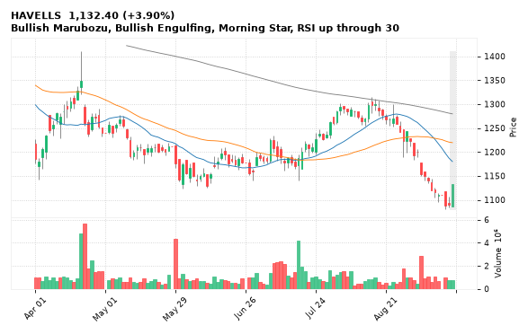

[🔔 Set alert on HAVELLS](mailto:himanshusardana05@gmail.com?subject=ALERT%20HAVELLS&body=Alert%20me%20when%3A%20close%20above%201132.40%0A%0AEdit%20the%20line%20above%20if%20you%20want%2C%20then%20press%20Send.%20Checked%20on%20every%20day%27s%20closing%20data%3B%20a%20triggered%20alert%20appears%20at%20the%20top%20of%20the%208%20AM%20Technical%20Analysis%20email.%0A%0AExamples%20you%20can%20write%3A%0A%20%20close%20above%201150%20%20%7C%20%20close%20below%201080%20%20%7C%20%20high%20above%201200%20%20%7C%20%20low%20below%201050%0A%20%20close%20crosses%20above%20200%20DMA%20%20%7C%20%20close%20below%2050%20DMA%20%20%7C%20%20RSI%20below%2030%20%20%7C%20%20RSI%20above%2070%0A%20%20volume%20above%202x%20%20%7C%20%20change%20above%205%25%20%20%7C%20%20change%20below%20-4%25%20%20%7C%20%2052-week%20high%20%20%7C%20%20golden%20cross%0A%20%20combine%20with%20%27and%27%2C%20e.g.%20%20close%20above%201150%20and%20volume%20above%201.5x%0A%0AReference%3A%20HAVELLS%20closed%201132.40%20%28high%201132.40%2C%20low%201086.00%29.%0ATo%20cancel%20later%2C%20send%20an%20email%20with%20subject%3A%20CANCEL%20ALERT%20HAVELLS) &nbsp;|&nbsp; [📈 Live chart (TradingView)](https://www.tradingview.com/chart/?symbol=NSE:HAVELLS)

---

## 2. SUPREMEIND - BULLISH
**3,580.30** (+8.49%) | vol 2.6x | RSI 56 | H 3,580.30 / L 3,347.40  
Bullish Marubozu, Morning Star, Close above 200 DMA, Volume spike 2.6x

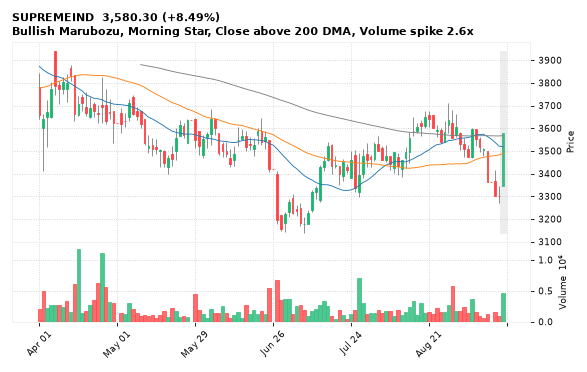

[🔔 Set alert on SUPREMEIND](mailto:himanshusardana05@gmail.com?subject=ALERT%20SUPREMEIND&body=Alert%20me%20when%3A%20close%20above%203580.30%0A%0AEdit%20the%20line%20above%20if%20you%20want%2C%20then%20press%20Send.%20Checked%20on%20every%20day%27s%20closing%20data%3B%20a%20triggered%20alert%20appears%20at%20the%20top%20of%20the%208%20AM%20Technical%20Analysis%20email.%0A%0AExamples%20you%20can%20write%3A%0A%20%20close%20above%201150%20%20%7C%20%20close%20below%201080%20%20%7C%20%20high%20above%201200%20%20%7C%20%20low%20below%201050%0A%20%20close%20crosses%20above%20200%20DMA%20%20%7C%20%20close%20below%2050%20DMA%20%20%7C%20%20RSI%20below%2030%20%20%7C%20%20RSI%20above%2070%0A%20%20volume%20above%202x%20%20%7C%20%20change%20above%205%25%20%20%7C%20%20change%20below%20-4%25%20%20%7C%20%2052-week%20high%20%20%7C%20%20golden%20cross%0A%20%20combine%20with%20%27and%27%2C%20e.g.%20%20close%20above%201150%20and%20volume%20above%201.5x%0A%0AReference%3A%20SUPREMEIND%20closed%203580.30%20%28high%203580.30%2C%20low%203347.40%29.%0ATo%20cancel%20later%2C%20send%20an%20email%20with%20subject%3A%20CANCEL%20ALERT%20SUPREMEIND) &nbsp;|&nbsp; [📈 Live chart (TradingView)](https://www.tradingview.com/chart/?symbol=NSE:SUPREMEIND)

---

## 3. APARINDS - BULLISH
**18,858.00** (+5.94%) | vol 2.4x | RSI 65 | H 19,080.00 / L 17,745.00  
Three White Soldiers, 52-week high breakout, Volume spike 2.4x

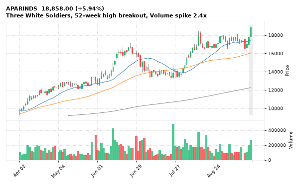

[🔔 Set alert on APARINDS](mailto:himanshusardana05@gmail.com?subject=ALERT%20APARINDS&body=Alert%20me%20when%3A%20close%20above%2019080.00%0A%0AEdit%20the%20line%20above%20if%20you%20want%2C%20then%20press%20Send.%20Checked%20on%20every%20day%27s%20closing%20data%3B%20a%20triggered%20alert%20appears%20at%20the%20top%20of%20the%208%20AM%20Technical%20Analysis%20email.%0A%0AExamples%20you%20can%20write%3A%0A%20%20close%20above%201150%20%20%7C%20%20close%20below%201080%20%20%7C%20%20high%20above%201200%20%20%7C%20%20low%20below%201050%0A%20%20close%20crosses%20above%20200%20DMA%20%20%7C%20%20close%20below%2050%20DMA%20%20%7C%20%20RSI%20below%2030%20%20%7C%20%20RSI%20above%2070%0A%20%20volume%20above%202x%20%20%7C%20%20change%20above%205%25%20%20%7C%20%20change%20below%20-4%25%20%20%7C%20%2052-week%20high%20%20%7C%20%20golden%20cross%0A%20%20combine%20with%20%27and%27%2C%20e.g.%20%20close%20above%201150%20and%20volume%20above%201.5x%0A%0AReference%3A%20APARINDS%20closed%2018858.00%20%28high%2019080.00%2C%20low%2017745.00%29.%0ATo%20cancel%20later%2C%20send%20an%20email%20with%20subject%3A%20CANCEL%20ALERT%20APARINDS) &nbsp;|&nbsp; [📈 Live chart (TradingView)](https://www.tradingview.com/chart/?symbol=NSE:APARINDS)

---

## 4. ATGL - BULLISH
**660.70** (+12.65%) | vol 69.1x | RSI 62 | H 674.80 / L 587.40  
Close above 200 DMA, RSI up through 30, MACD bullish cross, Volume spike 69.1x

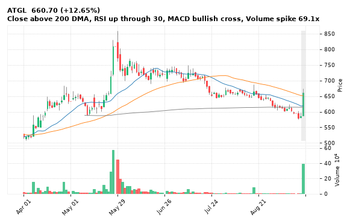

[🔔 Set alert on ATGL](mailto:himanshusardana05@gmail.com?subject=ALERT%20ATGL&body=Alert%20me%20when%3A%20close%20above%20674.80%0A%0AEdit%20the%20line%20above%20if%20you%20want%2C%20then%20press%20Send.%20Checked%20on%20every%20day%27s%20closing%20data%3B%20a%20triggered%20alert%20appears%20at%20the%20top%20of%20the%208%20AM%20Technical%20Analysis%20email.%0A%0AExamples%20you%20can%20write%3A%0A%20%20close%20above%201150%20%20%7C%20%20close%20below%201080%20%20%7C%20%20high%20above%201200%20%20%7C%20%20low%20below%201050%0A%20%20close%20crosses%20above%20200%20DMA%20%20%7C%20%20close%20below%2050%20DMA%20%20%7C%20%20RSI%20below%2030%20%20%7C%20%20RSI%20above%2070%0A%20%20volume%20above%202x%20%20%7C%20%20change%20above%205%25%20%20%7C%20%20change%20below%20-4%25%20%20%7C%20%2052-week%20high%20%20%7C%20%20golden%20cross%0A%20%20combine%20with%20%27and%27%2C%20e.g.%20%20close%20above%201150%20and%20volume%20above%201.5x%0A%0AReference%3A%20ATGL%20closed%20660.70%20%28high%20674.80%2C%20low%20587.40%29.%0ATo%20cancel%20later%2C%20send%20an%20email%20with%20subject%3A%20CANCEL%20ALERT%20ATGL) &nbsp;|&nbsp; [📈 Live chart (TradingView)](https://www.tradingview.com/chart/?symbol=NSE:ATGL)

---

## 5. PREMIERENE - BULLISH
**902.00** (+2.50%) | vol 2.6x | RSI 31 | H 905.80 / L 878.30  
Bullish Engulfing, RSI up through 30, Volume spike 2.6x

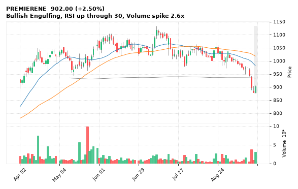

[🔔 Set alert on PREMIERENE](mailto:himanshusardana05@gmail.com?subject=ALERT%20PREMIERENE&body=Alert%20me%20when%3A%20close%20above%20905.80%0A%0AEdit%20the%20line%20above%20if%20you%20want%2C%20then%20press%20Send.%20Checked%20on%20every%20day%27s%20closing%20data%3B%20a%20triggered%20alert%20appears%20at%20the%20top%20of%20the%208%20AM%20Technical%20Analysis%20email.%0A%0AExamples%20you%20can%20write%3A%0A%20%20close%20above%201150%20%20%7C%20%20close%20below%201080%20%20%7C%20%20high%20above%201200%20%20%7C%20%20low%20below%201050%0A%20%20close%20crosses%20above%20200%20DMA%20%20%7C%20%20close%20below%2050%20DMA%20%20%7C%20%20RSI%20below%2030%20%20%7C%20%20RSI%20above%2070%0A%20%20volume%20above%202x%20%20%7C%20%20change%20above%205%25%20%20%7C%20%20change%20below%20-4%25%20%20%7C%20%2052-week%20high%20%20%7C%20%20golden%20cross%0A%20%20combine%20with%20%27and%27%2C%20e.g.%20%20close%20above%201150%20and%20volume%20above%201.5x%0A%0AReference%3A%20PREMIERENE%20closed%20902.00%20%28high%20905.80%2C%20low%20878.30%29.%0ATo%20cancel%20later%2C%20send%20an%20email%20with%20subject%3A%20CANCEL%20ALERT%20PREMIERENE) &nbsp;|&nbsp; [📈 Live chart (TradingView)](https://www.tradingview.com/chart/?symbol=NSE:PREMIERENE)

---

## 6. ABB - BULLISH
**7,270.50** (+4.16%) | vol 2.4x | RSI 46 | H 7,307.00 / L 7,151.00  
Morning Star, RSI up through 30, Volume spike 2.4x

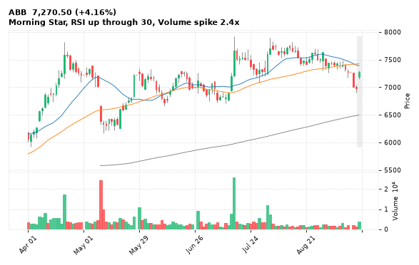

[🔔 Set alert on ABB](mailto:himanshusardana05@gmail.com?subject=ALERT%20ABB&body=Alert%20me%20when%3A%20close%20above%207307.00%0A%0AEdit%20the%20line%20above%20if%20you%20want%2C%20then%20press%20Send.%20Checked%20on%20every%20day%27s%20closing%20data%3B%20a%20triggered%20alert%20appears%20at%20the%20top%20of%20the%208%20AM%20Technical%20Analysis%20email.%0A%0AExamples%20you%20can%20write%3A%0A%20%20close%20above%201150%20%20%7C%20%20close%20below%201080%20%20%7C%20%20high%20above%201200%20%20%7C%20%20low%20below%201050%0A%20%20close%20crosses%20above%20200%20DMA%20%20%7C%20%20close%20below%2050%20DMA%20%20%7C%20%20RSI%20below%2030%20%20%7C%20%20RSI%20above%2070%0A%20%20volume%20above%202x%20%20%7C%20%20change%20above%205%25%20%20%7C%20%20change%20below%20-4%25%20%20%7C%20%2052-week%20high%20%20%7C%20%20golden%20cross%0A%20%20combine%20with%20%27and%27%2C%20e.g.%20%20close%20above%201150%20and%20volume%20above%201.5x%0A%0AReference%3A%20ABB%20closed%207270.50%20%28high%207307.00%2C%20low%207151.00%29.%0ATo%20cancel%20later%2C%20send%20an%20email%20with%20subject%3A%20CANCEL%20ALERT%20ABB) &nbsp;|&nbsp; [📈 Live chart (TradingView)](https://www.tradingview.com/chart/?symbol=NSE:ABB)

---

## 7. MAZDOCK - BULLISH
**2,280.00** (+3.17%) | vol 1.3x | RSI 35 | H 2,280.00 / L 2,205.10  
Bullish Marubozu, Bullish Engulfing, RSI up through 30

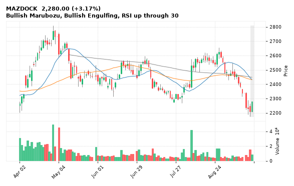

[🔔 Set alert on MAZDOCK](mailto:himanshusardana05@gmail.com?subject=ALERT%20MAZDOCK&body=Alert%20me%20when%3A%20close%20above%202280.00%0A%0AEdit%20the%20line%20above%20if%20you%20want%2C%20then%20press%20Send.%20Checked%20on%20every%20day%27s%20closing%20data%3B%20a%20triggered%20alert%20appears%20at%20the%20top%20of%20the%208%20AM%20Technical%20Analysis%20email.%0A%0AExamples%20you%20can%20write%3A%0A%20%20close%20above%201150%20%20%7C%20%20close%20below%201080%20%20%7C%20%20high%20above%201200%20%20%7C%20%20low%20below%201050%0A%20%20close%20crosses%20above%20200%20DMA%20%20%7C%20%20close%20below%2050%20DMA%20%20%7C%20%20RSI%20below%2030%20%20%7C%20%20RSI%20above%2070%0A%20%20volume%20above%202x%20%20%7C%20%20change%20above%205%25%20%20%7C%20%20change%20below%20-4%25%20%20%7C%20%2052-week%20high%20%20%7C%20%20golden%20cross%0A%20%20combine%20with%20%27and%27%2C%20e.g.%20%20close%20above%201150%20and%20volume%20above%201.5x%0A%0AReference%3A%20MAZDOCK%20closed%202280.00%20%28high%202280.00%2C%20low%202205.10%29.%0ATo%20cancel%20later%2C%20send%20an%20email%20with%20subject%3A%20CANCEL%20ALERT%20MAZDOCK) &nbsp;|&nbsp; [📈 Live chart (TradingView)](https://www.tradingview.com/chart/?symbol=NSE:MAZDOCK)

---

## 8. POONAWALLA - BULLISH
**479.40** (+10.86%) | vol 9.1x | RSI 58 | H 492.00 / L 434.00  
Close above 200 DMA, RSI up through 30, Volume spike 9.1x

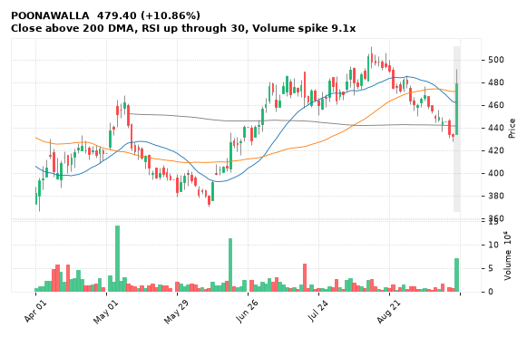

[🔔 Set alert on POONAWALLA](mailto:himanshusardana05@gmail.com?subject=ALERT%20POONAWALLA&body=Alert%20me%20when%3A%20close%20above%20492.00%0A%0AEdit%20the%20line%20above%20if%20you%20want%2C%20then%20press%20Send.%20Checked%20on%20every%20day%27s%20closing%20data%3B%20a%20triggered%20alert%20appears%20at%20the%20top%20of%20the%208%20AM%20Technical%20Analysis%20email.%0A%0AExamples%20you%20can%20write%3A%0A%20%20close%20above%201150%20%20%7C%20%20close%20below%201080%20%20%7C%20%20high%20above%201200%20%20%7C%20%20low%20below%201050%0A%20%20close%20crosses%20above%20200%20DMA%20%20%7C%20%20close%20below%2050%20DMA%20%20%7C%20%20RSI%20below%2030%20%20%7C%20%20RSI%20above%2070%0A%20%20volume%20above%202x%20%20%7C%20%20change%20above%205%25%20%20%7C%20%20change%20below%20-4%25%20%20%7C%20%2052-week%20high%20%20%7C%20%20golden%20cross%0A%20%20combine%20with%20%27and%27%2C%20e.g.%20%20close%20above%201150%20and%20volume%20above%201.5x%0A%0AReference%3A%20POONAWALLA%20closed%20479.40%20%28high%20492.00%2C%20low%20434.00%29.%0ATo%20cancel%20later%2C%20send%20an%20email%20with%20subject%3A%20CANCEL%20ALERT%20POONAWALLA) &nbsp;|&nbsp; [📈 Live chart (TradingView)](https://www.tradingview.com/chart/?symbol=NSE:POONAWALLA)

---

## 9. IKS - BULLISH
**1,779.90** (+2.95%) | vol 3.6x | RSI 51 | H 1,795.50 / L 1,721.00  
Bullish Engulfing, MACD bullish cross, Volume spike 3.6x

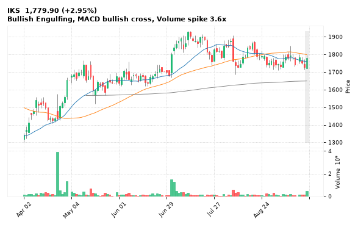

[🔔 Set alert on IKS](mailto:himanshusardana05@gmail.com?subject=ALERT%20IKS&body=Alert%20me%20when%3A%20close%20above%201795.50%0A%0AEdit%20the%20line%20above%20if%20you%20want%2C%20then%20press%20Send.%20Checked%20on%20every%20day%27s%20closing%20data%3B%20a%20triggered%20alert%20appears%20at%20the%20top%20of%20the%208%20AM%20Technical%20Analysis%20email.%0A%0AExamples%20you%20can%20write%3A%0A%20%20close%20above%201150%20%20%7C%20%20close%20below%201080%20%20%7C%20%20high%20above%201200%20%20%7C%20%20low%20below%201050%0A%20%20close%20crosses%20above%20200%20DMA%20%20%7C%20%20close%20below%2050%20DMA%20%20%7C%20%20RSI%20below%2030%20%20%7C%20%20RSI%20above%2070%0A%20%20volume%20above%202x%20%20%7C%20%20change%20above%205%25%20%20%7C%20%20change%20below%20-4%25%20%20%7C%20%2052-week%20high%20%20%7C%20%20golden%20cross%0A%20%20combine%20with%20%27and%27%2C%20e.g.%20%20close%20above%201150%20and%20volume%20above%201.5x%0A%0AReference%3A%20IKS%20closed%201779.90%20%28high%201795.50%2C%20low%201721.00%29.%0ATo%20cancel%20later%2C%20send%20an%20email%20with%20subject%3A%20CANCEL%20ALERT%20IKS) &nbsp;|&nbsp; [📈 Live chart (TradingView)](https://www.tradingview.com/chart/?symbol=NSE:IKS)

---

## 10. CHOICEIN - BULLISH
**763.85** (+5.26%) | vol 2.8x | RSI 47 | H 775.70 / L 738.45  
Close above 200 DMA, RSI up through 30, Volume spike 2.8x

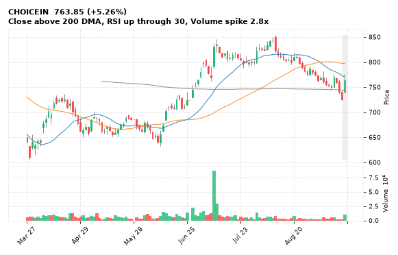

[🔔 Set alert on CHOICEIN](mailto:himanshusardana05@gmail.com?subject=ALERT%20CHOICEIN&body=Alert%20me%20when%3A%20close%20above%20775.70%0A%0AEdit%20the%20line%20above%20if%20you%20want%2C%20then%20press%20Send.%20Checked%20on%20every%20day%27s%20closing%20data%3B%20a%20triggered%20alert%20appears%20at%20the%20top%20of%20the%208%20AM%20Technical%20Analysis%20email.%0A%0AExamples%20you%20can%20write%3A%0A%20%20close%20above%201150%20%20%7C%20%20close%20below%201080%20%20%7C%20%20high%20above%201200%20%20%7C%20%20low%20below%201050%0A%20%20close%20crosses%20above%20200%20DMA%20%20%7C%20%20close%20below%2050%20DMA%20%20%7C%20%20RSI%20below%2030%20%20%7C%20%20RSI%20above%2070%0A%20%20volume%20above%202x%20%20%7C%20%20change%20above%205%25%20%20%7C%20%20change%20below%20-4%25%20%20%7C%20%2052-week%20high%20%20%7C%20%20golden%20cross%0A%20%20combine%20with%20%27and%27%2C%20e.g.%20%20close%20above%201150%20and%20volume%20above%201.5x%0A%0AReference%3A%20CHOICEIN%20closed%20763.85%20%28high%20775.70%2C%20low%20738.45%29.%0ATo%20cancel%20later%2C%20send%20an%20email%20with%20subject%3A%20CANCEL%20ALERT%20CHOICEIN) &nbsp;|&nbsp; [📈 Live chart (TradingView)](https://www.tradingview.com/chart/?symbol=NSE:CHOICEIN)

---

## 11. IRFC - BULLISH
**81.50** (+2.76%) | vol 2.0x | RSI 40 | H 81.50 / L 79.32  
Bullish Marubozu, RSI up through 30, Volume spike 2.0x

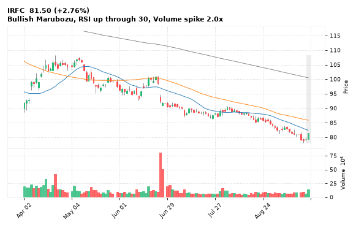

[🔔 Set alert on IRFC](mailto:himanshusardana05@gmail.com?subject=ALERT%20IRFC&body=Alert%20me%20when%3A%20close%20above%2081.50%0A%0AEdit%20the%20line%20above%20if%20you%20want%2C%20then%20press%20Send.%20Checked%20on%20every%20day%27s%20closing%20data%3B%20a%20triggered%20alert%20appears%20at%20the%20top%20of%20the%208%20AM%20Technical%20Analysis%20email.%0A%0AExamples%20you%20can%20write%3A%0A%20%20close%20above%201150%20%20%7C%20%20close%20below%201080%20%20%7C%20%20high%20above%201200%20%20%7C%20%20low%20below%201050%0A%20%20close%20crosses%20above%20200%20DMA%20%20%7C%20%20close%20below%2050%20DMA%20%20%7C%20%20RSI%20below%2030%20%20%7C%20%20RSI%20above%2070%0A%20%20volume%20above%202x%20%20%7C%20%20change%20above%205%25%20%20%7C%20%20change%20below%20-4%25%20%20%7C%20%2052-week%20high%20%20%7C%20%20golden%20cross%0A%20%20combine%20with%20%27and%27%2C%20e.g.%20%20close%20above%201150%20and%20volume%20above%201.5x%0A%0AReference%3A%20IRFC%20closed%2081.50%20%28high%2081.50%2C%20low%2079.32%29.%0ATo%20cancel%20later%2C%20send%20an%20email%20with%20subject%3A%20CANCEL%20ALERT%20IRFC) &nbsp;|&nbsp; [📈 Live chart (TradingView)](https://www.tradingview.com/chart/?symbol=NSE:IRFC)

---

## 12. NHPC - BULLISH
**76.95** (+2.33%) | vol 1.9x | RSI 53 | H 76.95 / L 75.09  
Bullish Marubozu, Bullish Engulfing, MACD bullish cross

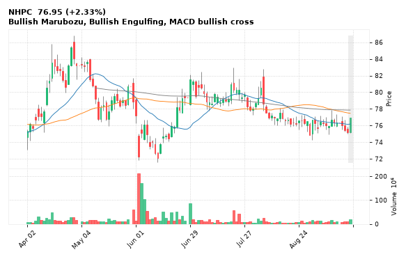

[🔔 Set alert on NHPC](mailto:himanshusardana05@gmail.com?subject=ALERT%20NHPC&body=Alert%20me%20when%3A%20close%20above%2076.95%0A%0AEdit%20the%20line%20above%20if%20you%20want%2C%20then%20press%20Send.%20Checked%20on%20every%20day%27s%20closing%20data%3B%20a%20triggered%20alert%20appears%20at%20the%20top%20of%20the%208%20AM%20Technical%20Analysis%20email.%0A%0AExamples%20you%20can%20write%3A%0A%20%20close%20above%201150%20%20%7C%20%20close%20below%201080%20%20%7C%20%20high%20above%201200%20%20%7C%20%20low%20below%201050%0A%20%20close%20crosses%20above%20200%20DMA%20%20%7C%20%20close%20below%2050%20DMA%20%20%7C%20%20RSI%20below%2030%20%20%7C%20%20RSI%20above%2070%0A%20%20volume%20above%202x%20%20%7C%20%20change%20above%205%25%20%20%7C%20%20change%20below%20-4%25%20%20%7C%20%2052-week%20high%20%20%7C%20%20golden%20cross%0A%20%20combine%20with%20%27and%27%2C%20e.g.%20%20close%20above%201150%20and%20volume%20above%201.5x%0A%0AReference%3A%20NHPC%20closed%2076.95%20%28high%2076.95%2C%20low%2075.09%29.%0ATo%20cancel%20later%2C%20send%20an%20email%20with%20subject%3A%20CANCEL%20ALERT%20NHPC) &nbsp;|&nbsp; [📈 Live chart (TradingView)](https://www.tradingview.com/chart/?symbol=NSE:NHPC)

---

## 13. GMRAIRPORT - BULLISH
**99.30** (+7.40%) | vol 1.8x | RSI 51 | H 99.30 / L 95.41  
Bullish Marubozu, Morning Star, MACD bullish cross

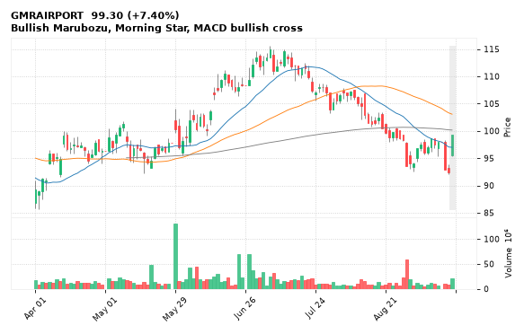

[🔔 Set alert on GMRAIRPORT](mailto:himanshusardana05@gmail.com?subject=ALERT%20GMRAIRPORT&body=Alert%20me%20when%3A%20close%20above%2099.30%0A%0AEdit%20the%20line%20above%20if%20you%20want%2C%20then%20press%20Send.%20Checked%20on%20every%20day%27s%20closing%20data%3B%20a%20triggered%20alert%20appears%20at%20the%20top%20of%20the%208%20AM%20Technical%20Analysis%20email.%0A%0AExamples%20you%20can%20write%3A%0A%20%20close%20above%201150%20%20%7C%20%20close%20below%201080%20%20%7C%20%20high%20above%201200%20%20%7C%20%20low%20below%201050%0A%20%20close%20crosses%20above%20200%20DMA%20%20%7C%20%20close%20below%2050%20DMA%20%20%7C%20%20RSI%20below%2030%20%20%7C%20%20RSI%20above%2070%0A%20%20volume%20above%202x%20%20%7C%20%20change%20above%205%25%20%20%7C%20%20change%20below%20-4%25%20%20%7C%20%2052-week%20high%20%20%7C%20%20golden%20cross%0A%20%20combine%20with%20%27and%27%2C%20e.g.%20%20close%20above%201150%20and%20volume%20above%201.5x%0A%0AReference%3A%20GMRAIRPORT%20closed%2099.30%20%28high%2099.30%2C%20low%2095.41%29.%0ATo%20cancel%20later%2C%20send%20an%20email%20with%20subject%3A%20CANCEL%20ALERT%20GMRAIRPORT) &nbsp;|&nbsp; [📈 Live chart (TradingView)](https://www.tradingview.com/chart/?symbol=NSE:GMRAIRPORT)

---

## 14. ACMESOLAR - BULLISH
**435.25** (+5.82%) | vol 6.1x | RSI 67 | H 440.70 / L 411.50  
52-week high breakout, Volume spike 6.1x

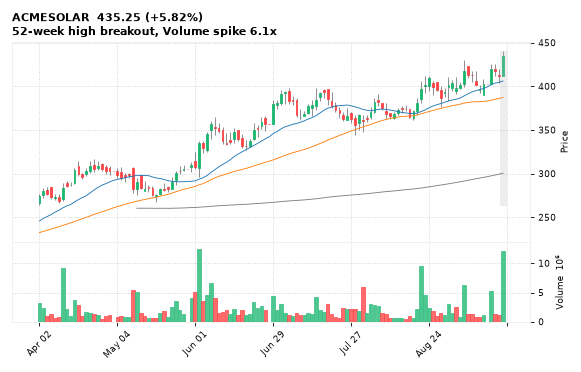

[🔔 Set alert on ACMESOLAR](mailto:himanshusardana05@gmail.com?subject=ALERT%20ACMESOLAR&body=Alert%20me%20when%3A%20close%20above%20440.70%0A%0AEdit%20the%20line%20above%20if%20you%20want%2C%20then%20press%20Send.%20Checked%20on%20every%20day%27s%20closing%20data%3B%20a%20triggered%20alert%20appears%20at%20the%20top%20of%20the%208%20AM%20Technical%20Analysis%20email.%0A%0AExamples%20you%20can%20write%3A%0A%20%20close%20above%201150%20%20%7C%20%20close%20below%201080%20%20%7C%20%20high%20above%201200%20%20%7C%20%20low%20below%201050%0A%20%20close%20crosses%20above%20200%20DMA%20%20%7C%20%20close%20below%2050%20DMA%20%20%7C%20%20RSI%20below%2030%20%20%7C%20%20RSI%20above%2070%0A%20%20volume%20above%202x%20%20%7C%20%20change%20above%205%25%20%20%7C%20%20change%20below%20-4%25%20%20%7C%20%2052-week%20high%20%20%7C%20%20golden%20cross%0A%20%20combine%20with%20%27and%27%2C%20e.g.%20%20close%20above%201150%20and%20volume%20above%201.5x%0A%0AReference%3A%20ACMESOLAR%20closed%20435.25%20%28high%20440.70%2C%20low%20411.50%29.%0ATo%20cancel%20later%2C%20send%20an%20email%20with%20subject%3A%20CANCEL%20ALERT%20ACMESOLAR) &nbsp;|&nbsp; [📈 Live chart (TradingView)](https://www.tradingview.com/chart/?symbol=NSE:ACMESOLAR)

---

## 15. SYRMA - BULLISH
**1,728.90** (+6.87%) | vol 5.4x | RSI 70 | H 1,764.00 / L 1,612.00  
52-week high breakout, Volume spike 5.4x

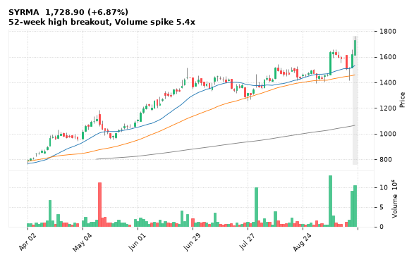

[🔔 Set alert on SYRMA](mailto:himanshusardana05@gmail.com?subject=ALERT%20SYRMA&body=Alert%20me%20when%3A%20close%20above%201764.00%0A%0AEdit%20the%20line%20above%20if%20you%20want%2C%20then%20press%20Send.%20Checked%20on%20every%20day%27s%20closing%20data%3B%20a%20triggered%20alert%20appears%20at%20the%20top%20of%20the%208%20AM%20Technical%20Analysis%20email.%0A%0AExamples%20you%20can%20write%3A%0A%20%20close%20above%201150%20%20%7C%20%20close%20below%201080%20%20%7C%20%20high%20above%201200%20%20%7C%20%20low%20below%201050%0A%20%20close%20crosses%20above%20200%20DMA%20%20%7C%20%20close%20below%2050%20DMA%20%20%7C%20%20RSI%20below%2030%20%20%7C%20%20RSI%20above%2070%0A%20%20volume%20above%202x%20%20%7C%20%20change%20above%205%25%20%20%7C%20%20change%20below%20-4%25%20%20%7C%20%2052-week%20high%20%20%7C%20%20golden%20cross%0A%20%20combine%20with%20%27and%27%2C%20e.g.%20%20close%20above%201150%20and%20volume%20above%201.5x%0A%0AReference%3A%20SYRMA%20closed%201728.90%20%28high%201764.00%2C%20low%201612.00%29.%0ATo%20cancel%20later%2C%20send%20an%20email%20with%20subject%3A%20CANCEL%20ALERT%20SYRMA) &nbsp;|&nbsp; [📈 Live chart (TradingView)](https://www.tradingview.com/chart/?symbol=NSE:SYRMA)

---

## 16. KPITTECH - BEARISH
**532.00** (-4.88%) | vol 2.8x | RSI 31 | H 559.50 / L 532.00  
Bearish Marubozu, 52-week low breakdown, Volume spike 2.8x

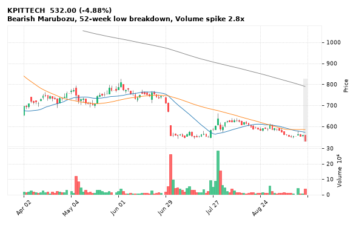

[🔔 Set alert on KPITTECH](mailto:himanshusardana05@gmail.com?subject=ALERT%20KPITTECH&body=Alert%20me%20when%3A%20close%20below%20532.00%0A%0AEdit%20the%20line%20above%20if%20you%20want%2C%20then%20press%20Send.%20Checked%20on%20every%20day%27s%20closing%20data%3B%20a%20triggered%20alert%20appears%20at%20the%20top%20of%20the%208%20AM%20Technical%20Analysis%20email.%0A%0AExamples%20you%20can%20write%3A%0A%20%20close%20above%201150%20%20%7C%20%20close%20below%201080%20%20%7C%20%20high%20above%201200%20%20%7C%20%20low%20below%201050%0A%20%20close%20crosses%20above%20200%20DMA%20%20%7C%20%20close%20below%2050%20DMA%20%20%7C%20%20RSI%20below%2030%20%20%7C%20%20RSI%20above%2070%0A%20%20volume%20above%202x%20%20%7C%20%20change%20above%205%25%20%20%7C%20%20change%20below%20-4%25%20%20%7C%20%2052-week%20high%20%20%7C%20%20golden%20cross%0A%20%20combine%20with%20%27and%27%2C%20e.g.%20%20close%20above%201150%20and%20volume%20above%201.5x%0A%0AReference%3A%20KPITTECH%20closed%20532.00%20%28high%20559.50%2C%20low%20532.00%29.%0ATo%20cancel%20later%2C%20send%20an%20email%20with%20subject%3A%20CANCEL%20ALERT%20KPITTECH) &nbsp;|&nbsp; [📈 Live chart (TradingView)](https://www.tradingview.com/chart/?symbol=NSE:KPITTECH)

---

## 17. GODIGIT - BEARISH
**239.00** (-6.46%) | vol 18.8x | RSI 33 | H 255.90 / L 235.80  
52-week low breakdown, MACD bearish cross, Volume spike 18.8x

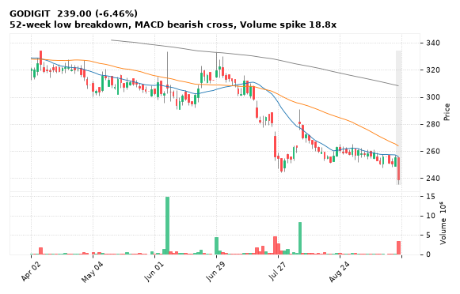

[🔔 Set alert on GODIGIT](mailto:himanshusardana05@gmail.com?subject=ALERT%20GODIGIT&body=Alert%20me%20when%3A%20close%20below%20235.80%0A%0AEdit%20the%20line%20above%20if%20you%20want%2C%20then%20press%20Send.%20Checked%20on%20every%20day%27s%20closing%20data%3B%20a%20triggered%20alert%20appears%20at%20the%20top%20of%20the%208%20AM%20Technical%20Analysis%20email.%0A%0AExamples%20you%20can%20write%3A%0A%20%20close%20above%201150%20%20%7C%20%20close%20below%201080%20%20%7C%20%20high%20above%201200%20%20%7C%20%20low%20below%201050%0A%20%20close%20crosses%20above%20200%20DMA%20%20%7C%20%20close%20below%2050%20DMA%20%20%7C%20%20RSI%20below%2030%20%20%7C%20%20RSI%20above%2070%0A%20%20volume%20above%202x%20%20%7C%20%20change%20above%205%25%20%20%7C%20%20change%20below%20-4%25%20%20%7C%20%2052-week%20high%20%20%7C%20%20golden%20cross%0A%20%20combine%20with%20%27and%27%2C%20e.g.%20%20close%20above%201150%20and%20volume%20above%201.5x%0A%0AReference%3A%20GODIGIT%20closed%20239.00%20%28high%20255.90%2C%20low%20235.80%29.%0ATo%20cancel%20later%2C%20send%20an%20email%20with%20subject%3A%20CANCEL%20ALERT%20GODIGIT) &nbsp;|&nbsp; [📈 Live chart (TradingView)](https://www.tradingview.com/chart/?symbol=NSE:GODIGIT)

---

## 18. BAYERCROP - BEARISH
**3,779.50** (-4.04%) | vol 6.0x | RSI 22 | H 3,899.10 / L 3,761.10  
52-week low breakdown, MACD bearish cross, Volume spike 6.0x

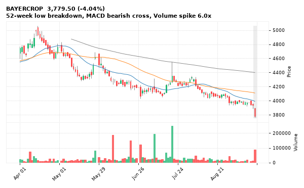

[🔔 Set alert on BAYERCROP](mailto:himanshusardana05@gmail.com?subject=ALERT%20BAYERCROP&body=Alert%20me%20when%3A%20close%20below%203761.10%0A%0AEdit%20the%20line%20above%20if%20you%20want%2C%20then%20press%20Send.%20Checked%20on%20every%20day%27s%20closing%20data%3B%20a%20triggered%20alert%20appears%20at%20the%20top%20of%20the%208%20AM%20Technical%20Analysis%20email.%0A%0AExamples%20you%20can%20write%3A%0A%20%20close%20above%201150%20%20%7C%20%20close%20below%201080%20%20%7C%20%20high%20above%201200%20%20%7C%20%20low%20below%201050%0A%20%20close%20crosses%20above%20200%20DMA%20%20%7C%20%20close%20below%2050%20DMA%20%20%7C%20%20RSI%20below%2030%20%20%7C%20%20RSI%20above%2070%0A%20%20volume%20above%202x%20%20%7C%20%20change%20above%205%25%20%20%7C%20%20change%20below%20-4%25%20%20%7C%20%2052-week%20high%20%20%7C%20%20golden%20cross%0A%20%20combine%20with%20%27and%27%2C%20e.g.%20%20close%20above%201150%20and%20volume%20above%201.5x%0A%0AReference%3A%20BAYERCROP%20closed%203779.50%20%28high%203899.10%2C%20low%203761.10%29.%0ATo%20cancel%20later%2C%20send%20an%20email%20with%20subject%3A%20CANCEL%20ALERT%20BAYERCROP) &nbsp;|&nbsp; [📈 Live chart (TradingView)](https://www.tradingview.com/chart/?symbol=NSE:BAYERCROP)

---

## 19. TATACHEM - BEARISH
**693.25** (-11.04%) | vol 5.6x | RSI 56 | H 741.35 / L 687.10  
Close below 200 DMA, RSI down through 70, Volume spike 5.6x

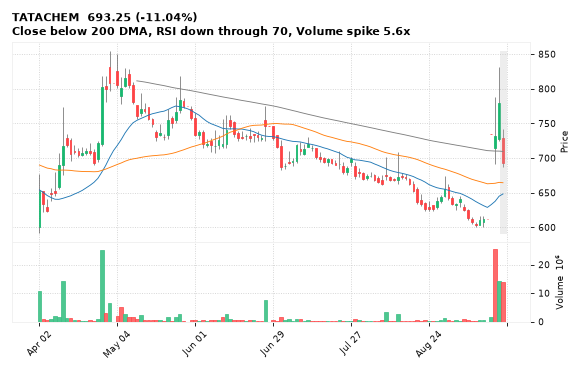

[🔔 Set alert on TATACHEM](mailto:himanshusardana05@gmail.com?subject=ALERT%20TATACHEM&body=Alert%20me%20when%3A%20close%20below%20687.10%0A%0AEdit%20the%20line%20above%20if%20you%20want%2C%20then%20press%20Send.%20Checked%20on%20every%20day%27s%20closing%20data%3B%20a%20triggered%20alert%20appears%20at%20the%20top%20of%20the%208%20AM%20Technical%20Analysis%20email.%0A%0AExamples%20you%20can%20write%3A%0A%20%20close%20above%201150%20%20%7C%20%20close%20below%201080%20%20%7C%20%20high%20above%201200%20%20%7C%20%20low%20below%201050%0A%20%20close%20crosses%20above%20200%20DMA%20%20%7C%20%20close%20below%2050%20DMA%20%20%7C%20%20RSI%20below%2030%20%20%7C%20%20RSI%20above%2070%0A%20%20volume%20above%202x%20%20%7C%20%20change%20above%205%25%20%20%7C%20%20change%20below%20-4%25%20%20%7C%20%2052-week%20high%20%20%7C%20%20golden%20cross%0A%20%20combine%20with%20%27and%27%2C%20e.g.%20%20close%20above%201150%20and%20volume%20above%201.5x%0A%0AReference%3A%20TATACHEM%20closed%20693.25%20%28high%20741.35%2C%20low%20687.10%29.%0ATo%20cancel%20later%2C%20send%20an%20email%20with%20subject%3A%20CANCEL%20ALERT%20TATACHEM) &nbsp;|&nbsp; [📈 Live chart (TradingView)](https://www.tradingview.com/chart/?symbol=NSE:TATACHEM)

---

## 20. SYNGENE - BEARISH
**369.05** (-2.91%) | vol 5.0x | RSI 27 | H 384.00 / L 366.65  
52-week low breakdown, Volume spike 5.0x

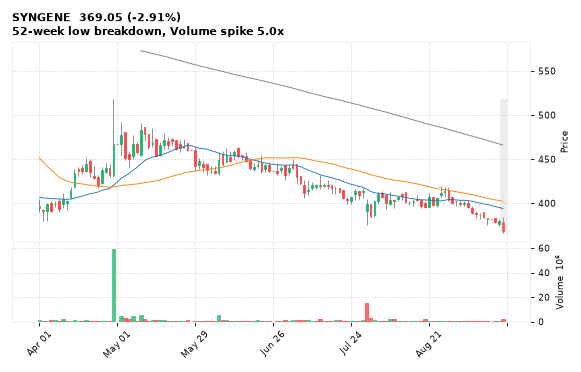

[🔔 Set alert on SYNGENE](mailto:himanshusardana05@gmail.com?subject=ALERT%20SYNGENE&body=Alert%20me%20when%3A%20close%20below%20366.65%0A%0AEdit%20the%20line%20above%20if%20you%20want%2C%20then%20press%20Send.%20Checked%20on%20every%20day%27s%20closing%20data%3B%20a%20triggered%20alert%20appears%20at%20the%20top%20of%20the%208%20AM%20Technical%20Analysis%20email.%0A%0AExamples%20you%20can%20write%3A%0A%20%20close%20above%201150%20%20%7C%20%20close%20below%201080%20%20%7C%20%20high%20above%201200%20%20%7C%20%20low%20below%201050%0A%20%20close%20crosses%20above%20200%20DMA%20%20%7C%20%20close%20below%2050%20DMA%20%20%7C%20%20RSI%20below%2030%20%20%7C%20%20RSI%20above%2070%0A%20%20volume%20above%202x%20%20%7C%20%20change%20above%205%25%20%20%7C%20%20change%20below%20-4%25%20%20%7C%20%2052-week%20high%20%20%7C%20%20golden%20cross%0A%20%20combine%20with%20%27and%27%2C%20e.g.%20%20close%20above%201150%20and%20volume%20above%201.5x%0A%0AReference%3A%20SYNGENE%20closed%20369.05%20%28high%20384.00%2C%20low%20366.65%29.%0ATo%20cancel%20later%2C%20send%20an%20email%20with%20subject%3A%20CANCEL%20ALERT%20SYNGENE) &nbsp;|&nbsp; [📈 Live chart (TradingView)](https://www.tradingview.com/chart/?symbol=NSE:SYNGENE)

---

## 21. GILLETTE - BEARISH
**7,073.00** (-2.78%) | vol 3.6x | RSI 29 | H 7,340.00 / L 7,031.50  
52-week low breakdown, Volume spike 3.6x

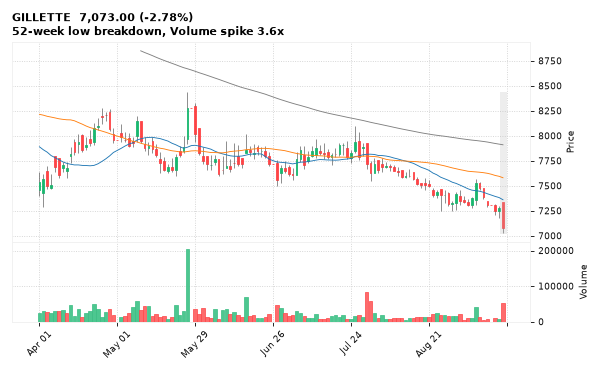

[🔔 Set alert on GILLETTE](mailto:himanshusardana05@gmail.com?subject=ALERT%20GILLETTE&body=Alert%20me%20when%3A%20close%20below%207031.50%0A%0AEdit%20the%20line%20above%20if%20you%20want%2C%20then%20press%20Send.%20Checked%20on%20every%20day%27s%20closing%20data%3B%20a%20triggered%20alert%20appears%20at%20the%20top%20of%20the%208%20AM%20Technical%20Analysis%20email.%0A%0AExamples%20you%20can%20write%3A%0A%20%20close%20above%201150%20%20%7C%20%20close%20below%201080%20%20%7C%20%20high%20above%201200%20%20%7C%20%20low%20below%201050%0A%20%20close%20crosses%20above%20200%20DMA%20%20%7C%20%20close%20below%2050%20DMA%20%20%7C%20%20RSI%20below%2030%20%20%7C%20%20RSI%20above%2070%0A%20%20volume%20above%202x%20%20%7C%20%20change%20above%205%25%20%20%7C%20%20change%20below%20-4%25%20%20%7C%20%2052-week%20high%20%20%7C%20%20golden%20cross%0A%20%20combine%20with%20%27and%27%2C%20e.g.%20%20close%20above%201150%20and%20volume%20above%201.5x%0A%0AReference%3A%20GILLETTE%20closed%207073.00%20%28high%207340.00%2C%20low%207031.50%29.%0ATo%20cancel%20later%2C%20send%20an%20email%20with%20subject%3A%20CANCEL%20ALERT%20GILLETTE) &nbsp;|&nbsp; [📈 Live chart (TradingView)](https://www.tradingview.com/chart/?symbol=NSE:GILLETTE)

---

## 22. TATAELXSI - BEARISH
**3,266.70** (-3.15%) | vol 1.7x | RSI 28 | H 3,399.00 / L 3,266.70  
Bearish Marubozu, 52-week low breakdown

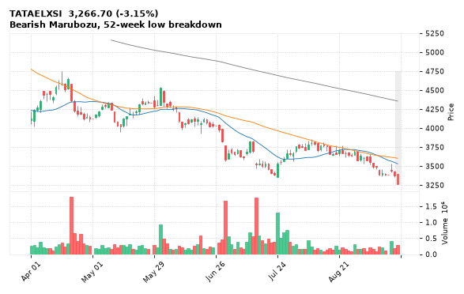

[🔔 Set alert on TATAELXSI](mailto:himanshusardana05@gmail.com?subject=ALERT%20TATAELXSI&body=Alert%20me%20when%3A%20close%20below%203266.70%0A%0AEdit%20the%20line%20above%20if%20you%20want%2C%20then%20press%20Send.%20Checked%20on%20every%20day%27s%20closing%20data%3B%20a%20triggered%20alert%20appears%20at%20the%20top%20of%20the%208%20AM%20Technical%20Analysis%20email.%0A%0AExamples%20you%20can%20write%3A%0A%20%20close%20above%201150%20%20%7C%20%20close%20below%201080%20%20%7C%20%20high%20above%201200%20%20%7C%20%20low%20below%201050%0A%20%20close%20crosses%20above%20200%20DMA%20%20%7C%20%20close%20below%2050%20DMA%20%20%7C%20%20RSI%20below%2030%20%20%7C%20%20RSI%20above%2070%0A%20%20volume%20above%202x%20%20%7C%20%20change%20above%205%25%20%20%7C%20%20change%20below%20-4%25%20%20%7C%20%2052-week%20high%20%20%7C%20%20golden%20cross%0A%20%20combine%20with%20%27and%27%2C%20e.g.%20%20close%20above%201150%20and%20volume%20above%201.5x%0A%0AReference%3A%20TATAELXSI%20closed%203266.70%20%28high%203399.00%2C%20low%203266.70%29.%0ATo%20cancel%20later%2C%20send%20an%20email%20with%20subject%3A%20CANCEL%20ALERT%20TATAELXSI) &nbsp;|&nbsp; [📈 Live chart (TradingView)](https://www.tradingview.com/chart/?symbol=NSE:TATAELXSI)

---

## 23. ITC - BEARISH
**262.30** (-1.47%) | vol 1.1x | RSI 43 | H 266.60 / L 262.30  
Bearish Marubozu, Bearish Engulfing

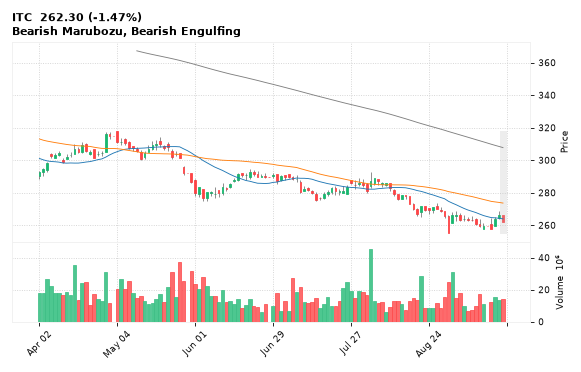

[🔔 Set alert on ITC](mailto:himanshusardana05@gmail.com?subject=ALERT%20ITC&body=Alert%20me%20when%3A%20close%20below%20262.30%0A%0AEdit%20the%20line%20above%20if%20you%20want%2C%20then%20press%20Send.%20Checked%20on%20every%20day%27s%20closing%20data%3B%20a%20triggered%20alert%20appears%20at%20the%20top%20of%20the%208%20AM%20Technical%20Analysis%20email.%0A%0AExamples%20you%20can%20write%3A%0A%20%20close%20above%201150%20%20%7C%20%20close%20below%201080%20%20%7C%20%20high%20above%201200%20%20%7C%20%20low%20below%201050%0A%20%20close%20crosses%20above%20200%20DMA%20%20%7C%20%20close%20below%2050%20DMA%20%20%7C%20%20RSI%20below%2030%20%20%7C%20%20RSI%20above%2070%0A%20%20volume%20above%202x%20%20%7C%20%20change%20above%205%25%20%20%7C%20%20change%20below%20-4%25%20%20%7C%20%2052-week%20high%20%20%7C%20%20golden%20cross%0A%20%20combine%20with%20%27and%27%2C%20e.g.%20%20close%20above%201150%20and%20volume%20above%201.5x%0A%0AReference%3A%20ITC%20closed%20262.30%20%28high%20266.60%2C%20low%20262.30%29.%0ATo%20cancel%20later%2C%20send%20an%20email%20with%20subject%3A%20CANCEL%20ALERT%20ITC) &nbsp;|&nbsp; [📈 Live chart (TradingView)](https://www.tradingview.com/chart/?symbol=NSE:ITC)

---

## 24. ZFCVINDIA - BEARISH
**2,387.00** (-3.03%) | vol 3.9x | RSI 35 | H 2,451.40 / L 2,361.00  
Close below 200 DMA, Volume spike 3.9x

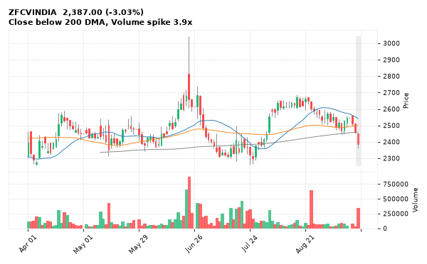

[🔔 Set alert on ZFCVINDIA](mailto:himanshusardana05@gmail.com?subject=ALERT%20ZFCVINDIA&body=Alert%20me%20when%3A%20close%20below%202361.00%0A%0AEdit%20the%20line%20above%20if%20you%20want%2C%20then%20press%20Send.%20Checked%20on%20every%20day%27s%20closing%20data%3B%20a%20triggered%20alert%20appears%20at%20the%20top%20of%20the%208%20AM%20Technical%20Analysis%20email.%0A%0AExamples%20you%20can%20write%3A%0A%20%20close%20above%201150%20%20%7C%20%20close%20below%201080%20%20%7C%20%20high%20above%201200%20%20%7C%20%20low%20below%201050%0A%20%20close%20crosses%20above%20200%20DMA%20%20%7C%20%20close%20below%2050%20DMA%20%20%7C%20%20RSI%20below%2030%20%20%7C%20%20RSI%20above%2070%0A%20%20volume%20above%202x%20%20%7C%20%20change%20above%205%25%20%20%7C%20%20change%20below%20-4%25%20%20%7C%20%2052-week%20high%20%20%7C%20%20golden%20cross%0A%20%20combine%20with%20%27and%27%2C%20e.g.%20%20close%20above%201150%20and%20volume%20above%201.5x%0A%0AReference%3A%20ZFCVINDIA%20closed%202387.00%20%28high%202451.40%2C%20low%202361.00%29.%0ATo%20cancel%20later%2C%20send%20an%20email%20with%20subject%3A%20CANCEL%20ALERT%20ZFCVINDIA) &nbsp;|&nbsp; [📈 Live chart (TradingView)](https://www.tradingview.com/chart/?symbol=NSE:ZFCVINDIA)

---

## 25. TCS - BEARISH
**2,105.00** (-3.88%) | vol 2.7x | RSI 32 | H 2,177.30 / L 2,101.20  
Bearish Marubozu, Volume spike 2.7x

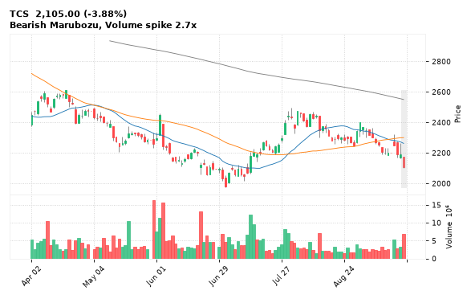

[🔔 Set alert on TCS](mailto:himanshusardana05@gmail.com?subject=ALERT%20TCS&body=Alert%20me%20when%3A%20close%20below%202101.20%0A%0AEdit%20the%20line%20above%20if%20you%20want%2C%20then%20press%20Send.%20Checked%20on%20every%20day%27s%20closing%20data%3B%20a%20triggered%20alert%20appears%20at%20the%20top%20of%20the%208%20AM%20Technical%20Analysis%20email.%0A%0AExamples%20you%20can%20write%3A%0A%20%20close%20above%201150%20%20%7C%20%20close%20below%201080%20%20%7C%20%20high%20above%201200%20%20%7C%20%20low%20below%201050%0A%20%20close%20crosses%20above%20200%20DMA%20%20%7C%20%20close%20below%2050%20DMA%20%20%7C%20%20RSI%20below%2030%20%20%7C%20%20RSI%20above%2070%0A%20%20volume%20above%202x%20%20%7C%20%20change%20above%205%25%20%20%7C%20%20change%20below%20-4%25%20%20%7C%20%2052-week%20high%20%20%7C%20%20golden%20cross%0A%20%20combine%20with%20%27and%27%2C%20e.g.%20%20close%20above%201150%20and%20volume%20above%201.5x%0A%0AReference%3A%20TCS%20closed%202105.00%20%28high%202177.30%2C%20low%202101.20%29.%0ATo%20cancel%20later%2C%20send%20an%20email%20with%20subject%3A%20CANCEL%20ALERT%20TCS) &nbsp;|&nbsp; [📈 Live chart (TradingView)](https://www.tradingview.com/chart/?symbol=NSE:TCS)

---

## 26. WHIRLPOOL - BEARISH
**717.70** (-1.33%) | vol 3.4x | RSI 29 | H 732.10 / L 706.00  
52-week low breakdown

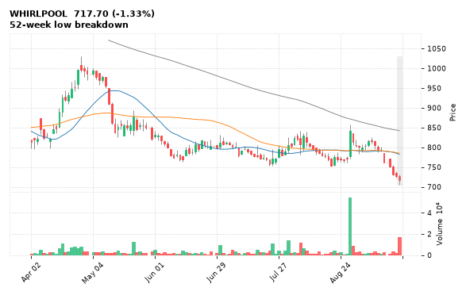

[🔔 Set alert on WHIRLPOOL](mailto:himanshusardana05@gmail.com?subject=ALERT%20WHIRLPOOL&body=Alert%20me%20when%3A%20close%20below%20706.00%0A%0AEdit%20the%20line%20above%20if%20you%20want%2C%20then%20press%20Send.%20Checked%20on%20every%20day%27s%20closing%20data%3B%20a%20triggered%20alert%20appears%20at%20the%20top%20of%20the%208%20AM%20Technical%20Analysis%20email.%0A%0AExamples%20you%20can%20write%3A%0A%20%20close%20above%201150%20%20%7C%20%20close%20below%201080%20%20%7C%20%20high%20above%201200%20%20%7C%20%20low%20below%201050%0A%20%20close%20crosses%20above%20200%20DMA%20%20%7C%20%20close%20below%2050%20DMA%20%20%7C%20%20RSI%20below%2030%20%20%7C%20%20RSI%20above%2070%0A%20%20volume%20above%202x%20%20%7C%20%20change%20above%205%25%20%20%7C%20%20change%20below%20-4%25%20%20%7C%20%2052-week%20high%20%20%7C%20%20golden%20cross%0A%20%20combine%20with%20%27and%27%2C%20e.g.%20%20close%20above%201150%20and%20volume%20above%201.5x%0A%0AReference%3A%20WHIRLPOOL%20closed%20717.70%20%28high%20732.10%2C%20low%20706.00%29.%0ATo%20cancel%20later%2C%20send%20an%20email%20with%20subject%3A%20CANCEL%20ALERT%20WHIRLPOOL) &nbsp;|&nbsp; [📈 Live chart (TradingView)](https://www.tradingview.com/chart/?symbol=NSE:WHIRLPOOL)

---

## 27. ABLBL - BEARISH
**81.17** (-1.50%) | vol 1.9x | RSI 29 | H 82.75 / L 80.81  
52-week low breakdown

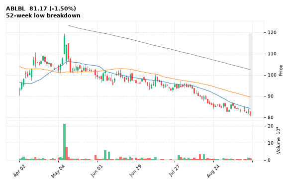

[🔔 Set alert on ABLBL](mailto:himanshusardana05@gmail.com?subject=ALERT%20ABLBL&body=Alert%20me%20when%3A%20close%20below%2080.81%0A%0AEdit%20the%20line%20above%20if%20you%20want%2C%20then%20press%20Send.%20Checked%20on%20every%20day%27s%20closing%20data%3B%20a%20triggered%20alert%20appears%20at%20the%20top%20of%20the%208%20AM%20Technical%20Analysis%20email.%0A%0AExamples%20you%20can%20write%3A%0A%20%20close%20above%201150%20%20%7C%20%20close%20below%201080%20%20%7C%20%20high%20above%201200%20%20%7C%20%20low%20below%201050%0A%20%20close%20crosses%20above%20200%20DMA%20%20%7C%20%20close%20below%2050%20DMA%20%20%7C%20%20RSI%20below%2030%20%20%7C%20%20RSI%20above%2070%0A%20%20volume%20above%202x%20%20%7C%20%20change%20above%205%25%20%20%7C%20%20change%20below%20-4%25%20%20%7C%20%2052-week%20high%20%20%7C%20%20golden%20cross%0A%20%20combine%20with%20%27and%27%2C%20e.g.%20%20close%20above%201150%20and%20volume%20above%201.5x%0A%0AReference%3A%20ABLBL%20closed%2081.17%20%28high%2082.75%2C%20low%2080.81%29.%0ATo%20cancel%20later%2C%20send%20an%20email%20with%20subject%3A%20CANCEL%20ALERT%20ABLBL) &nbsp;|&nbsp; [📈 Live chart (TradingView)](https://www.tradingview.com/chart/?symbol=NSE:ABLBL)

---

## 28. MARUTI - BEARISH
**12,103.00** (-1.90%) | vol 1.8x | RSI 25 | H 12,458.00 / L 12,103.00  
52-week low breakdown

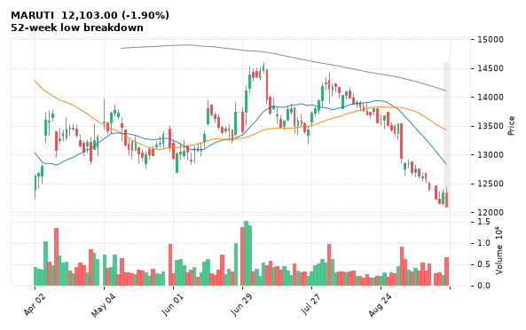

[🔔 Set alert on MARUTI](mailto:himanshusardana05@gmail.com?subject=ALERT%20MARUTI&body=Alert%20me%20when%3A%20close%20below%2012103.00%0A%0AEdit%20the%20line%20above%20if%20you%20want%2C%20then%20press%20Send.%20Checked%20on%20every%20day%27s%20closing%20data%3B%20a%20triggered%20alert%20appears%20at%20the%20top%20of%20the%208%20AM%20Technical%20Analysis%20email.%0A%0AExamples%20you%20can%20write%3A%0A%20%20close%20above%201150%20%20%7C%20%20close%20below%201080%20%20%7C%20%20high%20above%201200%20%20%7C%20%20low%20below%201050%0A%20%20close%20crosses%20above%20200%20DMA%20%20%7C%20%20close%20below%2050%20DMA%20%20%7C%20%20RSI%20below%2030%20%20%7C%20%20RSI%20above%2070%0A%20%20volume%20above%202x%20%20%7C%20%20change%20above%205%25%20%20%7C%20%20change%20below%20-4%25%20%20%7C%20%2052-week%20high%20%20%7C%20%20golden%20cross%0A%20%20combine%20with%20%27and%27%2C%20e.g.%20%20close%20above%201150%20and%20volume%20above%201.5x%0A%0AReference%3A%20MARUTI%20closed%2012103.00%20%28high%2012458.00%2C%20low%2012103.00%29.%0ATo%20cancel%20later%2C%20send%20an%20email%20with%20subject%3A%20CANCEL%20ALERT%20MARUTI) &nbsp;|&nbsp; [📈 Live chart (TradingView)](https://www.tradingview.com/chart/?symbol=NSE:MARUTI)

---

## 29. RELIANCE - BEARISH
**1,226.40** (-1.41%) | vol 1.4x | RSI 32 | H 1,247.30 / L 1,226.40  
52-week low breakdown

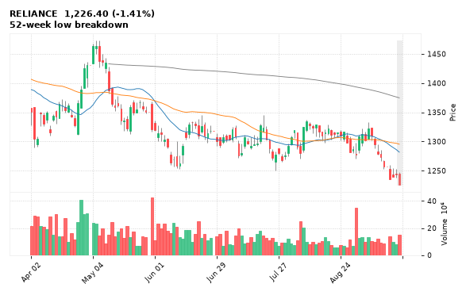

[🔔 Set alert on RELIANCE](mailto:himanshusardana05@gmail.com?subject=ALERT%20RELIANCE&body=Alert%20me%20when%3A%20close%20below%201226.40%0A%0AEdit%20the%20line%20above%20if%20you%20want%2C%20then%20press%20Send.%20Checked%20on%20every%20day%27s%20closing%20data%3B%20a%20triggered%20alert%20appears%20at%20the%20top%20of%20the%208%20AM%20Technical%20Analysis%20email.%0A%0AExamples%20you%20can%20write%3A%0A%20%20close%20above%201150%20%20%7C%20%20close%20below%201080%20%20%7C%20%20high%20above%201200%20%20%7C%20%20low%20below%201050%0A%20%20close%20crosses%20above%20200%20DMA%20%20%7C%20%20close%20below%2050%20DMA%20%20%7C%20%20RSI%20below%2030%20%20%7C%20%20RSI%20above%2070%0A%20%20volume%20above%202x%20%20%7C%20%20change%20above%205%25%20%20%7C%20%20change%20below%20-4%25%20%20%7C%20%2052-week%20high%20%20%7C%20%20golden%20cross%0A%20%20combine%20with%20%27and%27%2C%20e.g.%20%20close%20above%201150%20and%20volume%20above%201.5x%0A%0AReference%3A%20RELIANCE%20closed%201226.40%20%28high%201247.30%2C%20low%201226.40%29.%0ATo%20cancel%20later%2C%20send%20an%20email%20with%20subject%3A%20CANCEL%20ALERT%20RELIANCE) &nbsp;|&nbsp; [📈 Live chart (TradingView)](https://www.tradingview.com/chart/?symbol=NSE:RELIANCE)

---

## 30. IRB - BEARISH
**18.48** (-1.96%) | vol 1.3x | RSI 36 | H 18.99 / L 18.38  
52-week low breakdown

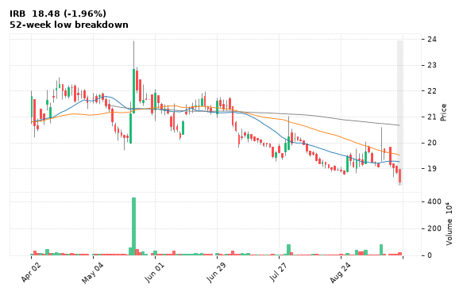

[🔔 Set alert on IRB](mailto:himanshusardana05@gmail.com?subject=ALERT%20IRB&body=Alert%20me%20when%3A%20close%20below%2018.38%0A%0AEdit%20the%20line%20above%20if%20you%20want%2C%20then%20press%20Send.%20Checked%20on%20every%20day%27s%20closing%20data%3B%20a%20triggered%20alert%20appears%20at%20the%20top%20of%20the%208%20AM%20Technical%20Analysis%20email.%0A%0AExamples%20you%20can%20write%3A%0A%20%20close%20above%201150%20%20%7C%20%20close%20below%201080%20%20%7C%20%20high%20above%201200%20%20%7C%20%20low%20below%201050%0A%20%20close%20crosses%20above%20200%20DMA%20%20%7C%20%20close%20below%2050%20DMA%20%20%7C%20%20RSI%20below%2030%20%20%7C%20%20RSI%20above%2070%0A%20%20volume%20above%202x%20%20%7C%20%20change%20above%205%25%20%20%7C%20%20change%20below%20-4%25%20%20%7C%20%2052-week%20high%20%20%7C%20%20golden%20cross%0A%20%20combine%20with%20%27and%27%2C%20e.g.%20%20close%20above%201150%20and%20volume%20above%201.5x%0A%0AReference%3A%20IRB%20closed%2018.48%20%28high%2018.99%2C%20low%2018.38%29.%0ATo%20cancel%20later%2C%20send%20an%20email%20with%20subject%3A%20CANCEL%20ALERT%20IRB) &nbsp;|&nbsp; [📈 Live chart (TradingView)](https://www.tradingview.com/chart/?symbol=NSE:IRB)

---
