# Technical Analysis Alert on Nifty 500 - charts for Tue 22 Sep 2026

Scroll through all charts. Tap **Set alert** under any chart to get an email alert in the 8 AM report when your price/condition triggers on the daily close.

## 1. MAPMYINDIA - BULLISH
**922.00** (+2.39%) | vol 9.3x | RSI 42 | H 969.80 / L 900.50  
Inverted Hammer, Bullish Engulfing, Volume spike 9.3x

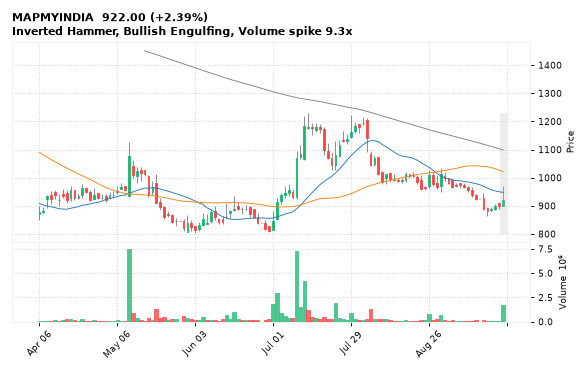

[🔔 Set alert on MAPMYINDIA](https://claude.ai/artifact/Ewc5hHTPX6WkU1nVcDNQzq?s=MAPMYINDIA&c=close%20above%20969.80) &nbsp;|&nbsp; [📈 Live chart (TradingView)](https://www.tradingview.com/chart/?symbol=NSE:MAPMYINDIA) &nbsp;|&nbsp; [alert by email](mailto:himanshusardana05@gmail.com?subject=ALERT%20MAPMYINDIA&body=Alert%20me%20when%3A%20close%20above%20969.80%0A%0AEdit%20the%20line%20above%20if%20you%20want%2C%20then%20press%20Send.%20Checked%20on%20every%20day%27s%20closing%20data%3B%20a%20triggered%20alert%20appears%20at%20the%20top%20of%20the%208%20AM%20Technical%20Analysis%20email.%0A%0AExamples%20you%20can%20write%3A%0A%20%20close%20above%201150%20%20%7C%20%20close%20below%201080%20%20%7C%20%20high%20above%201200%20%20%7C%20%20low%20below%201050%0A%20%20close%20crosses%20above%20200%20DMA%20%20%7C%20%20close%20below%2050%20DMA%20%20%7C%20%20RSI%20below%2030%20%20%7C%20%20RSI%20above%2070%0A%20%20volume%20above%202x%20%20%7C%20%20change%20above%205%25%20%20%7C%20%20change%20below%20-4%25%20%20%7C%20%2052-week%20high%20%20%7C%20%20golden%20cross%0A%20%20combine%20with%20%27and%27%2C%20e.g.%20%20close%20above%201150%20and%20volume%20above%201.5x%0A%0AReference%3A%20MAPMYINDIA%20closed%20922.00%20%28high%20969.80%2C%20low%20900.50%29.%0ATo%20cancel%20later%2C%20send%20an%20email%20with%20subject%3A%20CANCEL%20ALERT%20MAPMYINDIA)

---

## 2. ENGINERSIN - BULLISH
**302.55** (+6.06%) | vol 3.9x | RSI 74 | H 304.95 / L 281.50  
52-week high breakout, MACD bullish cross, Volume spike 3.9x

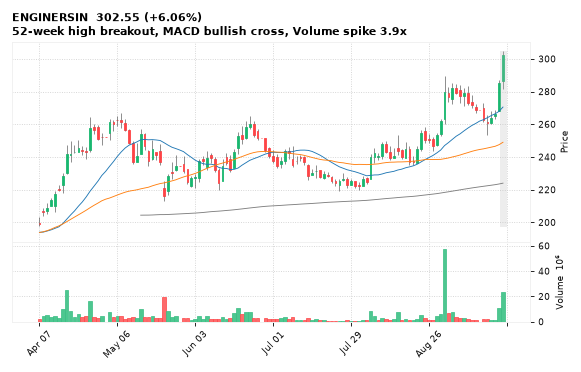

[🔔 Set alert on ENGINERSIN](https://claude.ai/artifact/Ewc5hHTPX6WkU1nVcDNQzq?s=ENGINERSIN&c=close%20above%20304.95) &nbsp;|&nbsp; [📈 Live chart (TradingView)](https://www.tradingview.com/chart/?symbol=NSE:ENGINERSIN) &nbsp;|&nbsp; [alert by email](mailto:himanshusardana05@gmail.com?subject=ALERT%20ENGINERSIN&body=Alert%20me%20when%3A%20close%20above%20304.95%0A%0AEdit%20the%20line%20above%20if%20you%20want%2C%20then%20press%20Send.%20Checked%20on%20every%20day%27s%20closing%20data%3B%20a%20triggered%20alert%20appears%20at%20the%20top%20of%20the%208%20AM%20Technical%20Analysis%20email.%0A%0AExamples%20you%20can%20write%3A%0A%20%20close%20above%201150%20%20%7C%20%20close%20below%201080%20%20%7C%20%20high%20above%201200%20%20%7C%20%20low%20below%201050%0A%20%20close%20crosses%20above%20200%20DMA%20%20%7C%20%20close%20below%2050%20DMA%20%20%7C%20%20RSI%20below%2030%20%20%7C%20%20RSI%20above%2070%0A%20%20volume%20above%202x%20%20%7C%20%20change%20above%205%25%20%20%7C%20%20change%20below%20-4%25%20%20%7C%20%2052-week%20high%20%20%7C%20%20golden%20cross%0A%20%20combine%20with%20%27and%27%2C%20e.g.%20%20close%20above%201150%20and%20volume%20above%201.5x%0A%0AReference%3A%20ENGINERSIN%20closed%20302.55%20%28high%20304.95%2C%20low%20281.50%29.%0ATo%20cancel%20later%2C%20send%20an%20email%20with%20subject%3A%20CANCEL%20ALERT%20ENGINERSIN)

---

## 3. JSWINFRA - BULLISH
**367.60** (+5.15%) | vol 4.8x | RSI 69 | H 375.50 / L 351.30  
52-week high breakout, Volume spike 4.8x

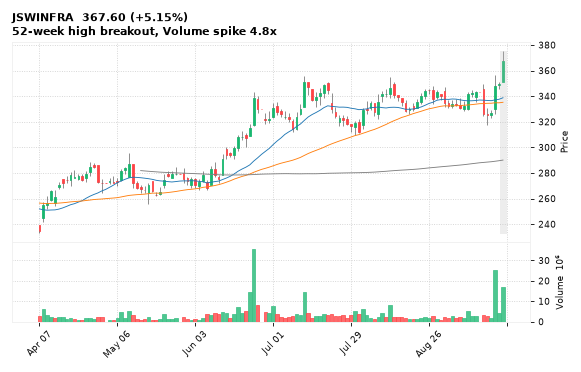

[🔔 Set alert on JSWINFRA](https://claude.ai/artifact/Ewc5hHTPX6WkU1nVcDNQzq?s=JSWINFRA&c=close%20above%20375.50) &nbsp;|&nbsp; [📈 Live chart (TradingView)](https://www.tradingview.com/chart/?symbol=NSE:JSWINFRA) &nbsp;|&nbsp; [alert by email](mailto:himanshusardana05@gmail.com?subject=ALERT%20JSWINFRA&body=Alert%20me%20when%3A%20close%20above%20375.50%0A%0AEdit%20the%20line%20above%20if%20you%20want%2C%20then%20press%20Send.%20Checked%20on%20every%20day%27s%20closing%20data%3B%20a%20triggered%20alert%20appears%20at%20the%20top%20of%20the%208%20AM%20Technical%20Analysis%20email.%0A%0AExamples%20you%20can%20write%3A%0A%20%20close%20above%201150%20%20%7C%20%20close%20below%201080%20%20%7C%20%20high%20above%201200%20%20%7C%20%20low%20below%201050%0A%20%20close%20crosses%20above%20200%20DMA%20%20%7C%20%20close%20below%2050%20DMA%20%20%7C%20%20RSI%20below%2030%20%20%7C%20%20RSI%20above%2070%0A%20%20volume%20above%202x%20%20%7C%20%20change%20above%205%25%20%20%7C%20%20change%20below%20-4%25%20%20%7C%20%2052-week%20high%20%20%7C%20%20golden%20cross%0A%20%20combine%20with%20%27and%27%2C%20e.g.%20%20close%20above%201150%20and%20volume%20above%201.5x%0A%0AReference%3A%20JSWINFRA%20closed%20367.60%20%28high%20375.50%2C%20low%20351.30%29.%0ATo%20cancel%20later%2C%20send%20an%20email%20with%20subject%3A%20CANCEL%20ALERT%20JSWINFRA)

---

## 4. RBLBANK - BULLISH
**423.20** (+5.17%) | vol 2.1x | RSI 64 | H 424.40 / L 402.85  
52-week high breakout, Volume spike 2.1x

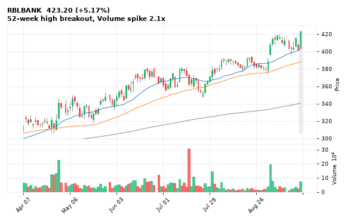

[🔔 Set alert on RBLBANK](https://claude.ai/artifact/Ewc5hHTPX6WkU1nVcDNQzq?s=RBLBANK&c=close%20above%20424.40) &nbsp;|&nbsp; [📈 Live chart (TradingView)](https://www.tradingview.com/chart/?symbol=NSE:RBLBANK) &nbsp;|&nbsp; [alert by email](mailto:himanshusardana05@gmail.com?subject=ALERT%20RBLBANK&body=Alert%20me%20when%3A%20close%20above%20424.40%0A%0AEdit%20the%20line%20above%20if%20you%20want%2C%20then%20press%20Send.%20Checked%20on%20every%20day%27s%20closing%20data%3B%20a%20triggered%20alert%20appears%20at%20the%20top%20of%20the%208%20AM%20Technical%20Analysis%20email.%0A%0AExamples%20you%20can%20write%3A%0A%20%20close%20above%201150%20%20%7C%20%20close%20below%201080%20%20%7C%20%20high%20above%201200%20%20%7C%20%20low%20below%201050%0A%20%20close%20crosses%20above%20200%20DMA%20%20%7C%20%20close%20below%2050%20DMA%20%20%7C%20%20RSI%20below%2030%20%20%7C%20%20RSI%20above%2070%0A%20%20volume%20above%202x%20%20%7C%20%20change%20above%205%25%20%20%7C%20%20change%20below%20-4%25%20%20%7C%20%2052-week%20high%20%20%7C%20%20golden%20cross%0A%20%20combine%20with%20%27and%27%2C%20e.g.%20%20close%20above%201150%20and%20volume%20above%201.5x%0A%0AReference%3A%20RBLBANK%20closed%20423.20%20%28high%20424.40%2C%20low%20402.85%29.%0ATo%20cancel%20later%2C%20send%20an%20email%20with%20subject%3A%20CANCEL%20ALERT%20RBLBANK)

---

## 5. BANDHANBNK - BULLISH
**184.70** (+3.18%) | vol 2.5x | RSI 66 | H 185.11 / L 179.90  
Bullish Marubozu, Volume spike 2.5x

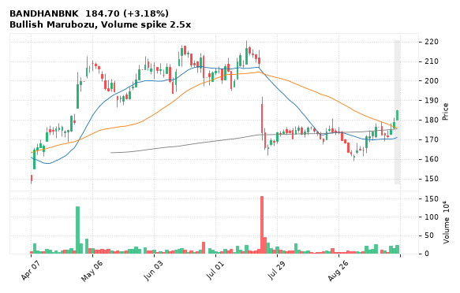

[🔔 Set alert on BANDHANBNK](https://claude.ai/artifact/Ewc5hHTPX6WkU1nVcDNQzq?s=BANDHANBNK&c=close%20above%20185.11) &nbsp;|&nbsp; [📈 Live chart (TradingView)](https://www.tradingview.com/chart/?symbol=NSE:BANDHANBNK) &nbsp;|&nbsp; [alert by email](mailto:himanshusardana05@gmail.com?subject=ALERT%20BANDHANBNK&body=Alert%20me%20when%3A%20close%20above%20185.11%0A%0AEdit%20the%20line%20above%20if%20you%20want%2C%20then%20press%20Send.%20Checked%20on%20every%20day%27s%20closing%20data%3B%20a%20triggered%20alert%20appears%20at%20the%20top%20of%20the%208%20AM%20Technical%20Analysis%20email.%0A%0AExamples%20you%20can%20write%3A%0A%20%20close%20above%201150%20%20%7C%20%20close%20below%201080%20%20%7C%20%20high%20above%201200%20%20%7C%20%20low%20below%201050%0A%20%20close%20crosses%20above%20200%20DMA%20%20%7C%20%20close%20below%2050%20DMA%20%20%7C%20%20RSI%20below%2030%20%20%7C%20%20RSI%20above%2070%0A%20%20volume%20above%202x%20%20%7C%20%20change%20above%205%25%20%20%7C%20%20change%20below%20-4%25%20%20%7C%20%2052-week%20high%20%20%7C%20%20golden%20cross%0A%20%20combine%20with%20%27and%27%2C%20e.g.%20%20close%20above%201150%20and%20volume%20above%201.5x%0A%0AReference%3A%20BANDHANBNK%20closed%20184.70%20%28high%20185.11%2C%20low%20179.90%29.%0ATo%20cancel%20later%2C%20send%20an%20email%20with%20subject%3A%20CANCEL%20ALERT%20BANDHANBNK)

---

## 6. WELSPUNLIV - BULLISH
**221.51** (+2.61%) | vol 1.4x | RSI 76 | H 224.00 / L 215.32  
52-week high breakout, MACD bullish cross

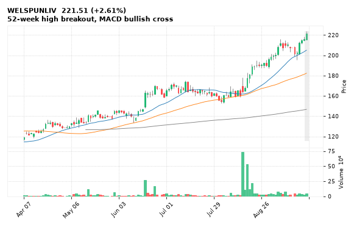

[🔔 Set alert on WELSPUNLIV](https://claude.ai/artifact/Ewc5hHTPX6WkU1nVcDNQzq?s=WELSPUNLIV&c=close%20above%20224.00) &nbsp;|&nbsp; [📈 Live chart (TradingView)](https://www.tradingview.com/chart/?symbol=NSE:WELSPUNLIV) &nbsp;|&nbsp; [alert by email](mailto:himanshusardana05@gmail.com?subject=ALERT%20WELSPUNLIV&body=Alert%20me%20when%3A%20close%20above%20224.00%0A%0AEdit%20the%20line%20above%20if%20you%20want%2C%20then%20press%20Send.%20Checked%20on%20every%20day%27s%20closing%20data%3B%20a%20triggered%20alert%20appears%20at%20the%20top%20of%20the%208%20AM%20Technical%20Analysis%20email.%0A%0AExamples%20you%20can%20write%3A%0A%20%20close%20above%201150%20%20%7C%20%20close%20below%201080%20%20%7C%20%20high%20above%201200%20%20%7C%20%20low%20below%201050%0A%20%20close%20crosses%20above%20200%20DMA%20%20%7C%20%20close%20below%2050%20DMA%20%20%7C%20%20RSI%20below%2030%20%20%7C%20%20RSI%20above%2070%0A%20%20volume%20above%202x%20%20%7C%20%20change%20above%205%25%20%20%7C%20%20change%20below%20-4%25%20%20%7C%20%2052-week%20high%20%20%7C%20%20golden%20cross%0A%20%20combine%20with%20%27and%27%2C%20e.g.%20%20close%20above%201150%20and%20volume%20above%201.5x%0A%0AReference%3A%20WELSPUNLIV%20closed%20221.51%20%28high%20224.00%2C%20low%20215.32%29.%0ATo%20cancel%20later%2C%20send%20an%20email%20with%20subject%3A%20CANCEL%20ALERT%20WELSPUNLIV)

---

## 7. BANKBARODA - BULLISH
**234.35** (+0.30%) | vol 0.5x | RSI 42 | H 234.90 / L 232.71  
Bullish Engulfing, MACD bullish cross

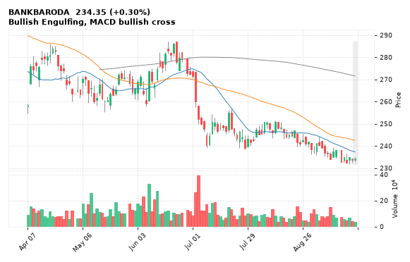

[🔔 Set alert on BANKBARODA](https://claude.ai/artifact/Ewc5hHTPX6WkU1nVcDNQzq?s=BANKBARODA&c=close%20above%20234.90) &nbsp;|&nbsp; [📈 Live chart (TradingView)](https://www.tradingview.com/chart/?symbol=NSE:BANKBARODA) &nbsp;|&nbsp; [alert by email](mailto:himanshusardana05@gmail.com?subject=ALERT%20BANKBARODA&body=Alert%20me%20when%3A%20close%20above%20234.90%0A%0AEdit%20the%20line%20above%20if%20you%20want%2C%20then%20press%20Send.%20Checked%20on%20every%20day%27s%20closing%20data%3B%20a%20triggered%20alert%20appears%20at%20the%20top%20of%20the%208%20AM%20Technical%20Analysis%20email.%0A%0AExamples%20you%20can%20write%3A%0A%20%20close%20above%201150%20%20%7C%20%20close%20below%201080%20%20%7C%20%20high%20above%201200%20%20%7C%20%20low%20below%201050%0A%20%20close%20crosses%20above%20200%20DMA%20%20%7C%20%20close%20below%2050%20DMA%20%20%7C%20%20RSI%20below%2030%20%20%7C%20%20RSI%20above%2070%0A%20%20volume%20above%202x%20%20%7C%20%20change%20above%205%25%20%20%7C%20%20change%20below%20-4%25%20%20%7C%20%2052-week%20high%20%20%7C%20%20golden%20cross%0A%20%20combine%20with%20%27and%27%2C%20e.g.%20%20close%20above%201150%20and%20volume%20above%201.5x%0A%0AReference%3A%20BANKBARODA%20closed%20234.35%20%28high%20234.90%2C%20low%20232.71%29.%0ATo%20cancel%20later%2C%20send%20an%20email%20with%20subject%3A%20CANCEL%20ALERT%20BANKBARODA)

---

## 8. GABRIEL - BULLISH
**1,471.40** (+14.04%) | vol 28.1x | RSI 62 | H 1,495.00 / L 1,291.30  
MACD bullish cross, Volume spike 28.1x

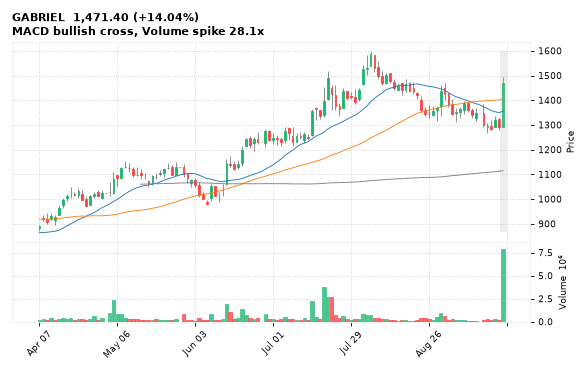

[🔔 Set alert on GABRIEL](https://claude.ai/artifact/Ewc5hHTPX6WkU1nVcDNQzq?s=GABRIEL&c=close%20above%201495.00) &nbsp;|&nbsp; [📈 Live chart (TradingView)](https://www.tradingview.com/chart/?symbol=NSE:GABRIEL) &nbsp;|&nbsp; [alert by email](mailto:himanshusardana05@gmail.com?subject=ALERT%20GABRIEL&body=Alert%20me%20when%3A%20close%20above%201495.00%0A%0AEdit%20the%20line%20above%20if%20you%20want%2C%20then%20press%20Send.%20Checked%20on%20every%20day%27s%20closing%20data%3B%20a%20triggered%20alert%20appears%20at%20the%20top%20of%20the%208%20AM%20Technical%20Analysis%20email.%0A%0AExamples%20you%20can%20write%3A%0A%20%20close%20above%201150%20%20%7C%20%20close%20below%201080%20%20%7C%20%20high%20above%201200%20%20%7C%20%20low%20below%201050%0A%20%20close%20crosses%20above%20200%20DMA%20%20%7C%20%20close%20below%2050%20DMA%20%20%7C%20%20RSI%20below%2030%20%20%7C%20%20RSI%20above%2070%0A%20%20volume%20above%202x%20%20%7C%20%20change%20above%205%25%20%20%7C%20%20change%20below%20-4%25%20%20%7C%20%2052-week%20high%20%20%7C%20%20golden%20cross%0A%20%20combine%20with%20%27and%27%2C%20e.g.%20%20close%20above%201150%20and%20volume%20above%201.5x%0A%0AReference%3A%20GABRIEL%20closed%201471.40%20%28high%201495.00%2C%20low%201291.30%29.%0ATo%20cancel%20later%2C%20send%20an%20email%20with%20subject%3A%20CANCEL%20ALERT%20GABRIEL)

---

## 9. SWIGGY - BULLISH
**284.05** (+4.16%) | vol 1.3x | RSI 57 | H 284.25 / L 272.80  
Bullish Marubozu, MACD bullish cross

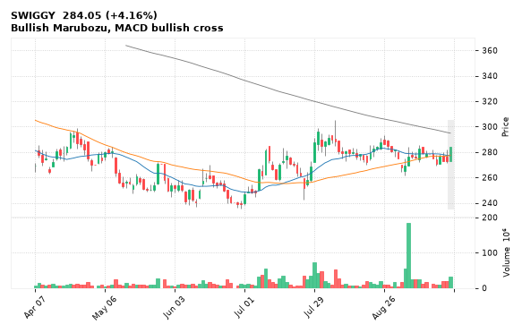

[🔔 Set alert on SWIGGY](https://claude.ai/artifact/Ewc5hHTPX6WkU1nVcDNQzq?s=SWIGGY&c=close%20above%20284.25) &nbsp;|&nbsp; [📈 Live chart (TradingView)](https://www.tradingview.com/chart/?symbol=NSE:SWIGGY) &nbsp;|&nbsp; [alert by email](mailto:himanshusardana05@gmail.com?subject=ALERT%20SWIGGY&body=Alert%20me%20when%3A%20close%20above%20284.25%0A%0AEdit%20the%20line%20above%20if%20you%20want%2C%20then%20press%20Send.%20Checked%20on%20every%20day%27s%20closing%20data%3B%20a%20triggered%20alert%20appears%20at%20the%20top%20of%20the%208%20AM%20Technical%20Analysis%20email.%0A%0AExamples%20you%20can%20write%3A%0A%20%20close%20above%201150%20%20%7C%20%20close%20below%201080%20%20%7C%20%20high%20above%201200%20%20%7C%20%20low%20below%201050%0A%20%20close%20crosses%20above%20200%20DMA%20%20%7C%20%20close%20below%2050%20DMA%20%20%7C%20%20RSI%20below%2030%20%20%7C%20%20RSI%20above%2070%0A%20%20volume%20above%202x%20%20%7C%20%20change%20above%205%25%20%20%7C%20%20change%20below%20-4%25%20%20%7C%20%2052-week%20high%20%20%7C%20%20golden%20cross%0A%20%20combine%20with%20%27and%27%2C%20e.g.%20%20close%20above%201150%20and%20volume%20above%201.5x%0A%0AReference%3A%20SWIGGY%20closed%20284.05%20%28high%20284.25%2C%20low%20272.80%29.%0ATo%20cancel%20later%2C%20send%20an%20email%20with%20subject%3A%20CANCEL%20ALERT%20SWIGGY)

---

## 10. CHALET - BULLISH
**872.35** (+1.43%) | vol 0.6x | RSI 52 | H 888.90 / L 857.00  
Bullish Engulfing

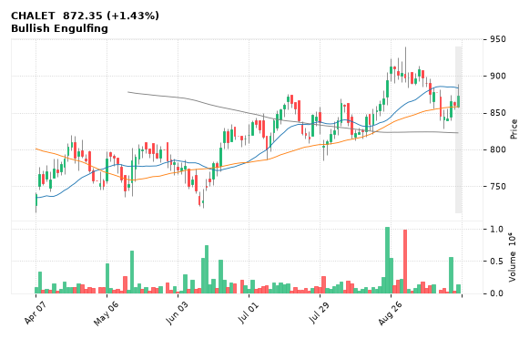

[🔔 Set alert on CHALET](https://claude.ai/artifact/Ewc5hHTPX6WkU1nVcDNQzq?s=CHALET&c=close%20above%20888.90) &nbsp;|&nbsp; [📈 Live chart (TradingView)](https://www.tradingview.com/chart/?symbol=NSE:CHALET) &nbsp;|&nbsp; [alert by email](mailto:himanshusardana05@gmail.com?subject=ALERT%20CHALET&body=Alert%20me%20when%3A%20close%20above%20888.90%0A%0AEdit%20the%20line%20above%20if%20you%20want%2C%20then%20press%20Send.%20Checked%20on%20every%20day%27s%20closing%20data%3B%20a%20triggered%20alert%20appears%20at%20the%20top%20of%20the%208%20AM%20Technical%20Analysis%20email.%0A%0AExamples%20you%20can%20write%3A%0A%20%20close%20above%201150%20%20%7C%20%20close%20below%201080%20%20%7C%20%20high%20above%201200%20%20%7C%20%20low%20below%201050%0A%20%20close%20crosses%20above%20200%20DMA%20%20%7C%20%20close%20below%2050%20DMA%20%20%7C%20%20RSI%20below%2030%20%20%7C%20%20RSI%20above%2070%0A%20%20volume%20above%202x%20%20%7C%20%20change%20above%205%25%20%20%7C%20%20change%20below%20-4%25%20%20%7C%20%2052-week%20high%20%20%7C%20%20golden%20cross%0A%20%20combine%20with%20%27and%27%2C%20e.g.%20%20close%20above%201150%20and%20volume%20above%201.5x%0A%0AReference%3A%20CHALET%20closed%20872.35%20%28high%20888.90%2C%20low%20857.00%29.%0ATo%20cancel%20later%2C%20send%20an%20email%20with%20subject%3A%20CANCEL%20ALERT%20CHALET)

---

## 11. JAINREC - BULLISH
**291.25** (+6.78%) | vol 14.8x | RSI 51 | H 299.80 / L 274.85  
Volume spike 14.8x

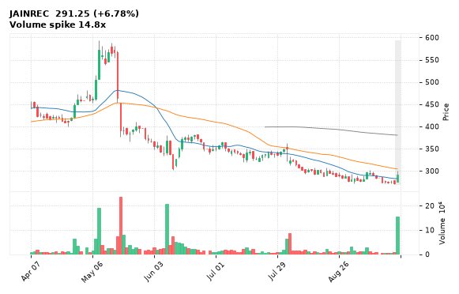

[🔔 Set alert on JAINREC](https://claude.ai/artifact/Ewc5hHTPX6WkU1nVcDNQzq?s=JAINREC&c=close%20above%20299.80) &nbsp;|&nbsp; [📈 Live chart (TradingView)](https://www.tradingview.com/chart/?symbol=NSE:JAINREC) &nbsp;|&nbsp; [alert by email](mailto:himanshusardana05@gmail.com?subject=ALERT%20JAINREC&body=Alert%20me%20when%3A%20close%20above%20299.80%0A%0AEdit%20the%20line%20above%20if%20you%20want%2C%20then%20press%20Send.%20Checked%20on%20every%20day%27s%20closing%20data%3B%20a%20triggered%20alert%20appears%20at%20the%20top%20of%20the%208%20AM%20Technical%20Analysis%20email.%0A%0AExamples%20you%20can%20write%3A%0A%20%20close%20above%201150%20%20%7C%20%20close%20below%201080%20%20%7C%20%20high%20above%201200%20%20%7C%20%20low%20below%201050%0A%20%20close%20crosses%20above%20200%20DMA%20%20%7C%20%20close%20below%2050%20DMA%20%20%7C%20%20RSI%20below%2030%20%20%7C%20%20RSI%20above%2070%0A%20%20volume%20above%202x%20%20%7C%20%20change%20above%205%25%20%20%7C%20%20change%20below%20-4%25%20%20%7C%20%2052-week%20high%20%20%7C%20%20golden%20cross%0A%20%20combine%20with%20%27and%27%2C%20e.g.%20%20close%20above%201150%20and%20volume%20above%201.5x%0A%0AReference%3A%20JAINREC%20closed%20291.25%20%28high%20299.80%2C%20low%20274.85%29.%0ATo%20cancel%20later%2C%20send%20an%20email%20with%20subject%3A%20CANCEL%20ALERT%20JAINREC)

---

## 12. SUNTV - BULLISH
**490.10** (+7.11%) | vol 6.3x | RSI 59 | H 494.20 / L 454.00  
Volume spike 6.3x

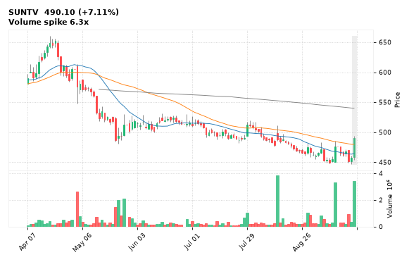

[🔔 Set alert on SUNTV](https://claude.ai/artifact/Ewc5hHTPX6WkU1nVcDNQzq?s=SUNTV&c=close%20above%20494.20) &nbsp;|&nbsp; [📈 Live chart (TradingView)](https://www.tradingview.com/chart/?symbol=NSE:SUNTV) &nbsp;|&nbsp; [alert by email](mailto:himanshusardana05@gmail.com?subject=ALERT%20SUNTV&body=Alert%20me%20when%3A%20close%20above%20494.20%0A%0AEdit%20the%20line%20above%20if%20you%20want%2C%20then%20press%20Send.%20Checked%20on%20every%20day%27s%20closing%20data%3B%20a%20triggered%20alert%20appears%20at%20the%20top%20of%20the%208%20AM%20Technical%20Analysis%20email.%0A%0AExamples%20you%20can%20write%3A%0A%20%20close%20above%201150%20%20%7C%20%20close%20below%201080%20%20%7C%20%20high%20above%201200%20%20%7C%20%20low%20below%201050%0A%20%20close%20crosses%20above%20200%20DMA%20%20%7C%20%20close%20below%2050%20DMA%20%20%7C%20%20RSI%20below%2030%20%20%7C%20%20RSI%20above%2070%0A%20%20volume%20above%202x%20%20%7C%20%20change%20above%205%25%20%20%7C%20%20change%20below%20-4%25%20%20%7C%20%2052-week%20high%20%20%7C%20%20golden%20cross%0A%20%20combine%20with%20%27and%27%2C%20e.g.%20%20close%20above%201150%20and%20volume%20above%201.5x%0A%0AReference%3A%20SUNTV%20closed%20490.10%20%28high%20494.20%2C%20low%20454.00%29.%0ATo%20cancel%20later%2C%20send%20an%20email%20with%20subject%3A%20CANCEL%20ALERT%20SUNTV)

---

## 13. PIIND - BULLISH
**2,410.00** (+3.80%) | vol 3.5x | RSI 50 | H 2,428.70 / L 2,350.00  
Volume spike 3.5x

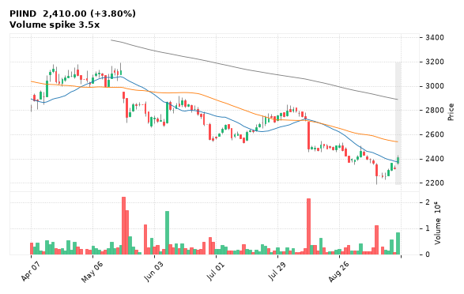

[🔔 Set alert on PIIND](https://claude.ai/artifact/Ewc5hHTPX6WkU1nVcDNQzq?s=PIIND&c=close%20above%202428.70) &nbsp;|&nbsp; [📈 Live chart (TradingView)](https://www.tradingview.com/chart/?symbol=NSE:PIIND) &nbsp;|&nbsp; [alert by email](mailto:himanshusardana05@gmail.com?subject=ALERT%20PIIND&body=Alert%20me%20when%3A%20close%20above%202428.70%0A%0AEdit%20the%20line%20above%20if%20you%20want%2C%20then%20press%20Send.%20Checked%20on%20every%20day%27s%20closing%20data%3B%20a%20triggered%20alert%20appears%20at%20the%20top%20of%20the%208%20AM%20Technical%20Analysis%20email.%0A%0AExamples%20you%20can%20write%3A%0A%20%20close%20above%201150%20%20%7C%20%20close%20below%201080%20%20%7C%20%20high%20above%201200%20%20%7C%20%20low%20below%201050%0A%20%20close%20crosses%20above%20200%20DMA%20%20%7C%20%20close%20below%2050%20DMA%20%20%7C%20%20RSI%20below%2030%20%20%7C%20%20RSI%20above%2070%0A%20%20volume%20above%202x%20%20%7C%20%20change%20above%205%25%20%20%7C%20%20change%20below%20-4%25%20%20%7C%20%2052-week%20high%20%20%7C%20%20golden%20cross%0A%20%20combine%20with%20%27and%27%2C%20e.g.%20%20close%20above%201150%20and%20volume%20above%201.5x%0A%0AReference%3A%20PIIND%20closed%202410.00%20%28high%202428.70%2C%20low%202350.00%29.%0ATo%20cancel%20later%2C%20send%20an%20email%20with%20subject%3A%20CANCEL%20ALERT%20PIIND)

---

## 14. CARBORUNIV - BULLISH
**1,211.30** (+2.75%) | vol 2.8x | RSI 66 | H 1,239.80 / L 1,177.00  
Volume spike 2.8x

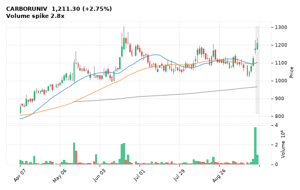

[🔔 Set alert on CARBORUNIV](https://claude.ai/artifact/Ewc5hHTPX6WkU1nVcDNQzq?s=CARBORUNIV&c=close%20above%201239.80) &nbsp;|&nbsp; [📈 Live chart (TradingView)](https://www.tradingview.com/chart/?symbol=NSE:CARBORUNIV) &nbsp;|&nbsp; [alert by email](mailto:himanshusardana05@gmail.com?subject=ALERT%20CARBORUNIV&body=Alert%20me%20when%3A%20close%20above%201239.80%0A%0AEdit%20the%20line%20above%20if%20you%20want%2C%20then%20press%20Send.%20Checked%20on%20every%20day%27s%20closing%20data%3B%20a%20triggered%20alert%20appears%20at%20the%20top%20of%20the%208%20AM%20Technical%20Analysis%20email.%0A%0AExamples%20you%20can%20write%3A%0A%20%20close%20above%201150%20%20%7C%20%20close%20below%201080%20%20%7C%20%20high%20above%201200%20%20%7C%20%20low%20below%201050%0A%20%20close%20crosses%20above%20200%20DMA%20%20%7C%20%20close%20below%2050%20DMA%20%20%7C%20%20RSI%20below%2030%20%20%7C%20%20RSI%20above%2070%0A%20%20volume%20above%202x%20%20%7C%20%20change%20above%205%25%20%20%7C%20%20change%20below%20-4%25%20%20%7C%20%2052-week%20high%20%20%7C%20%20golden%20cross%0A%20%20combine%20with%20%27and%27%2C%20e.g.%20%20close%20above%201150%20and%20volume%20above%201.5x%0A%0AReference%3A%20CARBORUNIV%20closed%201211.30%20%28high%201239.80%2C%20low%201177.00%29.%0ATo%20cancel%20later%2C%20send%20an%20email%20with%20subject%3A%20CANCEL%20ALERT%20CARBORUNIV)

---

## 15. VOLTAS - BEARISH
**1,100.80** (-3.62%) | vol 1.6x | RSI 32 | H 1,143.10 / L 1,100.00  
Bearish Marubozu, 52-week low breakdown, MACD bearish cross

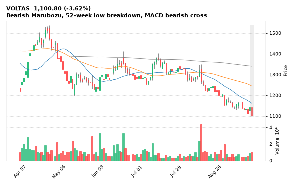

[🔔 Set alert on VOLTAS](https://claude.ai/artifact/Ewc5hHTPX6WkU1nVcDNQzq?s=VOLTAS&c=close%20below%201100.00) &nbsp;|&nbsp; [📈 Live chart (TradingView)](https://www.tradingview.com/chart/?symbol=NSE:VOLTAS) &nbsp;|&nbsp; [alert by email](mailto:himanshusardana05@gmail.com?subject=ALERT%20VOLTAS&body=Alert%20me%20when%3A%20close%20below%201100.00%0A%0AEdit%20the%20line%20above%20if%20you%20want%2C%20then%20press%20Send.%20Checked%20on%20every%20day%27s%20closing%20data%3B%20a%20triggered%20alert%20appears%20at%20the%20top%20of%20the%208%20AM%20Technical%20Analysis%20email.%0A%0AExamples%20you%20can%20write%3A%0A%20%20close%20above%201150%20%20%7C%20%20close%20below%201080%20%20%7C%20%20high%20above%201200%20%20%7C%20%20low%20below%201050%0A%20%20close%20crosses%20above%20200%20DMA%20%20%7C%20%20close%20below%2050%20DMA%20%20%7C%20%20RSI%20below%2030%20%20%7C%20%20RSI%20above%2070%0A%20%20volume%20above%202x%20%20%7C%20%20change%20above%205%25%20%20%7C%20%20change%20below%20-4%25%20%20%7C%20%2052-week%20high%20%20%7C%20%20golden%20cross%0A%20%20combine%20with%20%27and%27%2C%20e.g.%20%20close%20above%201150%20and%20volume%20above%201.5x%0A%0AReference%3A%20VOLTAS%20closed%201100.80%20%28high%201143.10%2C%20low%201100.00%29.%0ATo%20cancel%20later%2C%20send%20an%20email%20with%20subject%3A%20CANCEL%20ALERT%20VOLTAS)

---

## 16. TATAELXSI - BEARISH
**3,220.00** (-2.04%) | vol 2.9x | RSI 27 | H 3,295.00 / L 3,200.00  
52-week low breakdown, Volume spike 2.9x

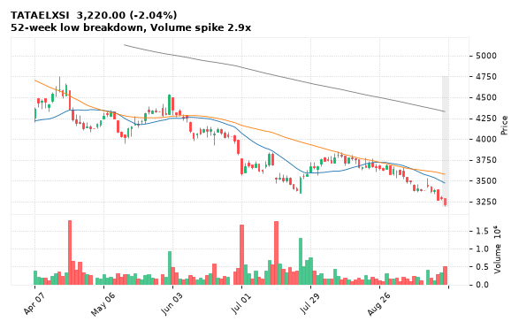

[🔔 Set alert on TATAELXSI](https://claude.ai/artifact/Ewc5hHTPX6WkU1nVcDNQzq?s=TATAELXSI&c=close%20below%203200.00) &nbsp;|&nbsp; [📈 Live chart (TradingView)](https://www.tradingview.com/chart/?symbol=NSE:TATAELXSI) &nbsp;|&nbsp; [alert by email](mailto:himanshusardana05@gmail.com?subject=ALERT%20TATAELXSI&body=Alert%20me%20when%3A%20close%20below%203200.00%0A%0AEdit%20the%20line%20above%20if%20you%20want%2C%20then%20press%20Send.%20Checked%20on%20every%20day%27s%20closing%20data%3B%20a%20triggered%20alert%20appears%20at%20the%20top%20of%20the%208%20AM%20Technical%20Analysis%20email.%0A%0AExamples%20you%20can%20write%3A%0A%20%20close%20above%201150%20%20%7C%20%20close%20below%201080%20%20%7C%20%20high%20above%201200%20%20%7C%20%20low%20below%201050%0A%20%20close%20crosses%20above%20200%20DMA%20%20%7C%20%20close%20below%2050%20DMA%20%20%7C%20%20RSI%20below%2030%20%20%7C%20%20RSI%20above%2070%0A%20%20volume%20above%202x%20%20%7C%20%20change%20above%205%25%20%20%7C%20%20change%20below%20-4%25%20%20%7C%20%2052-week%20high%20%20%7C%20%20golden%20cross%0A%20%20combine%20with%20%27and%27%2C%20e.g.%20%20close%20above%201150%20and%20volume%20above%201.5x%0A%0AReference%3A%20TATAELXSI%20closed%203220.00%20%28high%203295.00%2C%20low%203200.00%29.%0ATo%20cancel%20later%2C%20send%20an%20email%20with%20subject%3A%20CANCEL%20ALERT%20TATAELXSI)

---

## 17. AEGISVOPAK - BEARISH
**301.40** (-5.31%) | vol 1.9x | RSI 57 | H 320.85 / L 296.70  
Bearish Engulfing, RSI down through 70

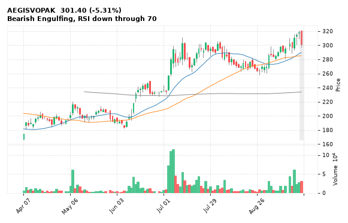

[🔔 Set alert on AEGISVOPAK](https://claude.ai/artifact/Ewc5hHTPX6WkU1nVcDNQzq?s=AEGISVOPAK&c=close%20below%20296.70) &nbsp;|&nbsp; [📈 Live chart (TradingView)](https://www.tradingview.com/chart/?symbol=NSE:AEGISVOPAK) &nbsp;|&nbsp; [alert by email](mailto:himanshusardana05@gmail.com?subject=ALERT%20AEGISVOPAK&body=Alert%20me%20when%3A%20close%20below%20296.70%0A%0AEdit%20the%20line%20above%20if%20you%20want%2C%20then%20press%20Send.%20Checked%20on%20every%20day%27s%20closing%20data%3B%20a%20triggered%20alert%20appears%20at%20the%20top%20of%20the%208%20AM%20Technical%20Analysis%20email.%0A%0AExamples%20you%20can%20write%3A%0A%20%20close%20above%201150%20%20%7C%20%20close%20below%201080%20%20%7C%20%20high%20above%201200%20%20%7C%20%20low%20below%201050%0A%20%20close%20crosses%20above%20200%20DMA%20%20%7C%20%20close%20below%2050%20DMA%20%20%7C%20%20RSI%20below%2030%20%20%7C%20%20RSI%20above%2070%0A%20%20volume%20above%202x%20%20%7C%20%20change%20above%205%25%20%20%7C%20%20change%20below%20-4%25%20%20%7C%20%2052-week%20high%20%20%7C%20%20golden%20cross%0A%20%20combine%20with%20%27and%27%2C%20e.g.%20%20close%20above%201150%20and%20volume%20above%201.5x%0A%0AReference%3A%20AEGISVOPAK%20closed%20301.40%20%28high%20320.85%2C%20low%20296.70%29.%0ATo%20cancel%20later%2C%20send%20an%20email%20with%20subject%3A%20CANCEL%20ALERT%20AEGISVOPAK)

---

## 18. ACUTAAS - BEARISH
**3,213.70** (-6.19%) | vol 1.7x | RSI 46 | H 3,450.00 / L 3,200.00  
Bearish Marubozu, Evening Star

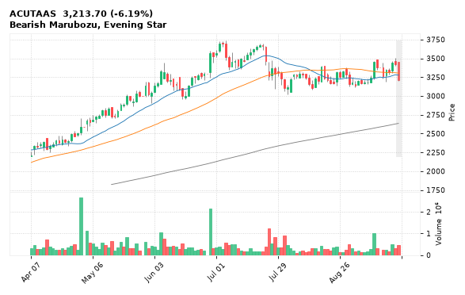

[🔔 Set alert on ACUTAAS](https://claude.ai/artifact/Ewc5hHTPX6WkU1nVcDNQzq?s=ACUTAAS&c=close%20below%203200.00) &nbsp;|&nbsp; [📈 Live chart (TradingView)](https://www.tradingview.com/chart/?symbol=NSE:ACUTAAS) &nbsp;|&nbsp; [alert by email](mailto:himanshusardana05@gmail.com?subject=ALERT%20ACUTAAS&body=Alert%20me%20when%3A%20close%20below%203200.00%0A%0AEdit%20the%20line%20above%20if%20you%20want%2C%20then%20press%20Send.%20Checked%20on%20every%20day%27s%20closing%20data%3B%20a%20triggered%20alert%20appears%20at%20the%20top%20of%20the%208%20AM%20Technical%20Analysis%20email.%0A%0AExamples%20you%20can%20write%3A%0A%20%20close%20above%201150%20%20%7C%20%20close%20below%201080%20%20%7C%20%20high%20above%201200%20%20%7C%20%20low%20below%201050%0A%20%20close%20crosses%20above%20200%20DMA%20%20%7C%20%20close%20below%2050%20DMA%20%20%7C%20%20RSI%20below%2030%20%20%7C%20%20RSI%20above%2070%0A%20%20volume%20above%202x%20%20%7C%20%20change%20above%205%25%20%20%7C%20%20change%20below%20-4%25%20%20%7C%20%2052-week%20high%20%20%7C%20%20golden%20cross%0A%20%20combine%20with%20%27and%27%2C%20e.g.%20%20close%20above%201150%20and%20volume%20above%201.5x%0A%0AReference%3A%20ACUTAAS%20closed%203213.70%20%28high%203450.00%2C%20low%203200.00%29.%0ATo%20cancel%20later%2C%20send%20an%20email%20with%20subject%3A%20CANCEL%20ALERT%20ACUTAAS)

---

## 19. CONCOR - BEARISH
**467.00** (-4.12%) | vol 2.4x | RSI 34 | H 489.50 / L 466.70  
Bearish Marubozu, Volume spike 2.4x

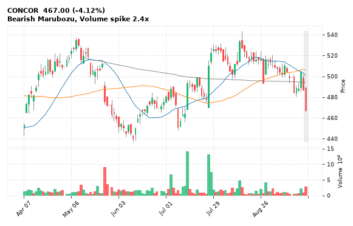

[🔔 Set alert on CONCOR](https://claude.ai/artifact/Ewc5hHTPX6WkU1nVcDNQzq?s=CONCOR&c=close%20below%20466.70) &nbsp;|&nbsp; [📈 Live chart (TradingView)](https://www.tradingview.com/chart/?symbol=NSE:CONCOR) &nbsp;|&nbsp; [alert by email](mailto:himanshusardana05@gmail.com?subject=ALERT%20CONCOR&body=Alert%20me%20when%3A%20close%20below%20466.70%0A%0AEdit%20the%20line%20above%20if%20you%20want%2C%20then%20press%20Send.%20Checked%20on%20every%20day%27s%20closing%20data%3B%20a%20triggered%20alert%20appears%20at%20the%20top%20of%20the%208%20AM%20Technical%20Analysis%20email.%0A%0AExamples%20you%20can%20write%3A%0A%20%20close%20above%201150%20%20%7C%20%20close%20below%201080%20%20%7C%20%20high%20above%201200%20%20%7C%20%20low%20below%201050%0A%20%20close%20crosses%20above%20200%20DMA%20%20%7C%20%20close%20below%2050%20DMA%20%20%7C%20%20RSI%20below%2030%20%20%7C%20%20RSI%20above%2070%0A%20%20volume%20above%202x%20%20%7C%20%20change%20above%205%25%20%20%7C%20%20change%20below%20-4%25%20%20%7C%20%2052-week%20high%20%20%7C%20%20golden%20cross%0A%20%20combine%20with%20%27and%27%2C%20e.g.%20%20close%20above%201150%20and%20volume%20above%201.5x%0A%0AReference%3A%20CONCOR%20closed%20467.00%20%28high%20489.50%2C%20low%20466.70%29.%0ATo%20cancel%20later%2C%20send%20an%20email%20with%20subject%3A%20CANCEL%20ALERT%20CONCOR)

---

## 20. BHEL - BEARISH
**425.80** (-1.75%) | vol 0.7x | RSI 51 | H 439.70 / L 424.65  
Bearish Engulfing, MACD bearish cross

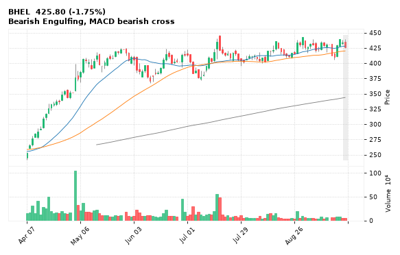

[🔔 Set alert on BHEL](https://claude.ai/artifact/Ewc5hHTPX6WkU1nVcDNQzq?s=BHEL&c=close%20below%20424.65) &nbsp;|&nbsp; [📈 Live chart (TradingView)](https://www.tradingview.com/chart/?symbol=NSE:BHEL) &nbsp;|&nbsp; [alert by email](mailto:himanshusardana05@gmail.com?subject=ALERT%20BHEL&body=Alert%20me%20when%3A%20close%20below%20424.65%0A%0AEdit%20the%20line%20above%20if%20you%20want%2C%20then%20press%20Send.%20Checked%20on%20every%20day%27s%20closing%20data%3B%20a%20triggered%20alert%20appears%20at%20the%20top%20of%20the%208%20AM%20Technical%20Analysis%20email.%0A%0AExamples%20you%20can%20write%3A%0A%20%20close%20above%201150%20%20%7C%20%20close%20below%201080%20%20%7C%20%20high%20above%201200%20%20%7C%20%20low%20below%201050%0A%20%20close%20crosses%20above%20200%20DMA%20%20%7C%20%20close%20below%2050%20DMA%20%20%7C%20%20RSI%20below%2030%20%20%7C%20%20RSI%20above%2070%0A%20%20volume%20above%202x%20%20%7C%20%20change%20above%205%25%20%20%7C%20%20change%20below%20-4%25%20%20%7C%20%2052-week%20high%20%20%7C%20%20golden%20cross%0A%20%20combine%20with%20%27and%27%2C%20e.g.%20%20close%20above%201150%20and%20volume%20above%201.5x%0A%0AReference%3A%20BHEL%20closed%20425.80%20%28high%20439.70%2C%20low%20424.65%29.%0ATo%20cancel%20later%2C%20send%20an%20email%20with%20subject%3A%20CANCEL%20ALERT%20BHEL)

---

## 21. ABDL - BEARISH
**647.90** (-1.28%) | vol 2.1x | RSI 60 | H 661.40 / L 631.70  
Bearish Engulfing

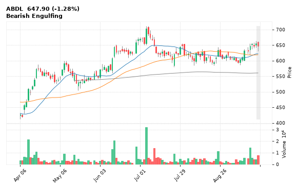

[🔔 Set alert on ABDL](https://claude.ai/artifact/Ewc5hHTPX6WkU1nVcDNQzq?s=ABDL&c=close%20below%20631.70) &nbsp;|&nbsp; [📈 Live chart (TradingView)](https://www.tradingview.com/chart/?symbol=NSE:ABDL) &nbsp;|&nbsp; [alert by email](mailto:himanshusardana05@gmail.com?subject=ALERT%20ABDL&body=Alert%20me%20when%3A%20close%20below%20631.70%0A%0AEdit%20the%20line%20above%20if%20you%20want%2C%20then%20press%20Send.%20Checked%20on%20every%20day%27s%20closing%20data%3B%20a%20triggered%20alert%20appears%20at%20the%20top%20of%20the%208%20AM%20Technical%20Analysis%20email.%0A%0AExamples%20you%20can%20write%3A%0A%20%20close%20above%201150%20%20%7C%20%20close%20below%201080%20%20%7C%20%20high%20above%201200%20%20%7C%20%20low%20below%201050%0A%20%20close%20crosses%20above%20200%20DMA%20%20%7C%20%20close%20below%2050%20DMA%20%20%7C%20%20RSI%20below%2030%20%20%7C%20%20RSI%20above%2070%0A%20%20volume%20above%202x%20%20%7C%20%20change%20above%205%25%20%20%7C%20%20change%20below%20-4%25%20%20%7C%20%2052-week%20high%20%20%7C%20%20golden%20cross%0A%20%20combine%20with%20%27and%27%2C%20e.g.%20%20close%20above%201150%20and%20volume%20above%201.5x%0A%0AReference%3A%20ABDL%20closed%20647.90%20%28high%20661.40%2C%20low%20631.70%29.%0ATo%20cancel%20later%2C%20send%20an%20email%20with%20subject%3A%20CANCEL%20ALERT%20ABDL)

---

## 22. AUROPHARMA - BEARISH
**1,700.00** (-0.78%) | vol 1.2x | RSI 57 | H 1,719.00 / L 1,689.30  
Bearish Engulfing

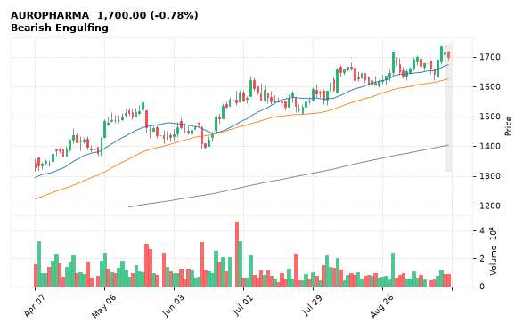

[🔔 Set alert on AUROPHARMA](https://claude.ai/artifact/Ewc5hHTPX6WkU1nVcDNQzq?s=AUROPHARMA&c=close%20below%201689.30) &nbsp;|&nbsp; [📈 Live chart (TradingView)](https://www.tradingview.com/chart/?symbol=NSE:AUROPHARMA) &nbsp;|&nbsp; [alert by email](mailto:himanshusardana05@gmail.com?subject=ALERT%20AUROPHARMA&body=Alert%20me%20when%3A%20close%20below%201689.30%0A%0AEdit%20the%20line%20above%20if%20you%20want%2C%20then%20press%20Send.%20Checked%20on%20every%20day%27s%20closing%20data%3B%20a%20triggered%20alert%20appears%20at%20the%20top%20of%20the%208%20AM%20Technical%20Analysis%20email.%0A%0AExamples%20you%20can%20write%3A%0A%20%20close%20above%201150%20%20%7C%20%20close%20below%201080%20%20%7C%20%20high%20above%201200%20%20%7C%20%20low%20below%201050%0A%20%20close%20crosses%20above%20200%20DMA%20%20%7C%20%20close%20below%2050%20DMA%20%20%7C%20%20RSI%20below%2030%20%20%7C%20%20RSI%20above%2070%0A%20%20volume%20above%202x%20%20%7C%20%20change%20above%205%25%20%20%7C%20%20change%20below%20-4%25%20%20%7C%20%2052-week%20high%20%20%7C%20%20golden%20cross%0A%20%20combine%20with%20%27and%27%2C%20e.g.%20%20close%20above%201150%20and%20volume%20above%201.5x%0A%0AReference%3A%20AUROPHARMA%20closed%201700.00%20%28high%201719.00%2C%20low%201689.30%29.%0ATo%20cancel%20later%2C%20send%20an%20email%20with%20subject%3A%20CANCEL%20ALERT%20AUROPHARMA)

---

## 23. CGPOWER - BEARISH
**896.10** (-1.53%) | vol 0.9x | RSI 51 | H 926.10 / L 896.10  
Bearish Engulfing

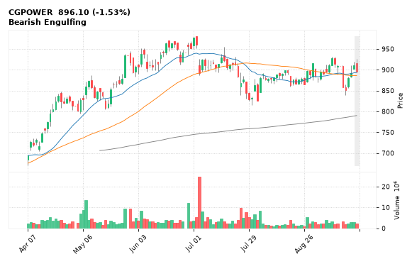

[🔔 Set alert on CGPOWER](https://claude.ai/artifact/Ewc5hHTPX6WkU1nVcDNQzq?s=CGPOWER&c=close%20below%20896.10) &nbsp;|&nbsp; [📈 Live chart (TradingView)](https://www.tradingview.com/chart/?symbol=NSE:CGPOWER) &nbsp;|&nbsp; [alert by email](mailto:himanshusardana05@gmail.com?subject=ALERT%20CGPOWER&body=Alert%20me%20when%3A%20close%20below%20896.10%0A%0AEdit%20the%20line%20above%20if%20you%20want%2C%20then%20press%20Send.%20Checked%20on%20every%20day%27s%20closing%20data%3B%20a%20triggered%20alert%20appears%20at%20the%20top%20of%20the%208%20AM%20Technical%20Analysis%20email.%0A%0AExamples%20you%20can%20write%3A%0A%20%20close%20above%201150%20%20%7C%20%20close%20below%201080%20%20%7C%20%20high%20above%201200%20%20%7C%20%20low%20below%201050%0A%20%20close%20crosses%20above%20200%20DMA%20%20%7C%20%20close%20below%2050%20DMA%20%20%7C%20%20RSI%20below%2030%20%20%7C%20%20RSI%20above%2070%0A%20%20volume%20above%202x%20%20%7C%20%20change%20above%205%25%20%20%7C%20%20change%20below%20-4%25%20%20%7C%20%2052-week%20high%20%20%7C%20%20golden%20cross%0A%20%20combine%20with%20%27and%27%2C%20e.g.%20%20close%20above%201150%20and%20volume%20above%201.5x%0A%0AReference%3A%20CGPOWER%20closed%20896.10%20%28high%20926.10%2C%20low%20896.10%29.%0ATo%20cancel%20later%2C%20send%20an%20email%20with%20subject%3A%20CANCEL%20ALERT%20CGPOWER)

---

## 24. IRB - BEARISH
**17.98** (-0.66%) | vol 0.9x | RSI 31 | H 18.27 / L 17.93  
52-week low breakdown

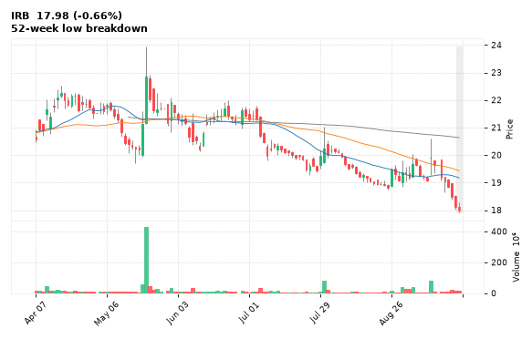

[🔔 Set alert on IRB](https://claude.ai/artifact/Ewc5hHTPX6WkU1nVcDNQzq?s=IRB&c=close%20below%2017.93) &nbsp;|&nbsp; [📈 Live chart (TradingView)](https://www.tradingview.com/chart/?symbol=NSE:IRB) &nbsp;|&nbsp; [alert by email](mailto:himanshusardana05@gmail.com?subject=ALERT%20IRB&body=Alert%20me%20when%3A%20close%20below%2017.93%0A%0AEdit%20the%20line%20above%20if%20you%20want%2C%20then%20press%20Send.%20Checked%20on%20every%20day%27s%20closing%20data%3B%20a%20triggered%20alert%20appears%20at%20the%20top%20of%20the%208%20AM%20Technical%20Analysis%20email.%0A%0AExamples%20you%20can%20write%3A%0A%20%20close%20above%201150%20%20%7C%20%20close%20below%201080%20%20%7C%20%20high%20above%201200%20%20%7C%20%20low%20below%201050%0A%20%20close%20crosses%20above%20200%20DMA%20%20%7C%20%20close%20below%2050%20DMA%20%20%7C%20%20RSI%20below%2030%20%20%7C%20%20RSI%20above%2070%0A%20%20volume%20above%202x%20%20%7C%20%20change%20above%205%25%20%20%7C%20%20change%20below%20-4%25%20%20%7C%20%2052-week%20high%20%20%7C%20%20golden%20cross%0A%20%20combine%20with%20%27and%27%2C%20e.g.%20%20close%20above%201150%20and%20volume%20above%201.5x%0A%0AReference%3A%20IRB%20closed%2017.98%20%28high%2018.27%2C%20low%2017.93%29.%0ATo%20cancel%20later%2C%20send%20an%20email%20with%20subject%3A%20CANCEL%20ALERT%20IRB)

---

## 25. JSL - BEARISH
**743.45** (-1.06%) | vol 0.8x | RSI 53 | H 750.10 / L 738.50  
Close below 200 DMA, MACD bearish cross

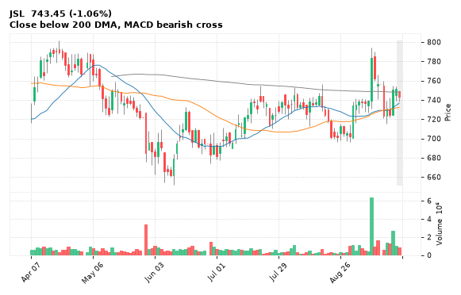

[🔔 Set alert on JSL](https://claude.ai/artifact/Ewc5hHTPX6WkU1nVcDNQzq?s=JSL&c=close%20below%20738.50) &nbsp;|&nbsp; [📈 Live chart (TradingView)](https://www.tradingview.com/chart/?symbol=NSE:JSL) &nbsp;|&nbsp; [alert by email](mailto:himanshusardana05@gmail.com?subject=ALERT%20JSL&body=Alert%20me%20when%3A%20close%20below%20738.50%0A%0AEdit%20the%20line%20above%20if%20you%20want%2C%20then%20press%20Send.%20Checked%20on%20every%20day%27s%20closing%20data%3B%20a%20triggered%20alert%20appears%20at%20the%20top%20of%20the%208%20AM%20Technical%20Analysis%20email.%0A%0AExamples%20you%20can%20write%3A%0A%20%20close%20above%201150%20%20%7C%20%20close%20below%201080%20%20%7C%20%20high%20above%201200%20%20%7C%20%20low%20below%201050%0A%20%20close%20crosses%20above%20200%20DMA%20%20%7C%20%20close%20below%2050%20DMA%20%20%7C%20%20RSI%20below%2030%20%20%7C%20%20RSI%20above%2070%0A%20%20volume%20above%202x%20%20%7C%20%20change%20above%205%25%20%20%7C%20%20change%20below%20-4%25%20%20%7C%20%2052-week%20high%20%20%7C%20%20golden%20cross%0A%20%20combine%20with%20%27and%27%2C%20e.g.%20%20close%20above%201150%20and%20volume%20above%201.5x%0A%0AReference%3A%20JSL%20closed%20743.45%20%28high%20750.10%2C%20low%20738.50%29.%0ATo%20cancel%20later%2C%20send%20an%20email%20with%20subject%3A%20CANCEL%20ALERT%20JSL)

---

## 26. LICI - BEARISH
**404.55** (+1.14%) | vol 0.8x | RSI 47 | H 406.80 / L 399.55  
Death Cross (50/200 DMA)

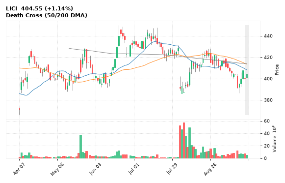

[🔔 Set alert on LICI](https://claude.ai/artifact/Ewc5hHTPX6WkU1nVcDNQzq?s=LICI&c=close%20below%20399.55) &nbsp;|&nbsp; [📈 Live chart (TradingView)](https://www.tradingview.com/chart/?symbol=NSE:LICI) &nbsp;|&nbsp; [alert by email](mailto:himanshusardana05@gmail.com?subject=ALERT%20LICI&body=Alert%20me%20when%3A%20close%20below%20399.55%0A%0AEdit%20the%20line%20above%20if%20you%20want%2C%20then%20press%20Send.%20Checked%20on%20every%20day%27s%20closing%20data%3B%20a%20triggered%20alert%20appears%20at%20the%20top%20of%20the%208%20AM%20Technical%20Analysis%20email.%0A%0AExamples%20you%20can%20write%3A%0A%20%20close%20above%201150%20%20%7C%20%20close%20below%201080%20%20%7C%20%20high%20above%201200%20%20%7C%20%20low%20below%201050%0A%20%20close%20crosses%20above%20200%20DMA%20%20%7C%20%20close%20below%2050%20DMA%20%20%7C%20%20RSI%20below%2030%20%20%7C%20%20RSI%20above%2070%0A%20%20volume%20above%202x%20%20%7C%20%20change%20above%205%25%20%20%7C%20%20change%20below%20-4%25%20%20%7C%20%2052-week%20high%20%20%7C%20%20golden%20cross%0A%20%20combine%20with%20%27and%27%2C%20e.g.%20%20close%20above%201150%20and%20volume%20above%201.5x%0A%0AReference%3A%20LICI%20closed%20404.55%20%28high%20406.80%2C%20low%20399.55%29.%0ATo%20cancel%20later%2C%20send%20an%20email%20with%20subject%3A%20CANCEL%20ALERT%20LICI)

---

## 27. LUPIN - BEARISH
**2,135.00** (+0.49%) | vol 0.8x | RSI 47 | H 2,135.00 / L 2,109.00  
Death Cross (50/200 DMA)

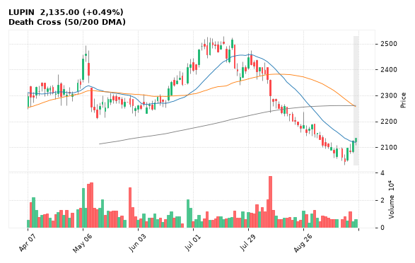

[🔔 Set alert on LUPIN](https://claude.ai/artifact/Ewc5hHTPX6WkU1nVcDNQzq?s=LUPIN&c=close%20below%202109.00) &nbsp;|&nbsp; [📈 Live chart (TradingView)](https://www.tradingview.com/chart/?symbol=NSE:LUPIN) &nbsp;|&nbsp; [alert by email](mailto:himanshusardana05@gmail.com?subject=ALERT%20LUPIN&body=Alert%20me%20when%3A%20close%20below%202109.00%0A%0AEdit%20the%20line%20above%20if%20you%20want%2C%20then%20press%20Send.%20Checked%20on%20every%20day%27s%20closing%20data%3B%20a%20triggered%20alert%20appears%20at%20the%20top%20of%20the%208%20AM%20Technical%20Analysis%20email.%0A%0AExamples%20you%20can%20write%3A%0A%20%20close%20above%201150%20%20%7C%20%20close%20below%201080%20%20%7C%20%20high%20above%201200%20%20%7C%20%20low%20below%201050%0A%20%20close%20crosses%20above%20200%20DMA%20%20%7C%20%20close%20below%2050%20DMA%20%20%7C%20%20RSI%20below%2030%20%20%7C%20%20RSI%20above%2070%0A%20%20volume%20above%202x%20%20%7C%20%20change%20above%205%25%20%20%7C%20%20change%20below%20-4%25%20%20%7C%20%2052-week%20high%20%20%7C%20%20golden%20cross%0A%20%20combine%20with%20%27and%27%2C%20e.g.%20%20close%20above%201150%20and%20volume%20above%201.5x%0A%0AReference%3A%20LUPIN%20closed%202135.00%20%28high%202135.00%2C%20low%202109.00%29.%0ATo%20cancel%20later%2C%20send%20an%20email%20with%20subject%3A%20CANCEL%20ALERT%20LUPIN)

---

## 28. TATACONSUM - BEARISH
**984.10** (-1.65%) | vol 0.6x | RSI 35 | H 1,006.00 / L 984.10  
52-week low breakdown

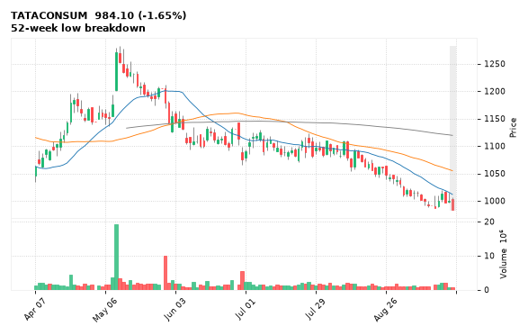

[🔔 Set alert on TATACONSUM](https://claude.ai/artifact/Ewc5hHTPX6WkU1nVcDNQzq?s=TATACONSUM&c=close%20below%20984.10) &nbsp;|&nbsp; [📈 Live chart (TradingView)](https://www.tradingview.com/chart/?symbol=NSE:TATACONSUM) &nbsp;|&nbsp; [alert by email](mailto:himanshusardana05@gmail.com?subject=ALERT%20TATACONSUM&body=Alert%20me%20when%3A%20close%20below%20984.10%0A%0AEdit%20the%20line%20above%20if%20you%20want%2C%20then%20press%20Send.%20Checked%20on%20every%20day%27s%20closing%20data%3B%20a%20triggered%20alert%20appears%20at%20the%20top%20of%20the%208%20AM%20Technical%20Analysis%20email.%0A%0AExamples%20you%20can%20write%3A%0A%20%20close%20above%201150%20%20%7C%20%20close%20below%201080%20%20%7C%20%20high%20above%201200%20%20%7C%20%20low%20below%201050%0A%20%20close%20crosses%20above%20200%20DMA%20%20%7C%20%20close%20below%2050%20DMA%20%20%7C%20%20RSI%20below%2030%20%20%7C%20%20RSI%20above%2070%0A%20%20volume%20above%202x%20%20%7C%20%20change%20above%205%25%20%20%7C%20%20change%20below%20-4%25%20%20%7C%20%2052-week%20high%20%20%7C%20%20golden%20cross%0A%20%20combine%20with%20%27and%27%2C%20e.g.%20%20close%20above%201150%20and%20volume%20above%201.5x%0A%0AReference%3A%20TATACONSUM%20closed%20984.10%20%28high%201006.00%2C%20low%20984.10%29.%0ATo%20cancel%20later%2C%20send%20an%20email%20with%20subject%3A%20CANCEL%20ALERT%20TATACONSUM)

---

## 29. TATACHEM - BEARISH
**674.00** (-2.98%) | vol 0.5x | RSI 52 | H 697.05 / L 673.00  
Bearish Engulfing, Inside Bar

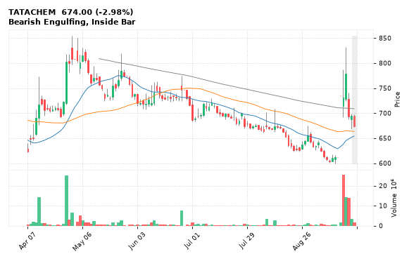

[🔔 Set alert on TATACHEM](https://claude.ai/artifact/Ewc5hHTPX6WkU1nVcDNQzq?s=TATACHEM&c=close%20below%20673.00) &nbsp;|&nbsp; [📈 Live chart (TradingView)](https://www.tradingview.com/chart/?symbol=NSE:TATACHEM) &nbsp;|&nbsp; [alert by email](mailto:himanshusardana05@gmail.com?subject=ALERT%20TATACHEM&body=Alert%20me%20when%3A%20close%20below%20673.00%0A%0AEdit%20the%20line%20above%20if%20you%20want%2C%20then%20press%20Send.%20Checked%20on%20every%20day%27s%20closing%20data%3B%20a%20triggered%20alert%20appears%20at%20the%20top%20of%20the%208%20AM%20Technical%20Analysis%20email.%0A%0AExamples%20you%20can%20write%3A%0A%20%20close%20above%201150%20%20%7C%20%20close%20below%201080%20%20%7C%20%20high%20above%201200%20%20%7C%20%20low%20below%201050%0A%20%20close%20crosses%20above%20200%20DMA%20%20%7C%20%20close%20below%2050%20DMA%20%20%7C%20%20RSI%20below%2030%20%20%7C%20%20RSI%20above%2070%0A%20%20volume%20above%202x%20%20%7C%20%20change%20above%205%25%20%20%7C%20%20change%20below%20-4%25%20%20%7C%20%2052-week%20high%20%20%7C%20%20golden%20cross%0A%20%20combine%20with%20%27and%27%2C%20e.g.%20%20close%20above%201150%20and%20volume%20above%201.5x%0A%0AReference%3A%20TATACHEM%20closed%20674.00%20%28high%20697.05%2C%20low%20673.00%29.%0ATo%20cancel%20later%2C%20send%20an%20email%20with%20subject%3A%20CANCEL%20ALERT%20TATACHEM)

---
