# Technical Analysis Alert on Nifty 500 - charts for Wed 23 Sep 2026

Scroll through all charts. Tap **Set alert** under any chart to get an email alert in the 8 AM report when your price/condition triggers on the daily close.

## 1. WHIRLPOOL - BULLISH
**865.25** (+20.00%) | vol 18.6x | RSI 68 | H 865.25 / L 722.20  
Bullish Marubozu, Close above 200 DMA, MACD bullish cross, Volume spike 18.6x

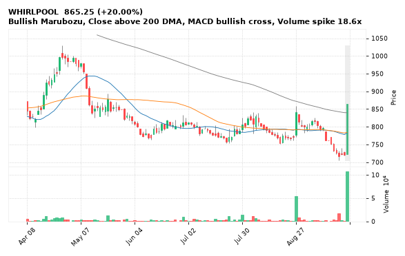

[🔔 Set alert on WHIRLPOOL](https://claude.ai/artifact/Ewc5hHTPX6WkU1nVcDNQzq?s=WHIRLPOOL&c=close%20above%20865.25) &nbsp;|&nbsp; [📈 Live chart (TradingView)](https://www.tradingview.com/chart/?symbol=NSE:WHIRLPOOL) &nbsp;|&nbsp; [alert by email](mailto:himanshusardana05@gmail.com?subject=ALERT%20WHIRLPOOL&body=Alert%20me%20when%3A%20close%20above%20865.25%0A%0AEdit%20the%20line%20above%20if%20you%20want%2C%20then%20press%20Send.%20Checked%20on%20every%20day%27s%20closing%20data%3B%20a%20triggered%20alert%20appears%20at%20the%20top%20of%20the%208%20AM%20Technical%20Analysis%20email.%0A%0AExamples%20you%20can%20write%3A%0A%20%20close%20above%201150%20%20%7C%20%20close%20below%201080%20%20%7C%20%20high%20above%201200%20%20%7C%20%20low%20below%201050%0A%20%20close%20crosses%20above%20200%20DMA%20%20%7C%20%20close%20below%2050%20DMA%20%20%7C%20%20RSI%20below%2030%20%20%7C%20%20RSI%20above%2070%0A%20%20volume%20above%202x%20%20%7C%20%20change%20above%205%25%20%20%7C%20%20change%20below%20-4%25%20%20%7C%20%2052-week%20high%20%20%7C%20%20golden%20cross%0A%20%20combine%20with%20%27and%27%2C%20e.g.%20%20close%20above%201150%20and%20volume%20above%201.5x%0A%0AReference%3A%20WHIRLPOOL%20closed%20865.25%20%28high%20865.25%2C%20low%20722.20%29.%0ATo%20cancel%20later%2C%20send%20an%20email%20with%20subject%3A%20CANCEL%20ALERT%20WHIRLPOOL)

---

## 2. TATACAP - BULLISH
**350.05** (+2.62%) | vol 3.2x | RSI 43 | H 352.00 / L 343.00  
Dragonfly Doji, Morning Star, Volume spike 3.2x

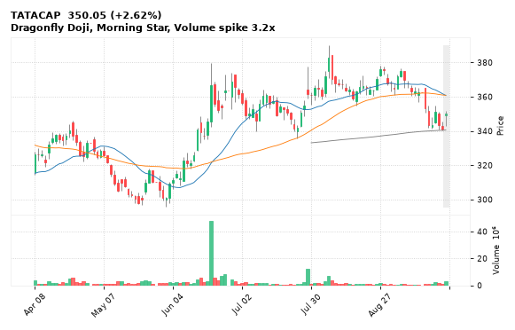

[🔔 Set alert on TATACAP](https://claude.ai/artifact/Ewc5hHTPX6WkU1nVcDNQzq?s=TATACAP&c=close%20above%20352.00) &nbsp;|&nbsp; [📈 Live chart (TradingView)](https://www.tradingview.com/chart/?symbol=NSE:TATACAP) &nbsp;|&nbsp; [alert by email](mailto:himanshusardana05@gmail.com?subject=ALERT%20TATACAP&body=Alert%20me%20when%3A%20close%20above%20352.00%0A%0AEdit%20the%20line%20above%20if%20you%20want%2C%20then%20press%20Send.%20Checked%20on%20every%20day%27s%20closing%20data%3B%20a%20triggered%20alert%20appears%20at%20the%20top%20of%20the%208%20AM%20Technical%20Analysis%20email.%0A%0AExamples%20you%20can%20write%3A%0A%20%20close%20above%201150%20%20%7C%20%20close%20below%201080%20%20%7C%20%20high%20above%201200%20%20%7C%20%20low%20below%201050%0A%20%20close%20crosses%20above%20200%20DMA%20%20%7C%20%20close%20below%2050%20DMA%20%20%7C%20%20RSI%20below%2030%20%20%7C%20%20RSI%20above%2070%0A%20%20volume%20above%202x%20%20%7C%20%20change%20above%205%25%20%20%7C%20%20change%20below%20-4%25%20%20%7C%20%2052-week%20high%20%20%7C%20%20golden%20cross%0A%20%20combine%20with%20%27and%27%2C%20e.g.%20%20close%20above%201150%20and%20volume%20above%201.5x%0A%0AReference%3A%20TATACAP%20closed%20350.05%20%28high%20352.00%2C%20low%20343.00%29.%0ATo%20cancel%20later%2C%20send%20an%20email%20with%20subject%3A%20CANCEL%20ALERT%20TATACAP)

---

## 3. JSWCEMENT - BULLISH
**118.18** (+1.27%) | vol 1.8x | RSI 36 | H 119.02 / L 116.71  
Morning Star, RSI up through 30, MACD bullish cross

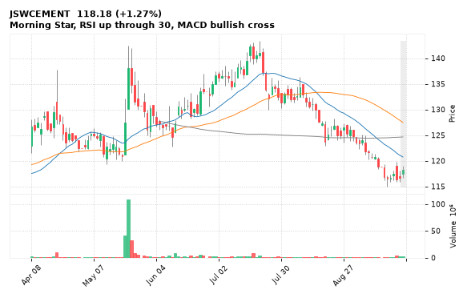

[🔔 Set alert on JSWCEMENT](https://claude.ai/artifact/Ewc5hHTPX6WkU1nVcDNQzq?s=JSWCEMENT&c=close%20above%20119.02) &nbsp;|&nbsp; [📈 Live chart (TradingView)](https://www.tradingview.com/chart/?symbol=NSE:JSWCEMENT) &nbsp;|&nbsp; [alert by email](mailto:himanshusardana05@gmail.com?subject=ALERT%20JSWCEMENT&body=Alert%20me%20when%3A%20close%20above%20119.02%0A%0AEdit%20the%20line%20above%20if%20you%20want%2C%20then%20press%20Send.%20Checked%20on%20every%20day%27s%20closing%20data%3B%20a%20triggered%20alert%20appears%20at%20the%20top%20of%20the%208%20AM%20Technical%20Analysis%20email.%0A%0AExamples%20you%20can%20write%3A%0A%20%20close%20above%201150%20%20%7C%20%20close%20below%201080%20%20%7C%20%20high%20above%201200%20%20%7C%20%20low%20below%201050%0A%20%20close%20crosses%20above%20200%20DMA%20%20%7C%20%20close%20below%2050%20DMA%20%20%7C%20%20RSI%20below%2030%20%20%7C%20%20RSI%20above%2070%0A%20%20volume%20above%202x%20%20%7C%20%20change%20above%205%25%20%20%7C%20%20change%20below%20-4%25%20%20%7C%20%2052-week%20high%20%20%7C%20%20golden%20cross%0A%20%20combine%20with%20%27and%27%2C%20e.g.%20%20close%20above%201150%20and%20volume%20above%201.5x%0A%0AReference%3A%20JSWCEMENT%20closed%20118.18%20%28high%20119.02%2C%20low%20116.71%29.%0ATo%20cancel%20later%2C%20send%20an%20email%20with%20subject%3A%20CANCEL%20ALERT%20JSWCEMENT)

---

## 4. FIVESTAR - BULLISH
**549.70** (+4.73%) | vol 1.4x | RSI 56 | H 552.00 / L 524.50  
Bullish Marubozu, Bullish Engulfing, MACD bullish cross

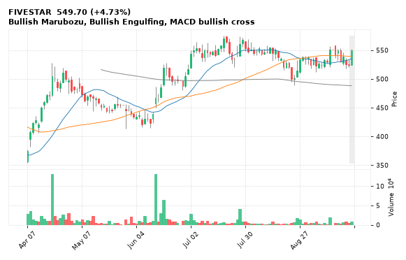

[🔔 Set alert on FIVESTAR](https://claude.ai/artifact/Ewc5hHTPX6WkU1nVcDNQzq?s=FIVESTAR&c=close%20above%20552.00) &nbsp;|&nbsp; [📈 Live chart (TradingView)](https://www.tradingview.com/chart/?symbol=NSE:FIVESTAR) &nbsp;|&nbsp; [alert by email](mailto:himanshusardana05@gmail.com?subject=ALERT%20FIVESTAR&body=Alert%20me%20when%3A%20close%20above%20552.00%0A%0AEdit%20the%20line%20above%20if%20you%20want%2C%20then%20press%20Send.%20Checked%20on%20every%20day%27s%20closing%20data%3B%20a%20triggered%20alert%20appears%20at%20the%20top%20of%20the%208%20AM%20Technical%20Analysis%20email.%0A%0AExamples%20you%20can%20write%3A%0A%20%20close%20above%201150%20%20%7C%20%20close%20below%201080%20%20%7C%20%20high%20above%201200%20%20%7C%20%20low%20below%201050%0A%20%20close%20crosses%20above%20200%20DMA%20%20%7C%20%20close%20below%2050%20DMA%20%20%7C%20%20RSI%20below%2030%20%20%7C%20%20RSI%20above%2070%0A%20%20volume%20above%202x%20%20%7C%20%20change%20above%205%25%20%20%7C%20%20change%20below%20-4%25%20%20%7C%20%2052-week%20high%20%20%7C%20%20golden%20cross%0A%20%20combine%20with%20%27and%27%2C%20e.g.%20%20close%20above%201150%20and%20volume%20above%201.5x%0A%0AReference%3A%20FIVESTAR%20closed%20549.70%20%28high%20552.00%2C%20low%20524.50%29.%0ATo%20cancel%20later%2C%20send%20an%20email%20with%20subject%3A%20CANCEL%20ALERT%20FIVESTAR)

---

## 5. RADICO - BULLISH
**4,601.90** (+3.44%) | vol 2.4x | RSI 58 | H 4,614.10 / L 4,450.40  
Bullish Marubozu, MACD bullish cross, Volume spike 2.4x

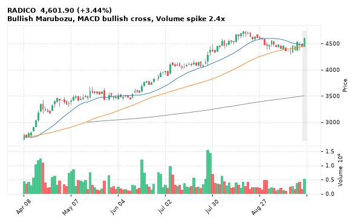

[🔔 Set alert on RADICO](https://claude.ai/artifact/Ewc5hHTPX6WkU1nVcDNQzq?s=RADICO&c=close%20above%204614.10) &nbsp;|&nbsp; [📈 Live chart (TradingView)](https://www.tradingview.com/chart/?symbol=NSE:RADICO) &nbsp;|&nbsp; [alert by email](mailto:himanshusardana05@gmail.com?subject=ALERT%20RADICO&body=Alert%20me%20when%3A%20close%20above%204614.10%0A%0AEdit%20the%20line%20above%20if%20you%20want%2C%20then%20press%20Send.%20Checked%20on%20every%20day%27s%20closing%20data%3B%20a%20triggered%20alert%20appears%20at%20the%20top%20of%20the%208%20AM%20Technical%20Analysis%20email.%0A%0AExamples%20you%20can%20write%3A%0A%20%20close%20above%201150%20%20%7C%20%20close%20below%201080%20%20%7C%20%20high%20above%201200%20%20%7C%20%20low%20below%201050%0A%20%20close%20crosses%20above%20200%20DMA%20%20%7C%20%20close%20below%2050%20DMA%20%20%7C%20%20RSI%20below%2030%20%20%7C%20%20RSI%20above%2070%0A%20%20volume%20above%202x%20%20%7C%20%20change%20above%205%25%20%20%7C%20%20change%20below%20-4%25%20%20%7C%20%2052-week%20high%20%20%7C%20%20golden%20cross%0A%20%20combine%20with%20%27and%27%2C%20e.g.%20%20close%20above%201150%20and%20volume%20above%201.5x%0A%0AReference%3A%20RADICO%20closed%204601.90%20%28high%204614.10%2C%20low%204450.40%29.%0ATo%20cancel%20later%2C%20send%20an%20email%20with%20subject%3A%20CANCEL%20ALERT%20RADICO)

---

## 6. JKTYRE - BULLISH
**355.35** (+2.55%) | vol 2.1x | RSI 41 | H 358.30 / L 348.60  
RSI up through 30, MACD bullish cross, Volume spike 2.1x

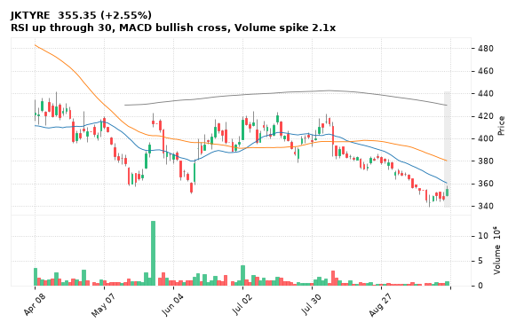

[🔔 Set alert on JKTYRE](https://claude.ai/artifact/Ewc5hHTPX6WkU1nVcDNQzq?s=JKTYRE&c=close%20above%20358.30) &nbsp;|&nbsp; [📈 Live chart (TradingView)](https://www.tradingview.com/chart/?symbol=NSE:JKTYRE) &nbsp;|&nbsp; [alert by email](mailto:himanshusardana05@gmail.com?subject=ALERT%20JKTYRE&body=Alert%20me%20when%3A%20close%20above%20358.30%0A%0AEdit%20the%20line%20above%20if%20you%20want%2C%20then%20press%20Send.%20Checked%20on%20every%20day%27s%20closing%20data%3B%20a%20triggered%20alert%20appears%20at%20the%20top%20of%20the%208%20AM%20Technical%20Analysis%20email.%0A%0AExamples%20you%20can%20write%3A%0A%20%20close%20above%201150%20%20%7C%20%20close%20below%201080%20%20%7C%20%20high%20above%201200%20%20%7C%20%20low%20below%201050%0A%20%20close%20crosses%20above%20200%20DMA%20%20%7C%20%20close%20below%2050%20DMA%20%20%7C%20%20RSI%20below%2030%20%20%7C%20%20RSI%20above%2070%0A%20%20volume%20above%202x%20%20%7C%20%20change%20above%205%25%20%20%7C%20%20change%20below%20-4%25%20%20%7C%20%2052-week%20high%20%20%7C%20%20golden%20cross%0A%20%20combine%20with%20%27and%27%2C%20e.g.%20%20close%20above%201150%20and%20volume%20above%201.5x%0A%0AReference%3A%20JKTYRE%20closed%20355.35%20%28high%20358.30%2C%20low%20348.60%29.%0ATo%20cancel%20later%2C%20send%20an%20email%20with%20subject%3A%20CANCEL%20ALERT%20JKTYRE)

---

## 7. APOLLOHOSP - BULLISH
**9,069.00** (+2.64%) | vol 1.6x | RSI 61 | H 9,070.50 / L 8,865.00  
Bullish Marubozu, 52-week high breakout

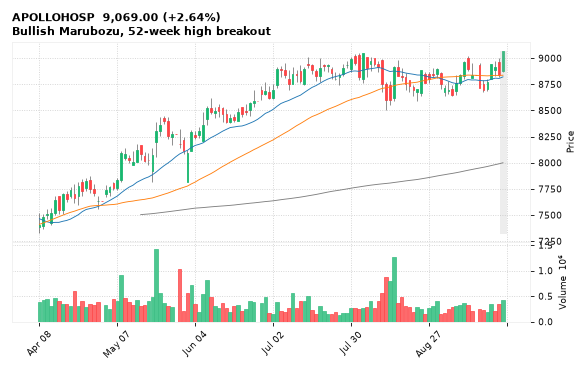

[🔔 Set alert on APOLLOHOSP](https://claude.ai/artifact/Ewc5hHTPX6WkU1nVcDNQzq?s=APOLLOHOSP&c=close%20above%209070.50) &nbsp;|&nbsp; [📈 Live chart (TradingView)](https://www.tradingview.com/chart/?symbol=NSE:APOLLOHOSP) &nbsp;|&nbsp; [alert by email](mailto:himanshusardana05@gmail.com?subject=ALERT%20APOLLOHOSP&body=Alert%20me%20when%3A%20close%20above%209070.50%0A%0AEdit%20the%20line%20above%20if%20you%20want%2C%20then%20press%20Send.%20Checked%20on%20every%20day%27s%20closing%20data%3B%20a%20triggered%20alert%20appears%20at%20the%20top%20of%20the%208%20AM%20Technical%20Analysis%20email.%0A%0AExamples%20you%20can%20write%3A%0A%20%20close%20above%201150%20%20%7C%20%20close%20below%201080%20%20%7C%20%20high%20above%201200%20%20%7C%20%20low%20below%201050%0A%20%20close%20crosses%20above%20200%20DMA%20%20%7C%20%20close%20below%2050%20DMA%20%20%7C%20%20RSI%20below%2030%20%20%7C%20%20RSI%20above%2070%0A%20%20volume%20above%202x%20%20%7C%20%20change%20above%205%25%20%20%7C%20%20change%20below%20-4%25%20%20%7C%20%2052-week%20high%20%20%7C%20%20golden%20cross%0A%20%20combine%20with%20%27and%27%2C%20e.g.%20%20close%20above%201150%20and%20volume%20above%201.5x%0A%0AReference%3A%20APOLLOHOSP%20closed%209069.00%20%28high%209070.50%2C%20low%208865.00%29.%0ATo%20cancel%20later%2C%20send%20an%20email%20with%20subject%3A%20CANCEL%20ALERT%20APOLLOHOSP)

---

## 8. GILLETTE - BULLISH
**7,094.00** (+1.21%) | vol 1.5x | RSI 35 | H 7,113.00 / L 6,970.00  
Bullish Engulfing, RSI up through 30

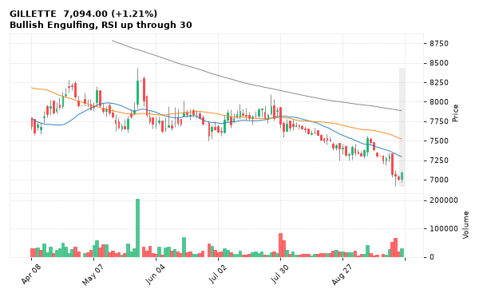

[🔔 Set alert on GILLETTE](https://claude.ai/artifact/Ewc5hHTPX6WkU1nVcDNQzq?s=GILLETTE&c=close%20above%207113.00) &nbsp;|&nbsp; [📈 Live chart (TradingView)](https://www.tradingview.com/chart/?symbol=NSE:GILLETTE) &nbsp;|&nbsp; [alert by email](mailto:himanshusardana05@gmail.com?subject=ALERT%20GILLETTE&body=Alert%20me%20when%3A%20close%20above%207113.00%0A%0AEdit%20the%20line%20above%20if%20you%20want%2C%20then%20press%20Send.%20Checked%20on%20every%20day%27s%20closing%20data%3B%20a%20triggered%20alert%20appears%20at%20the%20top%20of%20the%208%20AM%20Technical%20Analysis%20email.%0A%0AExamples%20you%20can%20write%3A%0A%20%20close%20above%201150%20%20%7C%20%20close%20below%201080%20%20%7C%20%20high%20above%201200%20%20%7C%20%20low%20below%201050%0A%20%20close%20crosses%20above%20200%20DMA%20%20%7C%20%20close%20below%2050%20DMA%20%20%7C%20%20RSI%20below%2030%20%20%7C%20%20RSI%20above%2070%0A%20%20volume%20above%202x%20%20%7C%20%20change%20above%205%25%20%20%7C%20%20change%20below%20-4%25%20%20%7C%20%2052-week%20high%20%20%7C%20%20golden%20cross%0A%20%20combine%20with%20%27and%27%2C%20e.g.%20%20close%20above%201150%20and%20volume%20above%201.5x%0A%0AReference%3A%20GILLETTE%20closed%207094.00%20%28high%207113.00%2C%20low%206970.00%29.%0ATo%20cancel%20later%2C%20send%20an%20email%20with%20subject%3A%20CANCEL%20ALERT%20GILLETTE)

---

## 9. VOLTAS - BULLISH
**1,130.00** (+2.65%) | vol 1.1x | RSI 40 | H 1,131.40 / L 1,090.80  
Bullish Marubozu, Piercing Line, MACD bullish cross

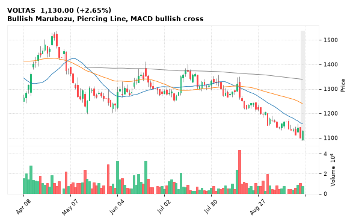

[🔔 Set alert on VOLTAS](https://claude.ai/artifact/Ewc5hHTPX6WkU1nVcDNQzq?s=VOLTAS&c=close%20above%201131.40) &nbsp;|&nbsp; [📈 Live chart (TradingView)](https://www.tradingview.com/chart/?symbol=NSE:VOLTAS) &nbsp;|&nbsp; [alert by email](mailto:himanshusardana05@gmail.com?subject=ALERT%20VOLTAS&body=Alert%20me%20when%3A%20close%20above%201131.40%0A%0AEdit%20the%20line%20above%20if%20you%20want%2C%20then%20press%20Send.%20Checked%20on%20every%20day%27s%20closing%20data%3B%20a%20triggered%20alert%20appears%20at%20the%20top%20of%20the%208%20AM%20Technical%20Analysis%20email.%0A%0AExamples%20you%20can%20write%3A%0A%20%20close%20above%201150%20%20%7C%20%20close%20below%201080%20%20%7C%20%20high%20above%201200%20%20%7C%20%20low%20below%201050%0A%20%20close%20crosses%20above%20200%20DMA%20%20%7C%20%20close%20below%2050%20DMA%20%20%7C%20%20RSI%20below%2030%20%20%7C%20%20RSI%20above%2070%0A%20%20volume%20above%202x%20%20%7C%20%20change%20above%205%25%20%20%7C%20%20change%20below%20-4%25%20%20%7C%20%2052-week%20high%20%20%7C%20%20golden%20cross%0A%20%20combine%20with%20%27and%27%2C%20e.g.%20%20close%20above%201150%20and%20volume%20above%201.5x%0A%0AReference%3A%20VOLTAS%20closed%201130.00%20%28high%201131.40%2C%20low%201090.80%29.%0ATo%20cancel%20later%2C%20send%20an%20email%20with%20subject%3A%20CANCEL%20ALERT%20VOLTAS)

---

## 10. ELECON - BULLISH
**466.60** (+10.95%) | vol 52.0x | RSI 66 | H 476.90 / L 420.10  
Close above 200 DMA, Volume spike 52.0x

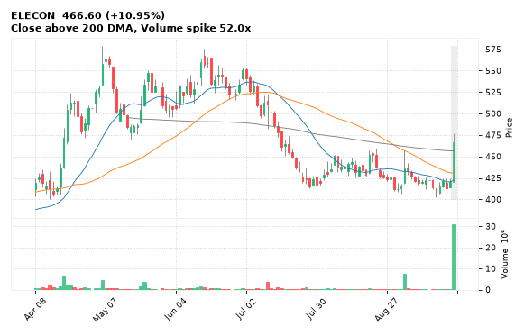

[🔔 Set alert on ELECON](https://claude.ai/artifact/Ewc5hHTPX6WkU1nVcDNQzq?s=ELECON&c=close%20above%20476.90) &nbsp;|&nbsp; [📈 Live chart (TradingView)](https://www.tradingview.com/chart/?symbol=NSE:ELECON) &nbsp;|&nbsp; [alert by email](mailto:himanshusardana05@gmail.com?subject=ALERT%20ELECON&body=Alert%20me%20when%3A%20close%20above%20476.90%0A%0AEdit%20the%20line%20above%20if%20you%20want%2C%20then%20press%20Send.%20Checked%20on%20every%20day%27s%20closing%20data%3B%20a%20triggered%20alert%20appears%20at%20the%20top%20of%20the%208%20AM%20Technical%20Analysis%20email.%0A%0AExamples%20you%20can%20write%3A%0A%20%20close%20above%201150%20%20%7C%20%20close%20below%201080%20%20%7C%20%20high%20above%201200%20%20%7C%20%20low%20below%201050%0A%20%20close%20crosses%20above%20200%20DMA%20%20%7C%20%20close%20below%2050%20DMA%20%20%7C%20%20RSI%20below%2030%20%20%7C%20%20RSI%20above%2070%0A%20%20volume%20above%202x%20%20%7C%20%20change%20above%205%25%20%20%7C%20%20change%20below%20-4%25%20%20%7C%20%2052-week%20high%20%20%7C%20%20golden%20cross%0A%20%20combine%20with%20%27and%27%2C%20e.g.%20%20close%20above%201150%20and%20volume%20above%201.5x%0A%0AReference%3A%20ELECON%20closed%20466.60%20%28high%20476.90%2C%20low%20420.10%29.%0ATo%20cancel%20later%2C%20send%20an%20email%20with%20subject%3A%20CANCEL%20ALERT%20ELECON)

---

## 11. NTPCGREEN - BULLISH
**95.42** (+2.26%) | vol 2.2x | RSI 71 | H 95.80 / L 93.77  
Close above 200 DMA, Volume spike 2.2x

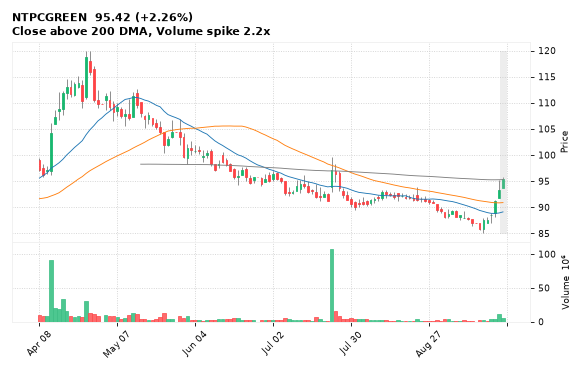

[🔔 Set alert on NTPCGREEN](https://claude.ai/artifact/Ewc5hHTPX6WkU1nVcDNQzq?s=NTPCGREEN&c=close%20above%2095.80) &nbsp;|&nbsp; [📈 Live chart (TradingView)](https://www.tradingview.com/chart/?symbol=NSE:NTPCGREEN) &nbsp;|&nbsp; [alert by email](mailto:himanshusardana05@gmail.com?subject=ALERT%20NTPCGREEN&body=Alert%20me%20when%3A%20close%20above%2095.80%0A%0AEdit%20the%20line%20above%20if%20you%20want%2C%20then%20press%20Send.%20Checked%20on%20every%20day%27s%20closing%20data%3B%20a%20triggered%20alert%20appears%20at%20the%20top%20of%20the%208%20AM%20Technical%20Analysis%20email.%0A%0AExamples%20you%20can%20write%3A%0A%20%20close%20above%201150%20%20%7C%20%20close%20below%201080%20%20%7C%20%20high%20above%201200%20%20%7C%20%20low%20below%201050%0A%20%20close%20crosses%20above%20200%20DMA%20%20%7C%20%20close%20below%2050%20DMA%20%20%7C%20%20RSI%20below%2030%20%20%7C%20%20RSI%20above%2070%0A%20%20volume%20above%202x%20%20%7C%20%20change%20above%205%25%20%20%7C%20%20change%20below%20-4%25%20%20%7C%20%2052-week%20high%20%20%7C%20%20golden%20cross%0A%20%20combine%20with%20%27and%27%2C%20e.g.%20%20close%20above%201150%20and%20volume%20above%201.5x%0A%0AReference%3A%20NTPCGREEN%20closed%2095.42%20%28high%2095.80%2C%20low%2093.77%29.%0ATo%20cancel%20later%2C%20send%20an%20email%20with%20subject%3A%20CANCEL%20ALERT%20NTPCGREEN)

---

## 12. SAIL - BULLISH
**185.44** (+6.57%) | vol 2.2x | RSI 56 | H 185.70 / L 174.50  
Bullish Marubozu, Volume spike 2.2x

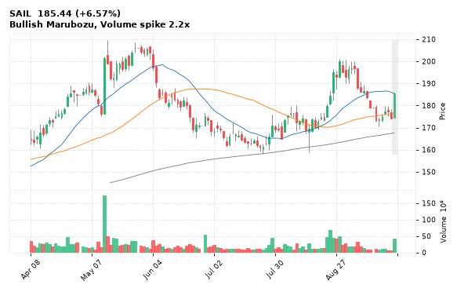

[🔔 Set alert on SAIL](https://claude.ai/artifact/Ewc5hHTPX6WkU1nVcDNQzq?s=SAIL&c=close%20above%20185.70) &nbsp;|&nbsp; [📈 Live chart (TradingView)](https://www.tradingview.com/chart/?symbol=NSE:SAIL) &nbsp;|&nbsp; [alert by email](mailto:himanshusardana05@gmail.com?subject=ALERT%20SAIL&body=Alert%20me%20when%3A%20close%20above%20185.70%0A%0AEdit%20the%20line%20above%20if%20you%20want%2C%20then%20press%20Send.%20Checked%20on%20every%20day%27s%20closing%20data%3B%20a%20triggered%20alert%20appears%20at%20the%20top%20of%20the%208%20AM%20Technical%20Analysis%20email.%0A%0AExamples%20you%20can%20write%3A%0A%20%20close%20above%201150%20%20%7C%20%20close%20below%201080%20%20%7C%20%20high%20above%201200%20%20%7C%20%20low%20below%201050%0A%20%20close%20crosses%20above%20200%20DMA%20%20%7C%20%20close%20below%2050%20DMA%20%20%7C%20%20RSI%20below%2030%20%20%7C%20%20RSI%20above%2070%0A%20%20volume%20above%202x%20%20%7C%20%20change%20above%205%25%20%20%7C%20%20change%20below%20-4%25%20%20%7C%20%2052-week%20high%20%20%7C%20%20golden%20cross%0A%20%20combine%20with%20%27and%27%2C%20e.g.%20%20close%20above%201150%20and%20volume%20above%201.5x%0A%0AReference%3A%20SAIL%20closed%20185.44%20%28high%20185.70%2C%20low%20174.50%29.%0ATo%20cancel%20later%2C%20send%20an%20email%20with%20subject%3A%20CANCEL%20ALERT%20SAIL)

---

## 13. HINDALCO - BULLISH
**1,003.80** (+3.17%) | vol 1.7x | RSI 51 | H 1,003.80 / L 978.20  
Bullish Marubozu, Close above 200 DMA

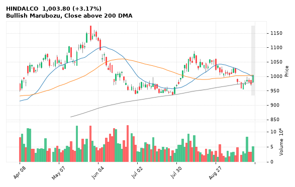

[🔔 Set alert on HINDALCO](https://claude.ai/artifact/Ewc5hHTPX6WkU1nVcDNQzq?s=HINDALCO&c=close%20above%201003.80) &nbsp;|&nbsp; [📈 Live chart (TradingView)](https://www.tradingview.com/chart/?symbol=NSE:HINDALCO) &nbsp;|&nbsp; [alert by email](mailto:himanshusardana05@gmail.com?subject=ALERT%20HINDALCO&body=Alert%20me%20when%3A%20close%20above%201003.80%0A%0AEdit%20the%20line%20above%20if%20you%20want%2C%20then%20press%20Send.%20Checked%20on%20every%20day%27s%20closing%20data%3B%20a%20triggered%20alert%20appears%20at%20the%20top%20of%20the%208%20AM%20Technical%20Analysis%20email.%0A%0AExamples%20you%20can%20write%3A%0A%20%20close%20above%201150%20%20%7C%20%20close%20below%201080%20%20%7C%20%20high%20above%201200%20%20%7C%20%20low%20below%201050%0A%20%20close%20crosses%20above%20200%20DMA%20%20%7C%20%20close%20below%2050%20DMA%20%20%7C%20%20RSI%20below%2030%20%20%7C%20%20RSI%20above%2070%0A%20%20volume%20above%202x%20%20%7C%20%20change%20above%205%25%20%20%7C%20%20change%20below%20-4%25%20%20%7C%20%2052-week%20high%20%20%7C%20%20golden%20cross%0A%20%20combine%20with%20%27and%27%2C%20e.g.%20%20close%20above%201150%20and%20volume%20above%201.5x%0A%0AReference%3A%20HINDALCO%20closed%201003.80%20%28high%201003.80%2C%20low%20978.20%29.%0ATo%20cancel%20later%2C%20send%20an%20email%20with%20subject%3A%20CANCEL%20ALERT%20HINDALCO)

---

## 14. LGEINDIA - BULLISH
**1,694.20** (+1.83%) | vol 1.6x | RSI 59 | H 1,715.00 / L 1,664.40  
Morning Star, MACD bullish cross

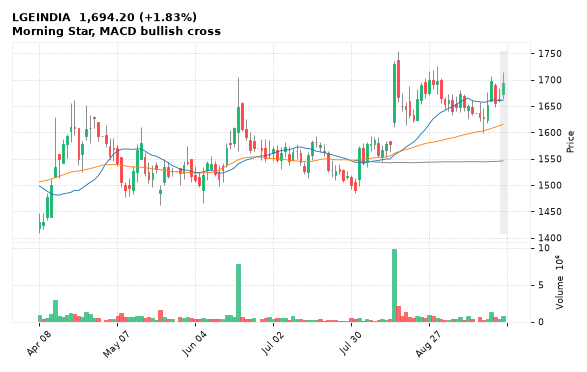

[🔔 Set alert on LGEINDIA](https://claude.ai/artifact/Ewc5hHTPX6WkU1nVcDNQzq?s=LGEINDIA&c=close%20above%201715.00) &nbsp;|&nbsp; [📈 Live chart (TradingView)](https://www.tradingview.com/chart/?symbol=NSE:LGEINDIA) &nbsp;|&nbsp; [alert by email](mailto:himanshusardana05@gmail.com?subject=ALERT%20LGEINDIA&body=Alert%20me%20when%3A%20close%20above%201715.00%0A%0AEdit%20the%20line%20above%20if%20you%20want%2C%20then%20press%20Send.%20Checked%20on%20every%20day%27s%20closing%20data%3B%20a%20triggered%20alert%20appears%20at%20the%20top%20of%20the%208%20AM%20Technical%20Analysis%20email.%0A%0AExamples%20you%20can%20write%3A%0A%20%20close%20above%201150%20%20%7C%20%20close%20below%201080%20%20%7C%20%20high%20above%201200%20%20%7C%20%20low%20below%201050%0A%20%20close%20crosses%20above%20200%20DMA%20%20%7C%20%20close%20below%2050%20DMA%20%20%7C%20%20RSI%20below%2030%20%20%7C%20%20RSI%20above%2070%0A%20%20volume%20above%202x%20%20%7C%20%20change%20above%205%25%20%20%7C%20%20change%20below%20-4%25%20%20%7C%20%2052-week%20high%20%20%7C%20%20golden%20cross%0A%20%20combine%20with%20%27and%27%2C%20e.g.%20%20close%20above%201150%20and%20volume%20above%201.5x%0A%0AReference%3A%20LGEINDIA%20closed%201694.20%20%28high%201715.00%2C%20low%201664.40%29.%0ATo%20cancel%20later%2C%20send%20an%20email%20with%20subject%3A%20CANCEL%20ALERT%20LGEINDIA)

---

## 15. RBLBANK - BULLISH
**428.00** (+1.13%) | vol 1.0x | RSI 66 | H 429.60 / L 422.05  
52-week high breakout, MACD bullish cross, NR7 (narrowest range in 7)

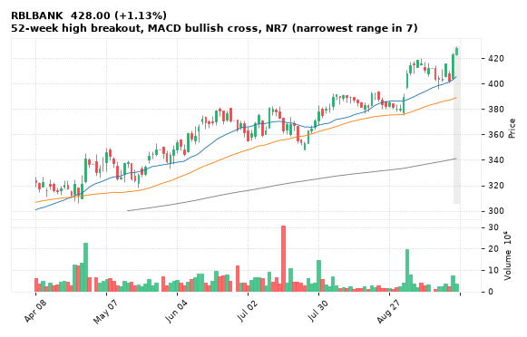

[🔔 Set alert on RBLBANK](https://claude.ai/artifact/Ewc5hHTPX6WkU1nVcDNQzq?s=RBLBANK&c=close%20above%20429.60) &nbsp;|&nbsp; [📈 Live chart (TradingView)](https://www.tradingview.com/chart/?symbol=NSE:RBLBANK) &nbsp;|&nbsp; [alert by email](mailto:himanshusardana05@gmail.com?subject=ALERT%20RBLBANK&body=Alert%20me%20when%3A%20close%20above%20429.60%0A%0AEdit%20the%20line%20above%20if%20you%20want%2C%20then%20press%20Send.%20Checked%20on%20every%20day%27s%20closing%20data%3B%20a%20triggered%20alert%20appears%20at%20the%20top%20of%20the%208%20AM%20Technical%20Analysis%20email.%0A%0AExamples%20you%20can%20write%3A%0A%20%20close%20above%201150%20%20%7C%20%20close%20below%201080%20%20%7C%20%20high%20above%201200%20%20%7C%20%20low%20below%201050%0A%20%20close%20crosses%20above%20200%20DMA%20%20%7C%20%20close%20below%2050%20DMA%20%20%7C%20%20RSI%20below%2030%20%20%7C%20%20RSI%20above%2070%0A%20%20volume%20above%202x%20%20%7C%20%20change%20above%205%25%20%20%7C%20%20change%20below%20-4%25%20%20%7C%20%2052-week%20high%20%20%7C%20%20golden%20cross%0A%20%20combine%20with%20%27and%27%2C%20e.g.%20%20close%20above%201150%20and%20volume%20above%201.5x%0A%0AReference%3A%20RBLBANK%20closed%20428.00%20%28high%20429.60%2C%20low%20422.05%29.%0ATo%20cancel%20later%2C%20send%20an%20email%20with%20subject%3A%20CANCEL%20ALERT%20RBLBANK)

---

## 16. PFOCUS - BEARISH
**337.15** (-5.68%) | vol 3.8x | RSI 62 | H 362.80 / L 333.15  
Bearish Engulfing, RSI down through 70, Volume spike 3.8x

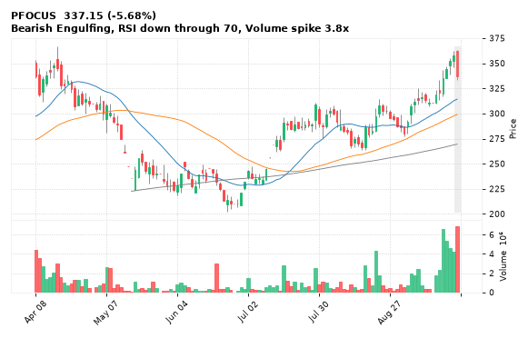

[🔔 Set alert on PFOCUS](https://claude.ai/artifact/Ewc5hHTPX6WkU1nVcDNQzq?s=PFOCUS&c=close%20below%20333.15) &nbsp;|&nbsp; [📈 Live chart (TradingView)](https://www.tradingview.com/chart/?symbol=NSE:PFOCUS) &nbsp;|&nbsp; [alert by email](mailto:himanshusardana05@gmail.com?subject=ALERT%20PFOCUS&body=Alert%20me%20when%3A%20close%20below%20333.15%0A%0AEdit%20the%20line%20above%20if%20you%20want%2C%20then%20press%20Send.%20Checked%20on%20every%20day%27s%20closing%20data%3B%20a%20triggered%20alert%20appears%20at%20the%20top%20of%20the%208%20AM%20Technical%20Analysis%20email.%0A%0AExamples%20you%20can%20write%3A%0A%20%20close%20above%201150%20%20%7C%20%20close%20below%201080%20%20%7C%20%20high%20above%201200%20%20%7C%20%20low%20below%201050%0A%20%20close%20crosses%20above%20200%20DMA%20%20%7C%20%20close%20below%2050%20DMA%20%20%7C%20%20RSI%20below%2030%20%20%7C%20%20RSI%20above%2070%0A%20%20volume%20above%202x%20%20%7C%20%20change%20above%205%25%20%20%7C%20%20change%20below%20-4%25%20%20%7C%20%2052-week%20high%20%20%7C%20%20golden%20cross%0A%20%20combine%20with%20%27and%27%2C%20e.g.%20%20close%20above%201150%20and%20volume%20above%201.5x%0A%0AReference%3A%20PFOCUS%20closed%20337.15%20%28high%20362.80%2C%20low%20333.15%29.%0ATo%20cancel%20later%2C%20send%20an%20email%20with%20subject%3A%20CANCEL%20ALERT%20PFOCUS)

---

## 17. INOXWIND - BEARISH
**75.02** (-3.70%) | vol 1.5x | RSI 48 | H 78.25 / L 74.80  
Bearish Marubozu, Evening Star

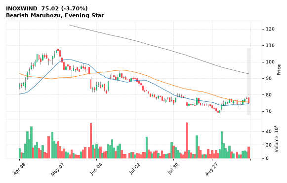

[🔔 Set alert on INOXWIND](https://claude.ai/artifact/Ewc5hHTPX6WkU1nVcDNQzq?s=INOXWIND&c=close%20below%2074.80) &nbsp;|&nbsp; [📈 Live chart (TradingView)](https://www.tradingview.com/chart/?symbol=NSE:INOXWIND) &nbsp;|&nbsp; [alert by email](mailto:himanshusardana05@gmail.com?subject=ALERT%20INOXWIND&body=Alert%20me%20when%3A%20close%20below%2074.80%0A%0AEdit%20the%20line%20above%20if%20you%20want%2C%20then%20press%20Send.%20Checked%20on%20every%20day%27s%20closing%20data%3B%20a%20triggered%20alert%20appears%20at%20the%20top%20of%20the%208%20AM%20Technical%20Analysis%20email.%0A%0AExamples%20you%20can%20write%3A%0A%20%20close%20above%201150%20%20%7C%20%20close%20below%201080%20%20%7C%20%20high%20above%201200%20%20%7C%20%20low%20below%201050%0A%20%20close%20crosses%20above%20200%20DMA%20%20%7C%20%20close%20below%2050%20DMA%20%20%7C%20%20RSI%20below%2030%20%20%7C%20%20RSI%20above%2070%0A%20%20volume%20above%202x%20%20%7C%20%20change%20above%205%25%20%20%7C%20%20change%20below%20-4%25%20%20%7C%20%2052-week%20high%20%20%7C%20%20golden%20cross%0A%20%20combine%20with%20%27and%27%2C%20e.g.%20%20close%20above%201150%20and%20volume%20above%201.5x%0A%0AReference%3A%20INOXWIND%20closed%2075.02%20%28high%2078.25%2C%20low%2074.80%29.%0ATo%20cancel%20later%2C%20send%20an%20email%20with%20subject%3A%20CANCEL%20ALERT%20INOXWIND)

---

## 18. URBANCO - BEARISH
**172.73** (-0.85%) | vol 0.7x | RSI 60 | H 177.77 / L 171.90  
Shooting Star, Bearish Engulfing

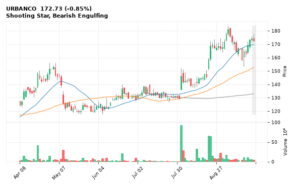

[🔔 Set alert on URBANCO](https://claude.ai/artifact/Ewc5hHTPX6WkU1nVcDNQzq?s=URBANCO&c=close%20below%20171.90) &nbsp;|&nbsp; [📈 Live chart (TradingView)](https://www.tradingview.com/chart/?symbol=NSE:URBANCO) &nbsp;|&nbsp; [alert by email](mailto:himanshusardana05@gmail.com?subject=ALERT%20URBANCO&body=Alert%20me%20when%3A%20close%20below%20171.90%0A%0AEdit%20the%20line%20above%20if%20you%20want%2C%20then%20press%20Send.%20Checked%20on%20every%20day%27s%20closing%20data%3B%20a%20triggered%20alert%20appears%20at%20the%20top%20of%20the%208%20AM%20Technical%20Analysis%20email.%0A%0AExamples%20you%20can%20write%3A%0A%20%20close%20above%201150%20%20%7C%20%20close%20below%201080%20%20%7C%20%20high%20above%201200%20%20%7C%20%20low%20below%201050%0A%20%20close%20crosses%20above%20200%20DMA%20%20%7C%20%20close%20below%2050%20DMA%20%20%7C%20%20RSI%20below%2030%20%20%7C%20%20RSI%20above%2070%0A%20%20volume%20above%202x%20%20%7C%20%20change%20above%205%25%20%20%7C%20%20change%20below%20-4%25%20%20%7C%20%2052-week%20high%20%20%7C%20%20golden%20cross%0A%20%20combine%20with%20%27and%27%2C%20e.g.%20%20close%20above%201150%20and%20volume%20above%201.5x%0A%0AReference%3A%20URBANCO%20closed%20172.73%20%28high%20177.77%2C%20low%20171.90%29.%0ATo%20cancel%20later%2C%20send%20an%20email%20with%20subject%3A%20CANCEL%20ALERT%20URBANCO)

---

## 19. SYRMA - BEARISH
**1,719.40** (-1.29%) | vol 0.5x | RSI 67 | H 1,750.30 / L 1,702.10  
Bearish Engulfing, RSI down through 70, NR7 (narrowest range in 7)

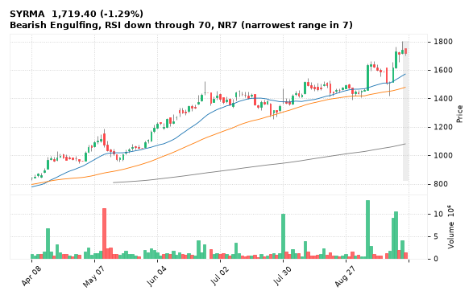

[🔔 Set alert on SYRMA](https://claude.ai/artifact/Ewc5hHTPX6WkU1nVcDNQzq?s=SYRMA&c=close%20below%201702.10) &nbsp;|&nbsp; [📈 Live chart (TradingView)](https://www.tradingview.com/chart/?symbol=NSE:SYRMA) &nbsp;|&nbsp; [alert by email](mailto:himanshusardana05@gmail.com?subject=ALERT%20SYRMA&body=Alert%20me%20when%3A%20close%20below%201702.10%0A%0AEdit%20the%20line%20above%20if%20you%20want%2C%20then%20press%20Send.%20Checked%20on%20every%20day%27s%20closing%20data%3B%20a%20triggered%20alert%20appears%20at%20the%20top%20of%20the%208%20AM%20Technical%20Analysis%20email.%0A%0AExamples%20you%20can%20write%3A%0A%20%20close%20above%201150%20%20%7C%20%20close%20below%201080%20%20%7C%20%20high%20above%201200%20%20%7C%20%20low%20below%201050%0A%20%20close%20crosses%20above%20200%20DMA%20%20%7C%20%20close%20below%2050%20DMA%20%20%7C%20%20RSI%20below%2030%20%20%7C%20%20RSI%20above%2070%0A%20%20volume%20above%202x%20%20%7C%20%20change%20above%205%25%20%20%7C%20%20change%20below%20-4%25%20%20%7C%20%2052-week%20high%20%20%7C%20%20golden%20cross%0A%20%20combine%20with%20%27and%27%2C%20e.g.%20%20close%20above%201150%20and%20volume%20above%201.5x%0A%0AReference%3A%20SYRMA%20closed%201719.40%20%28high%201750.30%2C%20low%201702.10%29.%0ATo%20cancel%20later%2C%20send%20an%20email%20with%20subject%3A%20CANCEL%20ALERT%20SYRMA)

---

## 20. PAYTM - BEARISH
**1,775.00** (-2.17%) | vol 0.6x | RSI 58 | H 1,819.90 / L 1,763.30  
Bearish Engulfing, MACD bearish cross

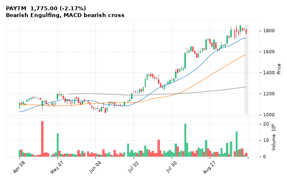

[🔔 Set alert on PAYTM](https://claude.ai/artifact/Ewc5hHTPX6WkU1nVcDNQzq?s=PAYTM&c=close%20below%201763.30) &nbsp;|&nbsp; [📈 Live chart (TradingView)](https://www.tradingview.com/chart/?symbol=NSE:PAYTM) &nbsp;|&nbsp; [alert by email](mailto:himanshusardana05@gmail.com?subject=ALERT%20PAYTM&body=Alert%20me%20when%3A%20close%20below%201763.30%0A%0AEdit%20the%20line%20above%20if%20you%20want%2C%20then%20press%20Send.%20Checked%20on%20every%20day%27s%20closing%20data%3B%20a%20triggered%20alert%20appears%20at%20the%20top%20of%20the%208%20AM%20Technical%20Analysis%20email.%0A%0AExamples%20you%20can%20write%3A%0A%20%20close%20above%201150%20%20%7C%20%20close%20below%201080%20%20%7C%20%20high%20above%201200%20%20%7C%20%20low%20below%201050%0A%20%20close%20crosses%20above%20200%20DMA%20%20%7C%20%20close%20below%2050%20DMA%20%20%7C%20%20RSI%20below%2030%20%20%7C%20%20RSI%20above%2070%0A%20%20volume%20above%202x%20%20%7C%20%20change%20above%205%25%20%20%7C%20%20change%20below%20-4%25%20%20%7C%20%2052-week%20high%20%20%7C%20%20golden%20cross%0A%20%20combine%20with%20%27and%27%2C%20e.g.%20%20close%20above%201150%20and%20volume%20above%201.5x%0A%0AReference%3A%20PAYTM%20closed%201775.00%20%28high%201819.90%2C%20low%201763.30%29.%0ATo%20cancel%20later%2C%20send%20an%20email%20with%20subject%3A%20CANCEL%20ALERT%20PAYTM)

---

## 21. BANDHANBNK - BEARISH
**191.38** (+3.62%) | vol 4.3x | RSI 72 | H 193.00 / L 185.70  
Death Cross (50/200 DMA), Volume spike 4.3x

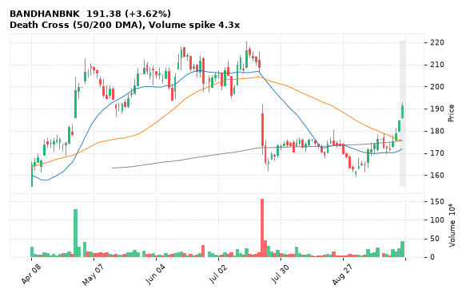

[🔔 Set alert on BANDHANBNK](https://claude.ai/artifact/Ewc5hHTPX6WkU1nVcDNQzq?s=BANDHANBNK&c=close%20below%20185.70) &nbsp;|&nbsp; [📈 Live chart (TradingView)](https://www.tradingview.com/chart/?symbol=NSE:BANDHANBNK) &nbsp;|&nbsp; [alert by email](mailto:himanshusardana05@gmail.com?subject=ALERT%20BANDHANBNK&body=Alert%20me%20when%3A%20close%20below%20185.70%0A%0AEdit%20the%20line%20above%20if%20you%20want%2C%20then%20press%20Send.%20Checked%20on%20every%20day%27s%20closing%20data%3B%20a%20triggered%20alert%20appears%20at%20the%20top%20of%20the%208%20AM%20Technical%20Analysis%20email.%0A%0AExamples%20you%20can%20write%3A%0A%20%20close%20above%201150%20%20%7C%20%20close%20below%201080%20%20%7C%20%20high%20above%201200%20%20%7C%20%20low%20below%201050%0A%20%20close%20crosses%20above%20200%20DMA%20%20%7C%20%20close%20below%2050%20DMA%20%20%7C%20%20RSI%20below%2030%20%20%7C%20%20RSI%20above%2070%0A%20%20volume%20above%202x%20%20%7C%20%20change%20above%205%25%20%20%7C%20%20change%20below%20-4%25%20%20%7C%20%2052-week%20high%20%20%7C%20%20golden%20cross%0A%20%20combine%20with%20%27and%27%2C%20e.g.%20%20close%20above%201150%20and%20volume%20above%201.5x%0A%0AReference%3A%20BANDHANBNK%20closed%20191.38%20%28high%20193.00%2C%20low%20185.70%29.%0ATo%20cancel%20later%2C%20send%20an%20email%20with%20subject%3A%20CANCEL%20ALERT%20BANDHANBNK)

---

## 22. ABLBL - BEARISH
**79.81** (-1.15%) | vol 1.8x | RSI 26 | H 82.33 / L 79.65  
52-week low breakdown

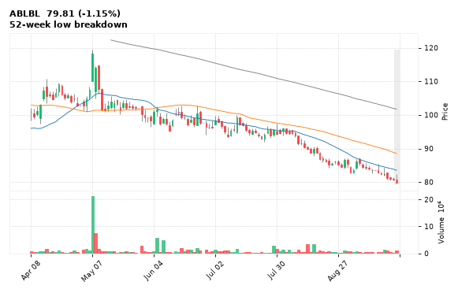

[🔔 Set alert on ABLBL](https://claude.ai/artifact/Ewc5hHTPX6WkU1nVcDNQzq?s=ABLBL&c=close%20below%2079.65) &nbsp;|&nbsp; [📈 Live chart (TradingView)](https://www.tradingview.com/chart/?symbol=NSE:ABLBL) &nbsp;|&nbsp; [alert by email](mailto:himanshusardana05@gmail.com?subject=ALERT%20ABLBL&body=Alert%20me%20when%3A%20close%20below%2079.65%0A%0AEdit%20the%20line%20above%20if%20you%20want%2C%20then%20press%20Send.%20Checked%20on%20every%20day%27s%20closing%20data%3B%20a%20triggered%20alert%20appears%20at%20the%20top%20of%20the%208%20AM%20Technical%20Analysis%20email.%0A%0AExamples%20you%20can%20write%3A%0A%20%20close%20above%201150%20%20%7C%20%20close%20below%201080%20%20%7C%20%20high%20above%201200%20%20%7C%20%20low%20below%201050%0A%20%20close%20crosses%20above%20200%20DMA%20%20%7C%20%20close%20below%2050%20DMA%20%20%7C%20%20RSI%20below%2030%20%20%7C%20%20RSI%20above%2070%0A%20%20volume%20above%202x%20%20%7C%20%20change%20above%205%25%20%20%7C%20%20change%20below%20-4%25%20%20%7C%20%2052-week%20high%20%20%7C%20%20golden%20cross%0A%20%20combine%20with%20%27and%27%2C%20e.g.%20%20close%20above%201150%20and%20volume%20above%201.5x%0A%0AReference%3A%20ABLBL%20closed%2079.81%20%28high%2082.33%2C%20low%2079.65%29.%0ATo%20cancel%20later%2C%20send%20an%20email%20with%20subject%3A%20CANCEL%20ALERT%20ABLBL)

---

## 23. CASTROLIND - BEARISH
**193.23** (-1.22%) | vol 1.5x | RSI 59 | H 195.95 / L 190.10  
Bearish Engulfing

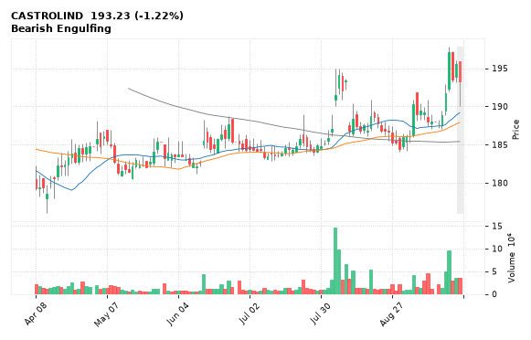

[🔔 Set alert on CASTROLIND](https://claude.ai/artifact/Ewc5hHTPX6WkU1nVcDNQzq?s=CASTROLIND&c=close%20below%20190.10) &nbsp;|&nbsp; [📈 Live chart (TradingView)](https://www.tradingview.com/chart/?symbol=NSE:CASTROLIND) &nbsp;|&nbsp; [alert by email](mailto:himanshusardana05@gmail.com?subject=ALERT%20CASTROLIND&body=Alert%20me%20when%3A%20close%20below%20190.10%0A%0AEdit%20the%20line%20above%20if%20you%20want%2C%20then%20press%20Send.%20Checked%20on%20every%20day%27s%20closing%20data%3B%20a%20triggered%20alert%20appears%20at%20the%20top%20of%20the%208%20AM%20Technical%20Analysis%20email.%0A%0AExamples%20you%20can%20write%3A%0A%20%20close%20above%201150%20%20%7C%20%20close%20below%201080%20%20%7C%20%20high%20above%201200%20%20%7C%20%20low%20below%201050%0A%20%20close%20crosses%20above%20200%20DMA%20%20%7C%20%20close%20below%2050%20DMA%20%20%7C%20%20RSI%20below%2030%20%20%7C%20%20RSI%20above%2070%0A%20%20volume%20above%202x%20%20%7C%20%20change%20above%205%25%20%20%7C%20%20change%20below%20-4%25%20%20%7C%20%2052-week%20high%20%20%7C%20%20golden%20cross%0A%20%20combine%20with%20%27and%27%2C%20e.g.%20%20close%20above%201150%20and%20volume%20above%201.5x%0A%0AReference%3A%20CASTROLIND%20closed%20193.23%20%28high%20195.95%2C%20low%20190.10%29.%0ATo%20cancel%20later%2C%20send%20an%20email%20with%20subject%3A%20CANCEL%20ALERT%20CASTROLIND)

---

## 24. TARIL - BEARISH
**289.00** (+2.94%) | vol 0.9x | RSI 47 | H 289.95 / L 280.95  
Death Cross (50/200 DMA)

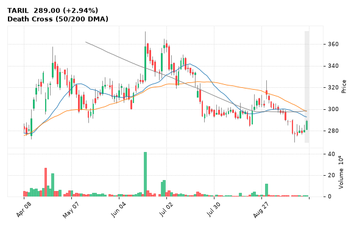

[🔔 Set alert on TARIL](https://claude.ai/artifact/Ewc5hHTPX6WkU1nVcDNQzq?s=TARIL&c=close%20below%20280.95) &nbsp;|&nbsp; [📈 Live chart (TradingView)](https://www.tradingview.com/chart/?symbol=NSE:TARIL) &nbsp;|&nbsp; [alert by email](mailto:himanshusardana05@gmail.com?subject=ALERT%20TARIL&body=Alert%20me%20when%3A%20close%20below%20280.95%0A%0AEdit%20the%20line%20above%20if%20you%20want%2C%20then%20press%20Send.%20Checked%20on%20every%20day%27s%20closing%20data%3B%20a%20triggered%20alert%20appears%20at%20the%20top%20of%20the%208%20AM%20Technical%20Analysis%20email.%0A%0AExamples%20you%20can%20write%3A%0A%20%20close%20above%201150%20%20%7C%20%20close%20below%201080%20%20%7C%20%20high%20above%201200%20%20%7C%20%20low%20below%201050%0A%20%20close%20crosses%20above%20200%20DMA%20%20%7C%20%20close%20below%2050%20DMA%20%20%7C%20%20RSI%20below%2030%20%20%7C%20%20RSI%20above%2070%0A%20%20volume%20above%202x%20%20%7C%20%20change%20above%205%25%20%20%7C%20%20change%20below%20-4%25%20%20%7C%20%2052-week%20high%20%20%7C%20%20golden%20cross%0A%20%20combine%20with%20%27and%27%2C%20e.g.%20%20close%20above%201150%20and%20volume%20above%201.5x%0A%0AReference%3A%20TARIL%20closed%20289.00%20%28high%20289.95%2C%20low%20280.95%29.%0ATo%20cancel%20later%2C%20send%20an%20email%20with%20subject%3A%20CANCEL%20ALERT%20TARIL)

---

## 25. COALINDIA - BEARISH
**424.55** (-0.81%) | vol 0.7x | RSI 55 | H 429.40 / L 421.55  
Bearish Engulfing

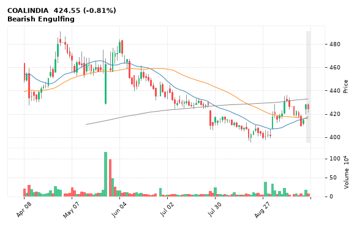

[🔔 Set alert on COALINDIA](https://claude.ai/artifact/Ewc5hHTPX6WkU1nVcDNQzq?s=COALINDIA&c=close%20below%20421.55) &nbsp;|&nbsp; [📈 Live chart (TradingView)](https://www.tradingview.com/chart/?symbol=NSE:COALINDIA) &nbsp;|&nbsp; [alert by email](mailto:himanshusardana05@gmail.com?subject=ALERT%20COALINDIA&body=Alert%20me%20when%3A%20close%20below%20421.55%0A%0AEdit%20the%20line%20above%20if%20you%20want%2C%20then%20press%20Send.%20Checked%20on%20every%20day%27s%20closing%20data%3B%20a%20triggered%20alert%20appears%20at%20the%20top%20of%20the%208%20AM%20Technical%20Analysis%20email.%0A%0AExamples%20you%20can%20write%3A%0A%20%20close%20above%201150%20%20%7C%20%20close%20below%201080%20%20%7C%20%20high%20above%201200%20%20%7C%20%20low%20below%201050%0A%20%20close%20crosses%20above%20200%20DMA%20%20%7C%20%20close%20below%2050%20DMA%20%20%7C%20%20RSI%20below%2030%20%20%7C%20%20RSI%20above%2070%0A%20%20volume%20above%202x%20%20%7C%20%20change%20above%205%25%20%20%7C%20%20change%20below%20-4%25%20%20%7C%20%2052-week%20high%20%20%7C%20%20golden%20cross%0A%20%20combine%20with%20%27and%27%2C%20e.g.%20%20close%20above%201150%20and%20volume%20above%201.5x%0A%0AReference%3A%20COALINDIA%20closed%20424.55%20%28high%20429.40%2C%20low%20421.55%29.%0ATo%20cancel%20later%2C%20send%20an%20email%20with%20subject%3A%20CANCEL%20ALERT%20COALINDIA)

---

## 26. GRSE - BEARISH
**2,380.60** (-0.80%) | vol 0.6x | RSI 39 | H 2,415.30 / L 2,376.00  
Death Cross (50/200 DMA), NR7 (narrowest range in 7)

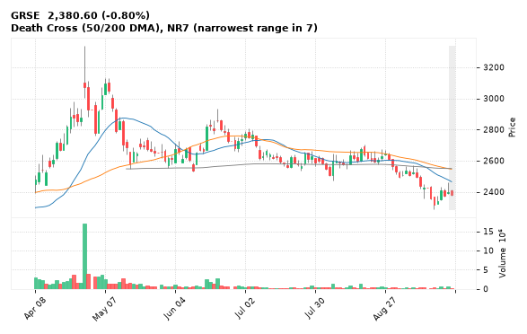

[🔔 Set alert on GRSE](https://claude.ai/artifact/Ewc5hHTPX6WkU1nVcDNQzq?s=GRSE&c=close%20below%202376.00) &nbsp;|&nbsp; [📈 Live chart (TradingView)](https://www.tradingview.com/chart/?symbol=NSE:GRSE) &nbsp;|&nbsp; [alert by email](mailto:himanshusardana05@gmail.com?subject=ALERT%20GRSE&body=Alert%20me%20when%3A%20close%20below%202376.00%0A%0AEdit%20the%20line%20above%20if%20you%20want%2C%20then%20press%20Send.%20Checked%20on%20every%20day%27s%20closing%20data%3B%20a%20triggered%20alert%20appears%20at%20the%20top%20of%20the%208%20AM%20Technical%20Analysis%20email.%0A%0AExamples%20you%20can%20write%3A%0A%20%20close%20above%201150%20%20%7C%20%20close%20below%201080%20%20%7C%20%20high%20above%201200%20%20%7C%20%20low%20below%201050%0A%20%20close%20crosses%20above%20200%20DMA%20%20%7C%20%20close%20below%2050%20DMA%20%20%7C%20%20RSI%20below%2030%20%20%7C%20%20RSI%20above%2070%0A%20%20volume%20above%202x%20%20%7C%20%20change%20above%205%25%20%20%7C%20%20change%20below%20-4%25%20%20%7C%20%2052-week%20high%20%20%7C%20%20golden%20cross%0A%20%20combine%20with%20%27and%27%2C%20e.g.%20%20close%20above%201150%20and%20volume%20above%201.5x%0A%0AReference%3A%20GRSE%20closed%202380.60%20%28high%202415.30%2C%20low%202376.00%29.%0ATo%20cancel%20later%2C%20send%20an%20email%20with%20subject%3A%20CANCEL%20ALERT%20GRSE)

---

## 27. ADANIENT - BEARISH
**2,993.20** (-0.13%) | vol 0.4x | RSI 50 | H 3,023.90 / L 2,978.20  
Bearish Engulfing

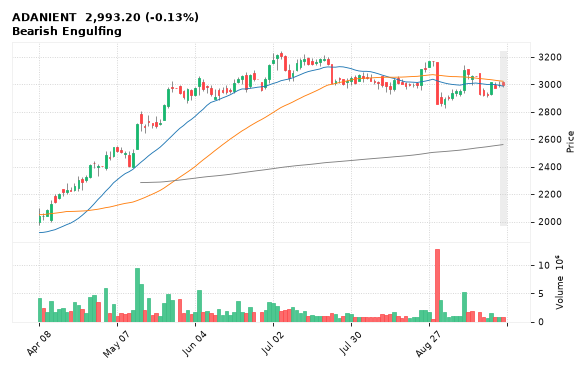

[🔔 Set alert on ADANIENT](https://claude.ai/artifact/Ewc5hHTPX6WkU1nVcDNQzq?s=ADANIENT&c=close%20below%202978.20) &nbsp;|&nbsp; [📈 Live chart (TradingView)](https://www.tradingview.com/chart/?symbol=NSE:ADANIENT) &nbsp;|&nbsp; [alert by email](mailto:himanshusardana05@gmail.com?subject=ALERT%20ADANIENT&body=Alert%20me%20when%3A%20close%20below%202978.20%0A%0AEdit%20the%20line%20above%20if%20you%20want%2C%20then%20press%20Send.%20Checked%20on%20every%20day%27s%20closing%20data%3B%20a%20triggered%20alert%20appears%20at%20the%20top%20of%20the%208%20AM%20Technical%20Analysis%20email.%0A%0AExamples%20you%20can%20write%3A%0A%20%20close%20above%201150%20%20%7C%20%20close%20below%201080%20%20%7C%20%20high%20above%201200%20%20%7C%20%20low%20below%201050%0A%20%20close%20crosses%20above%20200%20DMA%20%20%7C%20%20close%20below%2050%20DMA%20%20%7C%20%20RSI%20below%2030%20%20%7C%20%20RSI%20above%2070%0A%20%20volume%20above%202x%20%20%7C%20%20change%20above%205%25%20%20%7C%20%20change%20below%20-4%25%20%20%7C%20%2052-week%20high%20%20%7C%20%20golden%20cross%0A%20%20combine%20with%20%27and%27%2C%20e.g.%20%20close%20above%201150%20and%20volume%20above%201.5x%0A%0AReference%3A%20ADANIENT%20closed%202993.20%20%28high%203023.90%2C%20low%202978.20%29.%0ATo%20cancel%20later%2C%20send%20an%20email%20with%20subject%3A%20CANCEL%20ALERT%20ADANIENT)

---

## 28. GABRIEL - BEARISH
**1,428.10** (-2.94%) | vol 2.3x | RSI 56 | H 1,494.90 / L 1,417.30  
Volume spike 2.3x, Inside Bar

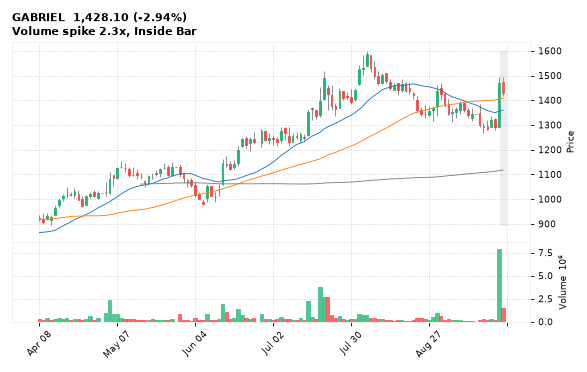

[🔔 Set alert on GABRIEL](https://claude.ai/artifact/Ewc5hHTPX6WkU1nVcDNQzq?s=GABRIEL&c=close%20below%201417.30) &nbsp;|&nbsp; [📈 Live chart (TradingView)](https://www.tradingview.com/chart/?symbol=NSE:GABRIEL) &nbsp;|&nbsp; [alert by email](mailto:himanshusardana05@gmail.com?subject=ALERT%20GABRIEL&body=Alert%20me%20when%3A%20close%20below%201417.30%0A%0AEdit%20the%20line%20above%20if%20you%20want%2C%20then%20press%20Send.%20Checked%20on%20every%20day%27s%20closing%20data%3B%20a%20triggered%20alert%20appears%20at%20the%20top%20of%20the%208%20AM%20Technical%20Analysis%20email.%0A%0AExamples%20you%20can%20write%3A%0A%20%20close%20above%201150%20%20%7C%20%20close%20below%201080%20%20%7C%20%20high%20above%201200%20%20%7C%20%20low%20below%201050%0A%20%20close%20crosses%20above%20200%20DMA%20%20%7C%20%20close%20below%2050%20DMA%20%20%7C%20%20RSI%20below%2030%20%20%7C%20%20RSI%20above%2070%0A%20%20volume%20above%202x%20%20%7C%20%20change%20above%205%25%20%20%7C%20%20change%20below%20-4%25%20%20%7C%20%2052-week%20high%20%20%7C%20%20golden%20cross%0A%20%20combine%20with%20%27and%27%2C%20e.g.%20%20close%20above%201150%20and%20volume%20above%201.5x%0A%0AReference%3A%20GABRIEL%20closed%201428.10%20%28high%201494.90%2C%20low%201417.30%29.%0ATo%20cancel%20later%2C%20send%20an%20email%20with%20subject%3A%20CANCEL%20ALERT%20GABRIEL)

---

## 29. TEGA - BEARISH
**2,078.80** (+0.47%) | vol 0.8x | RSI 74 | H 2,125.00 / L 2,061.50  
Shooting Star, Inside Bar, NR7 (narrowest range in 7)

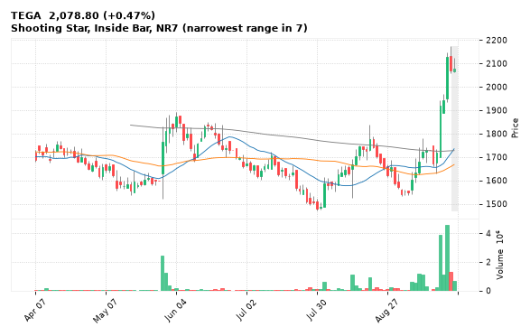

[🔔 Set alert on TEGA](https://claude.ai/artifact/Ewc5hHTPX6WkU1nVcDNQzq?s=TEGA&c=close%20below%202061.50) &nbsp;|&nbsp; [📈 Live chart (TradingView)](https://www.tradingview.com/chart/?symbol=NSE:TEGA) &nbsp;|&nbsp; [alert by email](mailto:himanshusardana05@gmail.com?subject=ALERT%20TEGA&body=Alert%20me%20when%3A%20close%20below%202061.50%0A%0AEdit%20the%20line%20above%20if%20you%20want%2C%20then%20press%20Send.%20Checked%20on%20every%20day%27s%20closing%20data%3B%20a%20triggered%20alert%20appears%20at%20the%20top%20of%20the%208%20AM%20Technical%20Analysis%20email.%0A%0AExamples%20you%20can%20write%3A%0A%20%20close%20above%201150%20%20%7C%20%20close%20below%201080%20%20%7C%20%20high%20above%201200%20%20%7C%20%20low%20below%201050%0A%20%20close%20crosses%20above%20200%20DMA%20%20%7C%20%20close%20below%2050%20DMA%20%20%7C%20%20RSI%20below%2030%20%20%7C%20%20RSI%20above%2070%0A%20%20volume%20above%202x%20%20%7C%20%20change%20above%205%25%20%20%7C%20%20change%20below%20-4%25%20%20%7C%20%2052-week%20high%20%20%7C%20%20golden%20cross%0A%20%20combine%20with%20%27and%27%2C%20e.g.%20%20close%20above%201150%20and%20volume%20above%201.5x%0A%0AReference%3A%20TEGA%20closed%202078.80%20%28high%202125.00%2C%20low%202061.50%29.%0ATo%20cancel%20later%2C%20send%20an%20email%20with%20subject%3A%20CANCEL%20ALERT%20TEGA)

---

## 30. REDINGTON - BEARISH
**400.75** (-2.34%) | vol 0.7x | RSI 63 | H 419.50 / L 397.10  
Dark Cloud Cover

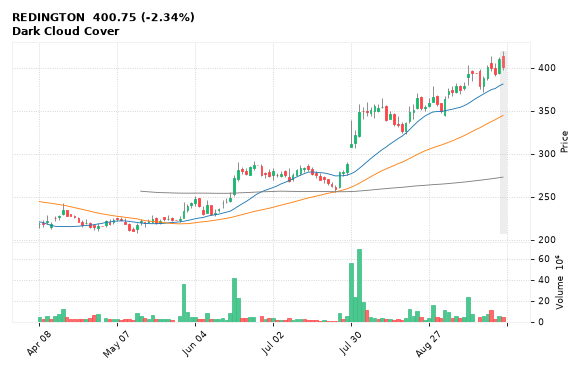

[🔔 Set alert on REDINGTON](https://claude.ai/artifact/Ewc5hHTPX6WkU1nVcDNQzq?s=REDINGTON&c=close%20below%20397.10) &nbsp;|&nbsp; [📈 Live chart (TradingView)](https://www.tradingview.com/chart/?symbol=NSE:REDINGTON) &nbsp;|&nbsp; [alert by email](mailto:himanshusardana05@gmail.com?subject=ALERT%20REDINGTON&body=Alert%20me%20when%3A%20close%20below%20397.10%0A%0AEdit%20the%20line%20above%20if%20you%20want%2C%20then%20press%20Send.%20Checked%20on%20every%20day%27s%20closing%20data%3B%20a%20triggered%20alert%20appears%20at%20the%20top%20of%20the%208%20AM%20Technical%20Analysis%20email.%0A%0AExamples%20you%20can%20write%3A%0A%20%20close%20above%201150%20%20%7C%20%20close%20below%201080%20%20%7C%20%20high%20above%201200%20%20%7C%20%20low%20below%201050%0A%20%20close%20crosses%20above%20200%20DMA%20%20%7C%20%20close%20below%2050%20DMA%20%20%7C%20%20RSI%20below%2030%20%20%7C%20%20RSI%20above%2070%0A%20%20volume%20above%202x%20%20%7C%20%20change%20above%205%25%20%20%7C%20%20change%20below%20-4%25%20%20%7C%20%2052-week%20high%20%20%7C%20%20golden%20cross%0A%20%20combine%20with%20%27and%27%2C%20e.g.%20%20close%20above%201150%20and%20volume%20above%201.5x%0A%0AReference%3A%20REDINGTON%20closed%20400.75%20%28high%20419.50%2C%20low%20397.10%29.%0ATo%20cancel%20later%2C%20send%20an%20email%20with%20subject%3A%20CANCEL%20ALERT%20REDINGTON)

---
