# Technical Analysis Alert on Nifty 500 - charts for Thu 24 Sep 2026

Scroll through all charts. Tap **Set alert** under any chart to get an email alert in the 8 AM report when your price/condition triggers on the daily close.

## 1. ABDL - BULLISH
**712.15** (+8.49%) | vol 13.9x | RSI 75 | H 722.00 / L 650.00  
52-week high breakout, Volume spike 13.9x

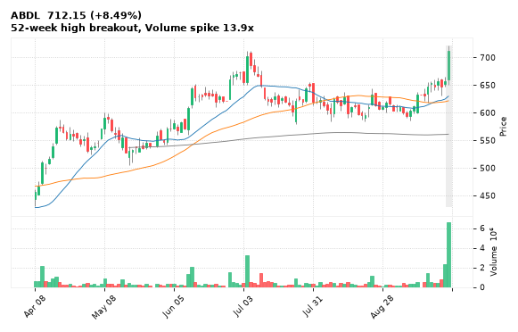

[🔔 Set alert on ABDL](https://claude.ai/artifact/Ewc5hHTPX6WkU1nVcDNQzq?s=ABDL&c=close%20above%20722.00) &nbsp;|&nbsp; [📈 Live chart (TradingView)](https://www.tradingview.com/chart/?symbol=NSE:ABDL) &nbsp;|&nbsp; [alert by email](mailto:himanshusardana05@gmail.com?subject=ALERT%20ABDL&body=Alert%20me%20when%3A%20close%20above%20722.00%0A%0AEdit%20the%20line%20above%20if%20you%20want%2C%20then%20press%20Send.%20Checked%20on%20every%20day%27s%20closing%20data%3B%20a%20triggered%20alert%20appears%20at%20the%20top%20of%20the%208%20AM%20Technical%20Analysis%20email.%0A%0AExamples%20you%20can%20write%3A%0A%20%20close%20above%201150%20%20%7C%20%20close%20below%201080%20%20%7C%20%20high%20above%201200%20%20%7C%20%20low%20below%201050%0A%20%20close%20crosses%20above%20200%20DMA%20%20%7C%20%20close%20below%2050%20DMA%20%20%7C%20%20RSI%20below%2030%20%20%7C%20%20RSI%20above%2070%0A%20%20volume%20above%202x%20%20%7C%20%20change%20above%205%25%20%20%7C%20%20change%20below%20-4%25%20%20%7C%20%2052-week%20high%20%20%7C%20%20golden%20cross%0A%20%20combine%20with%20%27and%27%2C%20e.g.%20%20close%20above%201150%20and%20volume%20above%201.5x%0A%0AReference%3A%20ABDL%20closed%20712.15%20%28high%20722.00%2C%20low%20650.00%29.%0ATo%20cancel%20later%2C%20send%20an%20email%20with%20subject%3A%20CANCEL%20ALERT%20ABDL)

---

## 2. ABREL - BULLISH
**1,211.80** (+0.45%) | vol 3.8x | RSI 31 | H 1,262.90 / L 1,189.60  
Inverted Hammer, RSI up through 30

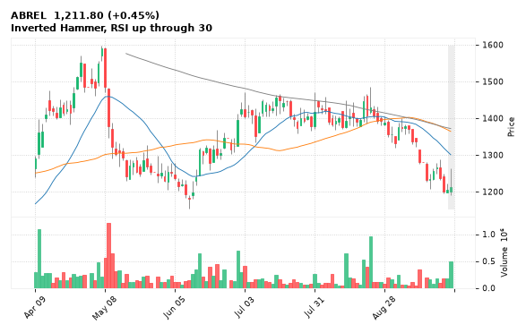

[🔔 Set alert on ABREL](https://claude.ai/artifact/Ewc5hHTPX6WkU1nVcDNQzq?s=ABREL&c=close%20above%201262.90) &nbsp;|&nbsp; [📈 Live chart (TradingView)](https://www.tradingview.com/chart/?symbol=NSE:ABREL) &nbsp;|&nbsp; [alert by email](mailto:himanshusardana05@gmail.com?subject=ALERT%20ABREL&body=Alert%20me%20when%3A%20close%20above%201262.90%0A%0AEdit%20the%20line%20above%20if%20you%20want%2C%20then%20press%20Send.%20Checked%20on%20every%20day%27s%20closing%20data%3B%20a%20triggered%20alert%20appears%20at%20the%20top%20of%20the%208%20AM%20Technical%20Analysis%20email.%0A%0AExamples%20you%20can%20write%3A%0A%20%20close%20above%201150%20%20%7C%20%20close%20below%201080%20%20%7C%20%20high%20above%201200%20%20%7C%20%20low%20below%201050%0A%20%20close%20crosses%20above%20200%20DMA%20%20%7C%20%20close%20below%2050%20DMA%20%20%7C%20%20RSI%20below%2030%20%20%7C%20%20RSI%20above%2070%0A%20%20volume%20above%202x%20%20%7C%20%20change%20above%205%25%20%20%7C%20%20change%20below%20-4%25%20%20%7C%20%2052-week%20high%20%20%7C%20%20golden%20cross%0A%20%20combine%20with%20%27and%27%2C%20e.g.%20%20close%20above%201150%20and%20volume%20above%201.5x%0A%0AReference%3A%20ABREL%20closed%201211.80%20%28high%201262.90%2C%20low%201189.60%29.%0ATo%20cancel%20later%2C%20send%20an%20email%20with%20subject%3A%20CANCEL%20ALERT%20ABREL)

---

## 3. SIGNATURE - BULLISH
**784.60** (+2.06%) | vol 2.4x | RSI 53 | H 801.85 / L 763.00  
MACD bullish cross, Volume spike 2.4x

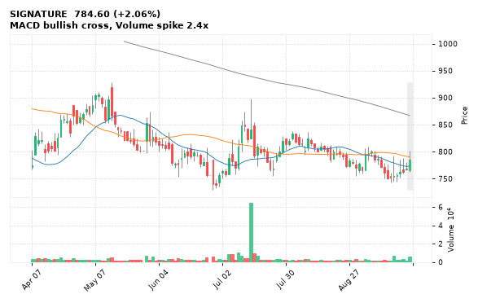

[🔔 Set alert on SIGNATURE](https://claude.ai/artifact/Ewc5hHTPX6WkU1nVcDNQzq?s=SIGNATURE&c=close%20above%20801.85) &nbsp;|&nbsp; [📈 Live chart (TradingView)](https://www.tradingview.com/chart/?symbol=NSE:SIGNATURE) &nbsp;|&nbsp; [alert by email](mailto:himanshusardana05@gmail.com?subject=ALERT%20SIGNATURE&body=Alert%20me%20when%3A%20close%20above%20801.85%0A%0AEdit%20the%20line%20above%20if%20you%20want%2C%20then%20press%20Send.%20Checked%20on%20every%20day%27s%20closing%20data%3B%20a%20triggered%20alert%20appears%20at%20the%20top%20of%20the%208%20AM%20Technical%20Analysis%20email.%0A%0AExamples%20you%20can%20write%3A%0A%20%20close%20above%201150%20%20%7C%20%20close%20below%201080%20%20%7C%20%20high%20above%201200%20%20%7C%20%20low%20below%201050%0A%20%20close%20crosses%20above%20200%20DMA%20%20%7C%20%20close%20below%2050%20DMA%20%20%7C%20%20RSI%20below%2030%20%20%7C%20%20RSI%20above%2070%0A%20%20volume%20above%202x%20%20%7C%20%20change%20above%205%25%20%20%7C%20%20change%20below%20-4%25%20%20%7C%20%2052-week%20high%20%20%7C%20%20golden%20cross%0A%20%20combine%20with%20%27and%27%2C%20e.g.%20%20close%20above%201150%20and%20volume%20above%201.5x%0A%0AReference%3A%20SIGNATURE%20closed%20784.60%20%28high%20801.85%2C%20low%20763.00%29.%0ATo%20cancel%20later%2C%20send%20an%20email%20with%20subject%3A%20CANCEL%20ALERT%20SIGNATURE)

---

## 4. GODIGIT - BULLISH
**250.30** (+2.16%) | vol 9.3x | RSI 46 | H 253.45 / L 236.15  
Volume spike 9.3x

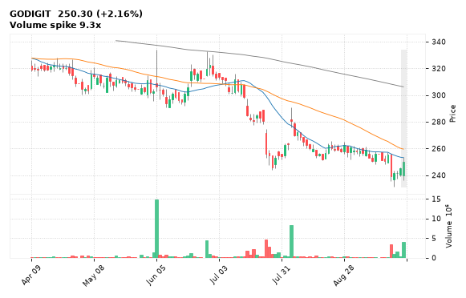

[🔔 Set alert on GODIGIT](https://claude.ai/artifact/Ewc5hHTPX6WkU1nVcDNQzq?s=GODIGIT&c=close%20above%20253.45) &nbsp;|&nbsp; [📈 Live chart (TradingView)](https://www.tradingview.com/chart/?symbol=NSE:GODIGIT) &nbsp;|&nbsp; [alert by email](mailto:himanshusardana05@gmail.com?subject=ALERT%20GODIGIT&body=Alert%20me%20when%3A%20close%20above%20253.45%0A%0AEdit%20the%20line%20above%20if%20you%20want%2C%20then%20press%20Send.%20Checked%20on%20every%20day%27s%20closing%20data%3B%20a%20triggered%20alert%20appears%20at%20the%20top%20of%20the%208%20AM%20Technical%20Analysis%20email.%0A%0AExamples%20you%20can%20write%3A%0A%20%20close%20above%201150%20%20%7C%20%20close%20below%201080%20%20%7C%20%20high%20above%201200%20%20%7C%20%20low%20below%201050%0A%20%20close%20crosses%20above%20200%20DMA%20%20%7C%20%20close%20below%2050%20DMA%20%20%7C%20%20RSI%20below%2030%20%20%7C%20%20RSI%20above%2070%0A%20%20volume%20above%202x%20%20%7C%20%20change%20above%205%25%20%20%7C%20%20change%20below%20-4%25%20%20%7C%20%2052-week%20high%20%20%7C%20%20golden%20cross%0A%20%20combine%20with%20%27and%27%2C%20e.g.%20%20close%20above%201150%20and%20volume%20above%201.5x%0A%0AReference%3A%20GODIGIT%20closed%20250.30%20%28high%20253.45%2C%20low%20236.15%29.%0ATo%20cancel%20later%2C%20send%20an%20email%20with%20subject%3A%20CANCEL%20ALERT%20GODIGIT)

---

## 5. SUNTV - BULLISH
**512.70** (+4.59%) | vol 4.3x | RSI 67 | H 522.00 / L 483.00  
Volume spike 4.3x

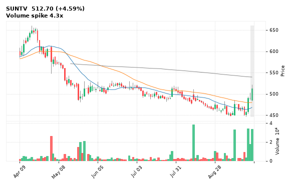

[🔔 Set alert on SUNTV](https://claude.ai/artifact/Ewc5hHTPX6WkU1nVcDNQzq?s=SUNTV&c=close%20above%20522.00) &nbsp;|&nbsp; [📈 Live chart (TradingView)](https://www.tradingview.com/chart/?symbol=NSE:SUNTV) &nbsp;|&nbsp; [alert by email](mailto:himanshusardana05@gmail.com?subject=ALERT%20SUNTV&body=Alert%20me%20when%3A%20close%20above%20522.00%0A%0AEdit%20the%20line%20above%20if%20you%20want%2C%20then%20press%20Send.%20Checked%20on%20every%20day%27s%20closing%20data%3B%20a%20triggered%20alert%20appears%20at%20the%20top%20of%20the%208%20AM%20Technical%20Analysis%20email.%0A%0AExamples%20you%20can%20write%3A%0A%20%20close%20above%201150%20%20%7C%20%20close%20below%201080%20%20%7C%20%20high%20above%201200%20%20%7C%20%20low%20below%201050%0A%20%20close%20crosses%20above%20200%20DMA%20%20%7C%20%20close%20below%2050%20DMA%20%20%7C%20%20RSI%20below%2030%20%20%7C%20%20RSI%20above%2070%0A%20%20volume%20above%202x%20%20%7C%20%20change%20above%205%25%20%20%7C%20%20change%20below%20-4%25%20%20%7C%20%2052-week%20high%20%20%7C%20%20golden%20cross%0A%20%20combine%20with%20%27and%27%2C%20e.g.%20%20close%20above%201150%20and%20volume%20above%201.5x%0A%0AReference%3A%20SUNTV%20closed%20512.70%20%28high%20522.00%2C%20low%20483.00%29.%0ATo%20cancel%20later%2C%20send%20an%20email%20with%20subject%3A%20CANCEL%20ALERT%20SUNTV)

---

## 6. MANKIND - BULLISH
**2,500.00** (+1.42%) | vol 1.2x | RSI 65 | H 2,504.30 / L 2,442.60  
Bullish Marubozu

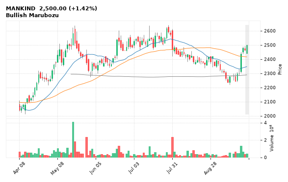

[🔔 Set alert on MANKIND](https://claude.ai/artifact/Ewc5hHTPX6WkU1nVcDNQzq?s=MANKIND&c=close%20above%202504.30) &nbsp;|&nbsp; [📈 Live chart (TradingView)](https://www.tradingview.com/chart/?symbol=NSE:MANKIND) &nbsp;|&nbsp; [alert by email](mailto:himanshusardana05@gmail.com?subject=ALERT%20MANKIND&body=Alert%20me%20when%3A%20close%20above%202504.30%0A%0AEdit%20the%20line%20above%20if%20you%20want%2C%20then%20press%20Send.%20Checked%20on%20every%20day%27s%20closing%20data%3B%20a%20triggered%20alert%20appears%20at%20the%20top%20of%20the%208%20AM%20Technical%20Analysis%20email.%0A%0AExamples%20you%20can%20write%3A%0A%20%20close%20above%201150%20%20%7C%20%20close%20below%201080%20%20%7C%20%20high%20above%201200%20%20%7C%20%20low%20below%201050%0A%20%20close%20crosses%20above%20200%20DMA%20%20%7C%20%20close%20below%2050%20DMA%20%20%7C%20%20RSI%20below%2030%20%20%7C%20%20RSI%20above%2070%0A%20%20volume%20above%202x%20%20%7C%20%20change%20above%205%25%20%20%7C%20%20change%20below%20-4%25%20%20%7C%20%2052-week%20high%20%20%7C%20%20golden%20cross%0A%20%20combine%20with%20%27and%27%2C%20e.g.%20%20close%20above%201150%20and%20volume%20above%201.5x%0A%0AReference%3A%20MANKIND%20closed%202500.00%20%28high%202504.30%2C%20low%202442.60%29.%0ATo%20cancel%20later%2C%20send%20an%20email%20with%20subject%3A%20CANCEL%20ALERT%20MANKIND)

---

## 7. ONGC - BULLISH
**239.00** (+0.89%) | vol 0.8x | RSI 56 | H 239.00 / L 235.23  
Bullish Marubozu

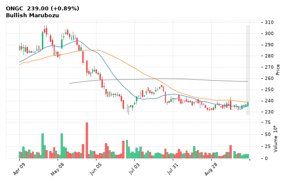

[🔔 Set alert on ONGC](https://claude.ai/artifact/Ewc5hHTPX6WkU1nVcDNQzq?s=ONGC&c=close%20above%20239.00) &nbsp;|&nbsp; [📈 Live chart (TradingView)](https://www.tradingview.com/chart/?symbol=NSE:ONGC) &nbsp;|&nbsp; [alert by email](mailto:himanshusardana05@gmail.com?subject=ALERT%20ONGC&body=Alert%20me%20when%3A%20close%20above%20239.00%0A%0AEdit%20the%20line%20above%20if%20you%20want%2C%20then%20press%20Send.%20Checked%20on%20every%20day%27s%20closing%20data%3B%20a%20triggered%20alert%20appears%20at%20the%20top%20of%20the%208%20AM%20Technical%20Analysis%20email.%0A%0AExamples%20you%20can%20write%3A%0A%20%20close%20above%201150%20%20%7C%20%20close%20below%201080%20%20%7C%20%20high%20above%201200%20%20%7C%20%20low%20below%201050%0A%20%20close%20crosses%20above%20200%20DMA%20%20%7C%20%20close%20below%2050%20DMA%20%20%7C%20%20RSI%20below%2030%20%20%7C%20%20RSI%20above%2070%0A%20%20volume%20above%202x%20%20%7C%20%20change%20above%205%25%20%20%7C%20%20change%20below%20-4%25%20%20%7C%20%2052-week%20high%20%20%7C%20%20golden%20cross%0A%20%20combine%20with%20%27and%27%2C%20e.g.%20%20close%20above%201150%20and%20volume%20above%201.5x%0A%0AReference%3A%20ONGC%20closed%20239.00%20%28high%20239.00%2C%20low%20235.23%29.%0ATo%20cancel%20later%2C%20send%20an%20email%20with%20subject%3A%20CANCEL%20ALERT%20ONGC)

---

## 8. ZEEL - BULLISH
**78.17** (+1.15%) | vol 0.6x | RSI 31 | H 79.45 / L 76.85  
RSI up through 30

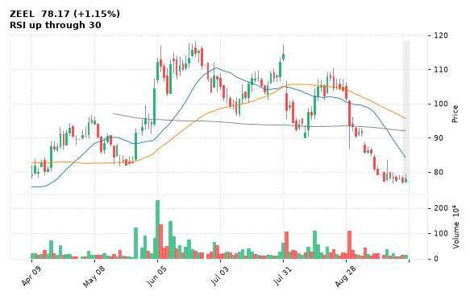

[🔔 Set alert on ZEEL](https://claude.ai/artifact/Ewc5hHTPX6WkU1nVcDNQzq?s=ZEEL&c=close%20above%2079.45) &nbsp;|&nbsp; [📈 Live chart (TradingView)](https://www.tradingview.com/chart/?symbol=NSE:ZEEL) &nbsp;|&nbsp; [alert by email](mailto:himanshusardana05@gmail.com?subject=ALERT%20ZEEL&body=Alert%20me%20when%3A%20close%20above%2079.45%0A%0AEdit%20the%20line%20above%20if%20you%20want%2C%20then%20press%20Send.%20Checked%20on%20every%20day%27s%20closing%20data%3B%20a%20triggered%20alert%20appears%20at%20the%20top%20of%20the%208%20AM%20Technical%20Analysis%20email.%0A%0AExamples%20you%20can%20write%3A%0A%20%20close%20above%201150%20%20%7C%20%20close%20below%201080%20%20%7C%20%20high%20above%201200%20%20%7C%20%20low%20below%201050%0A%20%20close%20crosses%20above%20200%20DMA%20%20%7C%20%20close%20below%2050%20DMA%20%20%7C%20%20RSI%20below%2030%20%20%7C%20%20RSI%20above%2070%0A%20%20volume%20above%202x%20%20%7C%20%20change%20above%205%25%20%20%7C%20%20change%20below%20-4%25%20%20%7C%20%2052-week%20high%20%20%7C%20%20golden%20cross%0A%20%20combine%20with%20%27and%27%2C%20e.g.%20%20close%20above%201150%20and%20volume%20above%201.5x%0A%0AReference%3A%20ZEEL%20closed%2078.17%20%28high%2079.45%2C%20low%2076.85%29.%0ATo%20cancel%20later%2C%20send%20an%20email%20with%20subject%3A%20CANCEL%20ALERT%20ZEEL)

---

## 9. LALPATHLAB - BULLISH
**1,961.30** (+1.92%) | vol 1.5x | RSI 62 | H 1,976.20 / L 1,911.70  
MACD bullish cross

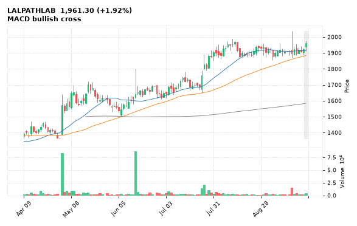

[🔔 Set alert on LALPATHLAB](https://claude.ai/artifact/Ewc5hHTPX6WkU1nVcDNQzq?s=LALPATHLAB&c=close%20above%201976.20) &nbsp;|&nbsp; [📈 Live chart (TradingView)](https://www.tradingview.com/chart/?symbol=NSE:LALPATHLAB) &nbsp;|&nbsp; [alert by email](mailto:himanshusardana05@gmail.com?subject=ALERT%20LALPATHLAB&body=Alert%20me%20when%3A%20close%20above%201976.20%0A%0AEdit%20the%20line%20above%20if%20you%20want%2C%20then%20press%20Send.%20Checked%20on%20every%20day%27s%20closing%20data%3B%20a%20triggered%20alert%20appears%20at%20the%20top%20of%20the%208%20AM%20Technical%20Analysis%20email.%0A%0AExamples%20you%20can%20write%3A%0A%20%20close%20above%201150%20%20%7C%20%20close%20below%201080%20%20%7C%20%20high%20above%201200%20%20%7C%20%20low%20below%201050%0A%20%20close%20crosses%20above%20200%20DMA%20%20%7C%20%20close%20below%2050%20DMA%20%20%7C%20%20RSI%20below%2030%20%20%7C%20%20RSI%20above%2070%0A%20%20volume%20above%202x%20%20%7C%20%20change%20above%205%25%20%20%7C%20%20change%20below%20-4%25%20%20%7C%20%2052-week%20high%20%20%7C%20%20golden%20cross%0A%20%20combine%20with%20%27and%27%2C%20e.g.%20%20close%20above%201150%20and%20volume%20above%201.5x%0A%0AReference%3A%20LALPATHLAB%20closed%201961.30%20%28high%201976.20%2C%20low%201911.70%29.%0ATo%20cancel%20later%2C%20send%20an%20email%20with%20subject%3A%20CANCEL%20ALERT%20LALPATHLAB)

---

## 10. VTL - BULLISH
**563.60** (+0.38%) | vol 1.5x | RSI 44 | H 596.60 / L 556.65  
Inverted Hammer

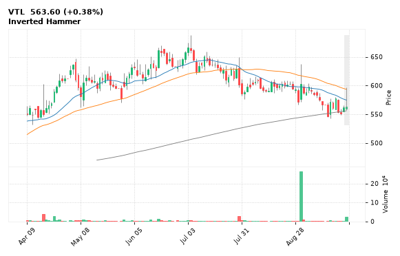

[🔔 Set alert on VTL](https://claude.ai/artifact/Ewc5hHTPX6WkU1nVcDNQzq?s=VTL&c=close%20above%20596.60) &nbsp;|&nbsp; [📈 Live chart (TradingView)](https://www.tradingview.com/chart/?symbol=NSE:VTL) &nbsp;|&nbsp; [alert by email](mailto:himanshusardana05@gmail.com?subject=ALERT%20VTL&body=Alert%20me%20when%3A%20close%20above%20596.60%0A%0AEdit%20the%20line%20above%20if%20you%20want%2C%20then%20press%20Send.%20Checked%20on%20every%20day%27s%20closing%20data%3B%20a%20triggered%20alert%20appears%20at%20the%20top%20of%20the%208%20AM%20Technical%20Analysis%20email.%0A%0AExamples%20you%20can%20write%3A%0A%20%20close%20above%201150%20%20%7C%20%20close%20below%201080%20%20%7C%20%20high%20above%201200%20%20%7C%20%20low%20below%201050%0A%20%20close%20crosses%20above%20200%20DMA%20%20%7C%20%20close%20below%2050%20DMA%20%20%7C%20%20RSI%20below%2030%20%20%7C%20%20RSI%20above%2070%0A%20%20volume%20above%202x%20%20%7C%20%20change%20above%205%25%20%20%7C%20%20change%20below%20-4%25%20%20%7C%20%2052-week%20high%20%20%7C%20%20golden%20cross%0A%20%20combine%20with%20%27and%27%2C%20e.g.%20%20close%20above%201150%20and%20volume%20above%201.5x%0A%0AReference%3A%20VTL%20closed%20563.60%20%28high%20596.60%2C%20low%20556.65%29.%0ATo%20cancel%20later%2C%20send%20an%20email%20with%20subject%3A%20CANCEL%20ALERT%20VTL)

---

## 11. SUNPHARMA - BULLISH
**1,849.90** (-0.81%) | vol 1.2x | RSI 43 | H 1,880.00 / L 1,848.40  
MACD bullish cross

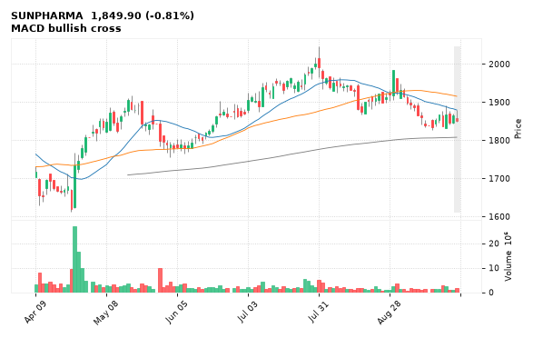

[🔔 Set alert on SUNPHARMA](https://claude.ai/artifact/Ewc5hHTPX6WkU1nVcDNQzq?s=SUNPHARMA&c=close%20above%201880.00) &nbsp;|&nbsp; [📈 Live chart (TradingView)](https://www.tradingview.com/chart/?symbol=NSE:SUNPHARMA) &nbsp;|&nbsp; [alert by email](mailto:himanshusardana05@gmail.com?subject=ALERT%20SUNPHARMA&body=Alert%20me%20when%3A%20close%20above%201880.00%0A%0AEdit%20the%20line%20above%20if%20you%20want%2C%20then%20press%20Send.%20Checked%20on%20every%20day%27s%20closing%20data%3B%20a%20triggered%20alert%20appears%20at%20the%20top%20of%20the%208%20AM%20Technical%20Analysis%20email.%0A%0AExamples%20you%20can%20write%3A%0A%20%20close%20above%201150%20%20%7C%20%20close%20below%201080%20%20%7C%20%20high%20above%201200%20%20%7C%20%20low%20below%201050%0A%20%20close%20crosses%20above%20200%20DMA%20%20%7C%20%20close%20below%2050%20DMA%20%20%7C%20%20RSI%20below%2030%20%20%7C%20%20RSI%20above%2070%0A%20%20volume%20above%202x%20%20%7C%20%20change%20above%205%25%20%20%7C%20%20change%20below%20-4%25%20%20%7C%20%2052-week%20high%20%20%7C%20%20golden%20cross%0A%20%20combine%20with%20%27and%27%2C%20e.g.%20%20close%20above%201150%20and%20volume%20above%201.5x%0A%0AReference%3A%20SUNPHARMA%20closed%201849.90%20%28high%201880.00%2C%20low%201848.40%29.%0ATo%20cancel%20later%2C%20send%20an%20email%20with%20subject%3A%20CANCEL%20ALERT%20SUNPHARMA)

---

## 12. NTPC - BULLISH
**326.60** (+0.18%) | vol 1.0x | RSI 40 | H 327.70 / L 324.40  
MACD bullish cross, NR7 (narrowest range in 7)

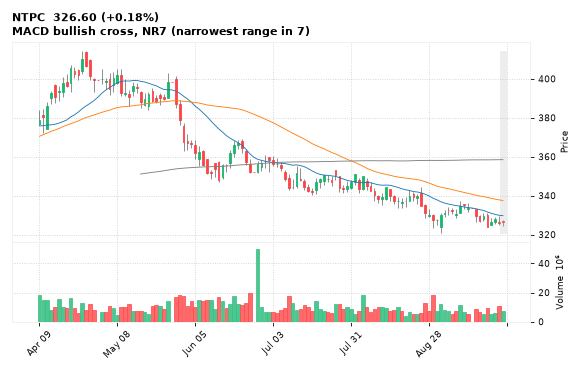

[🔔 Set alert on NTPC](https://claude.ai/artifact/Ewc5hHTPX6WkU1nVcDNQzq?s=NTPC&c=close%20above%20327.70) &nbsp;|&nbsp; [📈 Live chart (TradingView)](https://www.tradingview.com/chart/?symbol=NSE:NTPC) &nbsp;|&nbsp; [alert by email](mailto:himanshusardana05@gmail.com?subject=ALERT%20NTPC&body=Alert%20me%20when%3A%20close%20above%20327.70%0A%0AEdit%20the%20line%20above%20if%20you%20want%2C%20then%20press%20Send.%20Checked%20on%20every%20day%27s%20closing%20data%3B%20a%20triggered%20alert%20appears%20at%20the%20top%20of%20the%208%20AM%20Technical%20Analysis%20email.%0A%0AExamples%20you%20can%20write%3A%0A%20%20close%20above%201150%20%20%7C%20%20close%20below%201080%20%20%7C%20%20high%20above%201200%20%20%7C%20%20low%20below%201050%0A%20%20close%20crosses%20above%20200%20DMA%20%20%7C%20%20close%20below%2050%20DMA%20%20%7C%20%20RSI%20below%2030%20%20%7C%20%20RSI%20above%2070%0A%20%20volume%20above%202x%20%20%7C%20%20change%20above%205%25%20%20%7C%20%20change%20below%20-4%25%20%20%7C%20%2052-week%20high%20%20%7C%20%20golden%20cross%0A%20%20combine%20with%20%27and%27%2C%20e.g.%20%20close%20above%201150%20and%20volume%20above%201.5x%0A%0AReference%3A%20NTPC%20closed%20326.60%20%28high%20327.70%2C%20low%20324.40%29.%0ATo%20cancel%20later%2C%20send%20an%20email%20with%20subject%3A%20CANCEL%20ALERT%20NTPC)

---

## 13. TRIDENT - BULLISH
**23.15** (-1.15%) | vol 1.0x | RSI 36 | H 23.40 / L 23.02  
MACD bullish cross, Inside Bar

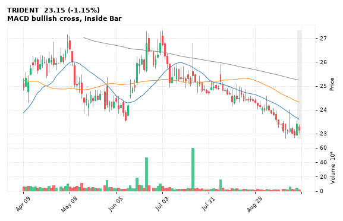

[🔔 Set alert on TRIDENT](https://claude.ai/artifact/Ewc5hHTPX6WkU1nVcDNQzq?s=TRIDENT&c=close%20above%2023.40) &nbsp;|&nbsp; [📈 Live chart (TradingView)](https://www.tradingview.com/chart/?symbol=NSE:TRIDENT) &nbsp;|&nbsp; [alert by email](mailto:himanshusardana05@gmail.com?subject=ALERT%20TRIDENT&body=Alert%20me%20when%3A%20close%20above%2023.40%0A%0AEdit%20the%20line%20above%20if%20you%20want%2C%20then%20press%20Send.%20Checked%20on%20every%20day%27s%20closing%20data%3B%20a%20triggered%20alert%20appears%20at%20the%20top%20of%20the%208%20AM%20Technical%20Analysis%20email.%0A%0AExamples%20you%20can%20write%3A%0A%20%20close%20above%201150%20%20%7C%20%20close%20below%201080%20%20%7C%20%20high%20above%201200%20%20%7C%20%20low%20below%201050%0A%20%20close%20crosses%20above%20200%20DMA%20%20%7C%20%20close%20below%2050%20DMA%20%20%7C%20%20RSI%20below%2030%20%20%7C%20%20RSI%20above%2070%0A%20%20volume%20above%202x%20%20%7C%20%20change%20above%205%25%20%20%7C%20%20change%20below%20-4%25%20%20%7C%20%2052-week%20high%20%20%7C%20%20golden%20cross%0A%20%20combine%20with%20%27and%27%2C%20e.g.%20%20close%20above%201150%20and%20volume%20above%201.5x%0A%0AReference%3A%20TRIDENT%20closed%2023.15%20%28high%2023.40%2C%20low%2023.02%29.%0ATo%20cancel%20later%2C%20send%20an%20email%20with%20subject%3A%20CANCEL%20ALERT%20TRIDENT)

---

## 14. UBL - BULLISH
**1,270.20** (+2.25%) | vol 1.0x | RSI 47 | H 1,289.70 / L 1,227.10  
MACD bullish cross

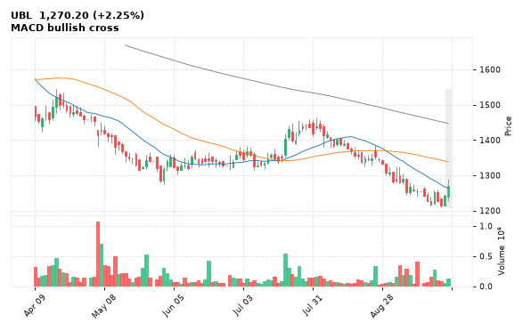

[🔔 Set alert on UBL](https://claude.ai/artifact/Ewc5hHTPX6WkU1nVcDNQzq?s=UBL&c=close%20above%201289.70) &nbsp;|&nbsp; [📈 Live chart (TradingView)](https://www.tradingview.com/chart/?symbol=NSE:UBL) &nbsp;|&nbsp; [alert by email](mailto:himanshusardana05@gmail.com?subject=ALERT%20UBL&body=Alert%20me%20when%3A%20close%20above%201289.70%0A%0AEdit%20the%20line%20above%20if%20you%20want%2C%20then%20press%20Send.%20Checked%20on%20every%20day%27s%20closing%20data%3B%20a%20triggered%20alert%20appears%20at%20the%20top%20of%20the%208%20AM%20Technical%20Analysis%20email.%0A%0AExamples%20you%20can%20write%3A%0A%20%20close%20above%201150%20%20%7C%20%20close%20below%201080%20%20%7C%20%20high%20above%201200%20%20%7C%20%20low%20below%201050%0A%20%20close%20crosses%20above%20200%20DMA%20%20%7C%20%20close%20below%2050%20DMA%20%20%7C%20%20RSI%20below%2030%20%20%7C%20%20RSI%20above%2070%0A%20%20volume%20above%202x%20%20%7C%20%20change%20above%205%25%20%20%7C%20%20change%20below%20-4%25%20%20%7C%20%2052-week%20high%20%20%7C%20%20golden%20cross%0A%20%20combine%20with%20%27and%27%2C%20e.g.%20%20close%20above%201150%20and%20volume%20above%201.5x%0A%0AReference%3A%20UBL%20closed%201270.20%20%28high%201289.70%2C%20low%201227.10%29.%0ATo%20cancel%20later%2C%20send%20an%20email%20with%20subject%3A%20CANCEL%20ALERT%20UBL)

---

## 15. TECHM - BULLISH
**1,543.00** (-0.90%) | vol 0.9x | RSI 44 | H 1,576.20 / L 1,543.00  
Inverted Hammer

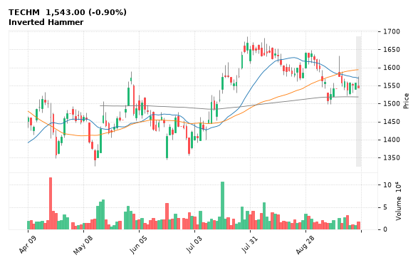

[🔔 Set alert on TECHM](https://claude.ai/artifact/Ewc5hHTPX6WkU1nVcDNQzq?s=TECHM&c=close%20above%201576.20) &nbsp;|&nbsp; [📈 Live chart (TradingView)](https://www.tradingview.com/chart/?symbol=NSE:TECHM) &nbsp;|&nbsp; [alert by email](mailto:himanshusardana05@gmail.com?subject=ALERT%20TECHM&body=Alert%20me%20when%3A%20close%20above%201576.20%0A%0AEdit%20the%20line%20above%20if%20you%20want%2C%20then%20press%20Send.%20Checked%20on%20every%20day%27s%20closing%20data%3B%20a%20triggered%20alert%20appears%20at%20the%20top%20of%20the%208%20AM%20Technical%20Analysis%20email.%0A%0AExamples%20you%20can%20write%3A%0A%20%20close%20above%201150%20%20%7C%20%20close%20below%201080%20%20%7C%20%20high%20above%201200%20%20%7C%20%20low%20below%201050%0A%20%20close%20crosses%20above%20200%20DMA%20%20%7C%20%20close%20below%2050%20DMA%20%20%7C%20%20RSI%20below%2030%20%20%7C%20%20RSI%20above%2070%0A%20%20volume%20above%202x%20%20%7C%20%20change%20above%205%25%20%20%7C%20%20change%20below%20-4%25%20%20%7C%20%2052-week%20high%20%20%7C%20%20golden%20cross%0A%20%20combine%20with%20%27and%27%2C%20e.g.%20%20close%20above%201150%20and%20volume%20above%201.5x%0A%0AReference%3A%20TECHM%20closed%201543.00%20%28high%201576.20%2C%20low%201543.00%29.%0ATo%20cancel%20later%2C%20send%20an%20email%20with%20subject%3A%20CANCEL%20ALERT%20TECHM)

---

## 16. POLICYBZR - BEARISH
**1,207.20** (-36.00%) | vol 20.9x | RSI 24 | H 1,697.70 / L 1,207.20  
Bearish Marubozu, 52-week low breakdown, Close below 200 DMA, Volume spike 20.9x

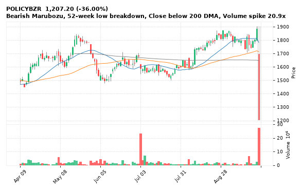

[🔔 Set alert on POLICYBZR](https://claude.ai/artifact/Ewc5hHTPX6WkU1nVcDNQzq?s=POLICYBZR&c=close%20below%201207.20) &nbsp;|&nbsp; [📈 Live chart (TradingView)](https://www.tradingview.com/chart/?symbol=NSE:POLICYBZR) &nbsp;|&nbsp; [alert by email](mailto:himanshusardana05@gmail.com?subject=ALERT%20POLICYBZR&body=Alert%20me%20when%3A%20close%20below%201207.20%0A%0AEdit%20the%20line%20above%20if%20you%20want%2C%20then%20press%20Send.%20Checked%20on%20every%20day%27s%20closing%20data%3B%20a%20triggered%20alert%20appears%20at%20the%20top%20of%20the%208%20AM%20Technical%20Analysis%20email.%0A%0AExamples%20you%20can%20write%3A%0A%20%20close%20above%201150%20%20%7C%20%20close%20below%201080%20%20%7C%20%20high%20above%201200%20%20%7C%20%20low%20below%201050%0A%20%20close%20crosses%20above%20200%20DMA%20%20%7C%20%20close%20below%2050%20DMA%20%20%7C%20%20RSI%20below%2030%20%20%7C%20%20RSI%20above%2070%0A%20%20volume%20above%202x%20%20%7C%20%20change%20above%205%25%20%20%7C%20%20change%20below%20-4%25%20%20%7C%20%2052-week%20high%20%20%7C%20%20golden%20cross%0A%20%20combine%20with%20%27and%27%2C%20e.g.%20%20close%20above%201150%20and%20volume%20above%201.5x%0A%0AReference%3A%20POLICYBZR%20closed%201207.20%20%28high%201697.70%2C%20low%201207.20%29.%0ATo%20cancel%20later%2C%20send%20an%20email%20with%20subject%3A%20CANCEL%20ALERT%20POLICYBZR)

---

## 17. NIVABUPA - BEARISH
**76.13** (-5.11%) | vol 2.9x | RSI 29 | H 78.69 / L 75.97  
Close below 200 DMA, MACD bearish cross, Volume spike 2.9x

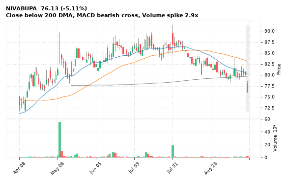

[🔔 Set alert on NIVABUPA](https://claude.ai/artifact/Ewc5hHTPX6WkU1nVcDNQzq?s=NIVABUPA&c=close%20below%2075.97) &nbsp;|&nbsp; [📈 Live chart (TradingView)](https://www.tradingview.com/chart/?symbol=NSE:NIVABUPA) &nbsp;|&nbsp; [alert by email](mailto:himanshusardana05@gmail.com?subject=ALERT%20NIVABUPA&body=Alert%20me%20when%3A%20close%20below%2075.97%0A%0AEdit%20the%20line%20above%20if%20you%20want%2C%20then%20press%20Send.%20Checked%20on%20every%20day%27s%20closing%20data%3B%20a%20triggered%20alert%20appears%20at%20the%20top%20of%20the%208%20AM%20Technical%20Analysis%20email.%0A%0AExamples%20you%20can%20write%3A%0A%20%20close%20above%201150%20%20%7C%20%20close%20below%201080%20%20%7C%20%20high%20above%201200%20%20%7C%20%20low%20below%201050%0A%20%20close%20crosses%20above%20200%20DMA%20%20%7C%20%20close%20below%2050%20DMA%20%20%7C%20%20RSI%20below%2030%20%20%7C%20%20RSI%20above%2070%0A%20%20volume%20above%202x%20%20%7C%20%20change%20above%205%25%20%20%7C%20%20change%20below%20-4%25%20%20%7C%20%2052-week%20high%20%20%7C%20%20golden%20cross%0A%20%20combine%20with%20%27and%27%2C%20e.g.%20%20close%20above%201150%20and%20volume%20above%201.5x%0A%0AReference%3A%20NIVABUPA%20closed%2076.13%20%28high%2078.69%2C%20low%2075.97%29.%0ATo%20cancel%20later%2C%20send%20an%20email%20with%20subject%3A%20CANCEL%20ALERT%20NIVABUPA)

---

## 18. MARUTI - BEARISH
**11,990.00** (-1.96%) | vol 1.0x | RSI 26 | H 12,184.00 / L 11,975.00  
Bearish Marubozu, 52-week low breakdown

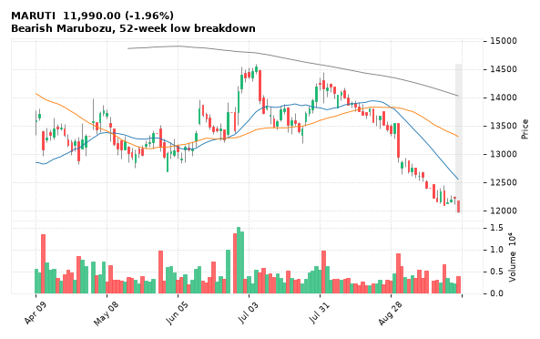

[🔔 Set alert on MARUTI](https://claude.ai/artifact/Ewc5hHTPX6WkU1nVcDNQzq?s=MARUTI&c=close%20below%2011975.00) &nbsp;|&nbsp; [📈 Live chart (TradingView)](https://www.tradingview.com/chart/?symbol=NSE:MARUTI) &nbsp;|&nbsp; [alert by email](mailto:himanshusardana05@gmail.com?subject=ALERT%20MARUTI&body=Alert%20me%20when%3A%20close%20below%2011975.00%0A%0AEdit%20the%20line%20above%20if%20you%20want%2C%20then%20press%20Send.%20Checked%20on%20every%20day%27s%20closing%20data%3B%20a%20triggered%20alert%20appears%20at%20the%20top%20of%20the%208%20AM%20Technical%20Analysis%20email.%0A%0AExamples%20you%20can%20write%3A%0A%20%20close%20above%201150%20%20%7C%20%20close%20below%201080%20%20%7C%20%20high%20above%201200%20%20%7C%20%20low%20below%201050%0A%20%20close%20crosses%20above%20200%20DMA%20%20%7C%20%20close%20below%2050%20DMA%20%20%7C%20%20RSI%20below%2030%20%20%7C%20%20RSI%20above%2070%0A%20%20volume%20above%202x%20%20%7C%20%20change%20above%205%25%20%20%7C%20%20change%20below%20-4%25%20%20%7C%20%2052-week%20high%20%20%7C%20%20golden%20cross%0A%20%20combine%20with%20%27and%27%2C%20e.g.%20%20close%20above%201150%20and%20volume%20above%201.5x%0A%0AReference%3A%20MARUTI%20closed%2011990.00%20%28high%2012184.00%2C%20low%2011975.00%29.%0ATo%20cancel%20later%2C%20send%20an%20email%20with%20subject%3A%20CANCEL%20ALERT%20MARUTI)

---

## 19. LATENTVIEW - BEARISH
**245.40** (-3.16%) | vol 0.6x | RSI 28 | H 252.90 / L 245.00  
Bearish Marubozu, 52-week low breakdown

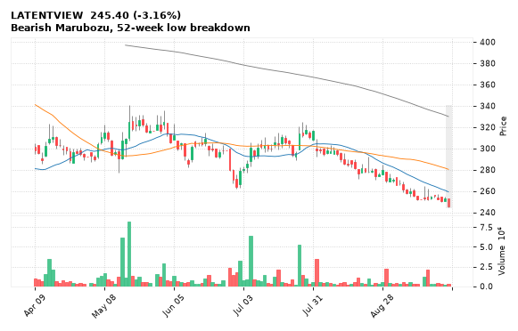

[🔔 Set alert on LATENTVIEW](https://claude.ai/artifact/Ewc5hHTPX6WkU1nVcDNQzq?s=LATENTVIEW&c=close%20below%20245.00) &nbsp;|&nbsp; [📈 Live chart (TradingView)](https://www.tradingview.com/chart/?symbol=NSE:LATENTVIEW) &nbsp;|&nbsp; [alert by email](mailto:himanshusardana05@gmail.com?subject=ALERT%20LATENTVIEW&body=Alert%20me%20when%3A%20close%20below%20245.00%0A%0AEdit%20the%20line%20above%20if%20you%20want%2C%20then%20press%20Send.%20Checked%20on%20every%20day%27s%20closing%20data%3B%20a%20triggered%20alert%20appears%20at%20the%20top%20of%20the%208%20AM%20Technical%20Analysis%20email.%0A%0AExamples%20you%20can%20write%3A%0A%20%20close%20above%201150%20%20%7C%20%20close%20below%201080%20%20%7C%20%20high%20above%201200%20%20%7C%20%20low%20below%201050%0A%20%20close%20crosses%20above%20200%20DMA%20%20%7C%20%20close%20below%2050%20DMA%20%20%7C%20%20RSI%20below%2030%20%20%7C%20%20RSI%20above%2070%0A%20%20volume%20above%202x%20%20%7C%20%20change%20above%205%25%20%20%7C%20%20change%20below%20-4%25%20%20%7C%20%2052-week%20high%20%20%7C%20%20golden%20cross%0A%20%20combine%20with%20%27and%27%2C%20e.g.%20%20close%20above%201150%20and%20volume%20above%201.5x%0A%0AReference%3A%20LATENTVIEW%20closed%20245.40%20%28high%20252.90%2C%20low%20245.00%29.%0ATo%20cancel%20later%2C%20send%20an%20email%20with%20subject%3A%20CANCEL%20ALERT%20LATENTVIEW)

---

## 20. ETERNAL - BEARISH
**335.50** (-2.09%) | vol 0.5x | RSI 62 | H 343.60 / L 333.55  
Evening Star, RSI down through 70

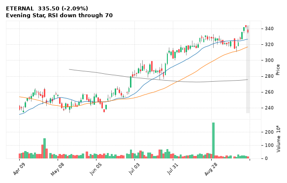

[🔔 Set alert on ETERNAL](https://claude.ai/artifact/Ewc5hHTPX6WkU1nVcDNQzq?s=ETERNAL&c=close%20below%20333.55) &nbsp;|&nbsp; [📈 Live chart (TradingView)](https://www.tradingview.com/chart/?symbol=NSE:ETERNAL) &nbsp;|&nbsp; [alert by email](mailto:himanshusardana05@gmail.com?subject=ALERT%20ETERNAL&body=Alert%20me%20when%3A%20close%20below%20333.55%0A%0AEdit%20the%20line%20above%20if%20you%20want%2C%20then%20press%20Send.%20Checked%20on%20every%20day%27s%20closing%20data%3B%20a%20triggered%20alert%20appears%20at%20the%20top%20of%20the%208%20AM%20Technical%20Analysis%20email.%0A%0AExamples%20you%20can%20write%3A%0A%20%20close%20above%201150%20%20%7C%20%20close%20below%201080%20%20%7C%20%20high%20above%201200%20%20%7C%20%20low%20below%201050%0A%20%20close%20crosses%20above%20200%20DMA%20%20%7C%20%20close%20below%2050%20DMA%20%20%7C%20%20RSI%20below%2030%20%20%7C%20%20RSI%20above%2070%0A%20%20volume%20above%202x%20%20%7C%20%20change%20above%205%25%20%20%7C%20%20change%20below%20-4%25%20%20%7C%20%2052-week%20high%20%20%7C%20%20golden%20cross%0A%20%20combine%20with%20%27and%27%2C%20e.g.%20%20close%20above%201150%20and%20volume%20above%201.5x%0A%0AReference%3A%20ETERNAL%20closed%20335.50%20%28high%20343.60%2C%20low%20333.55%29.%0ATo%20cancel%20later%2C%20send%20an%20email%20with%20subject%3A%20CANCEL%20ALERT%20ETERNAL)

---

## 21. LTF - BEARISH
**282.00** (-9.03%) | vol 9.9x | RSI 34 | H 290.60 / L 279.00  
Close below 200 DMA, Volume spike 9.9x

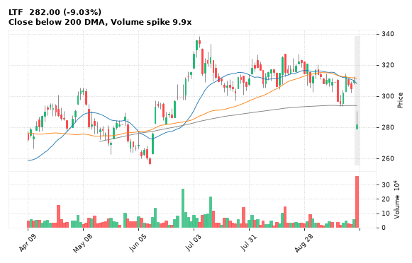

[🔔 Set alert on LTF](https://claude.ai/artifact/Ewc5hHTPX6WkU1nVcDNQzq?s=LTF&c=close%20below%20279.00) &nbsp;|&nbsp; [📈 Live chart (TradingView)](https://www.tradingview.com/chart/?symbol=NSE:LTF) &nbsp;|&nbsp; [alert by email](mailto:himanshusardana05@gmail.com?subject=ALERT%20LTF&body=Alert%20me%20when%3A%20close%20below%20279.00%0A%0AEdit%20the%20line%20above%20if%20you%20want%2C%20then%20press%20Send.%20Checked%20on%20every%20day%27s%20closing%20data%3B%20a%20triggered%20alert%20appears%20at%20the%20top%20of%20the%208%20AM%20Technical%20Analysis%20email.%0A%0AExamples%20you%20can%20write%3A%0A%20%20close%20above%201150%20%20%7C%20%20close%20below%201080%20%20%7C%20%20high%20above%201200%20%20%7C%20%20low%20below%201050%0A%20%20close%20crosses%20above%20200%20DMA%20%20%7C%20%20close%20below%2050%20DMA%20%20%7C%20%20RSI%20below%2030%20%20%7C%20%20RSI%20above%2070%0A%20%20volume%20above%202x%20%20%7C%20%20change%20above%205%25%20%20%7C%20%20change%20below%20-4%25%20%20%7C%20%2052-week%20high%20%20%7C%20%20golden%20cross%0A%20%20combine%20with%20%27and%27%2C%20e.g.%20%20close%20above%201150%20and%20volume%20above%201.5x%0A%0AReference%3A%20LTF%20closed%20282.00%20%28high%20290.60%2C%20low%20279.00%29.%0ATo%20cancel%20later%2C%20send%20an%20email%20with%20subject%3A%20CANCEL%20ALERT%20LTF)

---

## 22. CHOLAFIN - BEARISH
**1,681.70** (-5.20%) | vol 3.5x | RSI 31 | H 1,712.00 / L 1,629.90  
Close below 200 DMA, Volume spike 3.5x

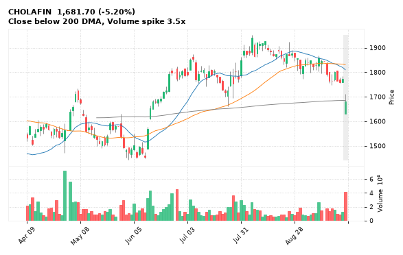

[🔔 Set alert on CHOLAFIN](https://claude.ai/artifact/Ewc5hHTPX6WkU1nVcDNQzq?s=CHOLAFIN&c=close%20below%201629.90) &nbsp;|&nbsp; [📈 Live chart (TradingView)](https://www.tradingview.com/chart/?symbol=NSE:CHOLAFIN) &nbsp;|&nbsp; [alert by email](mailto:himanshusardana05@gmail.com?subject=ALERT%20CHOLAFIN&body=Alert%20me%20when%3A%20close%20below%201629.90%0A%0AEdit%20the%20line%20above%20if%20you%20want%2C%20then%20press%20Send.%20Checked%20on%20every%20day%27s%20closing%20data%3B%20a%20triggered%20alert%20appears%20at%20the%20top%20of%20the%208%20AM%20Technical%20Analysis%20email.%0A%0AExamples%20you%20can%20write%3A%0A%20%20close%20above%201150%20%20%7C%20%20close%20below%201080%20%20%7C%20%20high%20above%201200%20%20%7C%20%20low%20below%201050%0A%20%20close%20crosses%20above%20200%20DMA%20%20%7C%20%20close%20below%2050%20DMA%20%20%7C%20%20RSI%20below%2030%20%20%7C%20%20RSI%20above%2070%0A%20%20volume%20above%202x%20%20%7C%20%20change%20above%205%25%20%20%7C%20%20change%20below%20-4%25%20%20%7C%20%2052-week%20high%20%20%7C%20%20golden%20cross%0A%20%20combine%20with%20%27and%27%2C%20e.g.%20%20close%20above%201150%20and%20volume%20above%201.5x%0A%0AReference%3A%20CHOLAFIN%20closed%201681.70%20%28high%201712.00%2C%20low%201629.90%29.%0ATo%20cancel%20later%2C%20send%20an%20email%20with%20subject%3A%20CANCEL%20ALERT%20CHOLAFIN)

---

## 23. INDUSINDBK - BEARISH
**919.50** (-4.15%) | vol 3.3x | RSI 31 | H 928.90 / L 909.30  
Close below 200 DMA, Volume spike 3.3x

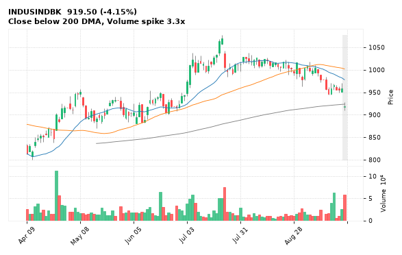

[🔔 Set alert on INDUSINDBK](https://claude.ai/artifact/Ewc5hHTPX6WkU1nVcDNQzq?s=INDUSINDBK&c=close%20below%20909.30) &nbsp;|&nbsp; [📈 Live chart (TradingView)](https://www.tradingview.com/chart/?symbol=NSE:INDUSINDBK) &nbsp;|&nbsp; [alert by email](mailto:himanshusardana05@gmail.com?subject=ALERT%20INDUSINDBK&body=Alert%20me%20when%3A%20close%20below%20909.30%0A%0AEdit%20the%20line%20above%20if%20you%20want%2C%20then%20press%20Send.%20Checked%20on%20every%20day%27s%20closing%20data%3B%20a%20triggered%20alert%20appears%20at%20the%20top%20of%20the%208%20AM%20Technical%20Analysis%20email.%0A%0AExamples%20you%20can%20write%3A%0A%20%20close%20above%201150%20%20%7C%20%20close%20below%201080%20%20%7C%20%20high%20above%201200%20%20%7C%20%20low%20below%201050%0A%20%20close%20crosses%20above%20200%20DMA%20%20%7C%20%20close%20below%2050%20DMA%20%20%7C%20%20RSI%20below%2030%20%20%7C%20%20RSI%20above%2070%0A%20%20volume%20above%202x%20%20%7C%20%20change%20above%205%25%20%20%7C%20%20change%20below%20-4%25%20%20%7C%20%2052-week%20high%20%20%7C%20%20golden%20cross%0A%20%20combine%20with%20%27and%27%2C%20e.g.%20%20close%20above%201150%20and%20volume%20above%201.5x%0A%0AReference%3A%20INDUSINDBK%20closed%20919.50%20%28high%20928.90%2C%20low%20909.30%29.%0ATo%20cancel%20later%2C%20send%20an%20email%20with%20subject%3A%20CANCEL%20ALERT%20INDUSINDBK)

---

## 24. CONCORDBIO - BEARISH
**1,478.80** (-5.22%) | vol 2.1x | RSI 50 | H 1,548.50 / L 1,472.70  
Bearish Marubozu, Volume spike 2.1x

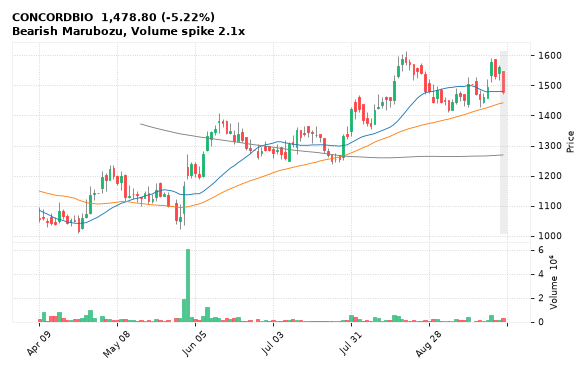

[🔔 Set alert on CONCORDBIO](https://claude.ai/artifact/Ewc5hHTPX6WkU1nVcDNQzq?s=CONCORDBIO&c=close%20below%201472.70) &nbsp;|&nbsp; [📈 Live chart (TradingView)](https://www.tradingview.com/chart/?symbol=NSE:CONCORDBIO) &nbsp;|&nbsp; [alert by email](mailto:himanshusardana05@gmail.com?subject=ALERT%20CONCORDBIO&body=Alert%20me%20when%3A%20close%20below%201472.70%0A%0AEdit%20the%20line%20above%20if%20you%20want%2C%20then%20press%20Send.%20Checked%20on%20every%20day%27s%20closing%20data%3B%20a%20triggered%20alert%20appears%20at%20the%20top%20of%20the%208%20AM%20Technical%20Analysis%20email.%0A%0AExamples%20you%20can%20write%3A%0A%20%20close%20above%201150%20%20%7C%20%20close%20below%201080%20%20%7C%20%20high%20above%201200%20%20%7C%20%20low%20below%201050%0A%20%20close%20crosses%20above%20200%20DMA%20%20%7C%20%20close%20below%2050%20DMA%20%20%7C%20%20RSI%20below%2030%20%20%7C%20%20RSI%20above%2070%0A%20%20volume%20above%202x%20%20%7C%20%20change%20above%205%25%20%20%7C%20%20change%20below%20-4%25%20%20%7C%20%2052-week%20high%20%20%7C%20%20golden%20cross%0A%20%20combine%20with%20%27and%27%2C%20e.g.%20%20close%20above%201150%20and%20volume%20above%201.5x%0A%0AReference%3A%20CONCORDBIO%20closed%201478.80%20%28high%201548.50%2C%20low%201472.70%29.%0ATo%20cancel%20later%2C%20send%20an%20email%20with%20subject%3A%20CANCEL%20ALERT%20CONCORDBIO)

---

## 25. MEESHO - BEARISH
**232.84** (-1.49%) | vol 0.6x | RSI 68 | H 239.66 / L 232.00  
Shooting Star, RSI down through 70, Inside Bar

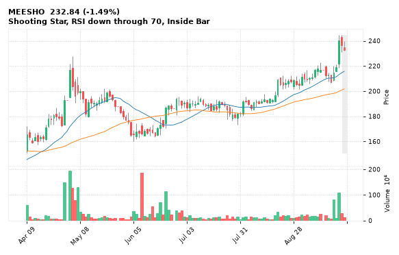

[🔔 Set alert on MEESHO](https://claude.ai/artifact/Ewc5hHTPX6WkU1nVcDNQzq?s=MEESHO&c=close%20below%20232.00) &nbsp;|&nbsp; [📈 Live chart (TradingView)](https://www.tradingview.com/chart/?symbol=NSE:MEESHO) &nbsp;|&nbsp; [alert by email](mailto:himanshusardana05@gmail.com?subject=ALERT%20MEESHO&body=Alert%20me%20when%3A%20close%20below%20232.00%0A%0AEdit%20the%20line%20above%20if%20you%20want%2C%20then%20press%20Send.%20Checked%20on%20every%20day%27s%20closing%20data%3B%20a%20triggered%20alert%20appears%20at%20the%20top%20of%20the%208%20AM%20Technical%20Analysis%20email.%0A%0AExamples%20you%20can%20write%3A%0A%20%20close%20above%201150%20%20%7C%20%20close%20below%201080%20%20%7C%20%20high%20above%201200%20%20%7C%20%20low%20below%201050%0A%20%20close%20crosses%20above%20200%20DMA%20%20%7C%20%20close%20below%2050%20DMA%20%20%7C%20%20RSI%20below%2030%20%20%7C%20%20RSI%20above%2070%0A%20%20volume%20above%202x%20%20%7C%20%20change%20above%205%25%20%20%7C%20%20change%20below%20-4%25%20%20%7C%20%2052-week%20high%20%20%7C%20%20golden%20cross%0A%20%20combine%20with%20%27and%27%2C%20e.g.%20%20close%20above%201150%20and%20volume%20above%201.5x%0A%0AReference%3A%20MEESHO%20closed%20232.84%20%28high%20239.66%2C%20low%20232.00%29.%0ATo%20cancel%20later%2C%20send%20an%20email%20with%20subject%3A%20CANCEL%20ALERT%20MEESHO)

---

## 26. FIVESTAR - BEARISH
**524.85** (-4.52%) | vol 2.7x | RSI 47 | H 540.00 / L 516.35  
MACD bearish cross, Volume spike 2.7x

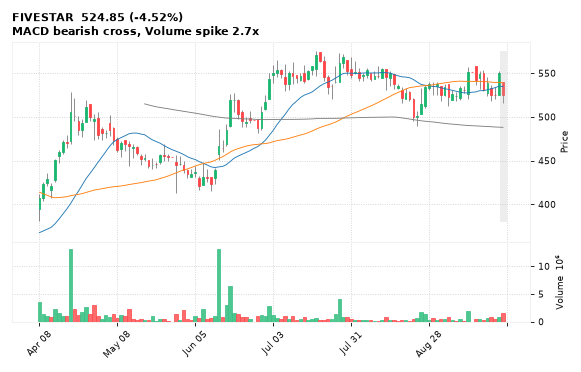

[🔔 Set alert on FIVESTAR](https://claude.ai/artifact/Ewc5hHTPX6WkU1nVcDNQzq?s=FIVESTAR&c=close%20below%20516.35) &nbsp;|&nbsp; [📈 Live chart (TradingView)](https://www.tradingview.com/chart/?symbol=NSE:FIVESTAR) &nbsp;|&nbsp; [alert by email](mailto:himanshusardana05@gmail.com?subject=ALERT%20FIVESTAR&body=Alert%20me%20when%3A%20close%20below%20516.35%0A%0AEdit%20the%20line%20above%20if%20you%20want%2C%20then%20press%20Send.%20Checked%20on%20every%20day%27s%20closing%20data%3B%20a%20triggered%20alert%20appears%20at%20the%20top%20of%20the%208%20AM%20Technical%20Analysis%20email.%0A%0AExamples%20you%20can%20write%3A%0A%20%20close%20above%201150%20%20%7C%20%20close%20below%201080%20%20%7C%20%20high%20above%201200%20%20%7C%20%20low%20below%201050%0A%20%20close%20crosses%20above%20200%20DMA%20%20%7C%20%20close%20below%2050%20DMA%20%20%7C%20%20RSI%20below%2030%20%20%7C%20%20RSI%20above%2070%0A%20%20volume%20above%202x%20%20%7C%20%20change%20above%205%25%20%20%7C%20%20change%20below%20-4%25%20%20%7C%20%2052-week%20high%20%20%7C%20%20golden%20cross%0A%20%20combine%20with%20%27and%27%2C%20e.g.%20%20close%20above%201150%20and%20volume%20above%201.5x%0A%0AReference%3A%20FIVESTAR%20closed%20524.85%20%28high%20540.00%2C%20low%20516.35%29.%0ATo%20cancel%20later%2C%20send%20an%20email%20with%20subject%3A%20CANCEL%20ALERT%20FIVESTAR)

---

## 27. IRCON - BEARISH
**106.60** (-3.21%) | vol 1.7x | RSI 25 | H 109.00 / L 106.06  
52-week low breakdown

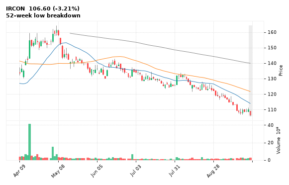

[🔔 Set alert on IRCON](https://claude.ai/artifact/Ewc5hHTPX6WkU1nVcDNQzq?s=IRCON&c=close%20below%20106.06) &nbsp;|&nbsp; [📈 Live chart (TradingView)](https://www.tradingview.com/chart/?symbol=NSE:IRCON) &nbsp;|&nbsp; [alert by email](mailto:himanshusardana05@gmail.com?subject=ALERT%20IRCON&body=Alert%20me%20when%3A%20close%20below%20106.06%0A%0AEdit%20the%20line%20above%20if%20you%20want%2C%20then%20press%20Send.%20Checked%20on%20every%20day%27s%20closing%20data%3B%20a%20triggered%20alert%20appears%20at%20the%20top%20of%20the%208%20AM%20Technical%20Analysis%20email.%0A%0AExamples%20you%20can%20write%3A%0A%20%20close%20above%201150%20%20%7C%20%20close%20below%201080%20%20%7C%20%20high%20above%201200%20%20%7C%20%20low%20below%201050%0A%20%20close%20crosses%20above%20200%20DMA%20%20%7C%20%20close%20below%2050%20DMA%20%20%7C%20%20RSI%20below%2030%20%20%7C%20%20RSI%20above%2070%0A%20%20volume%20above%202x%20%20%7C%20%20change%20above%205%25%20%20%7C%20%20change%20below%20-4%25%20%20%7C%20%2052-week%20high%20%20%7C%20%20golden%20cross%0A%20%20combine%20with%20%27and%27%2C%20e.g.%20%20close%20above%201150%20and%20volume%20above%201.5x%0A%0AReference%3A%20IRCON%20closed%20106.60%20%28high%20109.00%2C%20low%20106.06%29.%0ATo%20cancel%20later%2C%20send%20an%20email%20with%20subject%3A%20CANCEL%20ALERT%20IRCON)

---

## 28. ABLBL - BEARISH
**78.59** (-1.53%) | vol 1.5x | RSI 23 | H 80.08 / L 77.78  
52-week low breakdown

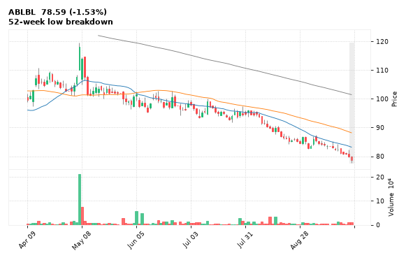

[🔔 Set alert on ABLBL](https://claude.ai/artifact/Ewc5hHTPX6WkU1nVcDNQzq?s=ABLBL&c=close%20below%2077.78) &nbsp;|&nbsp; [📈 Live chart (TradingView)](https://www.tradingview.com/chart/?symbol=NSE:ABLBL) &nbsp;|&nbsp; [alert by email](mailto:himanshusardana05@gmail.com?subject=ALERT%20ABLBL&body=Alert%20me%20when%3A%20close%20below%2077.78%0A%0AEdit%20the%20line%20above%20if%20you%20want%2C%20then%20press%20Send.%20Checked%20on%20every%20day%27s%20closing%20data%3B%20a%20triggered%20alert%20appears%20at%20the%20top%20of%20the%208%20AM%20Technical%20Analysis%20email.%0A%0AExamples%20you%20can%20write%3A%0A%20%20close%20above%201150%20%20%7C%20%20close%20below%201080%20%20%7C%20%20high%20above%201200%20%20%7C%20%20low%20below%201050%0A%20%20close%20crosses%20above%20200%20DMA%20%20%7C%20%20close%20below%2050%20DMA%20%20%7C%20%20RSI%20below%2030%20%20%7C%20%20RSI%20above%2070%0A%20%20volume%20above%202x%20%20%7C%20%20change%20above%205%25%20%20%7C%20%20change%20below%20-4%25%20%20%7C%20%2052-week%20high%20%20%7C%20%20golden%20cross%0A%20%20combine%20with%20%27and%27%2C%20e.g.%20%20close%20above%201150%20and%20volume%20above%201.5x%0A%0AReference%3A%20ABLBL%20closed%2078.59%20%28high%2080.08%2C%20low%2077.78%29.%0ATo%20cancel%20later%2C%20send%20an%20email%20with%20subject%3A%20CANCEL%20ALERT%20ABLBL)

---

## 29. ABFRL - BEARISH
**48.06** (-2.10%) | vol 1.2x | RSI 29 | H 49.00 / L 47.94  
52-week low breakdown

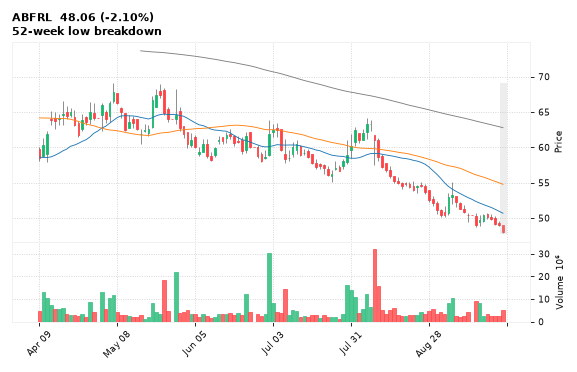

[🔔 Set alert on ABFRL](https://claude.ai/artifact/Ewc5hHTPX6WkU1nVcDNQzq?s=ABFRL&c=close%20below%2047.94) &nbsp;|&nbsp; [📈 Live chart (TradingView)](https://www.tradingview.com/chart/?symbol=NSE:ABFRL) &nbsp;|&nbsp; [alert by email](mailto:himanshusardana05@gmail.com?subject=ALERT%20ABFRL&body=Alert%20me%20when%3A%20close%20below%2047.94%0A%0AEdit%20the%20line%20above%20if%20you%20want%2C%20then%20press%20Send.%20Checked%20on%20every%20day%27s%20closing%20data%3B%20a%20triggered%20alert%20appears%20at%20the%20top%20of%20the%208%20AM%20Technical%20Analysis%20email.%0A%0AExamples%20you%20can%20write%3A%0A%20%20close%20above%201150%20%20%7C%20%20close%20below%201080%20%20%7C%20%20high%20above%201200%20%20%7C%20%20low%20below%201050%0A%20%20close%20crosses%20above%20200%20DMA%20%20%7C%20%20close%20below%2050%20DMA%20%20%7C%20%20RSI%20below%2030%20%20%7C%20%20RSI%20above%2070%0A%20%20volume%20above%202x%20%20%7C%20%20change%20above%205%25%20%20%7C%20%20change%20below%20-4%25%20%20%7C%20%2052-week%20high%20%20%7C%20%20golden%20cross%0A%20%20combine%20with%20%27and%27%2C%20e.g.%20%20close%20above%201150%20and%20volume%20above%201.5x%0A%0AReference%3A%20ABFRL%20closed%2048.06%20%28high%2049.00%2C%20low%2047.94%29.%0ATo%20cancel%20later%2C%20send%20an%20email%20with%20subject%3A%20CANCEL%20ALERT%20ABFRL)

---

## 30. RELIANCE - BEARISH
**1,219.20** (-2.31%) | vol 1.2x | RSI 35 | H 1,241.60 / L 1,219.20  
52-week low breakdown

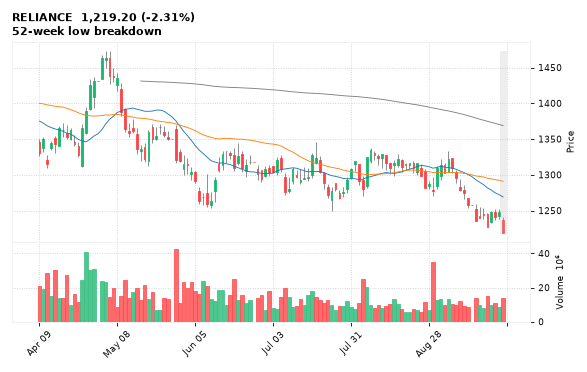

[🔔 Set alert on RELIANCE](https://claude.ai/artifact/Ewc5hHTPX6WkU1nVcDNQzq?s=RELIANCE&c=close%20below%201219.20) &nbsp;|&nbsp; [📈 Live chart (TradingView)](https://www.tradingview.com/chart/?symbol=NSE:RELIANCE) &nbsp;|&nbsp; [alert by email](mailto:himanshusardana05@gmail.com?subject=ALERT%20RELIANCE&body=Alert%20me%20when%3A%20close%20below%201219.20%0A%0AEdit%20the%20line%20above%20if%20you%20want%2C%20then%20press%20Send.%20Checked%20on%20every%20day%27s%20closing%20data%3B%20a%20triggered%20alert%20appears%20at%20the%20top%20of%20the%208%20AM%20Technical%20Analysis%20email.%0A%0AExamples%20you%20can%20write%3A%0A%20%20close%20above%201150%20%20%7C%20%20close%20below%201080%20%20%7C%20%20high%20above%201200%20%20%7C%20%20low%20below%201050%0A%20%20close%20crosses%20above%20200%20DMA%20%20%7C%20%20close%20below%2050%20DMA%20%20%7C%20%20RSI%20below%2030%20%20%7C%20%20RSI%20above%2070%0A%20%20volume%20above%202x%20%20%7C%20%20change%20above%205%25%20%20%7C%20%20change%20below%20-4%25%20%20%7C%20%2052-week%20high%20%20%7C%20%20golden%20cross%0A%20%20combine%20with%20%27and%27%2C%20e.g.%20%20close%20above%201150%20and%20volume%20above%201.5x%0A%0AReference%3A%20RELIANCE%20closed%201219.20%20%28high%201241.60%2C%20low%201219.20%29.%0ATo%20cancel%20later%2C%20send%20an%20email%20with%20subject%3A%20CANCEL%20ALERT%20RELIANCE)

---
