# Technical Analysis Alert on Nifty 500 - charts for Fri 25 Sep 2026

Scroll through all charts. Tap **Set alert** under any chart to get an email alert in the 8 AM report when your price/condition triggers on the daily close.

## 1. HYUNDAI - BULLISH
**2,115.00** (+2.64%) | vol 2.7x | RSI 45 | H 2,135.00 / L 2,052.50  
Bullish Engulfing, Close above 200 DMA, Volume spike 2.7x

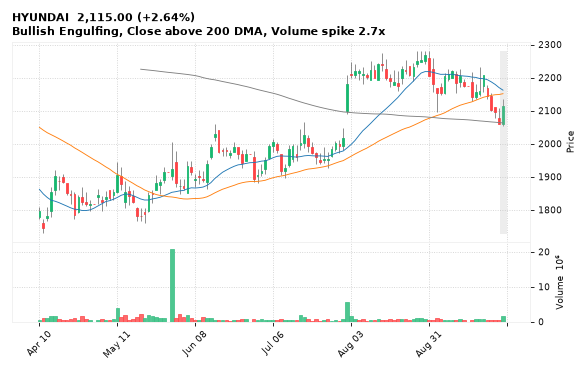

[🔔 Set alert on HYUNDAI](https://claude.ai/artifact/Ewc5hHTPX6WkU1nVcDNQzq?s=HYUNDAI&c=close%20above%202135.00) &nbsp;|&nbsp; [📈 Live chart (TradingView)](https://www.tradingview.com/chart/?symbol=NSE:HYUNDAI) &nbsp;|&nbsp; [alert by email](mailto:himanshusardana05@gmail.com?subject=ALERT%20HYUNDAI&body=Alert%20me%20when%3A%20close%20above%202135.00%0A%0AEdit%20the%20line%20above%20if%20you%20want%2C%20then%20press%20Send.%20Checked%20on%20every%20day%27s%20closing%20data%3B%20a%20triggered%20alert%20appears%20at%20the%20top%20of%20the%208%20AM%20Technical%20Analysis%20email.%0A%0AExamples%20you%20can%20write%3A%0A%20%20close%20above%201150%20%20%7C%20%20close%20below%201080%20%20%7C%20%20high%20above%201200%20%20%7C%20%20low%20below%201050%0A%20%20close%20crosses%20above%20200%20DMA%20%20%7C%20%20close%20below%2050%20DMA%20%20%7C%20%20RSI%20below%2030%20%20%7C%20%20RSI%20above%2070%0A%20%20volume%20above%202x%20%20%7C%20%20change%20above%205%25%20%20%7C%20%20change%20below%20-4%25%20%20%7C%20%2052-week%20high%20%20%7C%20%20golden%20cross%0A%20%20combine%20with%20%27and%27%2C%20e.g.%20%20close%20above%201150%20and%20volume%20above%201.5x%0A%0AReference%3A%20HYUNDAI%20closed%202115.00%20%28high%202135.00%2C%20low%202052.50%29.%0ATo%20cancel%20later%2C%20send%20an%20email%20with%20subject%3A%20CANCEL%20ALERT%20HYUNDAI)

---

## 2. ENGINERSIN - BULLISH
**315.65** (+6.40%) | vol 2.5x | RSI 73 | H 318.90 / L 295.05  
52-week high breakout, Volume spike 2.5x

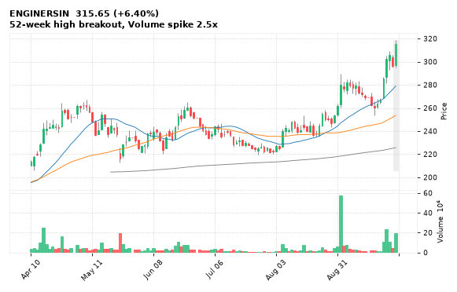

[🔔 Set alert on ENGINERSIN](https://claude.ai/artifact/Ewc5hHTPX6WkU1nVcDNQzq?s=ENGINERSIN&c=close%20above%20318.90) &nbsp;|&nbsp; [📈 Live chart (TradingView)](https://www.tradingview.com/chart/?symbol=NSE:ENGINERSIN) &nbsp;|&nbsp; [alert by email](mailto:himanshusardana05@gmail.com?subject=ALERT%20ENGINERSIN&body=Alert%20me%20when%3A%20close%20above%20318.90%0A%0AEdit%20the%20line%20above%20if%20you%20want%2C%20then%20press%20Send.%20Checked%20on%20every%20day%27s%20closing%20data%3B%20a%20triggered%20alert%20appears%20at%20the%20top%20of%20the%208%20AM%20Technical%20Analysis%20email.%0A%0AExamples%20you%20can%20write%3A%0A%20%20close%20above%201150%20%20%7C%20%20close%20below%201080%20%20%7C%20%20high%20above%201200%20%20%7C%20%20low%20below%201050%0A%20%20close%20crosses%20above%20200%20DMA%20%20%7C%20%20close%20below%2050%20DMA%20%20%7C%20%20RSI%20below%2030%20%20%7C%20%20RSI%20above%2070%0A%20%20volume%20above%202x%20%20%7C%20%20change%20above%205%25%20%20%7C%20%20change%20below%20-4%25%20%20%7C%20%2052-week%20high%20%20%7C%20%20golden%20cross%0A%20%20combine%20with%20%27and%27%2C%20e.g.%20%20close%20above%201150%20and%20volume%20above%201.5x%0A%0AReference%3A%20ENGINERSIN%20closed%20315.65%20%28high%20318.90%2C%20low%20295.05%29.%0ATo%20cancel%20later%2C%20send%20an%20email%20with%20subject%3A%20CANCEL%20ALERT%20ENGINERSIN)

---

## 3. ABFRL - BULLISH
**49.14** (+2.25%) | vol 1.1x | RSI 37 | H 49.28 / L 47.88  
Bullish Engulfing, RSI up through 30

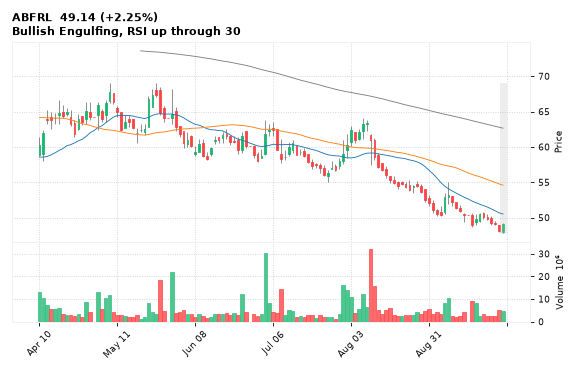

[🔔 Set alert on ABFRL](https://claude.ai/artifact/Ewc5hHTPX6WkU1nVcDNQzq?s=ABFRL&c=close%20above%2049.28) &nbsp;|&nbsp; [📈 Live chart (TradingView)](https://www.tradingview.com/chart/?symbol=NSE:ABFRL) &nbsp;|&nbsp; [alert by email](mailto:himanshusardana05@gmail.com?subject=ALERT%20ABFRL&body=Alert%20me%20when%3A%20close%20above%2049.28%0A%0AEdit%20the%20line%20above%20if%20you%20want%2C%20then%20press%20Send.%20Checked%20on%20every%20day%27s%20closing%20data%3B%20a%20triggered%20alert%20appears%20at%20the%20top%20of%20the%208%20AM%20Technical%20Analysis%20email.%0A%0AExamples%20you%20can%20write%3A%0A%20%20close%20above%201150%20%20%7C%20%20close%20below%201080%20%20%7C%20%20high%20above%201200%20%20%7C%20%20low%20below%201050%0A%20%20close%20crosses%20above%20200%20DMA%20%20%7C%20%20close%20below%2050%20DMA%20%20%7C%20%20RSI%20below%2030%20%20%7C%20%20RSI%20above%2070%0A%20%20volume%20above%202x%20%20%7C%20%20change%20above%205%25%20%20%7C%20%20change%20below%20-4%25%20%20%7C%20%2052-week%20high%20%20%7C%20%20golden%20cross%0A%20%20combine%20with%20%27and%27%2C%20e.g.%20%20close%20above%201150%20and%20volume%20above%201.5x%0A%0AReference%3A%20ABFRL%20closed%2049.14%20%28high%2049.28%2C%20low%2047.88%29.%0ATo%20cancel%20later%2C%20send%20an%20email%20with%20subject%3A%20CANCEL%20ALERT%20ABFRL)

---

## 4. M&M - BULLISH
**3,035.00** (+1.75%) | vol 1.1x | RSI 35 | H 3,045.00 / L 2,965.00  
Bullish Engulfing, RSI up through 30

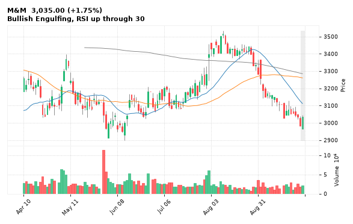

[🔔 Set alert on M&M](https://claude.ai/artifact/Ewc5hHTPX6WkU1nVcDNQzq?s=M%26M&c=close%20above%203045.00) &nbsp;|&nbsp; [📈 Live chart (TradingView)](https://www.tradingview.com/chart/?symbol=NSE:M%26M) &nbsp;|&nbsp; [alert by email](mailto:himanshusardana05@gmail.com?subject=ALERT%20M%26M&body=Alert%20me%20when%3A%20close%20above%203045.00%0A%0AEdit%20the%20line%20above%20if%20you%20want%2C%20then%20press%20Send.%20Checked%20on%20every%20day%27s%20closing%20data%3B%20a%20triggered%20alert%20appears%20at%20the%20top%20of%20the%208%20AM%20Technical%20Analysis%20email.%0A%0AExamples%20you%20can%20write%3A%0A%20%20close%20above%201150%20%20%7C%20%20close%20below%201080%20%20%7C%20%20high%20above%201200%20%20%7C%20%20low%20below%201050%0A%20%20close%20crosses%20above%20200%20DMA%20%20%7C%20%20close%20below%2050%20DMA%20%20%7C%20%20RSI%20below%2030%20%20%7C%20%20RSI%20above%2070%0A%20%20volume%20above%202x%20%20%7C%20%20change%20above%205%25%20%20%7C%20%20change%20below%20-4%25%20%20%7C%20%2052-week%20high%20%20%7C%20%20golden%20cross%0A%20%20combine%20with%20%27and%27%2C%20e.g.%20%20close%20above%201150%20and%20volume%20above%201.5x%0A%0AReference%3A%20M%26M%20closed%203035.00%20%28high%203045.00%2C%20low%202965.00%29.%0ATo%20cancel%20later%2C%20send%20an%20email%20with%20subject%3A%20CANCEL%20ALERT%20M%26M)

---

## 5. KPITTECH - BULLISH
**519.40** (+0.49%) | vol 0.7x | RSI 30 | H 519.50 / L 507.80  
Hammer, Bullish Harami, RSI up through 30

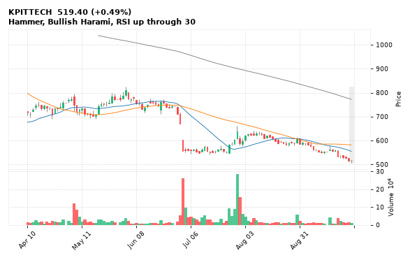

[🔔 Set alert on KPITTECH](https://claude.ai/artifact/Ewc5hHTPX6WkU1nVcDNQzq?s=KPITTECH&c=close%20above%20519.50) &nbsp;|&nbsp; [📈 Live chart (TradingView)](https://www.tradingview.com/chart/?symbol=NSE:KPITTECH) &nbsp;|&nbsp; [alert by email](mailto:himanshusardana05@gmail.com?subject=ALERT%20KPITTECH&body=Alert%20me%20when%3A%20close%20above%20519.50%0A%0AEdit%20the%20line%20above%20if%20you%20want%2C%20then%20press%20Send.%20Checked%20on%20every%20day%27s%20closing%20data%3B%20a%20triggered%20alert%20appears%20at%20the%20top%20of%20the%208%20AM%20Technical%20Analysis%20email.%0A%0AExamples%20you%20can%20write%3A%0A%20%20close%20above%201150%20%20%7C%20%20close%20below%201080%20%20%7C%20%20high%20above%201200%20%20%7C%20%20low%20below%201050%0A%20%20close%20crosses%20above%20200%20DMA%20%20%7C%20%20close%20below%2050%20DMA%20%20%7C%20%20RSI%20below%2030%20%20%7C%20%20RSI%20above%2070%0A%20%20volume%20above%202x%20%20%7C%20%20change%20above%205%25%20%20%7C%20%20change%20below%20-4%25%20%20%7C%20%2052-week%20high%20%20%7C%20%20golden%20cross%0A%20%20combine%20with%20%27and%27%2C%20e.g.%20%20close%20above%201150%20and%20volume%20above%201.5x%0A%0AReference%3A%20KPITTECH%20closed%20519.40%20%28high%20519.50%2C%20low%20507.80%29.%0ATo%20cancel%20later%2C%20send%20an%20email%20with%20subject%3A%20CANCEL%20ALERT%20KPITTECH)

---

## 6. GODREJPROP - BULLISH
**1,700.10** (+1.73%) | vol 0.4x | RSI 32 | H 1,700.10 / L 1,666.00  
Bullish Engulfing, RSI up through 30, Inside Bar

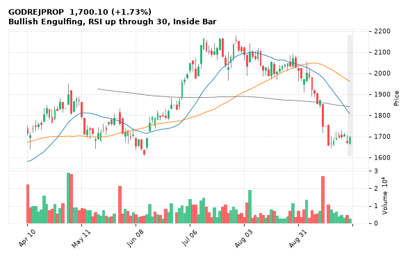

[🔔 Set alert on GODREJPROP](https://claude.ai/artifact/Ewc5hHTPX6WkU1nVcDNQzq?s=GODREJPROP&c=close%20above%201700.10) &nbsp;|&nbsp; [📈 Live chart (TradingView)](https://www.tradingview.com/chart/?symbol=NSE:GODREJPROP) &nbsp;|&nbsp; [alert by email](mailto:himanshusardana05@gmail.com?subject=ALERT%20GODREJPROP&body=Alert%20me%20when%3A%20close%20above%201700.10%0A%0AEdit%20the%20line%20above%20if%20you%20want%2C%20then%20press%20Send.%20Checked%20on%20every%20day%27s%20closing%20data%3B%20a%20triggered%20alert%20appears%20at%20the%20top%20of%20the%208%20AM%20Technical%20Analysis%20email.%0A%0AExamples%20you%20can%20write%3A%0A%20%20close%20above%201150%20%20%7C%20%20close%20below%201080%20%20%7C%20%20high%20above%201200%20%20%7C%20%20low%20below%201050%0A%20%20close%20crosses%20above%20200%20DMA%20%20%7C%20%20close%20below%2050%20DMA%20%20%7C%20%20RSI%20below%2030%20%20%7C%20%20RSI%20above%2070%0A%20%20volume%20above%202x%20%20%7C%20%20change%20above%205%25%20%20%7C%20%20change%20below%20-4%25%20%20%7C%20%2052-week%20high%20%20%7C%20%20golden%20cross%0A%20%20combine%20with%20%27and%27%2C%20e.g.%20%20close%20above%201150%20and%20volume%20above%201.5x%0A%0AReference%3A%20GODREJPROP%20closed%201700.10%20%28high%201700.10%2C%20low%201666.00%29.%0ATo%20cancel%20later%2C%20send%20an%20email%20with%20subject%3A%20CANCEL%20ALERT%20GODREJPROP)

---

## 7. MFSL - BULLISH
**1,458.00** (+3.40%) | vol 3.4x | RSI 43 | H 1,463.80 / L 1,390.00  
Bullish Marubozu, Volume spike 3.4x

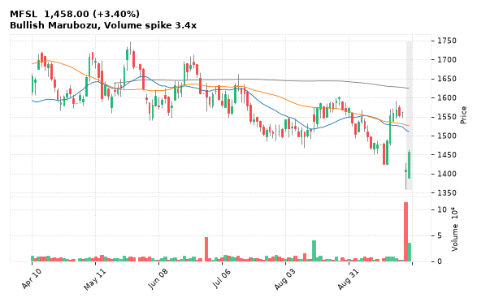

[🔔 Set alert on MFSL](https://claude.ai/artifact/Ewc5hHTPX6WkU1nVcDNQzq?s=MFSL&c=close%20above%201463.80) &nbsp;|&nbsp; [📈 Live chart (TradingView)](https://www.tradingview.com/chart/?symbol=NSE:MFSL) &nbsp;|&nbsp; [alert by email](mailto:himanshusardana05@gmail.com?subject=ALERT%20MFSL&body=Alert%20me%20when%3A%20close%20above%201463.80%0A%0AEdit%20the%20line%20above%20if%20you%20want%2C%20then%20press%20Send.%20Checked%20on%20every%20day%27s%20closing%20data%3B%20a%20triggered%20alert%20appears%20at%20the%20top%20of%20the%208%20AM%20Technical%20Analysis%20email.%0A%0AExamples%20you%20can%20write%3A%0A%20%20close%20above%201150%20%20%7C%20%20close%20below%201080%20%20%7C%20%20high%20above%201200%20%20%7C%20%20low%20below%201050%0A%20%20close%20crosses%20above%20200%20DMA%20%20%7C%20%20close%20below%2050%20DMA%20%20%7C%20%20RSI%20below%2030%20%20%7C%20%20RSI%20above%2070%0A%20%20volume%20above%202x%20%20%7C%20%20change%20above%205%25%20%20%7C%20%20change%20below%20-4%25%20%20%7C%20%2052-week%20high%20%20%7C%20%20golden%20cross%0A%20%20combine%20with%20%27and%27%2C%20e.g.%20%20close%20above%201150%20and%20volume%20above%201.5x%0A%0AReference%3A%20MFSL%20closed%201458.00%20%28high%201463.80%2C%20low%201390.00%29.%0ATo%20cancel%20later%2C%20send%20an%20email%20with%20subject%3A%20CANCEL%20ALERT%20MFSL)

---

## 8. GODREJIND - BULLISH
**1,105.30** (+0.57%) | vol 2.8x | RSI 38 | H 1,146.00 / L 1,090.40  
Inverted Hammer, Bullish Engulfing

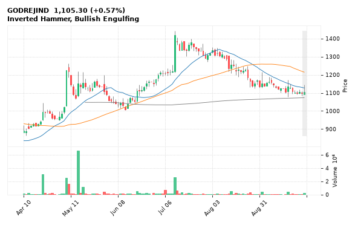

[🔔 Set alert on GODREJIND](https://claude.ai/artifact/Ewc5hHTPX6WkU1nVcDNQzq?s=GODREJIND&c=close%20above%201146.00) &nbsp;|&nbsp; [📈 Live chart (TradingView)](https://www.tradingview.com/chart/?symbol=NSE:GODREJIND) &nbsp;|&nbsp; [alert by email](mailto:himanshusardana05@gmail.com?subject=ALERT%20GODREJIND&body=Alert%20me%20when%3A%20close%20above%201146.00%0A%0AEdit%20the%20line%20above%20if%20you%20want%2C%20then%20press%20Send.%20Checked%20on%20every%20day%27s%20closing%20data%3B%20a%20triggered%20alert%20appears%20at%20the%20top%20of%20the%208%20AM%20Technical%20Analysis%20email.%0A%0AExamples%20you%20can%20write%3A%0A%20%20close%20above%201150%20%20%7C%20%20close%20below%201080%20%20%7C%20%20high%20above%201200%20%20%7C%20%20low%20below%201050%0A%20%20close%20crosses%20above%20200%20DMA%20%20%7C%20%20close%20below%2050%20DMA%20%20%7C%20%20RSI%20below%2030%20%20%7C%20%20RSI%20above%2070%0A%20%20volume%20above%202x%20%20%7C%20%20change%20above%205%25%20%20%7C%20%20change%20below%20-4%25%20%20%7C%20%2052-week%20high%20%20%7C%20%20golden%20cross%0A%20%20combine%20with%20%27and%27%2C%20e.g.%20%20close%20above%201150%20and%20volume%20above%201.5x%0A%0AReference%3A%20GODREJIND%20closed%201105.30%20%28high%201146.00%2C%20low%201090.40%29.%0ATo%20cancel%20later%2C%20send%20an%20email%20with%20subject%3A%20CANCEL%20ALERT%20GODREJIND)

---

## 9. HAVELLS - BULLISH
**1,096.50** (+0.60%) | vol 0.4x | RSI 35 | H 1,097.30 / L 1,085.20  
Bullish Engulfing, MACD bullish cross

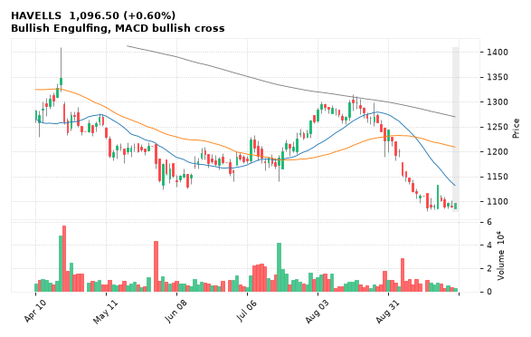

[🔔 Set alert on HAVELLS](https://claude.ai/artifact/Ewc5hHTPX6WkU1nVcDNQzq?s=HAVELLS&c=close%20above%201097.30) &nbsp;|&nbsp; [📈 Live chart (TradingView)](https://www.tradingview.com/chart/?symbol=NSE:HAVELLS) &nbsp;|&nbsp; [alert by email](mailto:himanshusardana05@gmail.com?subject=ALERT%20HAVELLS&body=Alert%20me%20when%3A%20close%20above%201097.30%0A%0AEdit%20the%20line%20above%20if%20you%20want%2C%20then%20press%20Send.%20Checked%20on%20every%20day%27s%20closing%20data%3B%20a%20triggered%20alert%20appears%20at%20the%20top%20of%20the%208%20AM%20Technical%20Analysis%20email.%0A%0AExamples%20you%20can%20write%3A%0A%20%20close%20above%201150%20%20%7C%20%20close%20below%201080%20%20%7C%20%20high%20above%201200%20%20%7C%20%20low%20below%201050%0A%20%20close%20crosses%20above%20200%20DMA%20%20%7C%20%20close%20below%2050%20DMA%20%20%7C%20%20RSI%20below%2030%20%20%7C%20%20RSI%20above%2070%0A%20%20volume%20above%202x%20%20%7C%20%20change%20above%205%25%20%20%7C%20%20change%20below%20-4%25%20%20%7C%20%2052-week%20high%20%20%7C%20%20golden%20cross%0A%20%20combine%20with%20%27and%27%2C%20e.g.%20%20close%20above%201150%20and%20volume%20above%201.5x%0A%0AReference%3A%20HAVELLS%20closed%201096.50%20%28high%201097.30%2C%20low%201085.20%29.%0ATo%20cancel%20later%2C%20send%20an%20email%20with%20subject%3A%20CANCEL%20ALERT%20HAVELLS)

---

## 10. ZENSARTECH - BULLISH
**434.90** (+2.92%) | vol 0.3x | RSI 42 | H 436.00 / L 416.15  
Bullish Engulfing, MACD bullish cross

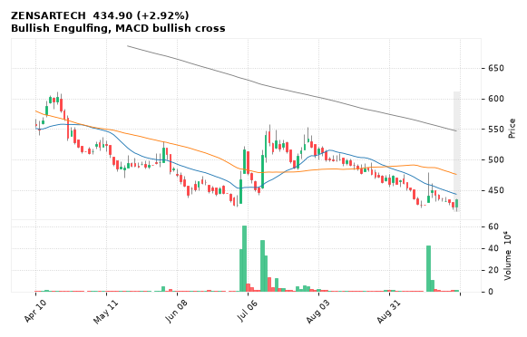

[🔔 Set alert on ZENSARTECH](https://claude.ai/artifact/Ewc5hHTPX6WkU1nVcDNQzq?s=ZENSARTECH&c=close%20above%20436.00) &nbsp;|&nbsp; [📈 Live chart (TradingView)](https://www.tradingview.com/chart/?symbol=NSE:ZENSARTECH) &nbsp;|&nbsp; [alert by email](mailto:himanshusardana05@gmail.com?subject=ALERT%20ZENSARTECH&body=Alert%20me%20when%3A%20close%20above%20436.00%0A%0AEdit%20the%20line%20above%20if%20you%20want%2C%20then%20press%20Send.%20Checked%20on%20every%20day%27s%20closing%20data%3B%20a%20triggered%20alert%20appears%20at%20the%20top%20of%20the%208%20AM%20Technical%20Analysis%20email.%0A%0AExamples%20you%20can%20write%3A%0A%20%20close%20above%201150%20%20%7C%20%20close%20below%201080%20%20%7C%20%20high%20above%201200%20%20%7C%20%20low%20below%201050%0A%20%20close%20crosses%20above%20200%20DMA%20%20%7C%20%20close%20below%2050%20DMA%20%20%7C%20%20RSI%20below%2030%20%20%7C%20%20RSI%20above%2070%0A%20%20volume%20above%202x%20%20%7C%20%20change%20above%205%25%20%20%7C%20%20change%20below%20-4%25%20%20%7C%20%2052-week%20high%20%20%7C%20%20golden%20cross%0A%20%20combine%20with%20%27and%27%2C%20e.g.%20%20close%20above%201150%20and%20volume%20above%201.5x%0A%0AReference%3A%20ZENSARTECH%20closed%20434.90%20%28high%20436.00%2C%20low%20416.15%29.%0ATo%20cancel%20later%2C%20send%20an%20email%20with%20subject%3A%20CANCEL%20ALERT%20ZENSARTECH)

---

## 11. INDGN - BULLISH
**608.95** (+2.50%) | vol 3.3x | RSI 65 | H 621.95 / L 597.35  
MACD bullish cross, Volume spike 3.3x

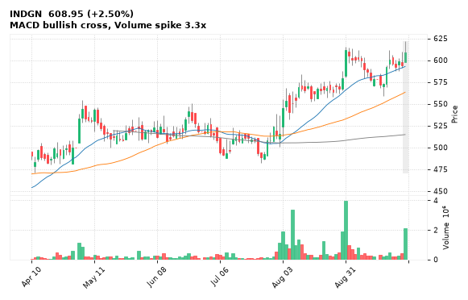

[🔔 Set alert on INDGN](https://claude.ai/artifact/Ewc5hHTPX6WkU1nVcDNQzq?s=INDGN&c=close%20above%20621.95) &nbsp;|&nbsp; [📈 Live chart (TradingView)](https://www.tradingview.com/chart/?symbol=NSE:INDGN) &nbsp;|&nbsp; [alert by email](mailto:himanshusardana05@gmail.com?subject=ALERT%20INDGN&body=Alert%20me%20when%3A%20close%20above%20621.95%0A%0AEdit%20the%20line%20above%20if%20you%20want%2C%20then%20press%20Send.%20Checked%20on%20every%20day%27s%20closing%20data%3B%20a%20triggered%20alert%20appears%20at%20the%20top%20of%20the%208%20AM%20Technical%20Analysis%20email.%0A%0AExamples%20you%20can%20write%3A%0A%20%20close%20above%201150%20%20%7C%20%20close%20below%201080%20%20%7C%20%20high%20above%201200%20%20%7C%20%20low%20below%201050%0A%20%20close%20crosses%20above%20200%20DMA%20%20%7C%20%20close%20below%2050%20DMA%20%20%7C%20%20RSI%20below%2030%20%20%7C%20%20RSI%20above%2070%0A%20%20volume%20above%202x%20%20%7C%20%20change%20above%205%25%20%20%7C%20%20change%20below%20-4%25%20%20%7C%20%2052-week%20high%20%20%7C%20%20golden%20cross%0A%20%20combine%20with%20%27and%27%2C%20e.g.%20%20close%20above%201150%20and%20volume%20above%201.5x%0A%0AReference%3A%20INDGN%20closed%20608.95%20%28high%20621.95%2C%20low%20597.35%29.%0ATo%20cancel%20later%2C%20send%20an%20email%20with%20subject%3A%20CANCEL%20ALERT%20INDGN)

---

## 12. NAUKRI - BULLISH
**1,254.80** (+2.52%) | vol 0.8x | RSI 45 | H 1,259.00 / L 1,215.40  
Bullish Engulfing

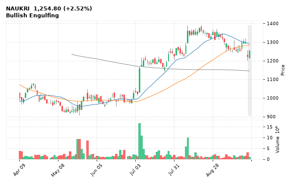

[🔔 Set alert on NAUKRI](https://claude.ai/artifact/Ewc5hHTPX6WkU1nVcDNQzq?s=NAUKRI&c=close%20above%201259.00) &nbsp;|&nbsp; [📈 Live chart (TradingView)](https://www.tradingview.com/chart/?symbol=NSE:NAUKRI) &nbsp;|&nbsp; [alert by email](mailto:himanshusardana05@gmail.com?subject=ALERT%20NAUKRI&body=Alert%20me%20when%3A%20close%20above%201259.00%0A%0AEdit%20the%20line%20above%20if%20you%20want%2C%20then%20press%20Send.%20Checked%20on%20every%20day%27s%20closing%20data%3B%20a%20triggered%20alert%20appears%20at%20the%20top%20of%20the%208%20AM%20Technical%20Analysis%20email.%0A%0AExamples%20you%20can%20write%3A%0A%20%20close%20above%201150%20%20%7C%20%20close%20below%201080%20%20%7C%20%20high%20above%201200%20%20%7C%20%20low%20below%201050%0A%20%20close%20crosses%20above%20200%20DMA%20%20%7C%20%20close%20below%2050%20DMA%20%20%7C%20%20RSI%20below%2030%20%20%7C%20%20RSI%20above%2070%0A%20%20volume%20above%202x%20%20%7C%20%20change%20above%205%25%20%20%7C%20%20change%20below%20-4%25%20%20%7C%20%2052-week%20high%20%20%7C%20%20golden%20cross%0A%20%20combine%20with%20%27and%27%2C%20e.g.%20%20close%20above%201150%20and%20volume%20above%201.5x%0A%0AReference%3A%20NAUKRI%20closed%201254.80%20%28high%201259.00%2C%20low%201215.40%29.%0ATo%20cancel%20later%2C%20send%20an%20email%20with%20subject%3A%20CANCEL%20ALERT%20NAUKRI)

---

## 13. CRAFTSMAN - BULLISH
**10,735.00** (+0.23%) | vol 0.6x | RSI 46 | H 10,799.00 / L 10,568.00  
Bullish Engulfing, NR7 (narrowest range in 7)

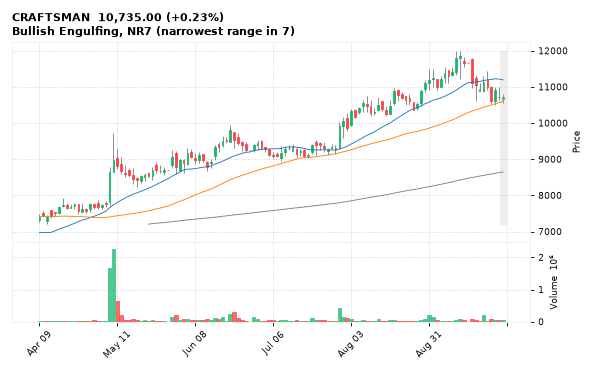

[🔔 Set alert on CRAFTSMAN](https://claude.ai/artifact/Ewc5hHTPX6WkU1nVcDNQzq?s=CRAFTSMAN&c=close%20above%2010799.00) &nbsp;|&nbsp; [📈 Live chart (TradingView)](https://www.tradingview.com/chart/?symbol=NSE:CRAFTSMAN) &nbsp;|&nbsp; [alert by email](mailto:himanshusardana05@gmail.com?subject=ALERT%20CRAFTSMAN&body=Alert%20me%20when%3A%20close%20above%2010799.00%0A%0AEdit%20the%20line%20above%20if%20you%20want%2C%20then%20press%20Send.%20Checked%20on%20every%20day%27s%20closing%20data%3B%20a%20triggered%20alert%20appears%20at%20the%20top%20of%20the%208%20AM%20Technical%20Analysis%20email.%0A%0AExamples%20you%20can%20write%3A%0A%20%20close%20above%201150%20%20%7C%20%20close%20below%201080%20%20%7C%20%20high%20above%201200%20%20%7C%20%20low%20below%201050%0A%20%20close%20crosses%20above%20200%20DMA%20%20%7C%20%20close%20below%2050%20DMA%20%20%7C%20%20RSI%20below%2030%20%20%7C%20%20RSI%20above%2070%0A%20%20volume%20above%202x%20%20%7C%20%20change%20above%205%25%20%20%7C%20%20change%20below%20-4%25%20%20%7C%20%2052-week%20high%20%20%7C%20%20golden%20cross%0A%20%20combine%20with%20%27and%27%2C%20e.g.%20%20close%20above%201150%20and%20volume%20above%201.5x%0A%0AReference%3A%20CRAFTSMAN%20closed%2010735.00%20%28high%2010799.00%2C%20low%2010568.00%29.%0ATo%20cancel%20later%2C%20send%20an%20email%20with%20subject%3A%20CANCEL%20ALERT%20CRAFTSMAN)

---

## 14. HCLTECH - BULLISH
**1,258.00** (+1.16%) | vol 0.6x | RSI 47 | H 1,266.50 / L 1,234.60  
Bullish Engulfing

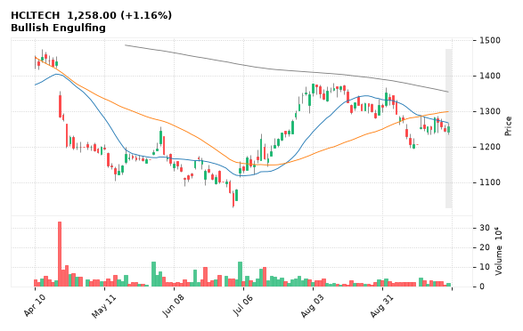

[🔔 Set alert on HCLTECH](https://claude.ai/artifact/Ewc5hHTPX6WkU1nVcDNQzq?s=HCLTECH&c=close%20above%201266.50) &nbsp;|&nbsp; [📈 Live chart (TradingView)](https://www.tradingview.com/chart/?symbol=NSE:HCLTECH) &nbsp;|&nbsp; [alert by email](mailto:himanshusardana05@gmail.com?subject=ALERT%20HCLTECH&body=Alert%20me%20when%3A%20close%20above%201266.50%0A%0AEdit%20the%20line%20above%20if%20you%20want%2C%20then%20press%20Send.%20Checked%20on%20every%20day%27s%20closing%20data%3B%20a%20triggered%20alert%20appears%20at%20the%20top%20of%20the%208%20AM%20Technical%20Analysis%20email.%0A%0AExamples%20you%20can%20write%3A%0A%20%20close%20above%201150%20%20%7C%20%20close%20below%201080%20%20%7C%20%20high%20above%201200%20%20%7C%20%20low%20below%201050%0A%20%20close%20crosses%20above%20200%20DMA%20%20%7C%20%20close%20below%2050%20DMA%20%20%7C%20%20RSI%20below%2030%20%20%7C%20%20RSI%20above%2070%0A%20%20volume%20above%202x%20%20%7C%20%20change%20above%205%25%20%20%7C%20%20change%20below%20-4%25%20%20%7C%20%2052-week%20high%20%20%7C%20%20golden%20cross%0A%20%20combine%20with%20%27and%27%2C%20e.g.%20%20close%20above%201150%20and%20volume%20above%201.5x%0A%0AReference%3A%20HCLTECH%20closed%201258.00%20%28high%201266.50%2C%20low%201234.60%29.%0ATo%20cancel%20later%2C%20send%20an%20email%20with%20subject%3A%20CANCEL%20ALERT%20HCLTECH)

---

## 15. HINDUNILVR - BULLISH
**1,942.90** (+0.49%) | vol 0.6x | RSI 42 | H 1,942.90 / L 1,915.00  
Bullish Engulfing

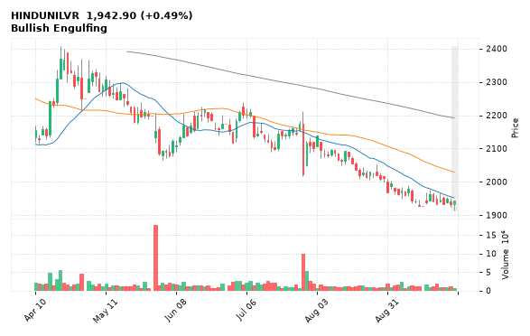

[🔔 Set alert on HINDUNILVR](https://claude.ai/artifact/Ewc5hHTPX6WkU1nVcDNQzq?s=HINDUNILVR&c=close%20above%201942.90) &nbsp;|&nbsp; [📈 Live chart (TradingView)](https://www.tradingview.com/chart/?symbol=NSE:HINDUNILVR) &nbsp;|&nbsp; [alert by email](mailto:himanshusardana05@gmail.com?subject=ALERT%20HINDUNILVR&body=Alert%20me%20when%3A%20close%20above%201942.90%0A%0AEdit%20the%20line%20above%20if%20you%20want%2C%20then%20press%20Send.%20Checked%20on%20every%20day%27s%20closing%20data%3B%20a%20triggered%20alert%20appears%20at%20the%20top%20of%20the%208%20AM%20Technical%20Analysis%20email.%0A%0AExamples%20you%20can%20write%3A%0A%20%20close%20above%201150%20%20%7C%20%20close%20below%201080%20%20%7C%20%20high%20above%201200%20%20%7C%20%20low%20below%201050%0A%20%20close%20crosses%20above%20200%20DMA%20%20%7C%20%20close%20below%2050%20DMA%20%20%7C%20%20RSI%20below%2030%20%20%7C%20%20RSI%20above%2070%0A%20%20volume%20above%202x%20%20%7C%20%20change%20above%205%25%20%20%7C%20%20change%20below%20-4%25%20%20%7C%20%2052-week%20high%20%20%7C%20%20golden%20cross%0A%20%20combine%20with%20%27and%27%2C%20e.g.%20%20close%20above%201150%20and%20volume%20above%201.5x%0A%0AReference%3A%20HINDUNILVR%20closed%201942.90%20%28high%201942.90%2C%20low%201915.00%29.%0ATo%20cancel%20later%2C%20send%20an%20email%20with%20subject%3A%20CANCEL%20ALERT%20HINDUNILVR)

---

## 16. NTPCGREEN - BEARISH
**93.47** (-2.05%) | vol 0.8x | RSI 61 | H 95.43 / L 92.50  
Bearish Engulfing, Close below 200 DMA, RSI down through 70

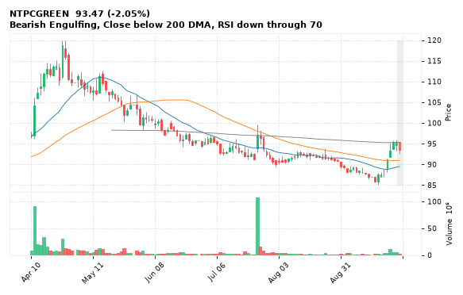

[🔔 Set alert on NTPCGREEN](https://claude.ai/artifact/Ewc5hHTPX6WkU1nVcDNQzq?s=NTPCGREEN&c=close%20below%2092.50) &nbsp;|&nbsp; [📈 Live chart (TradingView)](https://www.tradingview.com/chart/?symbol=NSE:NTPCGREEN) &nbsp;|&nbsp; [alert by email](mailto:himanshusardana05@gmail.com?subject=ALERT%20NTPCGREEN&body=Alert%20me%20when%3A%20close%20below%2092.50%0A%0AEdit%20the%20line%20above%20if%20you%20want%2C%20then%20press%20Send.%20Checked%20on%20every%20day%27s%20closing%20data%3B%20a%20triggered%20alert%20appears%20at%20the%20top%20of%20the%208%20AM%20Technical%20Analysis%20email.%0A%0AExamples%20you%20can%20write%3A%0A%20%20close%20above%201150%20%20%7C%20%20close%20below%201080%20%20%7C%20%20high%20above%201200%20%20%7C%20%20low%20below%201050%0A%20%20close%20crosses%20above%20200%20DMA%20%20%7C%20%20close%20below%2050%20DMA%20%20%7C%20%20RSI%20below%2030%20%20%7C%20%20RSI%20above%2070%0A%20%20volume%20above%202x%20%20%7C%20%20change%20above%205%25%20%20%7C%20%20change%20below%20-4%25%20%20%7C%20%2052-week%20high%20%20%7C%20%20golden%20cross%0A%20%20combine%20with%20%27and%27%2C%20e.g.%20%20close%20above%201150%20and%20volume%20above%201.5x%0A%0AReference%3A%20NTPCGREEN%20closed%2093.47%20%28high%2095.43%2C%20low%2092.50%29.%0ATo%20cancel%20later%2C%20send%20an%20email%20with%20subject%3A%20CANCEL%20ALERT%20NTPCGREEN)

---

## 17. POLICYBZR - BEARISH
**1,166.00** (-3.41%) | vol 16.0x | RSI 24 | H 1,261.70 / L 1,115.00  
Doji (indecision), 52-week low breakdown, Volume spike 16.0x

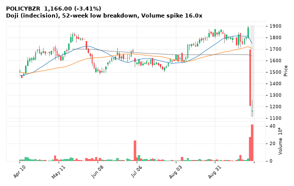

[🔔 Set alert on POLICYBZR](https://claude.ai/artifact/Ewc5hHTPX6WkU1nVcDNQzq?s=POLICYBZR&c=close%20below%201115.00) &nbsp;|&nbsp; [📈 Live chart (TradingView)](https://www.tradingview.com/chart/?symbol=NSE:POLICYBZR) &nbsp;|&nbsp; [alert by email](mailto:himanshusardana05@gmail.com?subject=ALERT%20POLICYBZR&body=Alert%20me%20when%3A%20close%20below%201115.00%0A%0AEdit%20the%20line%20above%20if%20you%20want%2C%20then%20press%20Send.%20Checked%20on%20every%20day%27s%20closing%20data%3B%20a%20triggered%20alert%20appears%20at%20the%20top%20of%20the%208%20AM%20Technical%20Analysis%20email.%0A%0AExamples%20you%20can%20write%3A%0A%20%20close%20above%201150%20%20%7C%20%20close%20below%201080%20%20%7C%20%20high%20above%201200%20%20%7C%20%20low%20below%201050%0A%20%20close%20crosses%20above%20200%20DMA%20%20%7C%20%20close%20below%2050%20DMA%20%20%7C%20%20RSI%20below%2030%20%20%7C%20%20RSI%20above%2070%0A%20%20volume%20above%202x%20%20%7C%20%20change%20above%205%25%20%20%7C%20%20change%20below%20-4%25%20%20%7C%20%2052-week%20high%20%20%7C%20%20golden%20cross%0A%20%20combine%20with%20%27and%27%2C%20e.g.%20%20close%20above%201150%20and%20volume%20above%201.5x%0A%0AReference%3A%20POLICYBZR%20closed%201166.00%20%28high%201261.70%2C%20low%201115.00%29.%0ATo%20cancel%20later%2C%20send%20an%20email%20with%20subject%3A%20CANCEL%20ALERT%20POLICYBZR)

---

## 18. MAXHEALTH - BEARISH
**1,014.00** (-3.06%) | vol 1.1x | RSI 44 | H 1,052.00 / L 1,008.00  
Bearish Engulfing, Close below 200 DMA

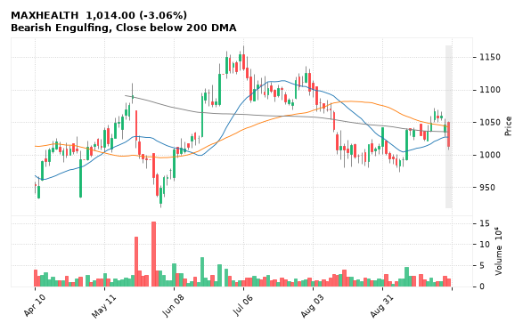

[🔔 Set alert on MAXHEALTH](https://claude.ai/artifact/Ewc5hHTPX6WkU1nVcDNQzq?s=MAXHEALTH&c=close%20below%201008.00) &nbsp;|&nbsp; [📈 Live chart (TradingView)](https://www.tradingview.com/chart/?symbol=NSE:MAXHEALTH) &nbsp;|&nbsp; [alert by email](mailto:himanshusardana05@gmail.com?subject=ALERT%20MAXHEALTH&body=Alert%20me%20when%3A%20close%20below%201008.00%0A%0AEdit%20the%20line%20above%20if%20you%20want%2C%20then%20press%20Send.%20Checked%20on%20every%20day%27s%20closing%20data%3B%20a%20triggered%20alert%20appears%20at%20the%20top%20of%20the%208%20AM%20Technical%20Analysis%20email.%0A%0AExamples%20you%20can%20write%3A%0A%20%20close%20above%201150%20%20%7C%20%20close%20below%201080%20%20%7C%20%20high%20above%201200%20%20%7C%20%20low%20below%201050%0A%20%20close%20crosses%20above%20200%20DMA%20%20%7C%20%20close%20below%2050%20DMA%20%20%7C%20%20RSI%20below%2030%20%20%7C%20%20RSI%20above%2070%0A%20%20volume%20above%202x%20%20%7C%20%20change%20above%205%25%20%20%7C%20%20change%20below%20-4%25%20%20%7C%20%2052-week%20high%20%20%7C%20%20golden%20cross%0A%20%20combine%20with%20%27and%27%2C%20e.g.%20%20close%20above%201150%20and%20volume%20above%201.5x%0A%0AReference%3A%20MAXHEALTH%20closed%201014.00%20%28high%201052.00%2C%20low%201008.00%29.%0ATo%20cancel%20later%2C%20send%20an%20email%20with%20subject%3A%20CANCEL%20ALERT%20MAXHEALTH)

---

## 19. HOMEFIRST - BEARISH
**1,123.10** (-2.97%) | vol 2.7x | RSI 36 | H 1,133.50 / L 1,097.30  
Hammer, Close below 200 DMA, Volume spike 2.7x

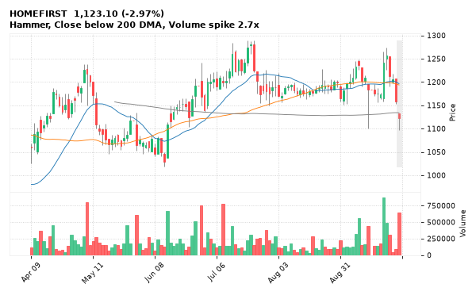

[🔔 Set alert on HOMEFIRST](https://claude.ai/artifact/Ewc5hHTPX6WkU1nVcDNQzq?s=HOMEFIRST&c=close%20below%201097.30) &nbsp;|&nbsp; [📈 Live chart (TradingView)](https://www.tradingview.com/chart/?symbol=NSE:HOMEFIRST) &nbsp;|&nbsp; [alert by email](mailto:himanshusardana05@gmail.com?subject=ALERT%20HOMEFIRST&body=Alert%20me%20when%3A%20close%20below%201097.30%0A%0AEdit%20the%20line%20above%20if%20you%20want%2C%20then%20press%20Send.%20Checked%20on%20every%20day%27s%20closing%20data%3B%20a%20triggered%20alert%20appears%20at%20the%20top%20of%20the%208%20AM%20Technical%20Analysis%20email.%0A%0AExamples%20you%20can%20write%3A%0A%20%20close%20above%201150%20%20%7C%20%20close%20below%201080%20%20%7C%20%20high%20above%201200%20%20%7C%20%20low%20below%201050%0A%20%20close%20crosses%20above%20200%20DMA%20%20%7C%20%20close%20below%2050%20DMA%20%20%7C%20%20RSI%20below%2030%20%20%7C%20%20RSI%20above%2070%0A%20%20volume%20above%202x%20%20%7C%20%20change%20above%205%25%20%20%7C%20%20change%20below%20-4%25%20%20%7C%20%2052-week%20high%20%20%7C%20%20golden%20cross%0A%20%20combine%20with%20%27and%27%2C%20e.g.%20%20close%20above%201150%20and%20volume%20above%201.5x%0A%0AReference%3A%20HOMEFIRST%20closed%201123.10%20%28high%201133.50%2C%20low%201097.30%29.%0ATo%20cancel%20later%2C%20send%20an%20email%20with%20subject%3A%20CANCEL%20ALERT%20HOMEFIRST)

---

## 20. TMPV - BEARISH
**290.45** (-1.54%) | vol 2.7x | RSI 31 | H 297.70 / L 288.00  
52-week low breakdown, MACD bearish cross

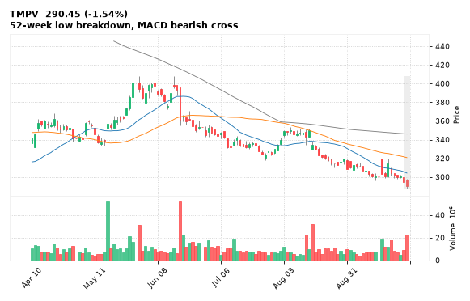

[🔔 Set alert on TMPV](https://claude.ai/artifact/Ewc5hHTPX6WkU1nVcDNQzq?s=TMPV&c=close%20below%20288.00) &nbsp;|&nbsp; [📈 Live chart (TradingView)](https://www.tradingview.com/chart/?symbol=NSE:TMPV) &nbsp;|&nbsp; [alert by email](mailto:himanshusardana05@gmail.com?subject=ALERT%20TMPV&body=Alert%20me%20when%3A%20close%20below%20288.00%0A%0AEdit%20the%20line%20above%20if%20you%20want%2C%20then%20press%20Send.%20Checked%20on%20every%20day%27s%20closing%20data%3B%20a%20triggered%20alert%20appears%20at%20the%20top%20of%20the%208%20AM%20Technical%20Analysis%20email.%0A%0AExamples%20you%20can%20write%3A%0A%20%20close%20above%201150%20%20%7C%20%20close%20below%201080%20%20%7C%20%20high%20above%201200%20%20%7C%20%20low%20below%201050%0A%20%20close%20crosses%20above%20200%20DMA%20%20%7C%20%20close%20below%2050%20DMA%20%20%7C%20%20RSI%20below%2030%20%20%7C%20%20RSI%20above%2070%0A%20%20volume%20above%202x%20%20%7C%20%20change%20above%205%25%20%20%7C%20%20change%20below%20-4%25%20%20%7C%20%2052-week%20high%20%20%7C%20%20golden%20cross%0A%20%20combine%20with%20%27and%27%2C%20e.g.%20%20close%20above%201150%20and%20volume%20above%201.5x%0A%0AReference%3A%20TMPV%20closed%20290.45%20%28high%20297.70%2C%20low%20288.00%29.%0ATo%20cancel%20later%2C%20send%20an%20email%20with%20subject%3A%20CANCEL%20ALERT%20TMPV)

---

## 21. OLECTRA - BEARISH
**1,207.20** (-2.96%) | vol 1.0x | RSI 43 | H 1,247.00 / L 1,204.30  
Bearish Marubozu, Close below 200 DMA

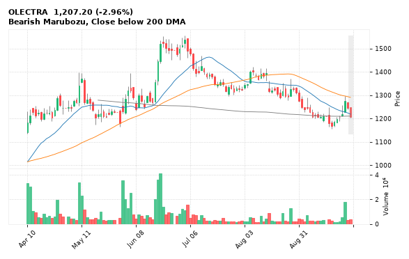

[🔔 Set alert on OLECTRA](https://claude.ai/artifact/Ewc5hHTPX6WkU1nVcDNQzq?s=OLECTRA&c=close%20below%201204.30) &nbsp;|&nbsp; [📈 Live chart (TradingView)](https://www.tradingview.com/chart/?symbol=NSE:OLECTRA) &nbsp;|&nbsp; [alert by email](mailto:himanshusardana05@gmail.com?subject=ALERT%20OLECTRA&body=Alert%20me%20when%3A%20close%20below%201204.30%0A%0AEdit%20the%20line%20above%20if%20you%20want%2C%20then%20press%20Send.%20Checked%20on%20every%20day%27s%20closing%20data%3B%20a%20triggered%20alert%20appears%20at%20the%20top%20of%20the%208%20AM%20Technical%20Analysis%20email.%0A%0AExamples%20you%20can%20write%3A%0A%20%20close%20above%201150%20%20%7C%20%20close%20below%201080%20%20%7C%20%20high%20above%201200%20%20%7C%20%20low%20below%201050%0A%20%20close%20crosses%20above%20200%20DMA%20%20%7C%20%20close%20below%2050%20DMA%20%20%7C%20%20RSI%20below%2030%20%20%7C%20%20RSI%20above%2070%0A%20%20volume%20above%202x%20%20%7C%20%20change%20above%205%25%20%20%7C%20%20change%20below%20-4%25%20%20%7C%20%2052-week%20high%20%20%7C%20%20golden%20cross%0A%20%20combine%20with%20%27and%27%2C%20e.g.%20%20close%20above%201150%20and%20volume%20above%201.5x%0A%0AReference%3A%20OLECTRA%20closed%201207.20%20%28high%201247.00%2C%20low%201204.30%29.%0ATo%20cancel%20later%2C%20send%20an%20email%20with%20subject%3A%20CANCEL%20ALERT%20OLECTRA)

---

## 22. LATENTVIEW - BEARISH
**243.75** (-0.67%) | vol 0.7x | RSI 27 | H 245.75 / L 240.50  
Hammer, 52-week low breakdown, MACD bearish cross

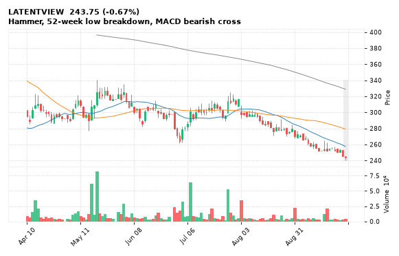

[🔔 Set alert on LATENTVIEW](https://claude.ai/artifact/Ewc5hHTPX6WkU1nVcDNQzq?s=LATENTVIEW&c=close%20below%20240.50) &nbsp;|&nbsp; [📈 Live chart (TradingView)](https://www.tradingview.com/chart/?symbol=NSE:LATENTVIEW) &nbsp;|&nbsp; [alert by email](mailto:himanshusardana05@gmail.com?subject=ALERT%20LATENTVIEW&body=Alert%20me%20when%3A%20close%20below%20240.50%0A%0AEdit%20the%20line%20above%20if%20you%20want%2C%20then%20press%20Send.%20Checked%20on%20every%20day%27s%20closing%20data%3B%20a%20triggered%20alert%20appears%20at%20the%20top%20of%20the%208%20AM%20Technical%20Analysis%20email.%0A%0AExamples%20you%20can%20write%3A%0A%20%20close%20above%201150%20%20%7C%20%20close%20below%201080%20%20%7C%20%20high%20above%201200%20%20%7C%20%20low%20below%201050%0A%20%20close%20crosses%20above%20200%20DMA%20%20%7C%20%20close%20below%2050%20DMA%20%20%7C%20%20RSI%20below%2030%20%20%7C%20%20RSI%20above%2070%0A%20%20volume%20above%202x%20%20%7C%20%20change%20above%205%25%20%20%7C%20%20change%20below%20-4%25%20%20%7C%20%2052-week%20high%20%20%7C%20%20golden%20cross%0A%20%20combine%20with%20%27and%27%2C%20e.g.%20%20close%20above%201150%20and%20volume%20above%201.5x%0A%0AReference%3A%20LATENTVIEW%20closed%20243.75%20%28high%20245.75%2C%20low%20240.50%29.%0ATo%20cancel%20later%2C%20send%20an%20email%20with%20subject%3A%20CANCEL%20ALERT%20LATENTVIEW)

---

## 23. FORTIS - BEARISH
**837.85** (-4.50%) | vol 2.4x | RSI 28 | H 880.55 / L 832.00  
MACD bearish cross, Volume spike 2.4x

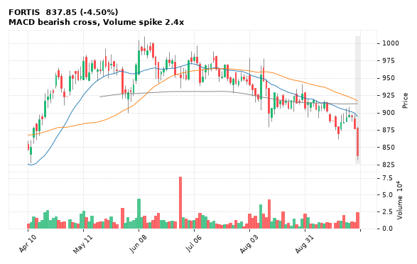

[🔔 Set alert on FORTIS](https://claude.ai/artifact/Ewc5hHTPX6WkU1nVcDNQzq?s=FORTIS&c=close%20below%20832.00) &nbsp;|&nbsp; [📈 Live chart (TradingView)](https://www.tradingview.com/chart/?symbol=NSE:FORTIS) &nbsp;|&nbsp; [alert by email](mailto:himanshusardana05@gmail.com?subject=ALERT%20FORTIS&body=Alert%20me%20when%3A%20close%20below%20832.00%0A%0AEdit%20the%20line%20above%20if%20you%20want%2C%20then%20press%20Send.%20Checked%20on%20every%20day%27s%20closing%20data%3B%20a%20triggered%20alert%20appears%20at%20the%20top%20of%20the%208%20AM%20Technical%20Analysis%20email.%0A%0AExamples%20you%20can%20write%3A%0A%20%20close%20above%201150%20%20%7C%20%20close%20below%201080%20%20%7C%20%20high%20above%201200%20%20%7C%20%20low%20below%201050%0A%20%20close%20crosses%20above%20200%20DMA%20%20%7C%20%20close%20below%2050%20DMA%20%20%7C%20%20RSI%20below%2030%20%20%7C%20%20RSI%20above%2070%0A%20%20volume%20above%202x%20%20%7C%20%20change%20above%205%25%20%20%7C%20%20change%20below%20-4%25%20%20%7C%20%2052-week%20high%20%20%7C%20%20golden%20cross%0A%20%20combine%20with%20%27and%27%2C%20e.g.%20%20close%20above%201150%20and%20volume%20above%201.5x%0A%0AReference%3A%20FORTIS%20closed%20837.85%20%28high%20880.55%2C%20low%20832.00%29.%0ATo%20cancel%20later%2C%20send%20an%20email%20with%20subject%3A%20CANCEL%20ALERT%20FORTIS)

---

## 24. AADHARHFC - BEARISH
**444.50** (-0.49%) | vol 1.4x | RSI 35 | H 450.60 / L 441.30  
Death Cross (50/200 DMA), NR7 (narrowest range in 7)

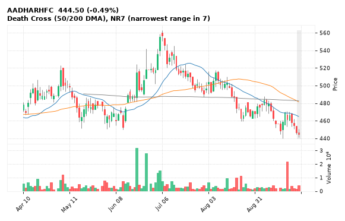

[🔔 Set alert on AADHARHFC](https://claude.ai/artifact/Ewc5hHTPX6WkU1nVcDNQzq?s=AADHARHFC&c=close%20below%20441.30) &nbsp;|&nbsp; [📈 Live chart (TradingView)](https://www.tradingview.com/chart/?symbol=NSE:AADHARHFC) &nbsp;|&nbsp; [alert by email](mailto:himanshusardana05@gmail.com?subject=ALERT%20AADHARHFC&body=Alert%20me%20when%3A%20close%20below%20441.30%0A%0AEdit%20the%20line%20above%20if%20you%20want%2C%20then%20press%20Send.%20Checked%20on%20every%20day%27s%20closing%20data%3B%20a%20triggered%20alert%20appears%20at%20the%20top%20of%20the%208%20AM%20Technical%20Analysis%20email.%0A%0AExamples%20you%20can%20write%3A%0A%20%20close%20above%201150%20%20%7C%20%20close%20below%201080%20%20%7C%20%20high%20above%201200%20%20%7C%20%20low%20below%201050%0A%20%20close%20crosses%20above%20200%20DMA%20%20%7C%20%20close%20below%2050%20DMA%20%20%7C%20%20RSI%20below%2030%20%20%7C%20%20RSI%20above%2070%0A%20%20volume%20above%202x%20%20%7C%20%20change%20above%205%25%20%20%7C%20%20change%20below%20-4%25%20%20%7C%20%2052-week%20high%20%20%7C%20%20golden%20cross%0A%20%20combine%20with%20%27and%27%2C%20e.g.%20%20close%20above%201150%20and%20volume%20above%201.5x%0A%0AReference%3A%20AADHARHFC%20closed%20444.50%20%28high%20450.60%2C%20low%20441.30%29.%0ATo%20cancel%20later%2C%20send%20an%20email%20with%20subject%3A%20CANCEL%20ALERT%20AADHARHFC)

---

## 25. IRCON - BEARISH
**105.95** (-0.61%) | vol 1.4x | RSI 24 | H 107.21 / L 104.76  
52-week low breakdown

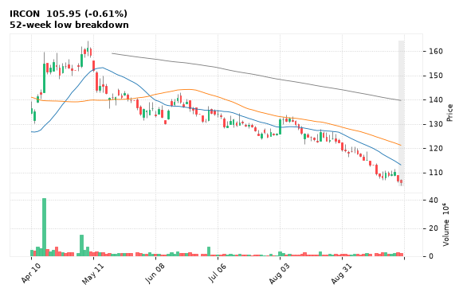

[🔔 Set alert on IRCON](https://claude.ai/artifact/Ewc5hHTPX6WkU1nVcDNQzq?s=IRCON&c=close%20below%20104.76) &nbsp;|&nbsp; [📈 Live chart (TradingView)](https://www.tradingview.com/chart/?symbol=NSE:IRCON) &nbsp;|&nbsp; [alert by email](mailto:himanshusardana05@gmail.com?subject=ALERT%20IRCON&body=Alert%20me%20when%3A%20close%20below%20104.76%0A%0AEdit%20the%20line%20above%20if%20you%20want%2C%20then%20press%20Send.%20Checked%20on%20every%20day%27s%20closing%20data%3B%20a%20triggered%20alert%20appears%20at%20the%20top%20of%20the%208%20AM%20Technical%20Analysis%20email.%0A%0AExamples%20you%20can%20write%3A%0A%20%20close%20above%201150%20%20%7C%20%20close%20below%201080%20%20%7C%20%20high%20above%201200%20%20%7C%20%20low%20below%201050%0A%20%20close%20crosses%20above%20200%20DMA%20%20%7C%20%20close%20below%2050%20DMA%20%20%7C%20%20RSI%20below%2030%20%20%7C%20%20RSI%20above%2070%0A%20%20volume%20above%202x%20%20%7C%20%20change%20above%205%25%20%20%7C%20%20change%20below%20-4%25%20%20%7C%20%2052-week%20high%20%20%7C%20%20golden%20cross%0A%20%20combine%20with%20%27and%27%2C%20e.g.%20%20close%20above%201150%20and%20volume%20above%201.5x%0A%0AReference%3A%20IRCON%20closed%20105.95%20%28high%20107.21%2C%20low%20104.76%29.%0ATo%20cancel%20later%2C%20send%20an%20email%20with%20subject%3A%20CANCEL%20ALERT%20IRCON)

---

## 26. INDIACEM - BEARISH
**323.10** (-2.12%) | vol 1.4x | RSI 26 | H 334.60 / L 319.20  
52-week low breakdown

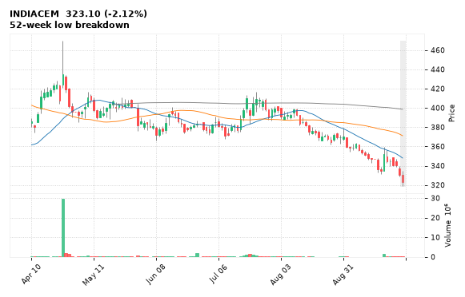

[🔔 Set alert on INDIACEM](https://claude.ai/artifact/Ewc5hHTPX6WkU1nVcDNQzq?s=INDIACEM&c=close%20below%20319.20) &nbsp;|&nbsp; [📈 Live chart (TradingView)](https://www.tradingview.com/chart/?symbol=NSE:INDIACEM) &nbsp;|&nbsp; [alert by email](mailto:himanshusardana05@gmail.com?subject=ALERT%20INDIACEM&body=Alert%20me%20when%3A%20close%20below%20319.20%0A%0AEdit%20the%20line%20above%20if%20you%20want%2C%20then%20press%20Send.%20Checked%20on%20every%20day%27s%20closing%20data%3B%20a%20triggered%20alert%20appears%20at%20the%20top%20of%20the%208%20AM%20Technical%20Analysis%20email.%0A%0AExamples%20you%20can%20write%3A%0A%20%20close%20above%201150%20%20%7C%20%20close%20below%201080%20%20%7C%20%20high%20above%201200%20%20%7C%20%20low%20below%201050%0A%20%20close%20crosses%20above%20200%20DMA%20%20%7C%20%20close%20below%2050%20DMA%20%20%7C%20%20RSI%20below%2030%20%20%7C%20%20RSI%20above%2070%0A%20%20volume%20above%202x%20%20%7C%20%20change%20above%205%25%20%20%7C%20%20change%20below%20-4%25%20%20%7C%20%2052-week%20high%20%20%7C%20%20golden%20cross%0A%20%20combine%20with%20%27and%27%2C%20e.g.%20%20close%20above%201150%20and%20volume%20above%201.5x%0A%0AReference%3A%20INDIACEM%20closed%20323.10%20%28high%20334.60%2C%20low%20319.20%29.%0ATo%20cancel%20later%2C%20send%20an%20email%20with%20subject%3A%20CANCEL%20ALERT%20INDIACEM)

---

## 27. MCX - BEARISH
**3,324.90** (-3.00%) | vol 1.3x | RSI 56 | H 3,481.40 / L 3,310.00  
Bearish Engulfing

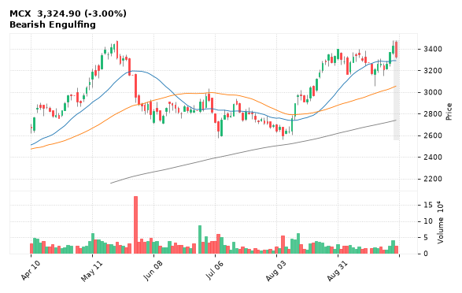

[🔔 Set alert on MCX](https://claude.ai/artifact/Ewc5hHTPX6WkU1nVcDNQzq?s=MCX&c=close%20below%203310.00) &nbsp;|&nbsp; [📈 Live chart (TradingView)](https://www.tradingview.com/chart/?symbol=NSE:MCX) &nbsp;|&nbsp; [alert by email](mailto:himanshusardana05@gmail.com?subject=ALERT%20MCX&body=Alert%20me%20when%3A%20close%20below%203310.00%0A%0AEdit%20the%20line%20above%20if%20you%20want%2C%20then%20press%20Send.%20Checked%20on%20every%20day%27s%20closing%20data%3B%20a%20triggered%20alert%20appears%20at%20the%20top%20of%20the%208%20AM%20Technical%20Analysis%20email.%0A%0AExamples%20you%20can%20write%3A%0A%20%20close%20above%201150%20%20%7C%20%20close%20below%201080%20%20%7C%20%20high%20above%201200%20%20%7C%20%20low%20below%201050%0A%20%20close%20crosses%20above%20200%20DMA%20%20%7C%20%20close%20below%2050%20DMA%20%20%7C%20%20RSI%20below%2030%20%20%7C%20%20RSI%20above%2070%0A%20%20volume%20above%202x%20%20%7C%20%20change%20above%205%25%20%20%7C%20%20change%20below%20-4%25%20%20%7C%20%2052-week%20high%20%20%7C%20%20golden%20cross%0A%20%20combine%20with%20%27and%27%2C%20e.g.%20%20close%20above%201150%20and%20volume%20above%201.5x%0A%0AReference%3A%20MCX%20closed%203324.90%20%28high%203481.40%2C%20low%203310.00%29.%0ATo%20cancel%20later%2C%20send%20an%20email%20with%20subject%3A%20CANCEL%20ALERT%20MCX)

---

## 28. MSUMI - BEARISH
**34.29** (-1.18%) | vol 1.1x | RSI 28 | H 34.74 / L 34.22  
52-week low breakdown, NR7 (narrowest range in 7)

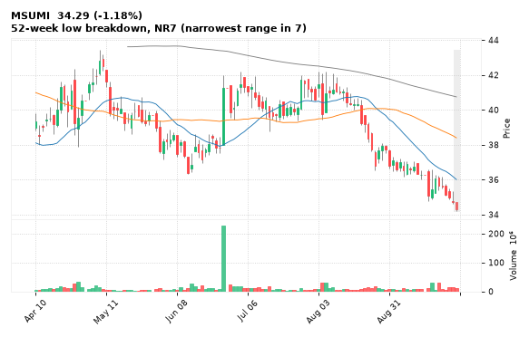

[🔔 Set alert on MSUMI](https://claude.ai/artifact/Ewc5hHTPX6WkU1nVcDNQzq?s=MSUMI&c=close%20below%2034.22) &nbsp;|&nbsp; [📈 Live chart (TradingView)](https://www.tradingview.com/chart/?symbol=NSE:MSUMI) &nbsp;|&nbsp; [alert by email](mailto:himanshusardana05@gmail.com?subject=ALERT%20MSUMI&body=Alert%20me%20when%3A%20close%20below%2034.22%0A%0AEdit%20the%20line%20above%20if%20you%20want%2C%20then%20press%20Send.%20Checked%20on%20every%20day%27s%20closing%20data%3B%20a%20triggered%20alert%20appears%20at%20the%20top%20of%20the%208%20AM%20Technical%20Analysis%20email.%0A%0AExamples%20you%20can%20write%3A%0A%20%20close%20above%201150%20%20%7C%20%20close%20below%201080%20%20%7C%20%20high%20above%201200%20%20%7C%20%20low%20below%201050%0A%20%20close%20crosses%20above%20200%20DMA%20%20%7C%20%20close%20below%2050%20DMA%20%20%7C%20%20RSI%20below%2030%20%20%7C%20%20RSI%20above%2070%0A%20%20volume%20above%202x%20%20%7C%20%20change%20above%205%25%20%20%7C%20%20change%20below%20-4%25%20%20%7C%20%2052-week%20high%20%20%7C%20%20golden%20cross%0A%20%20combine%20with%20%27and%27%2C%20e.g.%20%20close%20above%201150%20and%20volume%20above%201.5x%0A%0AReference%3A%20MSUMI%20closed%2034.29%20%28high%2034.74%2C%20low%2034.22%29.%0ATo%20cancel%20later%2C%20send%20an%20email%20with%20subject%3A%20CANCEL%20ALERT%20MSUMI)

---

## 29. RITES - BEARISH
**199.31** (-1.20%) | vol 1.1x | RSI 28 | H 203.57 / L 198.52  
Death Cross (50/200 DMA)

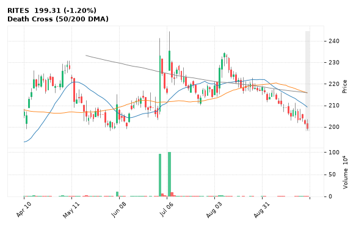

[🔔 Set alert on RITES](https://claude.ai/artifact/Ewc5hHTPX6WkU1nVcDNQzq?s=RITES&c=close%20below%20198.52) &nbsp;|&nbsp; [📈 Live chart (TradingView)](https://www.tradingview.com/chart/?symbol=NSE:RITES) &nbsp;|&nbsp; [alert by email](mailto:himanshusardana05@gmail.com?subject=ALERT%20RITES&body=Alert%20me%20when%3A%20close%20below%20198.52%0A%0AEdit%20the%20line%20above%20if%20you%20want%2C%20then%20press%20Send.%20Checked%20on%20every%20day%27s%20closing%20data%3B%20a%20triggered%20alert%20appears%20at%20the%20top%20of%20the%208%20AM%20Technical%20Analysis%20email.%0A%0AExamples%20you%20can%20write%3A%0A%20%20close%20above%201150%20%20%7C%20%20close%20below%201080%20%20%7C%20%20high%20above%201200%20%20%7C%20%20low%20below%201050%0A%20%20close%20crosses%20above%20200%20DMA%20%20%7C%20%20close%20below%2050%20DMA%20%20%7C%20%20RSI%20below%2030%20%20%7C%20%20RSI%20above%2070%0A%20%20volume%20above%202x%20%20%7C%20%20change%20above%205%25%20%20%7C%20%20change%20below%20-4%25%20%20%7C%20%2052-week%20high%20%20%7C%20%20golden%20cross%0A%20%20combine%20with%20%27and%27%2C%20e.g.%20%20close%20above%201150%20and%20volume%20above%201.5x%0A%0AReference%3A%20RITES%20closed%20199.31%20%28high%20203.57%2C%20low%20198.52%29.%0ATo%20cancel%20later%2C%20send%20an%20email%20with%20subject%3A%20CANCEL%20ALERT%20RITES)

---

## 30. SJVN - BEARISH
**61.76** (-0.77%) | vol 0.9x | RSI 28 | H 62.69 / L 61.21  
52-week low breakdown

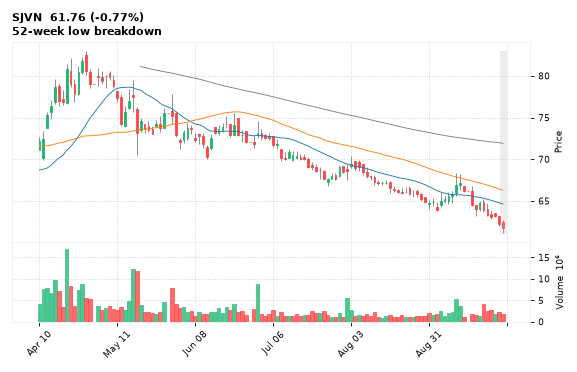

[🔔 Set alert on SJVN](https://claude.ai/artifact/Ewc5hHTPX6WkU1nVcDNQzq?s=SJVN&c=close%20below%2061.21) &nbsp;|&nbsp; [📈 Live chart (TradingView)](https://www.tradingview.com/chart/?symbol=NSE:SJVN) &nbsp;|&nbsp; [alert by email](mailto:himanshusardana05@gmail.com?subject=ALERT%20SJVN&body=Alert%20me%20when%3A%20close%20below%2061.21%0A%0AEdit%20the%20line%20above%20if%20you%20want%2C%20then%20press%20Send.%20Checked%20on%20every%20day%27s%20closing%20data%3B%20a%20triggered%20alert%20appears%20at%20the%20top%20of%20the%208%20AM%20Technical%20Analysis%20email.%0A%0AExamples%20you%20can%20write%3A%0A%20%20close%20above%201150%20%20%7C%20%20close%20below%201080%20%20%7C%20%20high%20above%201200%20%20%7C%20%20low%20below%201050%0A%20%20close%20crosses%20above%20200%20DMA%20%20%7C%20%20close%20below%2050%20DMA%20%20%7C%20%20RSI%20below%2030%20%20%7C%20%20RSI%20above%2070%0A%20%20volume%20above%202x%20%20%7C%20%20change%20above%205%25%20%20%7C%20%20change%20below%20-4%25%20%20%7C%20%2052-week%20high%20%20%7C%20%20golden%20cross%0A%20%20combine%20with%20%27and%27%2C%20e.g.%20%20close%20above%201150%20and%20volume%20above%201.5x%0A%0AReference%3A%20SJVN%20closed%2061.76%20%28high%2062.69%2C%20low%2061.21%29.%0ATo%20cancel%20later%2C%20send%20an%20email%20with%20subject%3A%20CANCEL%20ALERT%20SJVN)

---
