# Technical Analysis Alert on Nifty 500 - charts for Mon 28 Sep 2026

Scroll through all charts. Tap **Set alert** under any chart to get an email alert in the 8 AM report when your price/condition triggers on the daily close.

## 1. GLAXO - BULLISH
**2,896.40** (+2.87%) | vol 7.0x | RSI 55 | H 2,987.00 / L 2,790.10  
Bullish Engulfing, Volume spike 7.0x

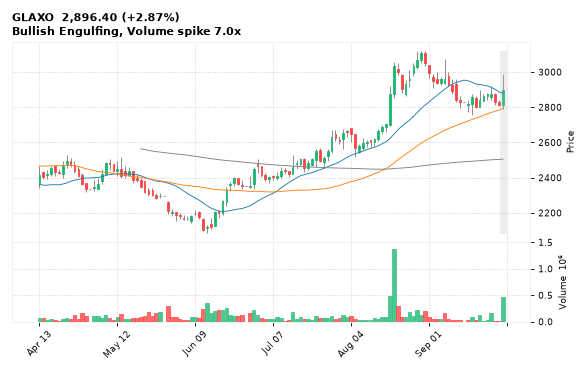

[🔔 Set alert on GLAXO](https://claude.ai/artifact/Ewc5hHTPX6WkU1nVcDNQzq?s=GLAXO&c=close%20above%202987.00) &nbsp;|&nbsp; [📈 Live chart (TradingView)](https://www.tradingview.com/chart/?symbol=NSE:GLAXO) &nbsp;|&nbsp; [alert by email](mailto:himanshusardana05@gmail.com?subject=ALERT%20GLAXO&body=Alert%20me%20when%3A%20close%20above%202987.00%0A%0AEdit%20the%20line%20above%20if%20you%20want%2C%20then%20press%20Send.%20Checked%20on%20every%20day%27s%20closing%20data%3B%20a%20triggered%20alert%20appears%20at%20the%20top%20of%20the%208%20AM%20Technical%20Analysis%20email.%0A%0AExamples%20you%20can%20write%3A%0A%20%20close%20above%201150%20%20%7C%20%20close%20below%201080%20%20%7C%20%20high%20above%201200%20%20%7C%20%20low%20below%201050%0A%20%20close%20crosses%20above%20200%20DMA%20%20%7C%20%20close%20below%2050%20DMA%20%20%7C%20%20RSI%20below%2030%20%20%7C%20%20RSI%20above%2070%0A%20%20volume%20above%202x%20%20%7C%20%20change%20above%205%25%20%20%7C%20%20change%20below%20-4%25%20%20%7C%20%2052-week%20high%20%20%7C%20%20golden%20cross%0A%20%20combine%20with%20%27and%27%2C%20e.g.%20%20close%20above%201150%20and%20volume%20above%201.5x%0A%0AReference%3A%20GLAXO%20closed%202896.40%20%28high%202987.00%2C%20low%202790.10%29.%0ATo%20cancel%20later%2C%20send%20an%20email%20with%20subject%3A%20CANCEL%20ALERT%20GLAXO)

---

## 2. MSUMI - BULLISH
**34.80** (+1.49%) | vol 1.4x | RSI 35 | H 35.08 / L 33.81  
Bullish Engulfing, RSI up through 30

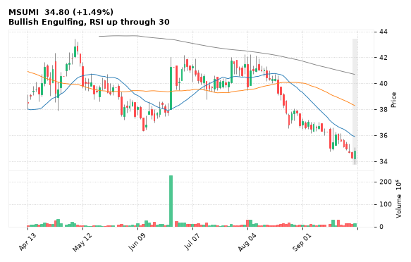

[🔔 Set alert on MSUMI](https://claude.ai/artifact/Ewc5hHTPX6WkU1nVcDNQzq?s=MSUMI&c=close%20above%2035.08) &nbsp;|&nbsp; [📈 Live chart (TradingView)](https://www.tradingview.com/chart/?symbol=NSE:MSUMI) &nbsp;|&nbsp; [alert by email](mailto:himanshusardana05@gmail.com?subject=ALERT%20MSUMI&body=Alert%20me%20when%3A%20close%20above%2035.08%0A%0AEdit%20the%20line%20above%20if%20you%20want%2C%20then%20press%20Send.%20Checked%20on%20every%20day%27s%20closing%20data%3B%20a%20triggered%20alert%20appears%20at%20the%20top%20of%20the%208%20AM%20Technical%20Analysis%20email.%0A%0AExamples%20you%20can%20write%3A%0A%20%20close%20above%201150%20%20%7C%20%20close%20below%201080%20%20%7C%20%20high%20above%201200%20%20%7C%20%20low%20below%201050%0A%20%20close%20crosses%20above%20200%20DMA%20%20%7C%20%20close%20below%2050%20DMA%20%20%7C%20%20RSI%20below%2030%20%20%7C%20%20RSI%20above%2070%0A%20%20volume%20above%202x%20%20%7C%20%20change%20above%205%25%20%20%7C%20%20change%20below%20-4%25%20%20%7C%20%2052-week%20high%20%20%7C%20%20golden%20cross%0A%20%20combine%20with%20%27and%27%2C%20e.g.%20%20close%20above%201150%20and%20volume%20above%201.5x%0A%0AReference%3A%20MSUMI%20closed%2034.80%20%28high%2035.08%2C%20low%2033.81%29.%0ATo%20cancel%20later%2C%20send%20an%20email%20with%20subject%3A%20CANCEL%20ALERT%20MSUMI)

---

## 3. MRPL - BULLISH
**169.80** (+3.16%) | vol 2.3x | RSI 50 | H 173.60 / L 163.50  
Close above 200 DMA, Volume spike 2.3x

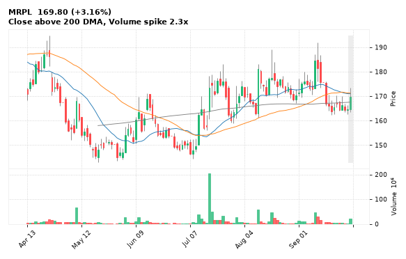

[🔔 Set alert on MRPL](https://claude.ai/artifact/Ewc5hHTPX6WkU1nVcDNQzq?s=MRPL&c=close%20above%20173.60) &nbsp;|&nbsp; [📈 Live chart (TradingView)](https://www.tradingview.com/chart/?symbol=NSE:MRPL) &nbsp;|&nbsp; [alert by email](mailto:himanshusardana05@gmail.com?subject=ALERT%20MRPL&body=Alert%20me%20when%3A%20close%20above%20173.60%0A%0AEdit%20the%20line%20above%20if%20you%20want%2C%20then%20press%20Send.%20Checked%20on%20every%20day%27s%20closing%20data%3B%20a%20triggered%20alert%20appears%20at%20the%20top%20of%20the%208%20AM%20Technical%20Analysis%20email.%0A%0AExamples%20you%20can%20write%3A%0A%20%20close%20above%201150%20%20%7C%20%20close%20below%201080%20%20%7C%20%20high%20above%201200%20%20%7C%20%20low%20below%201050%0A%20%20close%20crosses%20above%20200%20DMA%20%20%7C%20%20close%20below%2050%20DMA%20%20%7C%20%20RSI%20below%2030%20%20%7C%20%20RSI%20above%2070%0A%20%20volume%20above%202x%20%20%7C%20%20change%20above%205%25%20%20%7C%20%20change%20below%20-4%25%20%20%7C%20%2052-week%20high%20%20%7C%20%20golden%20cross%0A%20%20combine%20with%20%27and%27%2C%20e.g.%20%20close%20above%201150%20and%20volume%20above%201.5x%0A%0AReference%3A%20MRPL%20closed%20169.80%20%28high%20173.60%2C%20low%20163.50%29.%0ATo%20cancel%20later%2C%20send%20an%20email%20with%20subject%3A%20CANCEL%20ALERT%20MRPL)

---

## 4. TTML - BULLISH
**36.19** (+5.08%) | vol 50.8x | RSI 48 | H 37.90 / L 34.37  
MACD bullish cross, Volume spike 50.8x

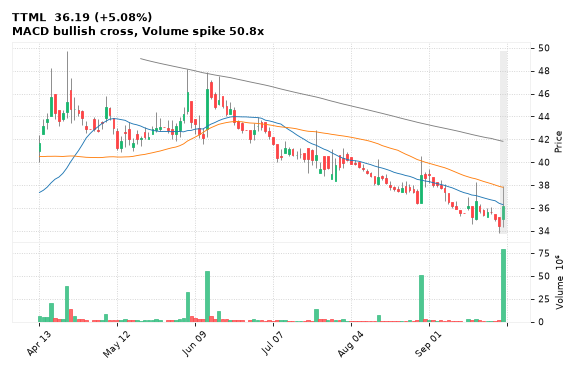

[🔔 Set alert on TTML](https://claude.ai/artifact/Ewc5hHTPX6WkU1nVcDNQzq?s=TTML&c=close%20above%2037.90) &nbsp;|&nbsp; [📈 Live chart (TradingView)](https://www.tradingview.com/chart/?symbol=NSE:TTML) &nbsp;|&nbsp; [alert by email](mailto:himanshusardana05@gmail.com?subject=ALERT%20TTML&body=Alert%20me%20when%3A%20close%20above%2037.90%0A%0AEdit%20the%20line%20above%20if%20you%20want%2C%20then%20press%20Send.%20Checked%20on%20every%20day%27s%20closing%20data%3B%20a%20triggered%20alert%20appears%20at%20the%20top%20of%20the%208%20AM%20Technical%20Analysis%20email.%0A%0AExamples%20you%20can%20write%3A%0A%20%20close%20above%201150%20%20%7C%20%20close%20below%201080%20%20%7C%20%20high%20above%201200%20%20%7C%20%20low%20below%201050%0A%20%20close%20crosses%20above%20200%20DMA%20%20%7C%20%20close%20below%2050%20DMA%20%20%7C%20%20RSI%20below%2030%20%20%7C%20%20RSI%20above%2070%0A%20%20volume%20above%202x%20%20%7C%20%20change%20above%205%25%20%20%7C%20%20change%20below%20-4%25%20%20%7C%20%2052-week%20high%20%20%7C%20%20golden%20cross%0A%20%20combine%20with%20%27and%27%2C%20e.g.%20%20close%20above%201150%20and%20volume%20above%201.5x%0A%0AReference%3A%20TTML%20closed%2036.19%20%28high%2037.90%2C%20low%2034.37%29.%0ATo%20cancel%20later%2C%20send%20an%20email%20with%20subject%3A%20CANCEL%20ALERT%20TTML)

---

## 5. ZYDUSLIFE - BULLISH
**1,215.00** (+0.92%) | vol 3.2x | RSI 67 | H 1,228.60 / L 1,201.20  
52-week high breakout

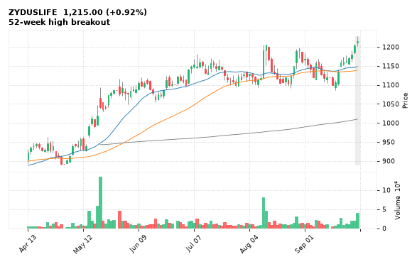

[🔔 Set alert on ZYDUSLIFE](https://claude.ai/artifact/Ewc5hHTPX6WkU1nVcDNQzq?s=ZYDUSLIFE&c=close%20above%201228.60) &nbsp;|&nbsp; [📈 Live chart (TradingView)](https://www.tradingview.com/chart/?symbol=NSE:ZYDUSLIFE) &nbsp;|&nbsp; [alert by email](mailto:himanshusardana05@gmail.com?subject=ALERT%20ZYDUSLIFE&body=Alert%20me%20when%3A%20close%20above%201228.60%0A%0AEdit%20the%20line%20above%20if%20you%20want%2C%20then%20press%20Send.%20Checked%20on%20every%20day%27s%20closing%20data%3B%20a%20triggered%20alert%20appears%20at%20the%20top%20of%20the%208%20AM%20Technical%20Analysis%20email.%0A%0AExamples%20you%20can%20write%3A%0A%20%20close%20above%201150%20%20%7C%20%20close%20below%201080%20%20%7C%20%20high%20above%201200%20%20%7C%20%20low%20below%201050%0A%20%20close%20crosses%20above%20200%20DMA%20%20%7C%20%20close%20below%2050%20DMA%20%20%7C%20%20RSI%20below%2030%20%20%7C%20%20RSI%20above%2070%0A%20%20volume%20above%202x%20%20%7C%20%20change%20above%205%25%20%20%7C%20%20change%20below%20-4%25%20%20%7C%20%2052-week%20high%20%20%7C%20%20golden%20cross%0A%20%20combine%20with%20%27and%27%2C%20e.g.%20%20close%20above%201150%20and%20volume%20above%201.5x%0A%0AReference%3A%20ZYDUSLIFE%20closed%201215.00%20%28high%201228.60%2C%20low%201201.20%29.%0ATo%20cancel%20later%2C%20send%20an%20email%20with%20subject%3A%20CANCEL%20ALERT%20ZYDUSLIFE)

---

## 6. GODIGIT - BULLISH
**263.25** (+3.76%) | vol 6.8x | RSI 58 | H 267.00 / L 252.10  
Volume spike 6.8x

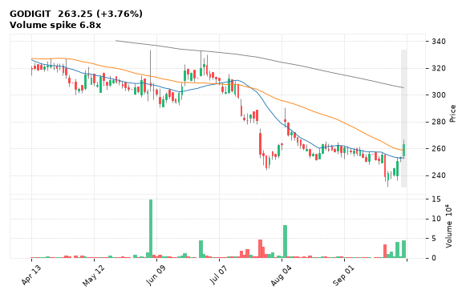

[🔔 Set alert on GODIGIT](https://claude.ai/artifact/Ewc5hHTPX6WkU1nVcDNQzq?s=GODIGIT&c=close%20above%20267.00) &nbsp;|&nbsp; [📈 Live chart (TradingView)](https://www.tradingview.com/chart/?symbol=NSE:GODIGIT) &nbsp;|&nbsp; [alert by email](mailto:himanshusardana05@gmail.com?subject=ALERT%20GODIGIT&body=Alert%20me%20when%3A%20close%20above%20267.00%0A%0AEdit%20the%20line%20above%20if%20you%20want%2C%20then%20press%20Send.%20Checked%20on%20every%20day%27s%20closing%20data%3B%20a%20triggered%20alert%20appears%20at%20the%20top%20of%20the%208%20AM%20Technical%20Analysis%20email.%0A%0AExamples%20you%20can%20write%3A%0A%20%20close%20above%201150%20%20%7C%20%20close%20below%201080%20%20%7C%20%20high%20above%201200%20%20%7C%20%20low%20below%201050%0A%20%20close%20crosses%20above%20200%20DMA%20%20%7C%20%20close%20below%2050%20DMA%20%20%7C%20%20RSI%20below%2030%20%20%7C%20%20RSI%20above%2070%0A%20%20volume%20above%202x%20%20%7C%20%20change%20above%205%25%20%20%7C%20%20change%20below%20-4%25%20%20%7C%20%2052-week%20high%20%20%7C%20%20golden%20cross%0A%20%20combine%20with%20%27and%27%2C%20e.g.%20%20close%20above%201150%20and%20volume%20above%201.5x%0A%0AReference%3A%20GODIGIT%20closed%20263.25%20%28high%20267.00%2C%20low%20252.10%29.%0ATo%20cancel%20later%2C%20send%20an%20email%20with%20subject%3A%20CANCEL%20ALERT%20GODIGIT)

---

## 7. FIRSTCRY - BULLISH
**184.72** (+2.15%) | vol 5.3x | RSI 55 | H 195.30 / L 178.19  
Volume spike 5.3x

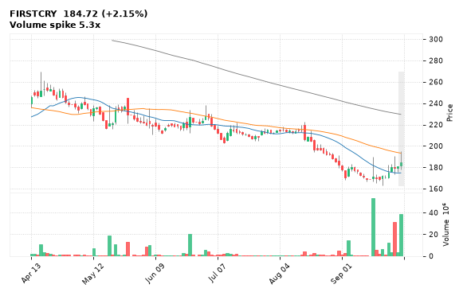

[🔔 Set alert on FIRSTCRY](https://claude.ai/artifact/Ewc5hHTPX6WkU1nVcDNQzq?s=FIRSTCRY&c=close%20above%20195.30) &nbsp;|&nbsp; [📈 Live chart (TradingView)](https://www.tradingview.com/chart/?symbol=NSE:FIRSTCRY) &nbsp;|&nbsp; [alert by email](mailto:himanshusardana05@gmail.com?subject=ALERT%20FIRSTCRY&body=Alert%20me%20when%3A%20close%20above%20195.30%0A%0AEdit%20the%20line%20above%20if%20you%20want%2C%20then%20press%20Send.%20Checked%20on%20every%20day%27s%20closing%20data%3B%20a%20triggered%20alert%20appears%20at%20the%20top%20of%20the%208%20AM%20Technical%20Analysis%20email.%0A%0AExamples%20you%20can%20write%3A%0A%20%20close%20above%201150%20%20%7C%20%20close%20below%201080%20%20%7C%20%20high%20above%201200%20%20%7C%20%20low%20below%201050%0A%20%20close%20crosses%20above%20200%20DMA%20%20%7C%20%20close%20below%2050%20DMA%20%20%7C%20%20RSI%20below%2030%20%20%7C%20%20RSI%20above%2070%0A%20%20volume%20above%202x%20%20%7C%20%20change%20above%205%25%20%20%7C%20%20change%20below%20-4%25%20%20%7C%20%2052-week%20high%20%20%7C%20%20golden%20cross%0A%20%20combine%20with%20%27and%27%2C%20e.g.%20%20close%20above%201150%20and%20volume%20above%201.5x%0A%0AReference%3A%20FIRSTCRY%20closed%20184.72%20%28high%20195.30%2C%20low%20178.19%29.%0ATo%20cancel%20later%2C%20send%20an%20email%20with%20subject%3A%20CANCEL%20ALERT%20FIRSTCRY)

---

## 8. ELECON - BULLISH
**480.75** (+4.91%) | vol 3.0x | RSI 69 | H 489.50 / L 452.25  
Volume spike 3.0x

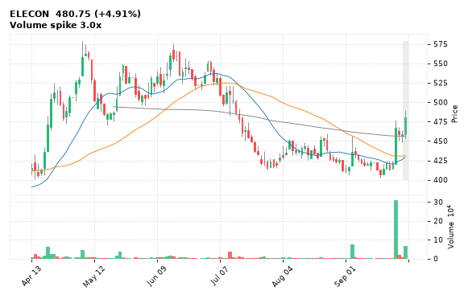

[🔔 Set alert on ELECON](https://claude.ai/artifact/Ewc5hHTPX6WkU1nVcDNQzq?s=ELECON&c=close%20above%20489.50) &nbsp;|&nbsp; [📈 Live chart (TradingView)](https://www.tradingview.com/chart/?symbol=NSE:ELECON) &nbsp;|&nbsp; [alert by email](mailto:himanshusardana05@gmail.com?subject=ALERT%20ELECON&body=Alert%20me%20when%3A%20close%20above%20489.50%0A%0AEdit%20the%20line%20above%20if%20you%20want%2C%20then%20press%20Send.%20Checked%20on%20every%20day%27s%20closing%20data%3B%20a%20triggered%20alert%20appears%20at%20the%20top%20of%20the%208%20AM%20Technical%20Analysis%20email.%0A%0AExamples%20you%20can%20write%3A%0A%20%20close%20above%201150%20%20%7C%20%20close%20below%201080%20%20%7C%20%20high%20above%201200%20%20%7C%20%20low%20below%201050%0A%20%20close%20crosses%20above%20200%20DMA%20%20%7C%20%20close%20below%2050%20DMA%20%20%7C%20%20RSI%20below%2030%20%20%7C%20%20RSI%20above%2070%0A%20%20volume%20above%202x%20%20%7C%20%20change%20above%205%25%20%20%7C%20%20change%20below%20-4%25%20%20%7C%20%2052-week%20high%20%20%7C%20%20golden%20cross%0A%20%20combine%20with%20%27and%27%2C%20e.g.%20%20close%20above%201150%20and%20volume%20above%201.5x%0A%0AReference%3A%20ELECON%20closed%20480.75%20%28high%20489.50%2C%20low%20452.25%29.%0ATo%20cancel%20later%2C%20send%20an%20email%20with%20subject%3A%20CANCEL%20ALERT%20ELECON)

---

## 9. CRISIL - BULLISH
**4,650.60** (+2.89%) | vol 2.4x | RSI 54 | H 4,706.20 / L 4,450.00  
Volume spike 2.4x

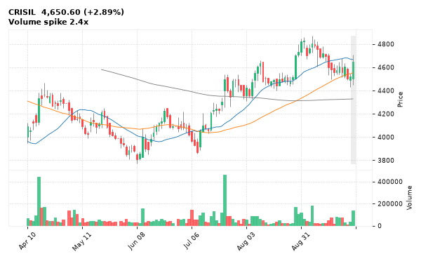

[🔔 Set alert on CRISIL](https://claude.ai/artifact/Ewc5hHTPX6WkU1nVcDNQzq?s=CRISIL&c=close%20above%204706.20) &nbsp;|&nbsp; [📈 Live chart (TradingView)](https://www.tradingview.com/chart/?symbol=NSE:CRISIL) &nbsp;|&nbsp; [alert by email](mailto:himanshusardana05@gmail.com?subject=ALERT%20CRISIL&body=Alert%20me%20when%3A%20close%20above%204706.20%0A%0AEdit%20the%20line%20above%20if%20you%20want%2C%20then%20press%20Send.%20Checked%20on%20every%20day%27s%20closing%20data%3B%20a%20triggered%20alert%20appears%20at%20the%20top%20of%20the%208%20AM%20Technical%20Analysis%20email.%0A%0AExamples%20you%20can%20write%3A%0A%20%20close%20above%201150%20%20%7C%20%20close%20below%201080%20%20%7C%20%20high%20above%201200%20%20%7C%20%20low%20below%201050%0A%20%20close%20crosses%20above%20200%20DMA%20%20%7C%20%20close%20below%2050%20DMA%20%20%7C%20%20RSI%20below%2030%20%20%7C%20%20RSI%20above%2070%0A%20%20volume%20above%202x%20%20%7C%20%20change%20above%205%25%20%20%7C%20%20change%20below%20-4%25%20%20%7C%20%2052-week%20high%20%20%7C%20%20golden%20cross%0A%20%20combine%20with%20%27and%27%2C%20e.g.%20%20close%20above%201150%20and%20volume%20above%201.5x%0A%0AReference%3A%20CRISIL%20closed%204650.60%20%28high%204706.20%2C%20low%204450.00%29.%0ATo%20cancel%20later%2C%20send%20an%20email%20with%20subject%3A%20CANCEL%20ALERT%20CRISIL)

---

## 10. FEDERALBNK - BULLISH
**325.00** (+0.93%) | vol 1.5x | RSI 34 | H 327.30 / L 320.50  
RSI up through 30, Inside Bar

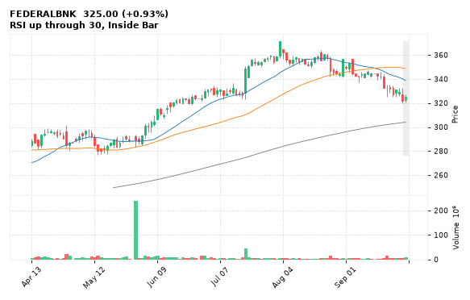

[🔔 Set alert on FEDERALBNK](https://claude.ai/artifact/Ewc5hHTPX6WkU1nVcDNQzq?s=FEDERALBNK&c=close%20above%20327.30) &nbsp;|&nbsp; [📈 Live chart (TradingView)](https://www.tradingview.com/chart/?symbol=NSE:FEDERALBNK) &nbsp;|&nbsp; [alert by email](mailto:himanshusardana05@gmail.com?subject=ALERT%20FEDERALBNK&body=Alert%20me%20when%3A%20close%20above%20327.30%0A%0AEdit%20the%20line%20above%20if%20you%20want%2C%20then%20press%20Send.%20Checked%20on%20every%20day%27s%20closing%20data%3B%20a%20triggered%20alert%20appears%20at%20the%20top%20of%20the%208%20AM%20Technical%20Analysis%20email.%0A%0AExamples%20you%20can%20write%3A%0A%20%20close%20above%201150%20%20%7C%20%20close%20below%201080%20%20%7C%20%20high%20above%201200%20%20%7C%20%20low%20below%201050%0A%20%20close%20crosses%20above%20200%20DMA%20%20%7C%20%20close%20below%2050%20DMA%20%20%7C%20%20RSI%20below%2030%20%20%7C%20%20RSI%20above%2070%0A%20%20volume%20above%202x%20%20%7C%20%20change%20above%205%25%20%20%7C%20%20change%20below%20-4%25%20%20%7C%20%2052-week%20high%20%20%7C%20%20golden%20cross%0A%20%20combine%20with%20%27and%27%2C%20e.g.%20%20close%20above%201150%20and%20volume%20above%201.5x%0A%0AReference%3A%20FEDERALBNK%20closed%20325.00%20%28high%20327.30%2C%20low%20320.50%29.%0ATo%20cancel%20later%2C%20send%20an%20email%20with%20subject%3A%20CANCEL%20ALERT%20FEDERALBNK)

---

## 11. BAJFINANCE - BULLISH
**985.00** (-1.19%) | vol 1.3x | RSI 38 | H 992.30 / L 974.00  
Hammer

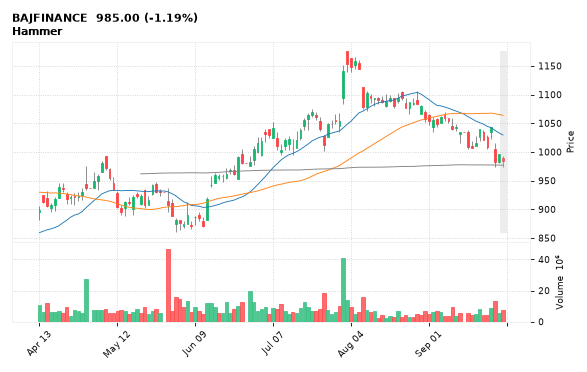

[🔔 Set alert on BAJFINANCE](https://claude.ai/artifact/Ewc5hHTPX6WkU1nVcDNQzq?s=BAJFINANCE&c=close%20above%20992.30) &nbsp;|&nbsp; [📈 Live chart (TradingView)](https://www.tradingview.com/chart/?symbol=NSE:BAJFINANCE) &nbsp;|&nbsp; [alert by email](mailto:himanshusardana05@gmail.com?subject=ALERT%20BAJFINANCE&body=Alert%20me%20when%3A%20close%20above%20992.30%0A%0AEdit%20the%20line%20above%20if%20you%20want%2C%20then%20press%20Send.%20Checked%20on%20every%20day%27s%20closing%20data%3B%20a%20triggered%20alert%20appears%20at%20the%20top%20of%20the%208%20AM%20Technical%20Analysis%20email.%0A%0AExamples%20you%20can%20write%3A%0A%20%20close%20above%201150%20%20%7C%20%20close%20below%201080%20%20%7C%20%20high%20above%201200%20%20%7C%20%20low%20below%201050%0A%20%20close%20crosses%20above%20200%20DMA%20%20%7C%20%20close%20below%2050%20DMA%20%20%7C%20%20RSI%20below%2030%20%20%7C%20%20RSI%20above%2070%0A%20%20volume%20above%202x%20%20%7C%20%20change%20above%205%25%20%20%7C%20%20change%20below%20-4%25%20%20%7C%20%2052-week%20high%20%20%7C%20%20golden%20cross%0A%20%20combine%20with%20%27and%27%2C%20e.g.%20%20close%20above%201150%20and%20volume%20above%201.5x%0A%0AReference%3A%20BAJFINANCE%20closed%20985.00%20%28high%20992.30%2C%20low%20974.00%29.%0ATo%20cancel%20later%2C%20send%20an%20email%20with%20subject%3A%20CANCEL%20ALERT%20BAJFINANCE)

---

## 12. BRITANNIA - BULLISH
**4,915.00** (-0.46%) | vol 1.3x | RSI 34 | H 4,933.00 / L 4,869.00  
Hammer

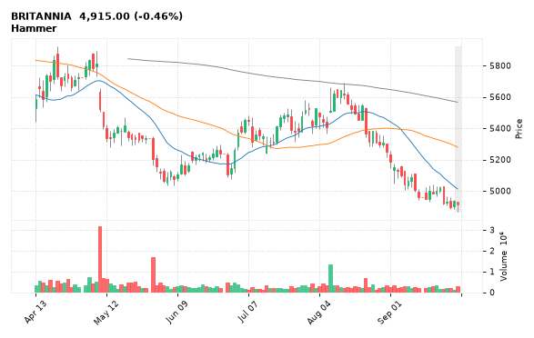

[🔔 Set alert on BRITANNIA](https://claude.ai/artifact/Ewc5hHTPX6WkU1nVcDNQzq?s=BRITANNIA&c=close%20above%204933.00) &nbsp;|&nbsp; [📈 Live chart (TradingView)](https://www.tradingview.com/chart/?symbol=NSE:BRITANNIA) &nbsp;|&nbsp; [alert by email](mailto:himanshusardana05@gmail.com?subject=ALERT%20BRITANNIA&body=Alert%20me%20when%3A%20close%20above%204933.00%0A%0AEdit%20the%20line%20above%20if%20you%20want%2C%20then%20press%20Send.%20Checked%20on%20every%20day%27s%20closing%20data%3B%20a%20triggered%20alert%20appears%20at%20the%20top%20of%20the%208%20AM%20Technical%20Analysis%20email.%0A%0AExamples%20you%20can%20write%3A%0A%20%20close%20above%201150%20%20%7C%20%20close%20below%201080%20%20%7C%20%20high%20above%201200%20%20%7C%20%20low%20below%201050%0A%20%20close%20crosses%20above%20200%20DMA%20%20%7C%20%20close%20below%2050%20DMA%20%20%7C%20%20RSI%20below%2030%20%20%7C%20%20RSI%20above%2070%0A%20%20volume%20above%202x%20%20%7C%20%20change%20above%205%25%20%20%7C%20%20change%20below%20-4%25%20%20%7C%20%2052-week%20high%20%20%7C%20%20golden%20cross%0A%20%20combine%20with%20%27and%27%2C%20e.g.%20%20close%20above%201150%20and%20volume%20above%201.5x%0A%0AReference%3A%20BRITANNIA%20closed%204915.00%20%28high%204933.00%2C%20low%204869.00%29.%0ATo%20cancel%20later%2C%20send%20an%20email%20with%20subject%3A%20CANCEL%20ALERT%20BRITANNIA)

---

## 13. INFY - BULLISH
**1,003.20** (+0.30%) | vol 1.0x | RSI 31 | H 1,009.50 / L 986.60  
Doji (indecision), RSI up through 30

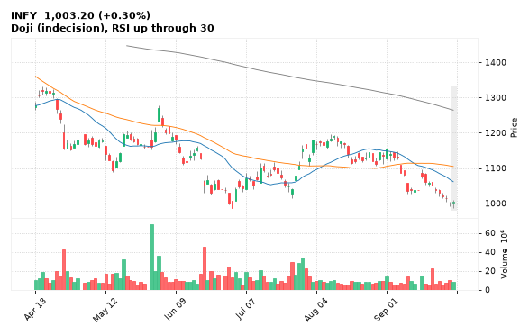

[🔔 Set alert on INFY](https://claude.ai/artifact/Ewc5hHTPX6WkU1nVcDNQzq?s=INFY&c=close%20above%201009.50) &nbsp;|&nbsp; [📈 Live chart (TradingView)](https://www.tradingview.com/chart/?symbol=NSE:INFY) &nbsp;|&nbsp; [alert by email](mailto:himanshusardana05@gmail.com?subject=ALERT%20INFY&body=Alert%20me%20when%3A%20close%20above%201009.50%0A%0AEdit%20the%20line%20above%20if%20you%20want%2C%20then%20press%20Send.%20Checked%20on%20every%20day%27s%20closing%20data%3B%20a%20triggered%20alert%20appears%20at%20the%20top%20of%20the%208%20AM%20Technical%20Analysis%20email.%0A%0AExamples%20you%20can%20write%3A%0A%20%20close%20above%201150%20%20%7C%20%20close%20below%201080%20%20%7C%20%20high%20above%201200%20%20%7C%20%20low%20below%201050%0A%20%20close%20crosses%20above%20200%20DMA%20%20%7C%20%20close%20below%2050%20DMA%20%20%7C%20%20RSI%20below%2030%20%20%7C%20%20RSI%20above%2070%0A%20%20volume%20above%202x%20%20%7C%20%20change%20above%205%25%20%20%7C%20%20change%20below%20-4%25%20%20%7C%20%2052-week%20high%20%20%7C%20%20golden%20cross%0A%20%20combine%20with%20%27and%27%2C%20e.g.%20%20close%20above%201150%20and%20volume%20above%201.5x%0A%0AReference%3A%20INFY%20closed%201003.20%20%28high%201009.50%2C%20low%20986.60%29.%0ATo%20cancel%20later%2C%20send%20an%20email%20with%20subject%3A%20CANCEL%20ALERT%20INFY)

---

## 14. INDUSINDBK - BULLISH
**909.70** (-0.27%) | vol 0.9x | RSI 29 | H 913.00 / L 889.40  
Hammer

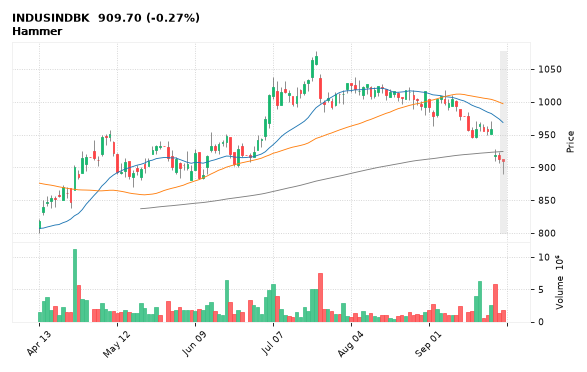

[🔔 Set alert on INDUSINDBK](https://claude.ai/artifact/Ewc5hHTPX6WkU1nVcDNQzq?s=INDUSINDBK&c=close%20above%20913.00) &nbsp;|&nbsp; [📈 Live chart (TradingView)](https://www.tradingview.com/chart/?symbol=NSE:INDUSINDBK) &nbsp;|&nbsp; [alert by email](mailto:himanshusardana05@gmail.com?subject=ALERT%20INDUSINDBK&body=Alert%20me%20when%3A%20close%20above%20913.00%0A%0AEdit%20the%20line%20above%20if%20you%20want%2C%20then%20press%20Send.%20Checked%20on%20every%20day%27s%20closing%20data%3B%20a%20triggered%20alert%20appears%20at%20the%20top%20of%20the%208%20AM%20Technical%20Analysis%20email.%0A%0AExamples%20you%20can%20write%3A%0A%20%20close%20above%201150%20%20%7C%20%20close%20below%201080%20%20%7C%20%20high%20above%201200%20%20%7C%20%20low%20below%201050%0A%20%20close%20crosses%20above%20200%20DMA%20%20%7C%20%20close%20below%2050%20DMA%20%20%7C%20%20RSI%20below%2030%20%20%7C%20%20RSI%20above%2070%0A%20%20volume%20above%202x%20%20%7C%20%20change%20above%205%25%20%20%7C%20%20change%20below%20-4%25%20%20%7C%20%2052-week%20high%20%20%7C%20%20golden%20cross%0A%20%20combine%20with%20%27and%27%2C%20e.g.%20%20close%20above%201150%20and%20volume%20above%201.5x%0A%0AReference%3A%20INDUSINDBK%20closed%20909.70%20%28high%20913.00%2C%20low%20889.40%29.%0ATo%20cancel%20later%2C%20send%20an%20email%20with%20subject%3A%20CANCEL%20ALERT%20INDUSINDBK)

---

## 15. KAYNES - BULLISH
**3,658.00** (+0.22%) | vol 0.9x | RSI 54 | H 3,695.00 / L 3,589.00  
Close above 200 DMA

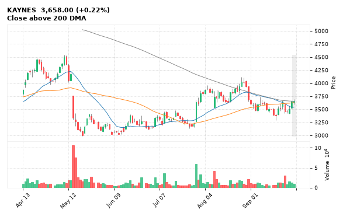

[🔔 Set alert on KAYNES](https://claude.ai/artifact/Ewc5hHTPX6WkU1nVcDNQzq?s=KAYNES&c=close%20above%203695.00) &nbsp;|&nbsp; [📈 Live chart (TradingView)](https://www.tradingview.com/chart/?symbol=NSE:KAYNES) &nbsp;|&nbsp; [alert by email](mailto:himanshusardana05@gmail.com?subject=ALERT%20KAYNES&body=Alert%20me%20when%3A%20close%20above%203695.00%0A%0AEdit%20the%20line%20above%20if%20you%20want%2C%20then%20press%20Send.%20Checked%20on%20every%20day%27s%20closing%20data%3B%20a%20triggered%20alert%20appears%20at%20the%20top%20of%20the%208%20AM%20Technical%20Analysis%20email.%0A%0AExamples%20you%20can%20write%3A%0A%20%20close%20above%201150%20%20%7C%20%20close%20below%201080%20%20%7C%20%20high%20above%201200%20%20%7C%20%20low%20below%201050%0A%20%20close%20crosses%20above%20200%20DMA%20%20%7C%20%20close%20below%2050%20DMA%20%20%7C%20%20RSI%20below%2030%20%20%7C%20%20RSI%20above%2070%0A%20%20volume%20above%202x%20%20%7C%20%20change%20above%205%25%20%20%7C%20%20change%20below%20-4%25%20%20%7C%20%2052-week%20high%20%20%7C%20%20golden%20cross%0A%20%20combine%20with%20%27and%27%2C%20e.g.%20%20close%20above%201150%20and%20volume%20above%201.5x%0A%0AReference%3A%20KAYNES%20closed%203658.00%20%28high%203695.00%2C%20low%203589.00%29.%0ATo%20cancel%20later%2C%20send%20an%20email%20with%20subject%3A%20CANCEL%20ALERT%20KAYNES)

---

## 16. AMBUJACEM - BEARISH
**374.35** (-2.46%) | vol 1.4x | RSI 30 | H 383.80 / L 374.00  
Bearish Marubozu, 52-week low breakdown, MACD bearish cross

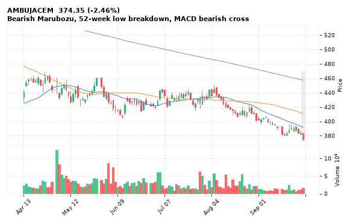

[🔔 Set alert on AMBUJACEM](https://claude.ai/artifact/Ewc5hHTPX6WkU1nVcDNQzq?s=AMBUJACEM&c=close%20below%20374.00) &nbsp;|&nbsp; [📈 Live chart (TradingView)](https://www.tradingview.com/chart/?symbol=NSE:AMBUJACEM) &nbsp;|&nbsp; [alert by email](mailto:himanshusardana05@gmail.com?subject=ALERT%20AMBUJACEM&body=Alert%20me%20when%3A%20close%20below%20374.00%0A%0AEdit%20the%20line%20above%20if%20you%20want%2C%20then%20press%20Send.%20Checked%20on%20every%20day%27s%20closing%20data%3B%20a%20triggered%20alert%20appears%20at%20the%20top%20of%20the%208%20AM%20Technical%20Analysis%20email.%0A%0AExamples%20you%20can%20write%3A%0A%20%20close%20above%201150%20%20%7C%20%20close%20below%201080%20%20%7C%20%20high%20above%201200%20%20%7C%20%20low%20below%201050%0A%20%20close%20crosses%20above%20200%20DMA%20%20%7C%20%20close%20below%2050%20DMA%20%20%7C%20%20RSI%20below%2030%20%20%7C%20%20RSI%20above%2070%0A%20%20volume%20above%202x%20%20%7C%20%20change%20above%205%25%20%20%7C%20%20change%20below%20-4%25%20%20%7C%20%2052-week%20high%20%20%7C%20%20golden%20cross%0A%20%20combine%20with%20%27and%27%2C%20e.g.%20%20close%20above%201150%20and%20volume%20above%201.5x%0A%0AReference%3A%20AMBUJACEM%20closed%20374.35%20%28high%20383.80%2C%20low%20374.00%29.%0ATo%20cancel%20later%2C%20send%20an%20email%20with%20subject%3A%20CANCEL%20ALERT%20AMBUJACEM)

---

## 17. BANKBARODA - BEARISH
**227.50** (-3.30%) | vol 1.0x | RSI 35 | H 234.99 / L 227.50  
Bearish Marubozu, 52-week low breakdown, MACD bearish cross

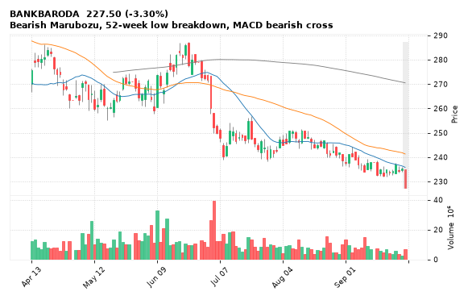

[🔔 Set alert on BANKBARODA](https://claude.ai/artifact/Ewc5hHTPX6WkU1nVcDNQzq?s=BANKBARODA&c=close%20below%20227.50) &nbsp;|&nbsp; [📈 Live chart (TradingView)](https://www.tradingview.com/chart/?symbol=NSE:BANKBARODA) &nbsp;|&nbsp; [alert by email](mailto:himanshusardana05@gmail.com?subject=ALERT%20BANKBARODA&body=Alert%20me%20when%3A%20close%20below%20227.50%0A%0AEdit%20the%20line%20above%20if%20you%20want%2C%20then%20press%20Send.%20Checked%20on%20every%20day%27s%20closing%20data%3B%20a%20triggered%20alert%20appears%20at%20the%20top%20of%20the%208%20AM%20Technical%20Analysis%20email.%0A%0AExamples%20you%20can%20write%3A%0A%20%20close%20above%201150%20%20%7C%20%20close%20below%201080%20%20%7C%20%20high%20above%201200%20%20%7C%20%20low%20below%201050%0A%20%20close%20crosses%20above%20200%20DMA%20%20%7C%20%20close%20below%2050%20DMA%20%20%7C%20%20RSI%20below%2030%20%20%7C%20%20RSI%20above%2070%0A%20%20volume%20above%202x%20%20%7C%20%20change%20above%205%25%20%20%7C%20%20change%20below%20-4%25%20%20%7C%20%2052-week%20high%20%20%7C%20%20golden%20cross%0A%20%20combine%20with%20%27and%27%2C%20e.g.%20%20close%20above%201150%20and%20volume%20above%201.5x%0A%0AReference%3A%20BANKBARODA%20closed%20227.50%20%28high%20234.99%2C%20low%20227.50%29.%0ATo%20cancel%20later%2C%20send%20an%20email%20with%20subject%3A%20CANCEL%20ALERT%20BANKBARODA)

---

## 18. CIEINDIA - BEARISH
**383.35** (-1.91%) | vol 0.7x | RSI 42 | H 392.80 / L 382.00  
Bearish Engulfing, Evening Star

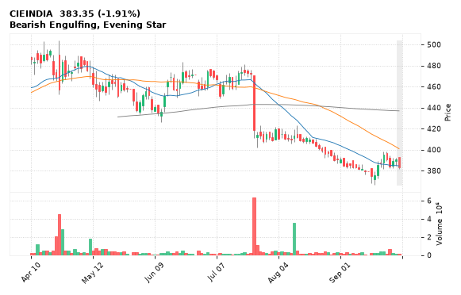

[🔔 Set alert on CIEINDIA](https://claude.ai/artifact/Ewc5hHTPX6WkU1nVcDNQzq?s=CIEINDIA&c=close%20below%20382.00) &nbsp;|&nbsp; [📈 Live chart (TradingView)](https://www.tradingview.com/chart/?symbol=NSE:CIEINDIA) &nbsp;|&nbsp; [alert by email](mailto:himanshusardana05@gmail.com?subject=ALERT%20CIEINDIA&body=Alert%20me%20when%3A%20close%20below%20382.00%0A%0AEdit%20the%20line%20above%20if%20you%20want%2C%20then%20press%20Send.%20Checked%20on%20every%20day%27s%20closing%20data%3B%20a%20triggered%20alert%20appears%20at%20the%20top%20of%20the%208%20AM%20Technical%20Analysis%20email.%0A%0AExamples%20you%20can%20write%3A%0A%20%20close%20above%201150%20%20%7C%20%20close%20below%201080%20%20%7C%20%20high%20above%201200%20%20%7C%20%20low%20below%201050%0A%20%20close%20crosses%20above%20200%20DMA%20%20%7C%20%20close%20below%2050%20DMA%20%20%7C%20%20RSI%20below%2030%20%20%7C%20%20RSI%20above%2070%0A%20%20volume%20above%202x%20%20%7C%20%20change%20above%205%25%20%20%7C%20%20change%20below%20-4%25%20%20%7C%20%2052-week%20high%20%20%7C%20%20golden%20cross%0A%20%20combine%20with%20%27and%27%2C%20e.g.%20%20close%20above%201150%20and%20volume%20above%201.5x%0A%0AReference%3A%20CIEINDIA%20closed%20383.35%20%28high%20392.80%2C%20low%20382.00%29.%0ATo%20cancel%20later%2C%20send%20an%20email%20with%20subject%3A%20CANCEL%20ALERT%20CIEINDIA)

---

## 19. HINDUNILVR - BEARISH
**1,896.00** (-2.41%) | vol 1.5x | RSI 35 | H 1,933.20 / L 1,893.20  
Bearish Marubozu, 52-week low breakdown

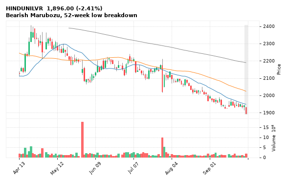

[🔔 Set alert on HINDUNILVR](https://claude.ai/artifact/Ewc5hHTPX6WkU1nVcDNQzq?s=HINDUNILVR&c=close%20below%201893.20) &nbsp;|&nbsp; [📈 Live chart (TradingView)](https://www.tradingview.com/chart/?symbol=NSE:HINDUNILVR) &nbsp;|&nbsp; [alert by email](mailto:himanshusardana05@gmail.com?subject=ALERT%20HINDUNILVR&body=Alert%20me%20when%3A%20close%20below%201893.20%0A%0AEdit%20the%20line%20above%20if%20you%20want%2C%20then%20press%20Send.%20Checked%20on%20every%20day%27s%20closing%20data%3B%20a%20triggered%20alert%20appears%20at%20the%20top%20of%20the%208%20AM%20Technical%20Analysis%20email.%0A%0AExamples%20you%20can%20write%3A%0A%20%20close%20above%201150%20%20%7C%20%20close%20below%201080%20%20%7C%20%20high%20above%201200%20%20%7C%20%20low%20below%201050%0A%20%20close%20crosses%20above%20200%20DMA%20%20%7C%20%20close%20below%2050%20DMA%20%20%7C%20%20RSI%20below%2030%20%20%7C%20%20RSI%20above%2070%0A%20%20volume%20above%202x%20%20%7C%20%20change%20above%205%25%20%20%7C%20%20change%20below%20-4%25%20%20%7C%20%2052-week%20high%20%20%7C%20%20golden%20cross%0A%20%20combine%20with%20%27and%27%2C%20e.g.%20%20close%20above%201150%20and%20volume%20above%201.5x%0A%0AReference%3A%20HINDUNILVR%20closed%201896.00%20%28high%201933.20%2C%20low%201893.20%29.%0ATo%20cancel%20later%2C%20send%20an%20email%20with%20subject%3A%20CANCEL%20ALERT%20HINDUNILVR)

---

## 20. BANKINDIA - BEARISH
**129.99** (-5.76%) | vol 2.3x | RSI 29 | H 137.50 / L 129.31  
Bearish Marubozu, Volume spike 2.3x

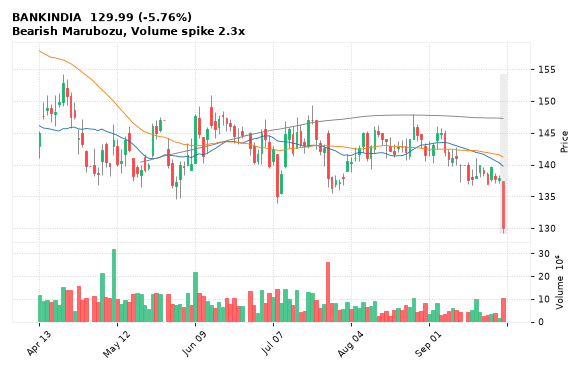

[🔔 Set alert on BANKINDIA](https://claude.ai/artifact/Ewc5hHTPX6WkU1nVcDNQzq?s=BANKINDIA&c=close%20below%20129.31) &nbsp;|&nbsp; [📈 Live chart (TradingView)](https://www.tradingview.com/chart/?symbol=NSE:BANKINDIA) &nbsp;|&nbsp; [alert by email](mailto:himanshusardana05@gmail.com?subject=ALERT%20BANKINDIA&body=Alert%20me%20when%3A%20close%20below%20129.31%0A%0AEdit%20the%20line%20above%20if%20you%20want%2C%20then%20press%20Send.%20Checked%20on%20every%20day%27s%20closing%20data%3B%20a%20triggered%20alert%20appears%20at%20the%20top%20of%20the%208%20AM%20Technical%20Analysis%20email.%0A%0AExamples%20you%20can%20write%3A%0A%20%20close%20above%201150%20%20%7C%20%20close%20below%201080%20%20%7C%20%20high%20above%201200%20%20%7C%20%20low%20below%201050%0A%20%20close%20crosses%20above%20200%20DMA%20%20%7C%20%20close%20below%2050%20DMA%20%20%7C%20%20RSI%20below%2030%20%20%7C%20%20RSI%20above%2070%0A%20%20volume%20above%202x%20%20%7C%20%20change%20above%205%25%20%20%7C%20%20change%20below%20-4%25%20%20%7C%20%2052-week%20high%20%20%7C%20%20golden%20cross%0A%20%20combine%20with%20%27and%27%2C%20e.g.%20%20close%20above%201150%20and%20volume%20above%201.5x%0A%0AReference%3A%20BANKINDIA%20closed%20129.99%20%28high%20137.50%2C%20low%20129.31%29.%0ATo%20cancel%20later%2C%20send%20an%20email%20with%20subject%3A%20CANCEL%20ALERT%20BANKINDIA)

---

## 21. NMDC - BEARISH
**77.43** (-3.09%) | vol 2.2x | RSI 33 | H 80.90 / L 77.43  
Bearish Marubozu, Volume spike 2.2x

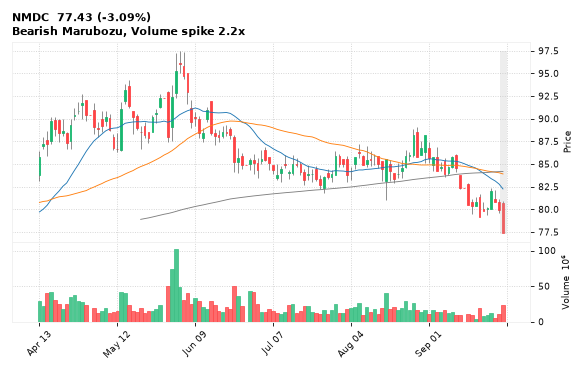

[🔔 Set alert on NMDC](https://claude.ai/artifact/Ewc5hHTPX6WkU1nVcDNQzq?s=NMDC&c=close%20below%2077.43) &nbsp;|&nbsp; [📈 Live chart (TradingView)](https://www.tradingview.com/chart/?symbol=NSE:NMDC) &nbsp;|&nbsp; [alert by email](mailto:himanshusardana05@gmail.com?subject=ALERT%20NMDC&body=Alert%20me%20when%3A%20close%20below%2077.43%0A%0AEdit%20the%20line%20above%20if%20you%20want%2C%20then%20press%20Send.%20Checked%20on%20every%20day%27s%20closing%20data%3B%20a%20triggered%20alert%20appears%20at%20the%20top%20of%20the%208%20AM%20Technical%20Analysis%20email.%0A%0AExamples%20you%20can%20write%3A%0A%20%20close%20above%201150%20%20%7C%20%20close%20below%201080%20%20%7C%20%20high%20above%201200%20%20%7C%20%20low%20below%201050%0A%20%20close%20crosses%20above%20200%20DMA%20%20%7C%20%20close%20below%2050%20DMA%20%20%7C%20%20RSI%20below%2030%20%20%7C%20%20RSI%20above%2070%0A%20%20volume%20above%202x%20%20%7C%20%20change%20above%205%25%20%20%7C%20%20change%20below%20-4%25%20%20%7C%20%2052-week%20high%20%20%7C%20%20golden%20cross%0A%20%20combine%20with%20%27and%27%2C%20e.g.%20%20close%20above%201150%20and%20volume%20above%201.5x%0A%0AReference%3A%20NMDC%20closed%2077.43%20%28high%2080.90%2C%20low%2077.43%29.%0ATo%20cancel%20later%2C%20send%20an%20email%20with%20subject%3A%20CANCEL%20ALERT%20NMDC)

---

## 22. YESBANK - BEARISH
**21.18** (-5.87%) | vol 1.7x | RSI 33 | H 22.38 / L 21.11  
Bearish Marubozu, Close below 200 DMA

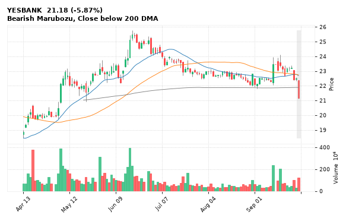

[🔔 Set alert on YESBANK](https://claude.ai/artifact/Ewc5hHTPX6WkU1nVcDNQzq?s=YESBANK&c=close%20below%2021.11) &nbsp;|&nbsp; [📈 Live chart (TradingView)](https://www.tradingview.com/chart/?symbol=NSE:YESBANK) &nbsp;|&nbsp; [alert by email](mailto:himanshusardana05@gmail.com?subject=ALERT%20YESBANK&body=Alert%20me%20when%3A%20close%20below%2021.11%0A%0AEdit%20the%20line%20above%20if%20you%20want%2C%20then%20press%20Send.%20Checked%20on%20every%20day%27s%20closing%20data%3B%20a%20triggered%20alert%20appears%20at%20the%20top%20of%20the%208%20AM%20Technical%20Analysis%20email.%0A%0AExamples%20you%20can%20write%3A%0A%20%20close%20above%201150%20%20%7C%20%20close%20below%201080%20%20%7C%20%20high%20above%201200%20%20%7C%20%20low%20below%201050%0A%20%20close%20crosses%20above%20200%20DMA%20%20%7C%20%20close%20below%2050%20DMA%20%20%7C%20%20RSI%20below%2030%20%20%7C%20%20RSI%20above%2070%0A%20%20volume%20above%202x%20%20%7C%20%20change%20above%205%25%20%20%7C%20%20change%20below%20-4%25%20%20%7C%20%2052-week%20high%20%20%7C%20%20golden%20cross%0A%20%20combine%20with%20%27and%27%2C%20e.g.%20%20close%20above%201150%20and%20volume%20above%201.5x%0A%0AReference%3A%20YESBANK%20closed%2021.18%20%28high%2022.38%2C%20low%2021.11%29.%0ATo%20cancel%20later%2C%20send%20an%20email%20with%20subject%3A%20CANCEL%20ALERT%20YESBANK)

---

## 23. HBLENGINE - BEARISH
**785.65** (-2.52%) | vol 1.6x | RSI 64 | H 829.90 / L 782.20  
Dark Cloud Cover, RSI down through 70

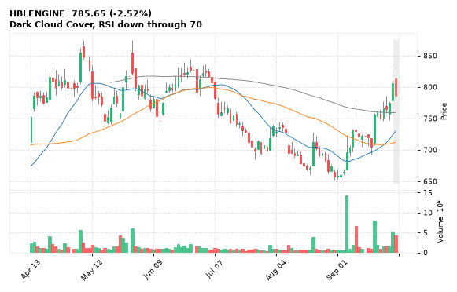

[🔔 Set alert on HBLENGINE](https://claude.ai/artifact/Ewc5hHTPX6WkU1nVcDNQzq?s=HBLENGINE&c=close%20below%20782.20) &nbsp;|&nbsp; [📈 Live chart (TradingView)](https://www.tradingview.com/chart/?symbol=NSE:HBLENGINE) &nbsp;|&nbsp; [alert by email](mailto:himanshusardana05@gmail.com?subject=ALERT%20HBLENGINE&body=Alert%20me%20when%3A%20close%20below%20782.20%0A%0AEdit%20the%20line%20above%20if%20you%20want%2C%20then%20press%20Send.%20Checked%20on%20every%20day%27s%20closing%20data%3B%20a%20triggered%20alert%20appears%20at%20the%20top%20of%20the%208%20AM%20Technical%20Analysis%20email.%0A%0AExamples%20you%20can%20write%3A%0A%20%20close%20above%201150%20%20%7C%20%20close%20below%201080%20%20%7C%20%20high%20above%201200%20%20%7C%20%20low%20below%201050%0A%20%20close%20crosses%20above%20200%20DMA%20%20%7C%20%20close%20below%2050%20DMA%20%20%7C%20%20RSI%20below%2030%20%20%7C%20%20RSI%20above%2070%0A%20%20volume%20above%202x%20%20%7C%20%20change%20above%205%25%20%20%7C%20%20change%20below%20-4%25%20%20%7C%20%2052-week%20high%20%20%7C%20%20golden%20cross%0A%20%20combine%20with%20%27and%27%2C%20e.g.%20%20close%20above%201150%20and%20volume%20above%201.5x%0A%0AReference%3A%20HBLENGINE%20closed%20785.65%20%28high%20829.90%2C%20low%20782.20%29.%0ATo%20cancel%20later%2C%20send%20an%20email%20with%20subject%3A%20CANCEL%20ALERT%20HBLENGINE)

---

## 24. JIOFIN - BEARISH
**220.50** (-2.86%) | vol 1.6x | RSI 29 | H 227.00 / L 218.80  
52-week low breakdown, MACD bearish cross

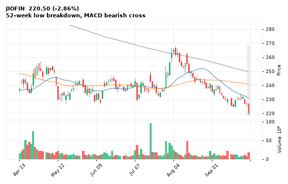

[🔔 Set alert on JIOFIN](https://claude.ai/artifact/Ewc5hHTPX6WkU1nVcDNQzq?s=JIOFIN&c=close%20below%20218.80) &nbsp;|&nbsp; [📈 Live chart (TradingView)](https://www.tradingview.com/chart/?symbol=NSE:JIOFIN) &nbsp;|&nbsp; [alert by email](mailto:himanshusardana05@gmail.com?subject=ALERT%20JIOFIN&body=Alert%20me%20when%3A%20close%20below%20218.80%0A%0AEdit%20the%20line%20above%20if%20you%20want%2C%20then%20press%20Send.%20Checked%20on%20every%20day%27s%20closing%20data%3B%20a%20triggered%20alert%20appears%20at%20the%20top%20of%20the%208%20AM%20Technical%20Analysis%20email.%0A%0AExamples%20you%20can%20write%3A%0A%20%20close%20above%201150%20%20%7C%20%20close%20below%201080%20%20%7C%20%20high%20above%201200%20%20%7C%20%20low%20below%201050%0A%20%20close%20crosses%20above%20200%20DMA%20%20%7C%20%20close%20below%2050%20DMA%20%20%7C%20%20RSI%20below%2030%20%20%7C%20%20RSI%20above%2070%0A%20%20volume%20above%202x%20%20%7C%20%20change%20above%205%25%20%20%7C%20%20change%20below%20-4%25%20%20%7C%20%2052-week%20high%20%20%7C%20%20golden%20cross%0A%20%20combine%20with%20%27and%27%2C%20e.g.%20%20close%20above%201150%20and%20volume%20above%201.5x%0A%0AReference%3A%20JIOFIN%20closed%20220.50%20%28high%20227.00%2C%20low%20218.80%29.%0ATo%20cancel%20later%2C%20send%20an%20email%20with%20subject%3A%20CANCEL%20ALERT%20JIOFIN)

---

## 25. TATACONSUM - BEARISH
**960.00** (-2.36%) | vol 1.2x | RSI 31 | H 983.60 / L 955.50  
52-week low breakdown, MACD bearish cross

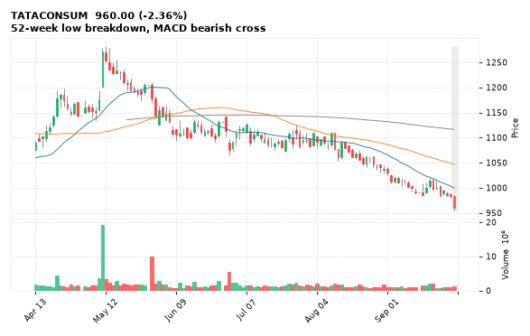

[🔔 Set alert on TATACONSUM](https://claude.ai/artifact/Ewc5hHTPX6WkU1nVcDNQzq?s=TATACONSUM&c=close%20below%20955.50) &nbsp;|&nbsp; [📈 Live chart (TradingView)](https://www.tradingview.com/chart/?symbol=NSE:TATACONSUM) &nbsp;|&nbsp; [alert by email](mailto:himanshusardana05@gmail.com?subject=ALERT%20TATACONSUM&body=Alert%20me%20when%3A%20close%20below%20955.50%0A%0AEdit%20the%20line%20above%20if%20you%20want%2C%20then%20press%20Send.%20Checked%20on%20every%20day%27s%20closing%20data%3B%20a%20triggered%20alert%20appears%20at%20the%20top%20of%20the%208%20AM%20Technical%20Analysis%20email.%0A%0AExamples%20you%20can%20write%3A%0A%20%20close%20above%201150%20%20%7C%20%20close%20below%201080%20%20%7C%20%20high%20above%201200%20%20%7C%20%20low%20below%201050%0A%20%20close%20crosses%20above%20200%20DMA%20%20%7C%20%20close%20below%2050%20DMA%20%20%7C%20%20RSI%20below%2030%20%20%7C%20%20RSI%20above%2070%0A%20%20volume%20above%202x%20%20%7C%20%20change%20above%205%25%20%20%7C%20%20change%20below%20-4%25%20%20%7C%20%2052-week%20high%20%20%7C%20%20golden%20cross%0A%20%20combine%20with%20%27and%27%2C%20e.g.%20%20close%20above%201150%20and%20volume%20above%201.5x%0A%0AReference%3A%20TATACONSUM%20closed%20960.00%20%28high%20983.60%2C%20low%20955.50%29.%0ATo%20cancel%20later%2C%20send%20an%20email%20with%20subject%3A%20CANCEL%20ALERT%20TATACONSUM)

---

## 26. UNIONBANK - BEARISH
**171.75** (-4.69%) | vol 1.2x | RSI 35 | H 178.99 / L 171.55  
Bearish Marubozu, Close below 200 DMA

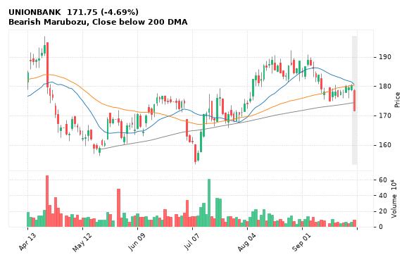

[🔔 Set alert on UNIONBANK](https://claude.ai/artifact/Ewc5hHTPX6WkU1nVcDNQzq?s=UNIONBANK&c=close%20below%20171.55) &nbsp;|&nbsp; [📈 Live chart (TradingView)](https://www.tradingview.com/chart/?symbol=NSE:UNIONBANK) &nbsp;|&nbsp; [alert by email](mailto:himanshusardana05@gmail.com?subject=ALERT%20UNIONBANK&body=Alert%20me%20when%3A%20close%20below%20171.55%0A%0AEdit%20the%20line%20above%20if%20you%20want%2C%20then%20press%20Send.%20Checked%20on%20every%20day%27s%20closing%20data%3B%20a%20triggered%20alert%20appears%20at%20the%20top%20of%20the%208%20AM%20Technical%20Analysis%20email.%0A%0AExamples%20you%20can%20write%3A%0A%20%20close%20above%201150%20%20%7C%20%20close%20below%201080%20%20%7C%20%20high%20above%201200%20%20%7C%20%20low%20below%201050%0A%20%20close%20crosses%20above%20200%20DMA%20%20%7C%20%20close%20below%2050%20DMA%20%20%7C%20%20RSI%20below%2030%20%20%7C%20%20RSI%20above%2070%0A%20%20volume%20above%202x%20%20%7C%20%20change%20above%205%25%20%20%7C%20%20change%20below%20-4%25%20%20%7C%20%2052-week%20high%20%20%7C%20%20golden%20cross%0A%20%20combine%20with%20%27and%27%2C%20e.g.%20%20close%20above%201150%20and%20volume%20above%201.5x%0A%0AReference%3A%20UNIONBANK%20closed%20171.75%20%28high%20178.99%2C%20low%20171.55%29.%0ATo%20cancel%20later%2C%20send%20an%20email%20with%20subject%3A%20CANCEL%20ALERT%20UNIONBANK)

---

## 27. JKTYRE - BEARISH
**337.80** (-2.33%) | vol 0.9x | RSI 30 | H 343.95 / L 337.10  
52-week low breakdown, MACD bearish cross, NR7 (narrowest range in 7)

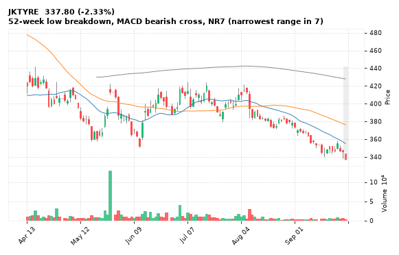

[🔔 Set alert on JKTYRE](https://claude.ai/artifact/Ewc5hHTPX6WkU1nVcDNQzq?s=JKTYRE&c=close%20below%20337.10) &nbsp;|&nbsp; [📈 Live chart (TradingView)](https://www.tradingview.com/chart/?symbol=NSE:JKTYRE) &nbsp;|&nbsp; [alert by email](mailto:himanshusardana05@gmail.com?subject=ALERT%20JKTYRE&body=Alert%20me%20when%3A%20close%20below%20337.10%0A%0AEdit%20the%20line%20above%20if%20you%20want%2C%20then%20press%20Send.%20Checked%20on%20every%20day%27s%20closing%20data%3B%20a%20triggered%20alert%20appears%20at%20the%20top%20of%20the%208%20AM%20Technical%20Analysis%20email.%0A%0AExamples%20you%20can%20write%3A%0A%20%20close%20above%201150%20%20%7C%20%20close%20below%201080%20%20%7C%20%20high%20above%201200%20%20%7C%20%20low%20below%201050%0A%20%20close%20crosses%20above%20200%20DMA%20%20%7C%20%20close%20below%2050%20DMA%20%20%7C%20%20RSI%20below%2030%20%20%7C%20%20RSI%20above%2070%0A%20%20volume%20above%202x%20%20%7C%20%20change%20above%205%25%20%20%7C%20%20change%20below%20-4%25%20%20%7C%20%2052-week%20high%20%20%7C%20%20golden%20cross%0A%20%20combine%20with%20%27and%27%2C%20e.g.%20%20close%20above%201150%20and%20volume%20above%201.5x%0A%0AReference%3A%20JKTYRE%20closed%20337.80%20%28high%20343.95%2C%20low%20337.10%29.%0ATo%20cancel%20later%2C%20send%20an%20email%20with%20subject%3A%20CANCEL%20ALERT%20JKTYRE)

---

## 28. ABFRL - BEARISH
**47.59** (-3.15%) | vol 0.8x | RSI 32 | H 49.60 / L 47.25  
52-week low breakdown, MACD bearish cross

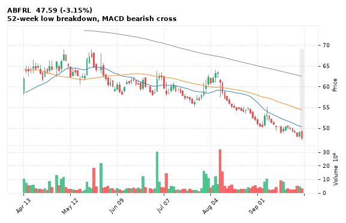

[🔔 Set alert on ABFRL](https://claude.ai/artifact/Ewc5hHTPX6WkU1nVcDNQzq?s=ABFRL&c=close%20below%2047.25) &nbsp;|&nbsp; [📈 Live chart (TradingView)](https://www.tradingview.com/chart/?symbol=NSE:ABFRL) &nbsp;|&nbsp; [alert by email](mailto:himanshusardana05@gmail.com?subject=ALERT%20ABFRL&body=Alert%20me%20when%3A%20close%20below%2047.25%0A%0AEdit%20the%20line%20above%20if%20you%20want%2C%20then%20press%20Send.%20Checked%20on%20every%20day%27s%20closing%20data%3B%20a%20triggered%20alert%20appears%20at%20the%20top%20of%20the%208%20AM%20Technical%20Analysis%20email.%0A%0AExamples%20you%20can%20write%3A%0A%20%20close%20above%201150%20%20%7C%20%20close%20below%201080%20%20%7C%20%20high%20above%201200%20%20%7C%20%20low%20below%201050%0A%20%20close%20crosses%20above%20200%20DMA%20%20%7C%20%20close%20below%2050%20DMA%20%20%7C%20%20RSI%20below%2030%20%20%7C%20%20RSI%20above%2070%0A%20%20volume%20above%202x%20%20%7C%20%20change%20above%205%25%20%20%7C%20%20change%20below%20-4%25%20%20%7C%20%2052-week%20high%20%20%7C%20%20golden%20cross%0A%20%20combine%20with%20%27and%27%2C%20e.g.%20%20close%20above%201150%20and%20volume%20above%201.5x%0A%0AReference%3A%20ABFRL%20closed%2047.59%20%28high%2049.60%2C%20low%2047.25%29.%0ATo%20cancel%20later%2C%20send%20an%20email%20with%20subject%3A%20CANCEL%20ALERT%20ABFRL)

---

## 29. CESC - BEARISH
**136.18** (-2.63%) | vol 0.7x | RSI 25 | H 139.84 / L 135.90  
52-week low breakdown, MACD bearish cross

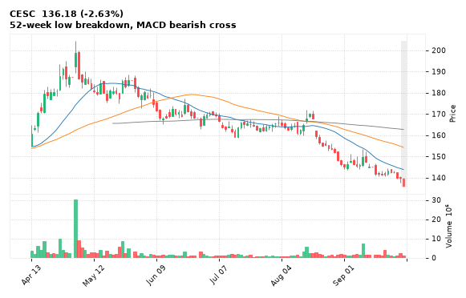

[🔔 Set alert on CESC](https://claude.ai/artifact/Ewc5hHTPX6WkU1nVcDNQzq?s=CESC&c=close%20below%20135.90) &nbsp;|&nbsp; [📈 Live chart (TradingView)](https://www.tradingview.com/chart/?symbol=NSE:CESC) &nbsp;|&nbsp; [alert by email](mailto:himanshusardana05@gmail.com?subject=ALERT%20CESC&body=Alert%20me%20when%3A%20close%20below%20135.90%0A%0AEdit%20the%20line%20above%20if%20you%20want%2C%20then%20press%20Send.%20Checked%20on%20every%20day%27s%20closing%20data%3B%20a%20triggered%20alert%20appears%20at%20the%20top%20of%20the%208%20AM%20Technical%20Analysis%20email.%0A%0AExamples%20you%20can%20write%3A%0A%20%20close%20above%201150%20%20%7C%20%20close%20below%201080%20%20%7C%20%20high%20above%201200%20%20%7C%20%20low%20below%201050%0A%20%20close%20crosses%20above%20200%20DMA%20%20%7C%20%20close%20below%2050%20DMA%20%20%7C%20%20RSI%20below%2030%20%20%7C%20%20RSI%20above%2070%0A%20%20volume%20above%202x%20%20%7C%20%20change%20above%205%25%20%20%7C%20%20change%20below%20-4%25%20%20%7C%20%2052-week%20high%20%20%7C%20%20golden%20cross%0A%20%20combine%20with%20%27and%27%2C%20e.g.%20%20close%20above%201150%20and%20volume%20above%201.5x%0A%0AReference%3A%20CESC%20closed%20136.18%20%28high%20139.84%2C%20low%20135.90%29.%0ATo%20cancel%20later%2C%20send%20an%20email%20with%20subject%3A%20CANCEL%20ALERT%20CESC)

---

## 30. POLYCAB - BEARISH
**8,191.00** (-2.59%) | vol 0.7x | RSI 37 | H 8,400.00 / L 8,180.00  
Bearish Marubozu, Close below 200 DMA

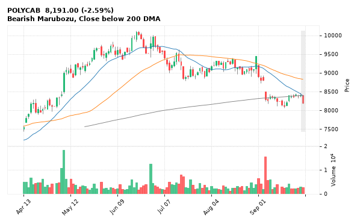

[🔔 Set alert on POLYCAB](https://claude.ai/artifact/Ewc5hHTPX6WkU1nVcDNQzq?s=POLYCAB&c=close%20below%208180.00) &nbsp;|&nbsp; [📈 Live chart (TradingView)](https://www.tradingview.com/chart/?symbol=NSE:POLYCAB) &nbsp;|&nbsp; [alert by email](mailto:himanshusardana05@gmail.com?subject=ALERT%20POLYCAB&body=Alert%20me%20when%3A%20close%20below%208180.00%0A%0AEdit%20the%20line%20above%20if%20you%20want%2C%20then%20press%20Send.%20Checked%20on%20every%20day%27s%20closing%20data%3B%20a%20triggered%20alert%20appears%20at%20the%20top%20of%20the%208%20AM%20Technical%20Analysis%20email.%0A%0AExamples%20you%20can%20write%3A%0A%20%20close%20above%201150%20%20%7C%20%20close%20below%201080%20%20%7C%20%20high%20above%201200%20%20%7C%20%20low%20below%201050%0A%20%20close%20crosses%20above%20200%20DMA%20%20%7C%20%20close%20below%2050%20DMA%20%20%7C%20%20RSI%20below%2030%20%20%7C%20%20RSI%20above%2070%0A%20%20volume%20above%202x%20%20%7C%20%20change%20above%205%25%20%20%7C%20%20change%20below%20-4%25%20%20%7C%20%2052-week%20high%20%20%7C%20%20golden%20cross%0A%20%20combine%20with%20%27and%27%2C%20e.g.%20%20close%20above%201150%20and%20volume%20above%201.5x%0A%0AReference%3A%20POLYCAB%20closed%208191.00%20%28high%208400.00%2C%20low%208180.00%29.%0ATo%20cancel%20later%2C%20send%20an%20email%20with%20subject%3A%20CANCEL%20ALERT%20POLYCAB)

---
